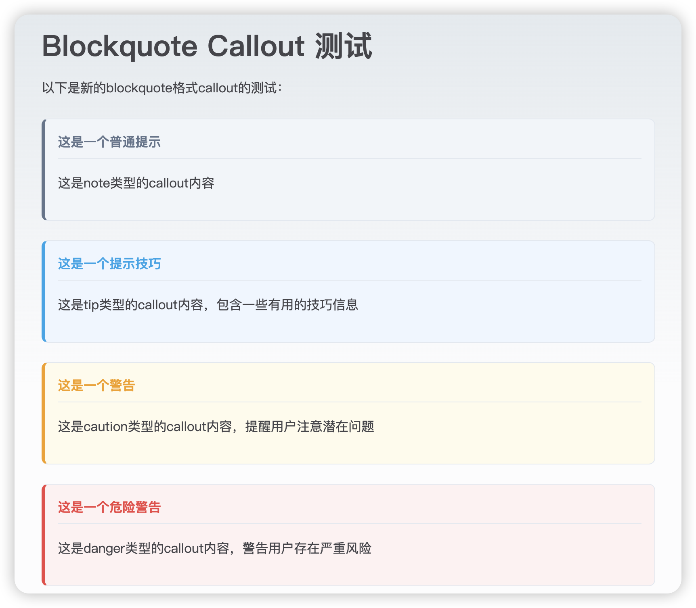
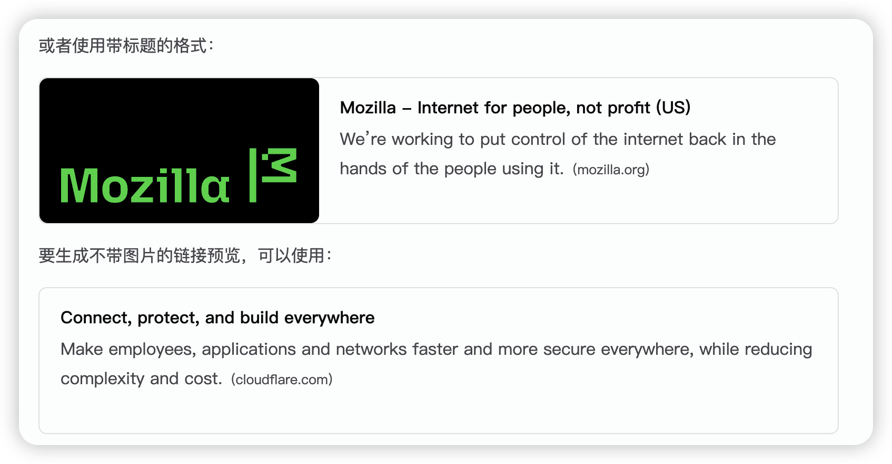

# Joeytoday's Blog Changelog

## 1.0.x

- 原生博客模式，无较大修改内容
- 修改主页面背景色

## 2.0.x

### 2.0.3

- 取消博客页面的封面
- 把页面的主题颜色换成了绿色
- 修改了引用区样式
- 增加了折叠区：防止图片过长影响阅读
- md 原生 callout 样式显示

- 修复暗色模式下 blockquote & callout 背景显示
- md 原生新增 LinkPreview 显示功能

---

- **callout 使用方法**

  ```plaintext
  >[!note]标题
  >
  > 内容
  > 不换行内容
  >
  > 换行内容
  ```
  



- **linkpreview 使用方法**

  - 有图片，不设置标题

    ````plaintext
    ```linkpreview
    链接 URL
    ```
    ````

  - 有图片，设置标题
  
    ````plaintext
    ```linkpreview
    [标题](链接 URL)
    ```
    ````
  
  - 不带图片
  
    ````plaintext
    ```linkpreview-nopic
    链接 URL
    ```
    ````



