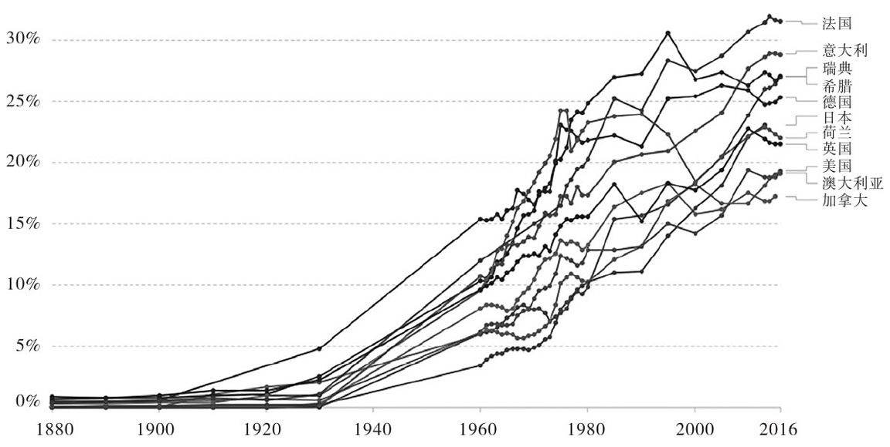

>打算开始尝试以周刊的形式写作，敦促自己每周写点什么。至于为什么叫「第三周刊」，我想我们不必总是在是/否（Yes or No、To be or Not to be）之间做选择，我可以都不选，或者可以选择第三个，这是作为保留项的第三选择，所以它叫「第三周刊」。
>
> 这里是「第三周刊」的第一篇内容，谈谈这个月看完的书，迈克尔·桑德尔的《公正：该如何做是好？》
>
>**摘要**：从功利主义、自由主义和社群主义三个方向讨论思考公正的方向。`

先谈谈作者，[迈克尔·桑德尔](https://scholar.harvard.edu/sandel/home)（后面简称桑德尔），我最先知道他就是哈佛大学公开课《公正 Justice》，这是哈佛大学最早免费公开的视频课程之一，也以哈佛大学历史上修读最多的课程闻名，但没看课程，先看了由这门课程整理的文字讲稿，也就是这本书—— [《公正：该如何做是好？》](https://book.douban.com/subject/20366368/)。

本书类似讲课的方式，哲学化的概念由很生活的问题引入，通过简单易懂的语言阐述，理解起来非常轻松（不是那种会把人吓到的长难句，一句话要读三遍的那种），有时候读着会让人误以为自己理解了康德和罗尔斯的核心哲学思想（bushi）。

桑德尔以对自由主义的批判闻名，对共同善的倡导也让他被冠上了“社群主义”的名号，虽然他本人很拒绝（但没用）。近年来，他也以对优绩主义（meritocracy）的批评广为人知，主要著作包括[《精英的傲慢》](https://book.douban.com/subject/35586814/)，有一个他与项飙的访谈 [《项飙对谈迈克尔·桑德尔：我们如何摆脱“优绩主义”？》](https://www.thepaper.cn/newsDetail_forward_17281196)，感兴趣可以看看。

对公正的追求贯穿整个人类文明，这种行为也塑造了现代社会的法律体系和社会生活，对社会的思考离不开对公正的追问，桑德尔在这本书中深入浅出讲述历史上“最伟大的哲学家们”对公正的看法，以及他对公正的思考。

本书的核心问题只有一个，那就是：<mark style="background: #F6E99E;">我们如何思考公正？</mark>桑德尔阐述了三种看待公正的方式，分别是：**功利主义**、**自由主义**和**社群主义**，我将根据他提供的思路阐述。

## 功利主义

功利主义认为公正意味着使功利或福利最大多数人的最大幸福。

代表人物就是[杰里米·边沁](https://baike.baidu.com/item/杰里米·边沁?fromModule=lemma_search-box)（Jeremy Bentham，1748～1832），他的核心观点就是**道德的最高原则就是使幸福最大化，使快乐总体上超过痛苦**。

为了论证自己的观点，他还提出了两个假想计划：

一个是**环形监狱**：在该监狱的中间有一个监视塔，这使得看管者可以监视囚犯，而囚犯却看不见他。边沁建议，可以将这个环形监狱交给一个私人的承包商（理想人选就是他自己）来运营，该承包商将管理监狱，以换取罪犯劳动所得的利润，这些囚犯将每天工作 16 个小时。

如上图所示，边沁认为这能够更高效地管理囚犯，并通过囚犯给个人换取利润，这增加了社会幸福。不过此设想被更多用在[米歇尔·福柯](https://baike.baidu.com/item/米歇尔·福柯/576152?fromtitle=福柯&fromid=2044)论证权力与规训中。

一个是**乞丐管理营**：通过为穷人建立一个自主筹款的救济院而改进“乞丐管理”。

在街上遇到乞丐会以两种方式降低行人的幸福感。对于心肠软弱的人们来说，看到乞丐便产生了一种同情之苦；而对于心肠较硬的人们来说，看到乞丐便产生一种厌恶之苦。因此，边沁建议要将乞丐从街上赶走，并将他们局限于救济院之内。

很多人会反驳，那么乞丐的“功利”不是减少了？在边沁看来，乞丐减少的福利，远没有公众减少的痛苦多，所以，这样做是合理的。

现在看起来极度功利的设想，但这种想法依然被很多人认可，在我看来是一种极度“[工具理性](https://baike.baidu.com/item/工具理性)”的设计，问题在于怎么衡量乞丐的痛苦和公众的幸福呢？企图将人类的价值用一种“功利”来计算，不仅仅是不近人情的，也是对人类尊严的践踏。

## 自由主义

自由主义认为**公正意味着尊重人们选择的自由**，或者是人们在自由市场中所做出的实际选择（如自由至上主义者们的观点），或者是人们在平等的原初状态中，所可能做出的假想的选择（如平等主义者的观点）。

自由主义作为上世纪最重要的社会思潮之一，得到了很多思想家、哲学家的拥护，其内部也分成了不同倾向。

### 古典自由主义

代表人物是[约翰·穆勒](https://baike.baidu.com/item/约翰·穆勒/4808412?fromtitle=约翰·斯图亚特·密尔&fromid=8011685)（John Stuart Mill，1806～1873）[《论自由》](https://book.douban.com/subject/30394971/)，其核心思想是：**倘若不伤害到他人的话，人们应该可以自由地去做任何他们想做的事情**。政府不能为了保护人们不受到伤害，而干涉个体的自由，或将大多数人关于怎样最好地生活的观念强加于每个人。

这种主张个人自由的论述非常具有吸引力，因为他宣称了人本自由，而且我们应当、正当自由，这种思想不仅仅影响了社会的思潮，也影响了一大批政治人物，比如**罗纳德·里根**（Ronald Reagan）和**玛格丽特·撒切尔**（Margaret thatcher），他们支持市场自由、反对政府干预的政策，同时也导致了当时的各种福利制度倒退，一大批人因此归于穷困（关于这个现象的纪实可以参考[《贫穷的质感》](https://book.douban.com/subject/35720365/)）。

但这种理论依然有一个问题，也正是现在社会愈发明显的社会不平等的问题，如果我们的起点就不同，我们如何谈论公正呢？

在这个问题下，就算是自由主义者在谈论公正时，也为它预设了条件。[《无政府、国家和乌托邦》](https://book.douban.com/subject/3074246/)的作者[罗伯特·诺齐克](https://baike.baidu.com/item/罗伯特·诺齐克/5746530?fromModule=lemma-qiyi_sense-lemma)（Robert Nozick）反对模式化的公正理论，而支持那些尊重人们在自由市场中所做出的选择的公正理论。他认为分配公正取决于两个条件：
- **初始拥有的正当性**
  - 你用来赚钱的资产是否一开始就是合法地属于你（如果你通过倒卖被盗的物品而赚钱的话，那么你就无权拥有这一收益）。
- **财产转移的正当性**
  - 你是否通过在市场中自由交换，或接受他人对你的自愿馈赠而赚钱。

于是约翰·罗尔斯在前人的基础上补充完善此观点。

### 平等自由主义

[约翰·罗尔斯](https://baike.baidu.com/item/约翰·罗尔斯)（1921～2002）是一位美国政治哲学家，在[《正义论》](https://book.douban.com/subject/4000736/)A Theory of Justice）一书当中，他主张，思考公正的方式就是要询问，在一种平等的原初状态中，我们会认可什么样的原则。

这个平等的原初状态，就是他所说的“**无知之幕**”，在幕帘背后，我们不知道自己的身份，有可能是富甲一方、也有可能流落街头，有可能作为社会主流群体、也可能作为少数群体，等等，所以我们预想的、希望的社会运作方式，不会是倾向特权和强势群体的，因为我有可能在此对立面，所以从这种假想的契约中，会产生两种公正原则：

- 第一个原则**为所有公民提供平等的基本自由**，如言论自由和宗教自由。这一原则要优先于社会功利和总体福利的考虑。
- 第二个原则**关心社会和经济的平等**。尽管它并不要求一种平等的关于收入和财富的分配，它却只允许那些有利于社会最不利者的社会和经济的不平等。

持有这种思想的人们或者可以称之为平等主义的自由主义者们。

罗尔斯认为收入和机会的分配，不应当依赖于那些从道德上来说具有任意性的因素。他进一步提出了“**差异原则**”：只有当社会和经济的不平等能够有利于社会最不利者的利益时，它们才是可允许的。

其原因在于他认为**公正不应当源于道德任意性**。

- 根据出生的偶然分配收入、财富、机会是不公正的。
- 市场在部分程度上纠正了这些任意性，允许人们参与自由市场重新分配。
- 公平的精英统治制度（meritocracy）试图通过超越单纯的形式上的机会平等，而做到这一点。

## 社群主义

社群主义认为公正涉及培养德性和推理共同善。其核心代表人物就是[亚里士多德](https://baike.baidu.com/item/亚里士多德/26769)，我想也不需要我过多介绍了。

从一个问题开始，*假设有一根很优质的长笛，你认为应该给予谁是公正的呢？*

功利主义者们认为，那就给最想要这把长笛的人，因为这促进了整体的幸福感；自由主义者们认为，每个人都应该基于自己的理性（康德的定义，但没有篇幅说了，大概理解一下吧）给出自己的选择，大家应该尊重彼此的选择；社群主义者们会认为，谁最擅长吹笛子，那就给谁。这就是三个方向对公正的简化概括。

在亚里士多德看来，<mark style="background: #F6E99E;">公正与良善生活必然相关</mark>，他认为：

1. **公正是目的论的**。对于权利的界定要求我们弄明白所讨论的社会行为的目的（telos，意图、目标或本性）。
2. **公正是荣誉性的**。为了推理一种行为的目的—或讨论之，就至少要部分地推理或讨论它应当尊敬或奖励什么样的德性。

所以，亚里士多德认为：政治的目的并不在于建立一套中立于各种目的的权利框架，而是要塑造好公民，培育好品质。政治的目的完全在于：**使人们能够发展各自独特的人类能力和德性—能够慎议共同善，能够获得实际的判断，能够共享自治，能够关心作为整体的共同体的命运。**

先来说明一下<mark style="background: #F6E99E;">「共同体」</mark>吧。

中国人总会说“忠孝难两全”，这种道德困境的原因就来源于我们同时身负对「共同体」（国家/社区/集体）的责任和我们个人的道德责任（对父母/孩子/朋友感情的回馈和自然义务），这两种责任有了冲突和对立，我们才会感觉到矛盾与痛苦。

如果按照古典自由主义的观点，我们无需对任何共同体负有责任，那么这种困境就是不存在的，因为存在着唯一正确的选择，就是对个人的道德责任负责就好了。

这种说法很有吸引力，那让我们重新设想一种场景，我们经常会看到各种“撤侨”或者对本国公民的“倾斜”政策，我们会期待我们的国家保护我们，我们认为国家有责任保护我们，这种对国家的期待其实就是一种对「共同体」的认同。

还是会有人反驳，因为我给国家交税啊，所以国家有责任保护我们，那么，如果出国走在街上，我们更可能对本国人产生认同感，对于本国人的一些糟糕行径，我们也会有一种“羞耻”的情绪，这种认同感，是基于我们类似的经历、相同的文化塑造出来，基于此塑造的认同感，就是「共同体」存在的证明。

人生活在社群中，生活在塑造自己认同感的「共同体」中，这个“想象的共同体”不仅塑造我们，我们也对此负有责任，我们需要参与其中，塑造「共同善」，这就是「公正」。

## 社会不平等的问题

无论是经济还是政治上的不平等，都会给我们的生活带来巨大的打击，随着全世界贫富差距都在进一步扩大，桑德尔基于社群主义倡导「共同善」更值得被所有人关注。

P.S: 但是绝对贫困状况在变好，很多国家的公共福利支出都在增加。

简单从五个方面概括一下经济不平等可能带来的问题：

1. **加深人群之间物理的距离**，比如富人把孩子送进私立学校，只去专供的场所等等。
2. **破坏民主，贫富差距过大带来人群的情感上的分离**，物理上的区隔也进一步加深这种分裂，强大的社会鸿沟带来极端情绪的增长，特朗普就是一例，这不利于公民团结；
3. 财政上随着富人不再进入公共领域，他们会不愿意缴纳税款或者不支持公共设施的建设，这会进一步**压缩一部分人的生存空间**；
4. **对多元化的损伤**，公共领域的消失减少了各种不一样的人邂逅的可能，这些不一样的想法、对话，可能会启发创新；
5. **腐蚀公民美德**，例如对人的同情心、对公正的追求、对他人的关怀等等。

## 最后

以上内容只是简单梳理了一下此书的内容，由于篇幅限制，连康德的哲学都略去不谈了，这部分作者写得非常精彩，如果各位看书，一定要看第五章，以及罗尔斯的论证也只简单梳理了几个关键点，原内容严密得多。

自由主义看起来谈得比较多，但其实连哈耶克都没提，自由主义作为至今仍有强大影响力的系统思想，其论证非常严密，无怪乎有很多拥护者们。

看完书，会对社群主义有着很初步的了解，我想从功利主义到自由主义再到社群主义，对人的关注是一步步加深的。功利主义者的眼里根本没有人的价值，一切只有利益可谈，自由主义者们开始看到“人生而自由”，进一步平等主义的自由主义者们开始肯定每个人的初始状态不一样，公正也要基于此考量，所以才会有进一步的社群主义者们，他们看到从个人到社群的图景，人生活在社会中，我们生活在社群中。

社群主义不是君主式的“大局观”，而是关注到个人之后的“我和我的关系”、“我和我的故事”，其实很难不被桑德尔说服，怪不得说是选修最多的课程之一，我想跟他辩论应该也特别有意思，看文字感觉人比较温和。

哈哈哈，这是我的一家之谈，如果你有被吸引，此处我是不是应该要一个点赞？

这是「第三周刊」的第一篇内容，希望它是一篇还不错的文章，祝各位周末愉快。
