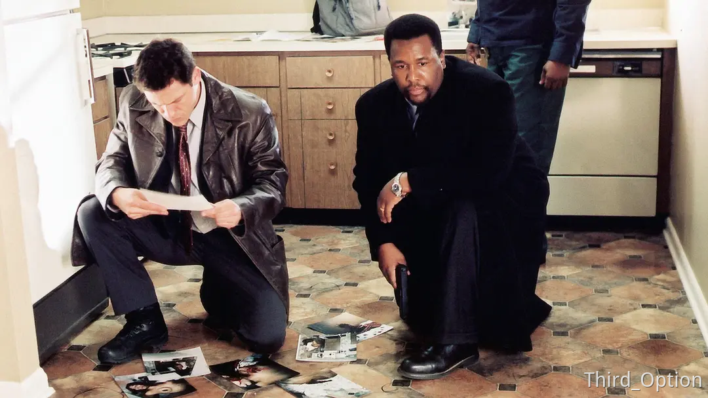

这里是「第三周刊」第 2 期。差点以为要拖稿，本周二阳了，一直到周四去打吊针才退烧。_

《凶年》是记者大卫·西蒙在美国的“哥谭市”——巴尔的摩凶案组一年的纪实写作。也是美剧《火线》的原著。

在 1988 年，巴尔的摩有 234 个人因暴力被杀害，几乎每一天，凶案组都会面对一具以各种姿势倒在路边的人，如果你还不能在尸体旁谈论今天的晚餐，好吧，那你就还不算是一名合格的警探。

很多人会想象凶案组的生活，不用说我也能猜到，一定跟我们看过的电视有关，警探们、法医们从各种蛛丝马迹中还原现场、找到动机、抓捕凶手，一集一个案子，每一起案子都有着反转、证据，最好还有凶手本人痛哭流涕的忏悔，看得非常过瘾。

可是巴尔的摩，美国的哥谭市。这里，平均几乎每一天都有凶杀案，尸体比警察常见，你每路过一个街区，这里或许不久之前或许不久之后，将要发生一起谋杀案。我们期待的所有，大概都不可能在这样混乱的城市发生。

在毒品肆虐的巴尔的摩街头，杀人不需要理由，或许只是因为夏天的一根冰淇淋，对了，在犯罪现场，抓证人可得比抓凶手更快，不然这个案子就得花更多的精力去寻找证人。反转？好吧，这种东西最好都去见上帝。无辜的受害者？哦，见鬼去吧。

## 拉托尼亚·瓦伦斯

在巴尔的摩凶杀组工作的警察，或许一开始还对死去的人有着同情、怜悯这种情绪，只需要几个月，他们就可以成为在被枪杀的尸体面前嘲讽 ta 死去的姿势不好看的“合格”的巴尔的摩警察了。

在巴尔的摩，大多数凶杀案的受害者都死有余辜，他们不是有家庭暴力史，就是经营着高风险的贩毒事业——死亡是这些人的宿命。然而，有些人则和拉托尼亚·瓦伦斯一样无辜。

一个十一岁被侵犯后开膛破肚弃尸街头的小女孩，这起案子让所有警察都急切地想要抓住凶手，不仅仅是为了破案率，当然破案率是最重要的事情，还因为或许巴尔的摩所有死去的人都不算“无辜”，他们或许死于毒贩之间的火拼，或许死于分赃不均，或许死于夏天产生的暴躁，但瓦伦斯一定是最无辜的。每一个知道此案的警探都想要抓住这个凶手，然后把他送上法庭。

> 她的上半身被红色的塑料雨衣部分覆盖着，她的下半身穿着黄色的长裤，上面沾满了污泥。雨衣之下是她的衬衫和尼龙夹克，它们都被扯破了，血从那些口子里流淌了出来。她的生命正是从这些口子里流逝的。她的脖子上有一条勒痕——应该是绳索留下的——并在头颅底部交叉了起来。她的右手上是一个蓝色便携包。它一动不动地躺在人行道上，里面装满了图书馆借书、一些纸张、一个廉价的照相机以及一个充斥着亮红色、蓝色和紫色的化妆盒——这是夸张的、女孩的颜色，这是个对世界充满好奇的年龄，这是个还未懂得向世界施展魅力的年龄。

负责此案的警察佩勒格利尼是整个警局最优秀的警察之一。他研读无数次案卷，从初春查到晚秋，找到嫌疑人“捕鱼人”，一个有侵犯前科的老人，而且在死前见过小女孩，可是无论如何都找不到可以钉死嫌疑的铁证，但佩勒格利尼一年以来都没有放弃，中间无数条生命也未能阻断佩勒格利尼对此案的执着，原因无他，因为这个案子不仅关于一个十一岁小女孩的生命和尊严，也关乎着他的职业荣誉。

他对此案超乎寻常地执着，可是对几乎平均每天都有一起凶杀案的凶案组警探来说，执着是一种毒药。我不是在说警探们不应该执着于某一起案子，只是如果每天都有人死去，你只关心其中一个，那被你忽视的其他人怎么办呢？如果你无暇管理其他的案子，那么你的同伴只能被分配到更多的任务，而这无疑会引来许多抱怨与不满。

这个案子是贯穿整本书线索，但是直到故事的最后，哪怕动用了资金请审讯专家来对“捕鱼人”进行审讯，依然，一无所获，现实的结局总是不如人意，有时候破案更多依靠的，是运气。执着并不是运气。

在所有努力都无用之后，佩勒格利尼终于放弃了，他开始做起一件有意义的小事。他利用闲暇把拉托尼亚·瓦伦斯一案的卷宗重新整理了一遍，让它们变得更加清晰且明了。他是在为未来的警探准备这一切。他知道，或许哪一天，瓦伦斯一案的谜底真的会被揭晓，可那时候，他或许已经不在了

## 十二怒汉的假象

>本案的陪审团总共有十二个人：十一个女人，一个男人；九个黑人，三个白人。在巴尔的摩，这样的陪审团组成是相当典型的。这十二位陪审团成员也没起到多大的作用，说实在的，能让他们保持清醒就已经不错了——在本市的法庭，陪审团打瞌睡是经常发生的事，而法官也经常被迫让治安官去把某位陪审团成员弄醒。

吉米·卡西迪是一位优秀的警探，他和警长麦克拉尼很早就在一起工作，麦克拉尼觉得，吉米一定会成为一个很好的警探，可是，他在执勤时被一个毒贩朝头上开了两枪。

幸运的是，他没有死，不幸的是，他失去了一双眼睛、嗅觉、味觉，在他死里逃生之后，他才知道自己将要成为父亲，但却再也没有办法看到孩子的脸。

这个案子揪住了整个警局的心，不仅仅因为卡西迪是他们的同事，更因为他只是在走向询问的过程中直接就被开了枪，在警探们的努力下，警局逐渐掌握嫌疑人——弗雷泽尔，当地有名的毒贩，最后确定他就是犯人，为了能够定罪且不通过辩诉交易，卡西迪也不接受低于十年的判刑，一级谋杀是不能动摇的罪名。警探们提交的证据毫无疑问可以判定此人的罪责，但陪审团仍然僵持了很长时间，原因只是“卡西迪是个白人警察”。

>“小姐，”麦克拉尼冲了上去，“我是本案的调查警探。你能否告诉我评议室里到底发生了什么？”
>女孩摇着头说：“他们很多人都无所谓。我的意思是，他们一丁点都不关心，简直是疯了。”
>“他们无所谓？”
>“是的。”
>“他们对什么无所谓？”
>“所有这一切。他们什么都不想关心。”
>麦克拉尼震惊了。
>女孩耐心地回答他的问题，他终于渐渐明白之前的八小时里到底发生了什么：<mark style="background: #F6E99E;">肤色和冷漠成了关键词</mark>。据女孩说，从一开始，两位白人陪审团成员便提出判一级谋杀，可也有两位年轻黑人陪审团成员说要无罪释放弗雷泽尔。他们说，一旦有人——任何人——枪击了白人警察，警察们就会团结一气、千方百计地给此人定罪。他们说，这就是为什么法庭上会出现那么多警察的原因。弗雷泽尔的女朋友之所以会哭，是因为她遭受了警察施加于她的压力。而另两位证人完全不值一信，因为他们那时刚刚从酒吧出来，很可能已经醉了。那个弗雷泽尔的狱友之所以会作证，则是因为想给自己减刑。

但最后这个案件，还是判处了以及谋杀，二十年内不得假释，其原因就是总有些人会坚持自己认为对的事情，不完美的正义，也是一种正义。

>“那你们最后是怎么达成一致的？”他问。
>“我不会再改变我的决定了，而那个坐在后排的女人，她说她也不会改变主意。她也是从一开始就坚持一级谋杀罪的。我们争执不下了好一会。到最后，我想，大家都想回家了吧。

## 最后

我本来想写更多，但因为生病脑子有点没法动弹，这本书里的讲述虽然是以警探们和警局为核心，其中也涉及到了美国司法体系的描述，对警察体系的反思。

故事里描述的每一个警探，各有各的缺点和优点，脏话、暴力、刻薄，这是凶案组面对死亡的反应机制，无可避免的人际矛盾，以及，为了加班费。

>在我们这个毫无优雅可言的时代，职业操守便是一种优雅，它足以令人原谅此人其他方面的小罪小恶。

所以，就到此为止吧。祝各位周末愉快。