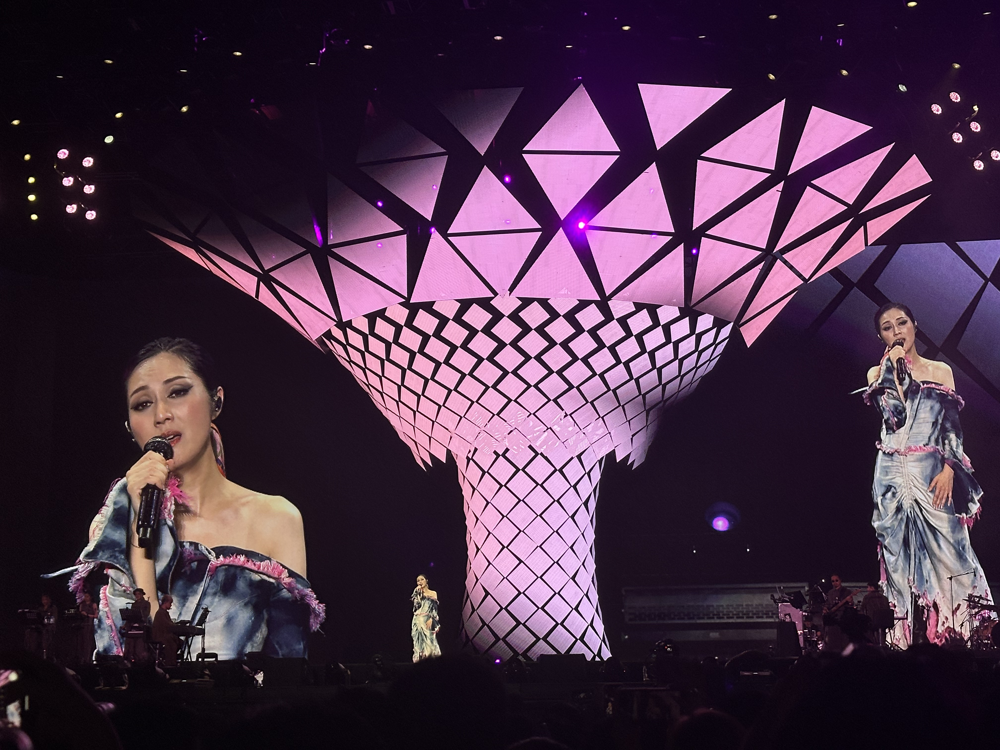
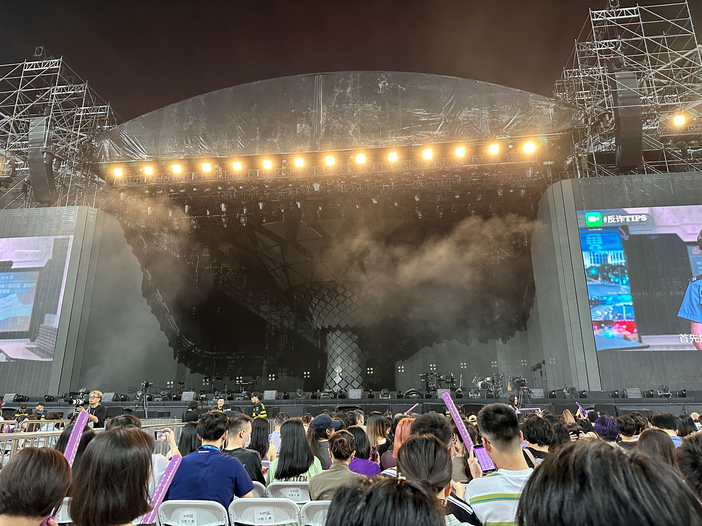
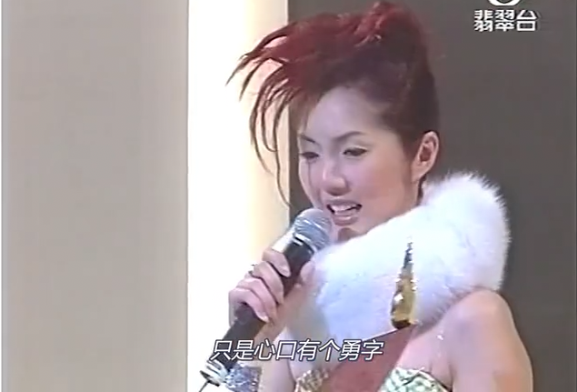
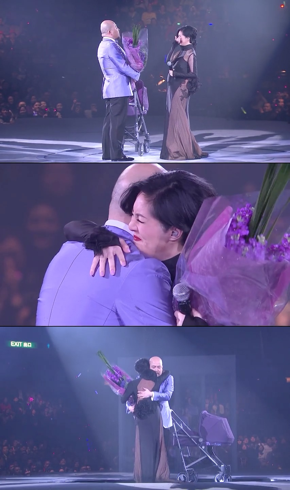
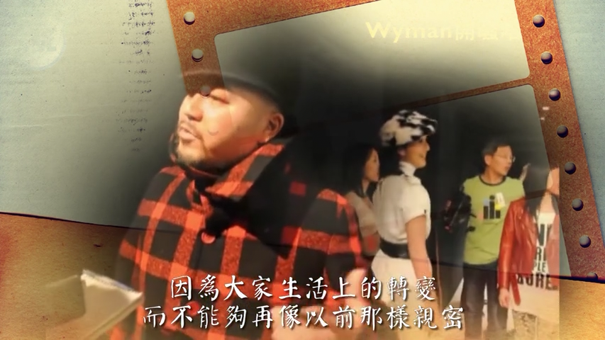
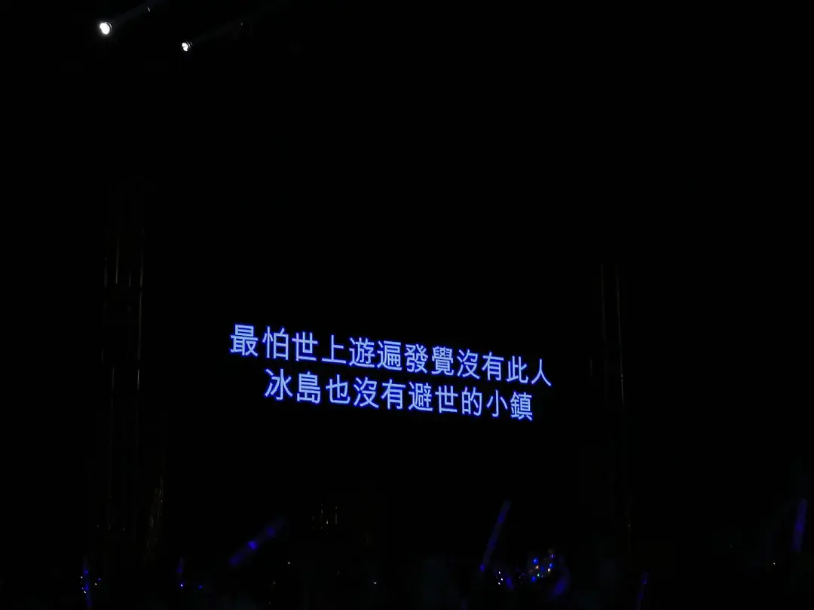
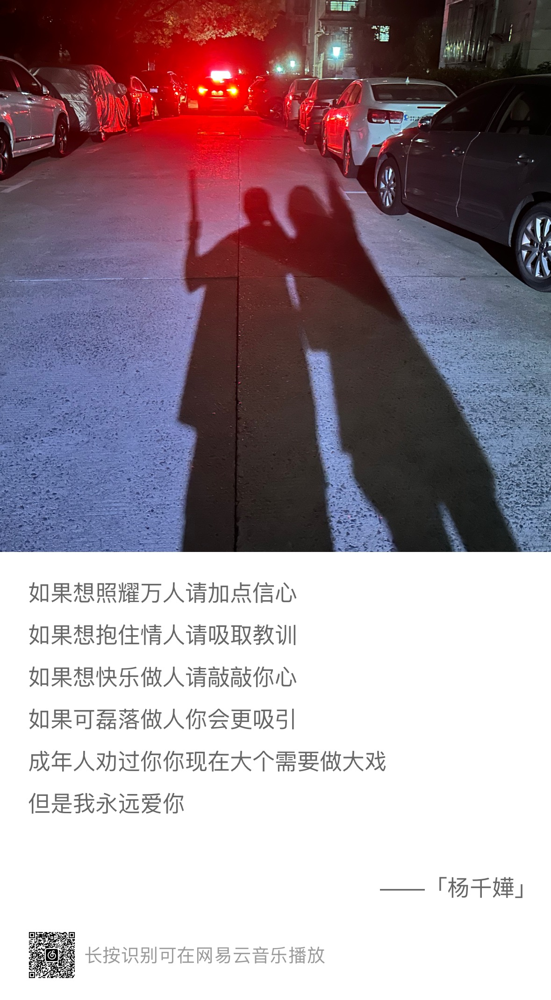
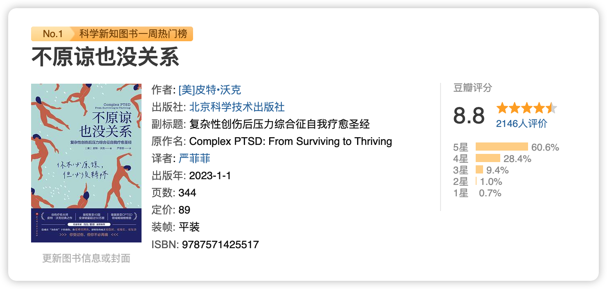

> 这里是「第三周刊」第 3 期，今天的紫色献给杨千嬅。

在本周完成人生必做事项之一：看一场杨千嬅的演唱会，买到了内场，位置不错（我真的笑得超级开心），还有和我一起见证此事完成的朋友在我身边，如果不写点什么，怕幸运会溜走。

## 可惜我是水瓶座
我开始入港乐的坑，是一篇写杨千嬅《芬梨道上》的乐评，要说更早的缘分，或许从出生就开始了，「可惜我是水瓶座」。

在初中还幼稚地需要靠星座认识自己的时候，我就搜到了这首歌，当时是用“百度音乐”听的（也是时代的眼泪了），同时一起听的还有陈洁仪的《心动》，听完之后的感受只有一个词——好难听（对不起，当时还没到可以欣赏音乐的年纪）。

然后跟这首歌的缘分就到此为止，但是真命运不会这么轻易散掉。《芬梨道上》谐音是“分离道上”，我和杨千嬅的缘分，从十几年后的“芬梨道上”重新开始。

>这山顶何其矜贵，怎可给停留一世，
>只得很少数伉俪，在这风景线上建筑关系。
>——《芬梨道上》

[【4K60帧】回味经典，杨千嬅《可惜我是水瓶座》现场！！！\_哔哩哔哩\_bilibili](https://www.bilibili.com/video/BV16T4y1k7FD/)

后来重听《可惜我是水瓶座》，切切实实爱上，不仅仅是旋律，也爱歌词：
>如何笨到底，但到底还是我
>谁人待我好，待我差太清楚
>要是回去没有止痛药水
>拿来长岛冰茶换我半晚安睡

黄伟文说，从来没有见过连饮十杯长岛冰茶还不醉的人，这个人就是杨小姐，我后来还去查了一下长岛冰茶是什么，很多年之后终于尝试了一下，味道还蛮不错的。

## 沿途红灯再红，无人可挡我路

我学会的第一首粤语歌，杨千嬅的《勇》：
> 旁人从不赞同，连情理也不容，
> 仍全情投入伤都不觉痛。
> 如穷追我梦，谁人如何激进，
> 亦不及我为你那么勇。

杨小姐，是最适合这首歌的人，如果要选一首歌代表她，我不会选《可惜我是水瓶座》，“拿来长岛冰茶换我半晚安睡”只能说明她的倔强，也不会选《处处吻》，劲歌洒脱不是她的底色，《少女的祈祷》，“祈求天父放过一双恋人”不像是她会说的话，她更像是那个会说出“我偏要勉强”的人。我只选这首。

在写到这些歌的时候，我都替同期一些歌手忌妒她（个人想法），林夕和黄伟文真的把自己最好的词的一部分，都给了她。在 2002 年叱咤女歌手颁奖典礼上，杨千嬅边哭边说，“我什么都没有，唯有心头一个勇”，台下坐着的黄伟文由此给杨千嬅写下了这首《勇》。

>沿途红灯再红，无人可挡我路，
>望着是万马千军都直冲，
>我没有温柔唯独有这点英勇。

最爱哭的杨小姐，靠着心口的勇字，一路走到今天，希望能继续走下去。

## 最佳损友，最好的债

黄伟文是最了解她的人之一，这世界上的爱很多，爱她的人也很多，我想黄伟文一定是最爱她的人之一。他几多歌词，算是定制，每次听到，都会感慨万千，相识于微时，一路走到成名，却分道扬镳，等再回首拥抱，中间是十年日月，她带着身孕献出最温柔的一版《野孩子》，他推着满香港找来的紫色婴儿车，相逢一笑（哭）泯恩仇。

视频链接：
[【Concert YY】杨千嬅-可惜我是水瓶座 勇 野孩子+黄伟文+陈奕迅-最佳损友\_哔哩哔哩\_bilibili](https://www.bilibili.com/video/BV1us41197tx/)

说起二人的恩怨，也算是百转千回，总结就是，黄伟文不满自己每次用心写的歌词都不被选作主打受重视，认为杨千嬅其实并不爱自己写的歌，而其中选择又掺合进各种利益、市场，杨小姐又没解释，于是二人决裂，十年，黄伟文没再写歌给杨千嬅。

>你那生平杰作被埋他脚下
>他不太值得吧
>但你将最好那些
>都已经送他
>——《最好的》王菀之

黄伟文生气时说，“你那生平杰作被埋他脚下，她不太值得吧”，词中的幽怨都快溢出来，但转头还是写了《最佳损友》交给杨小姐的圈内好友陈奕迅演唱，以及和杨同一天生日的郭伟亮作曲。

决裂时两人互相躲着见面，同场活动，相距不过三米，却始终没有回过头讲一句话，“地球上最远的只怕是同场也不看我一次（《墙纸》）”，黄伟文的这句歌词，不知有没有在说这件事。

《最佳损友》的歌词太好，好到我无法摘抄，黄已然内心认定决裂，却也承认某人“实实在在踏入过我宇宙”，就算“来年陌生的是昨日最亲的某某”，也“总好于那日，我没有遇到过某某”。这首歌曾让杨千嬅听到在车内大哭，“很多东西今生只可给你，保守直到永久”，你们彼此知道自己给出去了什么。

>朋友我当你一秒朋友
>朋友我当你一世朋友
>很多东西今生只可给你
>保守至到永久
>别人如何明白透
>实实在在踏入过我宇宙
>即使相处到有个裂口
>命运决定了以后再没法聚头
>但说过去却那样厚
>早知解散后各自有际遇作导游
>奇就奇在接受了各自有路走
>却没人像你让我眼泪背着流
>严重似情侣讲分手
>来年陌生的是昨日最亲的某某
>总好于那日我没有
>没有 遇过 某某

再到十年后和解，2015 年黄伟文在《最好的债》写道“爱撒野的小孩，被教得很乖，最好胜的小孩，也被我拥入怀”，十年的纠葛愤懑，抵不过时光。“我恨你恨到比宇宙更大，被年月压缩到最小纸碎一块，随风散落闹市中，铺满在路过的街，我决定不带”。

>如有空介意其实只介意
>怎么我们会到此
>曾陪伴似天使
>曾怀着过好意
>谁来原谅谁别太关注
>其实爱侣与挚友无赢跟输
>能明白最后仍不算是迟
>谁好或谁坏
>一万年以后已不需要分解
>我只盼今生可释怀
>记挂与你分享的天涯
>和你结过那些党派
>你是最好那段债
>——《最好的债》

在 2015 年的演唱会上，穿着“野孩子”的黄伟文再次拥抱他的野孩子，然后唱出“你是最好那段债”，我相信他已经释怀。

[【杨千嬅】最好的债-2015 Let's Begin演唱会版\_哔哩哔哩\_bilibili](https://www.bilibili.com/video/BV1Fs411R7cu/)

## 最后

其实我不算是粉丝，只是歌迷，其实我连她都拿过什么奖都不清楚，只是爱她的歌，热门的冷门的都听。很长一段时间，我的朋友圈背景都是她的一句歌词“最怕世上游遍，发觉没有此人，冰岛也没有避世的小镇”。

很爱她《稀客》中“游客是你，风景是我，无法避免，让你经过”，听到《火鸟》“从头细数什么命运由什么铸成，心境每秒在注释生命”会晃一晃神，“满街脚步突然静了，满天柏树突然没有动摇”，我的心情会随着她的声音平静下来。

![[2023.9.9火鸟.mov]]

这次的演唱会，“红馆孟姜女”很努力在忍住眼泪了，但是她还是哭了，背过身擦掉眼泪的杨千嬅，已经不是在红馆哭到无法发声的小女孩了，她多次朝台下鞠躬，说“我已经五十岁了，有时候都记不住歌词了，不知道还能唱多久”，她蹦蹦跳跳，又酷又漂亮，能在此刻参与并成为演唱会的一部分，实在是很幸运了。

《杨千嬅》是演唱会最后一首歌，也是我很喜欢的一首歌，就以此结尾吧：

## 本周读书

### 《不原谅也没关系》by 皮特·沃克

这是一本讲述 CPTSD 的书籍，大家都知道 PTSD（创伤性应激反应），**CPTSD 就是复杂创伤性应激反应，常常出现在长期受到父母或养育的大人情感忽视、蔑视、虐待的人身上**，这样的孩子长大之后，自我价值感非常低，经常会出现**负面情绪闪回、自我遗弃、恶劣的自我批判**等症状，严重的会伴随长期的**遗弃抑郁**和**被动自杀意念**，就是不主动实行，但觉得生命没有价值的状态，同时这样的人还会出现依恋障碍，导致他们无法与他人建立正常健康的关系。

皮特本人就是 CPTSD 的幸存者，他使用自己的经历和在治疗中的案例，讲述个人如何在患上 CPTSD 之后，如何自我疗愈，并和他人发展出健康的亲密关系，作者说到了在父母的情感虐待下，幸存者常常会展现的 4F 反应（**战 Fight、逃 Flight、僵 Freeze、讨好 Fawn**），这些反应在小时候是为了帮助我们幸存，但在长大之后往往会出现过度反应而带来一些问题。

近几年经常在提的“自我再养育”，我们可以好好帮助自己的内心的小孩长大，对于过去，不原谅也没关系，对于现在和未来，幸福是需要我们自己努力的。

这本书大概会写一篇笔记。

## 本周荐文

（点击蓝字查看原文）

### 1. [项飙对谈迈克尔·桑德尔：我们如何摆脱“优绩主义”？](https://m.thepaper.cn/newsDetail_forward_17281196)by 澎湃

自幼年起，我们就被教导，只要勤奋，就能进入精英大学，爬上社会的阶梯。然而，精英真的是完全靠自己的努力取得成功的吗？精英们在道德上是否配得上他们所获得的一切？

3月19日，哈佛大学政治哲学家迈克尔·桑德尔教授与马克斯•普朗克社会人类学研究所所长项飙教授展开线上对谈，探讨优绩主义的公正性以及对中国社会的影响，堪称一场思想盛筵。

### 2. [打工十三年，我仍然一无所有](https://mp.weixin.qq.com/s/8H1ARMFfqYuA2DWqu3yXiw) by 极昼工作室

唐勇，一位95年出生的年轻工人，从初中毕业就出来打工，辗转福建、广西、广东的多家工厂。这十几年，他几乎是在工厂里“长大成人”。2017年前，他频繁换工作，理由通常是不顺心。随后他患糖尿病多年的父亲上山割猪草时，发了病，摔死了。父亲也曾是农民工，他们曾经在同一座城市做过"工友”。

此后他的打工生涯稳定了许多，主要围绕富士康进进出出。工价高的时候，入职拧螺丝，工价低的时候，提桶跑路。在深圳，在富士康，他们像潮水一样流过各个工厂，没有留下痕迹。

唐勇也尝试过这个时代的新机会：他发短视频记录打工生活，但每个月只有1000多块，只能在深圳住便宜的“挂逼房”（最便宜的日租房）持续十年打工也没存下什么钱，在富士康赚到的钱，因为过于劳累，许多工人又会花钱找乐子，把钱重新花给“富士康”。

今年年后，唐勇决定再次提桶跑路。他瞒着家人骑行三个月，在云南见到了一位前工友，对方在家乡开了家粉面店，盈利为负。两人见面没多久，店铺就倒闭了。骑行回家后，唐勇受够了无聊，存款的流失也令人恐慌。他决定回深圳继续打工，还在犹豫要不要重回富士康。

打工是生存的希望，但这群年轻人像进入死循环：赚钱，躺平，钱花完继续打工。**而打工本身令人绝望**。

### 3. [2个女孩决定搭伙过日子：解绑性与爱，比恋人更亲密](https://mp.weixin.qq.com/s/fqTQzXijO6G2GmZ-C753NA) by 一条

“全女共居”作为一股潮流正在兴起，它意味着一部分女性，不依靠婚姻和血缘，而是选择志同道合的朋友成为家人，长久而亲密地生活在同一屋檐下。

一条联系了3组“共居”女性，她们有人从网络好友，逐渐结成新型PLP关系（柏拉图式生活伴侣），有人与47位女生共居30天，同吃同喝，畅聊私密话题，还有人在城市郊区长租一栋别墅，用严谨的表格和公约精神，来让陌生女性拥有遮风避雨的屋瓦。