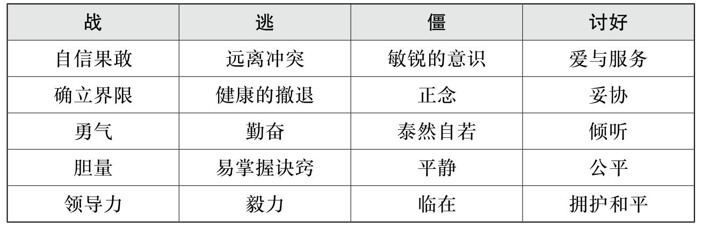
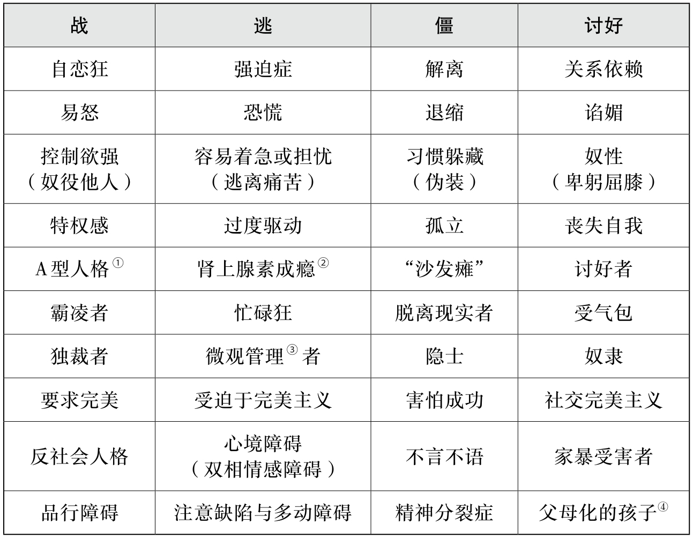
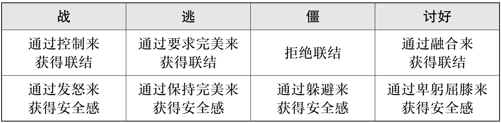

> 距离上次更新已经一个月了，很难想象一个月之内能发生这么多事情，终于在本周有时间更新这个被搁置了一个月的栏目。
> 阅读这本书的原因是在微博上看到了一个博主讲述自己被自己的父母情感蔑视的经历，又加上一个有点热度的短视频，一个母亲不停地说自己的女儿是“小黑娃”“很胖”等等，哪怕这个女孩其实很漂亮也很成功了，还是会面对来自母亲的蔑视。
> 我想这是很多家庭里的孩子都会经历的一个过程，我们被迫接受了来自父母的暴力，而后在漫长的人生里反复质询自己，想通过这篇文章告诉各位，「你并没有做错什么，你已经做得很好了，善良地长大了，真是太了不起的一件事情了，以后要好好照顾自己」。
> 本文会有点长，就没有「本周读书」和「本周荐文」了。

有一句很热门的话，“**幸运的人一生都在被童年治愈，不幸的人一生都在治愈童年**”，必须要治愈童年的人，大概率就是患上了 CPTSD。有时看着网络上的讲述、频发的少年心理事件和青少年越来越高的自杀率，会觉得心痛，本文将从以下几个方面对 CPTSD 做点简单的科普并提供一些可以实践的解决方向（注：如果有严重的心理障碍请及时就医，以及本文提供的是对原书的不完全整理）：
1. PTSD 与 CPTSD 的区别
2. CPTSD 的常见症状
3. CPTSD 的创伤反应：4 F 反应
4. 自我疗愈的方法
5. 结语

## 1. PTSD 与 CPTSD 的区别

### PTSD

创伤后应激障碍(Post-Traumatic Stress Disorder，PTSD)：创伤后应激障碍是一种暴露于单个或一系列极端威胁或恐怖的事件后可能发生的障碍。表现为以下特征：
①**创伤经历的再体验**，即创伤事件以栩栩如生的侵入性记忆、闪回或梦魇等形式在当下再现，通常伴有强烈的、压倒性的情感，多为恐惧或恐怖，以及强烈的躯体感觉；
②回避行为，**回避对创伤事件的想法或记忆**，或回避使人想起创伤事件的活动、情境或人物；
③**对目前威胁的持续性高水平觉察**，如可表现为高度警觉，或在遇到刺激（如突发的响声）时出现强烈的惊跳反应。这些症状至少持续数周，并在个人、家庭、社会、教育、职业或其他重要功能领域造成严重损害。
PTSD 包括：创伤性神经症(Traumatic Neurosis)。

### CPTSD

复杂性创伤后应激障碍(Complex Post-Traumatic Stress Disorder，CPTSD)：复杂性创伤后应激障碍是一种暴露于单个或一系列极端威胁或恐怖的事件后可能发生的障碍。

这些创伤性应激事件通常是长期或反复的，从这些事件中逃脱是极其困难或不可能的（例如奴役、种族灭绝活动、**长期的家庭暴力**、**儿童的反复性虐待或躯体虐待**）。必须首先满足 PTSD 的所有诊断需求，同时存在以下特征：
①情绪调节上的异常；
②存在一些信念，认为自己是渺小的、失败的、无价值的，对创伤性事件有愧疚感、自责自罪或失败感；
③难以与他人保持亲密的人际关系。这些症状在个人、家庭、社会、教育、职业或其他重要功能领域造成严重损害。

**CPTSD不包括：创伤后应激障碍**。

CPTSD 主要形成原因包括：
- 童年长期遭受躯体虐待或性虐待
- 持续的言语虐待
- 情感蔑视和忽视

## 2. CPTSD 的常见症状

CPTSD 是一种更为严重的创伤后应激障碍(PTSD)。它与后者这种较著名的创伤综合征的区别，在于 CPTSD 最常见、最棘手的五个主要症状：

1. 情绪闪回 (Emotional Flashbacks)
2. 毒性羞耻感 (Toxic Shame)
3. 自我遗弃 (Self-abandonment)
4. 恶性内在批判（Vicious Inner Critic，或称内在批判者）
5. 社交焦虑 (Social Anxiety)

### 情绪闪回：CPTSD 最典型的症状

情绪闪回是一种<mark style="background: #F6E99E;">突然发生且通常持续时间较长的退行 (Regression)</mark>，幸存者会退行至童年遭受虐待或遗弃时所产生的强烈的情绪状态。

这种情绪状态可能包括强烈的恐惧、羞耻、疏离、愤怒、悲伤和抑郁，甚至出现不必要的战或逃 (Fight or Flight)反应。

### 毒性羞耻感：情绪闪回的表象

毒性羞耻感会让 CPTSD 幸存者觉得自己惹人厌、丑陋、愚蠢或有致命缺陷，导致低自我价值感和孤立感。

这种强烈的感受会摧毁幸存者的自尊，触发情绪闪回，使幸存者重新体验被父母蔑视、打击、忽视和拒绝的感受。

“混杂的被遗弃感”是一种混杂着恐惧、焦虑和毒性羞耻感的痛苦感受，这种感受还会与遗弃抑郁 (Abandonment Depression)相互作用。

### 自杀意念

自杀意念 (Suicidal Ideation)是 CPTSD 的一种常见症状，经常出现在剧烈而长时间的闪回期间。其包括以下两种：
1. 主动自杀意念：主动实行自杀行为。
2. 被动自杀意念：会有强烈的自杀意图，但不会真的付诸实践。

### 其他症状

- 绝望的孤独感和被遗弃感
- 脆弱的自尊
- 依恋障碍
- 发展停滞
- 人际关系困难
- 极端的情绪波动
- 发生解离——在行为活动和精神状态层面分散注意力
- 极易触发战或逃反应
- 对应激情境的过度敏感 

## 3. CPTSD 的创伤反应：4 F 反应

在面临来自家庭（养育者）持续的情感暴力，为了保护自己，孩子们会根据养育者对待他们的方式发展出不同的处理方式，主要有以下几种类型：
- <mark style="background: #F6E99E;">战 Fight：自恋型</mark>
	- **形成机制**：受到父母自恋式的期待，加入父母的阵营霸凌其他家庭成员。
- <mark style="background: #F6E99E;">逃 Flight：强迫型</mark>
	- **形成机制**：家庭里被蔑视和打压的孩子，“替罪羊”，产生低自尊感，常常会形成强烈的不配得感。
	- **结果**：幸存者会产生强迫性重复 (Repetition Compulsion)或重演 (Reenactment)，会不断和伤害自己的人生活在一起。
- <mark style="background: #F6E99E;">僵 Freeze：解离型</mark>
	- **形成机制**：家庭中被忽视的孩子，完全没有得到关注和照顾的孩子，会出现一种麻木和解离的状态，在社交场合感觉焦虑和排斥。容易出现成瘾，恋物癖等等。
- <mark style="background: #F6E99E;">讨好 Fawn：关系依赖型</mark>
	- **形成机制**：高敏感孩子通过压抑自己需求讨好父母获得关注。

因为四种反应类型的单词都以 F 开头，所以合并称为 4F 反应。虽然是经历创伤之后形成的反应机制，这些反应有着自己的积极和消极面，当然也会对亲密关系造成一些扭曲理解，感觉有些可以完美套入《再见爱人》里很多人的模式。

## 4. 自我疗愈的方法：自我关怀

很多 CPTSD 患者会出现发展停滞的状态，因为在小孩时没有得到足够的支持和爱，于是仅仅只是身体和年纪长大了，但心理还是当年那个无所适从的小孩，呈现出一种与年龄不符合的幼稚与暴躁。

近年来也会有很多人提到“自我养育”，也就是做自己的父母，把自己重新养大一遍，我可以爱护我自己，我可以治愈我自己的童年。

自我疗愈是对 CPTSD 症状的改善，主要包括：
- 管理自己的情绪闪回。
- 缩减内在批判者：内在批判者是内化父母，他们会不停贬低自我。
- 缩减外在批判者：外在批判者是我们内在批判向外的投射，是对他人的不信任导致的攻击倾向。
- 学会哀悼
- 管理遗弃抑郁
- 通过健康的关系治愈遗弃创伤
- 接受自己，不强迫自己原谅
- 通过阅读丰富自己的认知并实践

对这些的处理方式，书中写得详细且具备很强的可操作性，我仅仅摘录其中对最核心的的症状——情绪闪回的处理方法。

情绪闪回是一种精神的退行，它会让你感到自己回到小时候被抛弃、被蔑视的情境里，你会出现一种焦虑与无助的情绪。情绪闪回的常见体验包括：感觉自身渺小、脆弱和无助；感觉一切都非常困难，感觉生活非常可怕；展现自己让你感到极度恐慌和脆弱；你的能量似乎耗尽了；在最糟糕的闪回中，你会觉得世界末日马上就要来临了。

所以我们需要识别我们情绪闪回的诱因和迹象，然后将自己的情绪闪回控制住，然后解决它。

### 情绪闪回的诱因
- <mark style="background: #F6E99E;">外在诱因</mark>
  - 记起最初创伤的人、物、地点、事件、表情和交流方式。
  - 比如：看望父母；看到与童年施虐者相似的人；极具创伤性事件的周年纪念；听到有人用与父母相似的羞辱性口吻或用语。
- <mark style="background: #F6E99E;">内在诱因</mark>
  - 内在诱因通常是内在批判者造成的恶果，是关于危险或必须完美的想法或可视化想象。

### 情绪闪回的迹象
- **感觉自己渺小、无助和无望**。在强烈的闪回中，这种感觉会被放大为强烈的羞耻感，以致我们不愿意出门或露面；还会表现为感到脆弱、紧张、敏感、易受伤；可能还会使我们感到成年后建立起的自尊变得荡然无存。
- 内在批判者和外在批判者越发恶毒，通常会**表现得更加极端化和灾难化，而且对自我和他人的批判变得更加强烈**。常见的例子是陷入非常极端的“全或无”思维，只能看到自己或他人的缺陷。
- **对一些情况做出超出常理的情绪反应**。这包括两种常见的情况：
  - ①一件小小的不愉快的事，却感觉像一件紧急大事；
  - ②一点小小的不公平，却感觉像对正义的践踏。
- 迫切地想要使用比平时更多的物质，比如酗酒、暴食等。

### 管理情绪闪回的 13 个步骤

1. **告诉自己：“我正在经历闪回。”**
2. **提醒自己现在很安全。**
3. **你需要，并且有权利设定界限**。提醒自己不必容忍他人的虐待。你可以自由地离开危险的环境，并抗议不公平的行为。
4. **安慰你的内在小孩**。你的内在小孩需要知道你是无条件地爱着他的，当他感到失落和恐惧时，可以寻求你的安慰和保护。
5. **破除“闪回无休无止”的观念**。
6. **提醒自己已经长大了**。现在我们拥有了成年人的身体，还有童年时不曾拥有的盟友、技能和资源，能够保护自己（感觉渺小和脆弱是闪回的迹象）。
7. **慢慢回到身体里**。恐惧会使你产生“上头”的忧虑、麻木和放空的感觉，你需要温和地重新回到自己的身体里。
   ①柔和地引导身体放松：感受身体的每一个主要肌肉群，柔和地使它们放松下来（紧张的肌肉会向大脑发送错误的危险信号）
   ②慢慢地深呼吸：屏住呼吸也会向大脑传送危险信号。
   ③放慢速度：冲动与急躁会按下大脑的逃跑反应按钮。
   ④找一个安全的地方放松并舒缓自己：裹着毯子，抱着枕头或毛绒玩具，躺在床上或衣柜里，或者洗个澡，小憩一会。
   ⑤感受身体中的恐惧，但不做出反应：恐惧只是你身体中的一种能量。如果你不逃避它，它就无法伤害你。
8. **抵制内在批判者极端化、灾难化的思维**。
   ①运用“思维阻断”制止内在批判者，停止其无休止地夸大危险和试图控制不可控事情的行为。拒绝羞辱、仇恨或遗弃自己。把自我攻击的愤怒转化为对不公平的自我批判说“不”。
   ②运用“思维替换”和“思维纠正”的方法，记住自己的一系列优点和成就，用来替换消极思维。
9. 允许自己哀悼。肯定过去受到的伤害，并哀悼自己。
10. **培养安全的关系并寻求支持**。想要独处时，可以给自己一些独处的时间，但不要因为羞耻感而孤立自己。感觉羞耻并不意味着你是可耻的。让你的亲密对象了解什么是闪回，并请他们通过交谈和分享感受来帮你度过闪回阶段。
11. **学会识别触发闪回的诱因**。远离那些让你感到不安全的人、地方、活动，以及可能触发闪回的心理过程。如果诱因无法避免，可以通过练习这些管理闪回的步骤进行预防。
12. **弄清闪回的根源**。闪回是一次机会，可以让你发现、验证和治愈你过往遭受的虐待或遗弃所带来的伤害。闪回也表明了你仍未充分满足自己的发展需求，并为你提供动力来满足这些需求。
13. **对缓慢的康复过程要有耐心**。此刻你需要时间来代谢肾上腺素，之后也需要相当长的时间来逐渐减少闪回的强度、持续时间和次数。真正的康复是一个循序渐进的过程（往往是前进两步就又后退一步），而非一蹴而就的救赎幻想，所以不要因为出现闪回而自责。

## 5. 结语

了解 CPTSD 的概念对我而言是一次新的起航，我相信也不只我一个人会经历长久的自我批判与时不时的情绪闪回带来的退行性表现，而通过识别自己的创伤，接纳自己的经历，我们才会更有信息和能力走向未来的生活。

就不说太多了，希望没有被童年治愈的朋友们，能够被自己治愈，毕竟我们还有未来可以享受，真的辛苦啦！