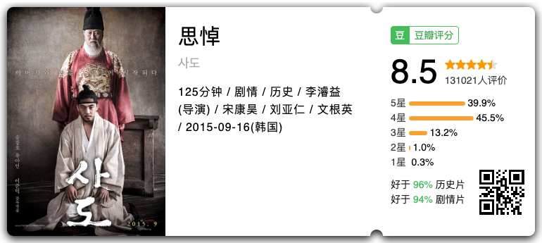
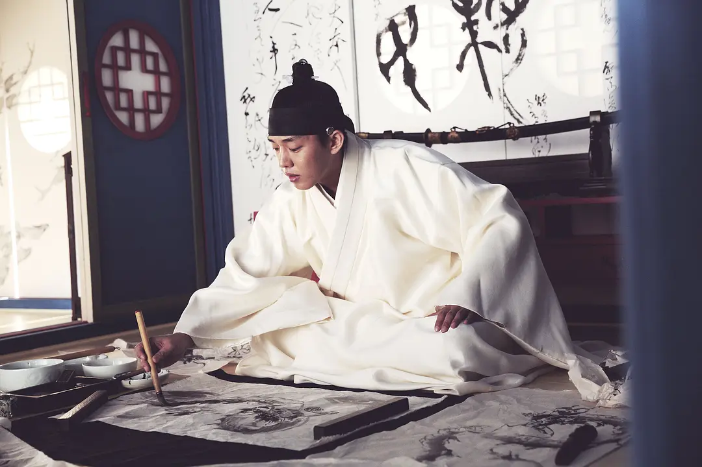
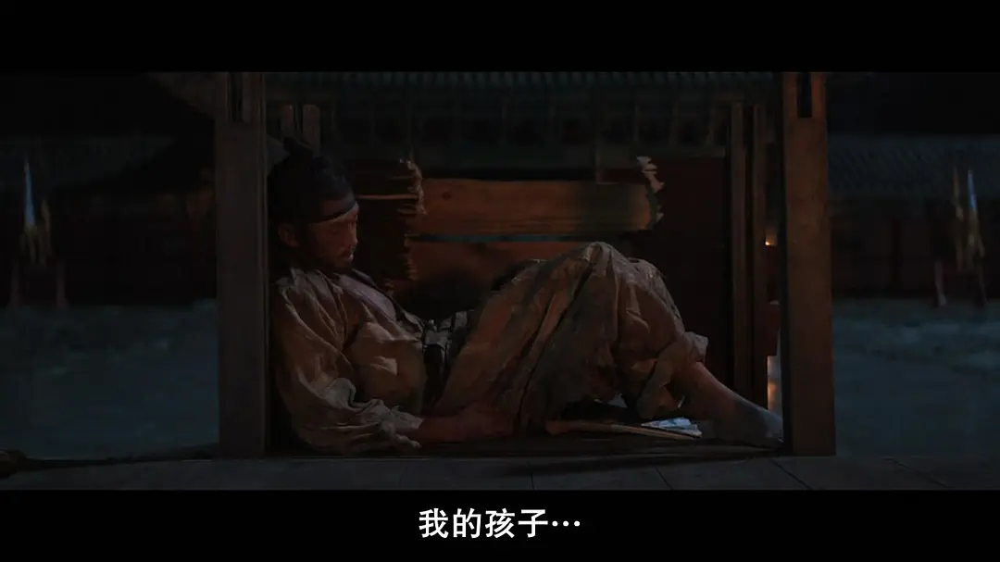
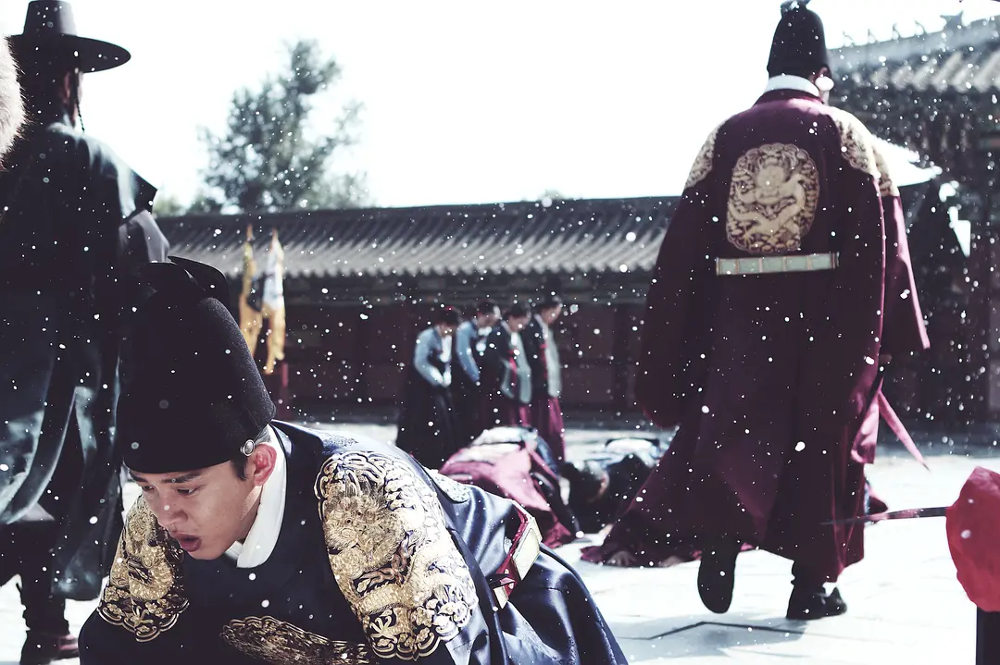
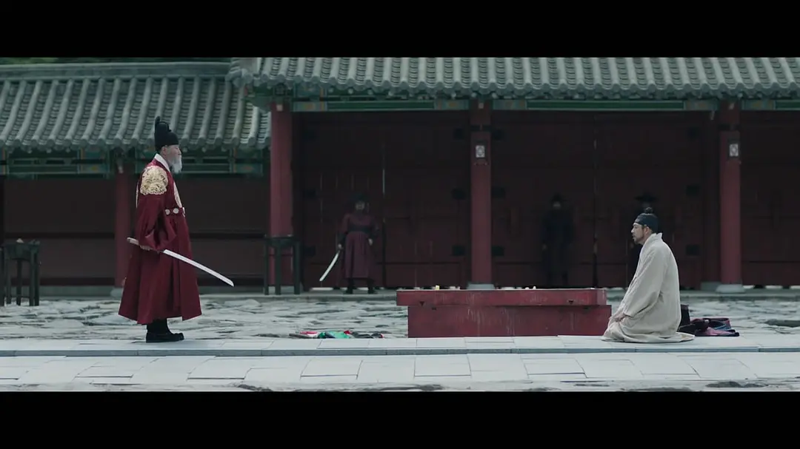
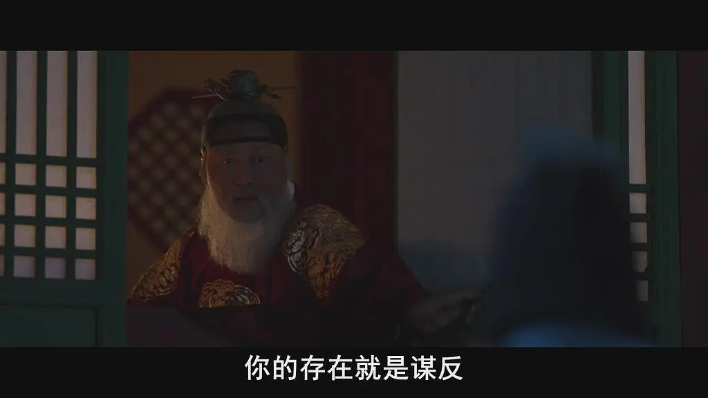
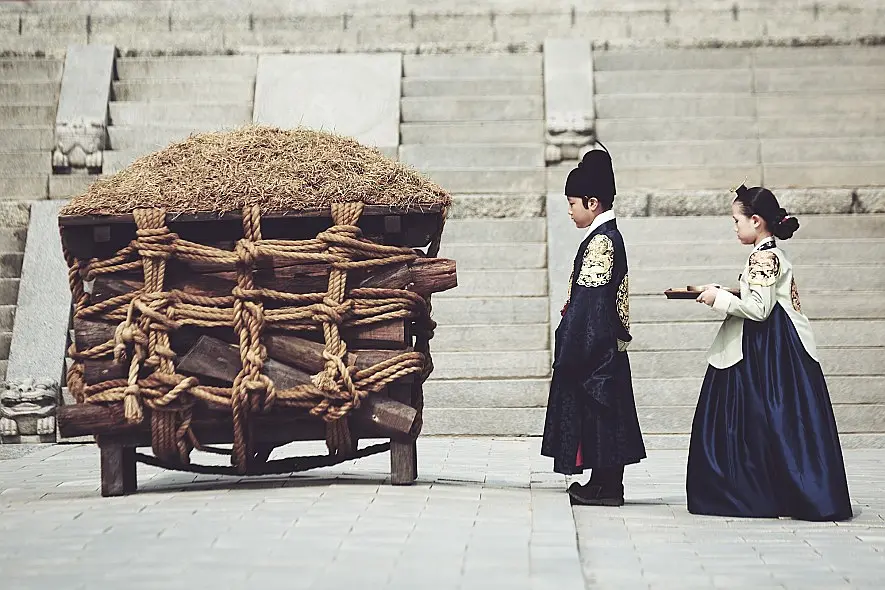

> 《思悼》是一部韩国的电影，由于电影制作上的优秀与刘亚仁的精彩表演，让这个朝鲜历史上极具悲剧色彩的王世子走进大众视线——**思悼世子作为唯一的王朝继承人被自己的父亲关入米柜内饿死**，年仅 28 岁。
> 电影基于历史著作《权力与人》改编，最大程度还原了思悼世子的人生经历，也从中展开对封建王权的批判、对王权下父子关系的思考。

《思悼》无疑是一部非常优秀的电影，从演员、镜头、剧情来说都呈现了韩国电影的优秀水准，每次看到思悼世子，我也会想到汉武帝时期的“戾太子”刘据，同样是在父亲的期待下降生，同样年纪轻轻就被立为王朝的继承人，同样从小被被当作继承人培养，也同样，在漫长的继承人时光里与父亲演变成“子不知父，父不知子”的悲剧。

大热剧《琅琊榜》拍出了“父子相疑”的人伦悲剧，可是最后的落点是寻找一个新“圣君”，利用他可以继承的权力替被冤枉死掉的战士们平反，所以正义指望的是——**权力拥有者的良知**，我在说到这句话都忍不住笑，几万人的正义指望另一个人的良知。所以这部剧，最终只能是一部爽剧，它没有向更根源的问题发问，也没有批判产生这场悲剧的体系。

每次看到《思悼》、《兹山鱼谱》这样的电影，我时常羡慕韩国能够拍出如此深刻批判封建王权对人的异化、批判儒教对人的摧残的电影，真要说到这类历史题材与悲剧，又有谁比得过我们呢？从汉武帝到康熙，这样的人伦悲剧还少吗？

可是无论是影视剧还是电影，对历史王权总是美化多于批判，视角总是权力拥有者而非被碾压的个人，看这部电影经常会有种被敲打的感觉，意识到我对历史王朝的想象是非常浅显且无知的，充满了所谓“胜利者”的视角。

思悼世子不喜欢四书五经、不喜欢摇头晃脑背诵经典，他喜欢画画，喜欢骑射，喜欢游玩，对奶奶、养母、母亲有着深切的感情和同情，对父亲有尊重和敬畏，看着电影里思悼世子从快乐的小孩一步步走向癫狂，最后崩溃死于狭小的米柜之中，那种悲哀，**在于见证了一个人的毁灭**。

## 世子出生：理想儿子的反面

思悼世子于 1735 年正月二十一日生于昌庆宫集福轩，从出生他就带着成为国王的命运，他同父异母的哥哥孝章世子已经去世七年，英祖年过四十二，正处于对继承人束手无策的情况之下。他带着父亲与朝臣的期待降生，在出生次年三月就被封为世子，成为王国的继承人。

正因如此，思悼世子从一出生就背负着王国的命运，背负着英祖的期待，刚周岁时就建立了侍讲院，两周岁后立刻开设了正式课程—―书筵，让世子阅读《孝经》与《小学》。之后世子学习《千字文》等书，从七岁起开始正式读书。世子读的第一本书是《童蒙先习》。随后在他八岁时，也就是 1742 年三月二十六日举行了入学礼。课程非常繁重，而且这些课程只针对世子一个人，所以他不被允许走神，也缺乏一起学习的朋友，他从小学习的就是儒家那一套“克己复礼”、“存天理、灭人欲”那一套的思想。

>如果我们通过思悼世子接受的教育，解读朝鲜时代世子教育的常见问题的话，可以认为这是与世子地位不符，从俭素开始教导的观念教育、非自主性教育与反社会性的教育。
>——《权力与人：思悼世子之死与朝鲜王室》

英祖不仅教给思悼世子作为君王的基本素养，也教他如何处理国政悬案。从世子三岁起，英祖就让他在自己身边观察国政讨论，在他十五岁时让他代理听政，直接决定重大国事。

**英祖对于唯一的儿子有着超乎寻常的期待，这种期待在英祖本人的偏执症情况下往往显得苛刻**，常年独自面对繁重的课业压力与父亲的期望，世子的精神状态不堪重负，于是出现厌学、暴食、沉迷玩乐的行为。可是这样的行为更加加剧了英祖的不满，也加剧了父子之间的矛盾。

> 王朝国家秩序的顶点是国王。谁都不能挑战他的权威，也不能违背他的意思，这就是绝对权力。但是**儒教社会的朝鲜还存在另一个绝对权力，那就是父母**。
> ——《权力与人：思悼世子之死与朝鲜王室》

世子作为王国唯一的继承人，他在宫中的生活往往都是以他为中心的，在这样的环境下，世子很难进行社会化的教育，在游戏中他开始喜欢刀剑与武艺，这样的状态和教育，其实是培养了世子的反社会性，他会认为世界上只有自己是重要的，而他唯一想要的又是父亲的认可，又因为天性不爱学习，他在重压之下更不可能成为英祖眼中那个理想的儿子和理想的世子。

## 世子之死：存在即谋逆

思悼世子不是被关进米柜的时候才开始死的，**早在被定位谋反之前，他就试图自杀好几次了**，十五岁听政被父亲否定之后，世子的精神状态持续恶化，在《恨中录》中记载世子后来精神状态几近于疯掉了，“癸酉年，至有惊悸之症。甲戌年，此症时时间发，渐为沉痼”，后来转变为严重的强迫行为，对衣物着装的强迫，乃至于杀人的程度。

世子是从什么时候开始死的呢？

是被关进米柜之后的某一天没有生气的那刻，是生下来继承者的备选项——他的儿子的那刻，是童年时被迫放弃自己喜欢的事情那刻，还是他出生的那刻？

之前有部国产电视剧《东宫》抄袭了《思悼》的台词“**你的存在本身，就是谋逆**”，思悼世子的身份不仅仅是儿子，是英祖大权独揽的竞争者，是他死后权力的合法继承者，他对儿子的爱混杂着对失权的恐惧，从他开始长大，这份矛盾就开始显现，逐渐变得不可调和。

在被告谋逆之后，英祖终于忍不了世子，决定对世子动手，当时的情况如下：
>“汝若自处则不失朝鲜世子之名，汝速为自处。”
>“吾死则三百年宗社亡矣，汝死则宗社尚保，汝死可矣。”
>惠庆宫派人到宫墙底下偷听，听到世子求饶。
>“父王！父王！吾之谬误甚矣，自今以后，惟命是从，读书且听所教，幸勿如是！”他还说：“某年臣几不免于剑头魂也，今又命之，死臣当死矣。”

思悼世子的死亡几乎是不可避免的，英祖把世子关进米柜饿死的行为未免显得太过于不近人情，而后很多声音试图把英祖塑造成为对杀死儿子后悔的父亲，显然是很不合逻辑的，在儿子死后，英祖奏着凯旋乐离开他的尸体，在之后对儿子的评价上也并不正面，并且把孙子过继到思悼世子的哥哥孝章世子名下，这也引发了之后正祖对思悼世子的史料篡改和对他的正名。

## 罪否？世子死后的讨论

世子死后关于他是否谋逆的争论，总会让我想到嘉靖时期的“大议礼”，同样**是想要给自己的父亲一个“合法”的身份，以求自己的继任合法性和身份的抬高**。

在世子死后三十余年，正祖即位之后，金縢之书（金縢意为金属质的丝带，是捆束装有中国古代皇室秘密文书匣子的绳子，因此金縢也象征着王室的秘密）被发现，实物并未被公开展示，全文内容也无从得知。正祖仅将文中的二十字汉诗示于大臣们，即“**血衫血衫，桐兮桐兮，谁是金藏千秋，予怀归来望思**”。也就是表达了思悼世子对嫡母去世的悼念孝心的文字内容。

不仅如此，正祖还默许了很多替世子伸冤的上书，表达世子并无谋逆，而是英祖误判了当时的情况，世子藏兵器并无谋逆之意。既然世子并无谋逆之意，那么这项罪名只能安排到别人的头上去，于是正祖把谋逆的“罪人”之名安到了金尚鲁与洪启禧身上，**一个在英祖时期全身而退的大臣，换个君王就成为了“逆贼”，可见所谓“忠臣”与“逆贼”之名，也不过是君王眼中的工具罢了**。

> **所谓“国家的罪人”，这句话在这片土地上是一句空话，它被狡猾的群体用做圈套，失去意义已经有几百年之久了**。在党派斗争的时候，随着占据上风的势力的变化，有的人可能今天是忠臣，明天就会变成国家的罪人，昨天是国家的罪人，今天又有可能变成忠臣受到表彰。
> ——《权力与人：思悼世子之死与朝鲜王室》

正祖通过删除史料、重新发布符合意愿的文章来给世子所犯之罪洗白，并且对世子的“狂症”只字不提，重构父亲的形象。

乔治·奥威尔在《1984》中说到，“过去不仅被改变了，而且是持续被改变”(The past not only changed, but changed continuously)”，正祖为了父亲，也为了自身与朝鲜王室的正统性及正当性，递进式地改变了思悼世子的形象。

## 结语

> **权力在落入手中之前并不属于自己，但一旦拥有，就会出现主体与客体的同一化。我即权力，权力即我。** 我会认为权力原本就是自己的，因为这是给予自己的，所以也会出现这样的逻辑跳跃，即只有自己才有资格拥有。如果同一化进行得更顺畅，之后还会产生对此的责任感与义务感，即自身有责任维护，并认为此事是自身的义务。
> ——《权力与人：思悼世子之死与朝鲜王室》

思悼世子的悲剧不仅仅是父子之间的悲剧，更是在权力下被异化的个人悲剧，纠缠在这个故事里的每一个人，都不算有个好结局。

英祖以残忍的方式杀害了自己唯一的儿子，即使良知上能过得去，史书却无法抹去；正祖在幼年时就不得不面对自己的祖父杀死自己的父亲，而后又被送到祖父身边抚养，与母亲分离；世子的母亲在儿子死后只为孙子活着，在孙子被过继给孝章世子之后选择死亡；参与这场政变的大臣，在正祖时期被定位“逆贼”，经历长久的社会性死亡；思悼世子是其中最悲剧性的一个，被权力逼疯、被权力杀害、被权力塑造。

看电影和看书的时候，很难不去思考这样的悲剧原因何在？这其中的争斗意义何在？但我一旦开始想，就会想到很多并不能写出来的东西，所以此文就到此为止。

祝各位周末愉快。