年度总结，肯定少不了我爱的电影，挑选了本年度线上观影 Top 5、影院观影 Top 5、女性作品 Top 5、最佳剧集、最佳综艺和最新奇电影。

好电影值得我们体会。

## 年度观影 Top 5

### 兹山鱼谱 자산어보(2021)

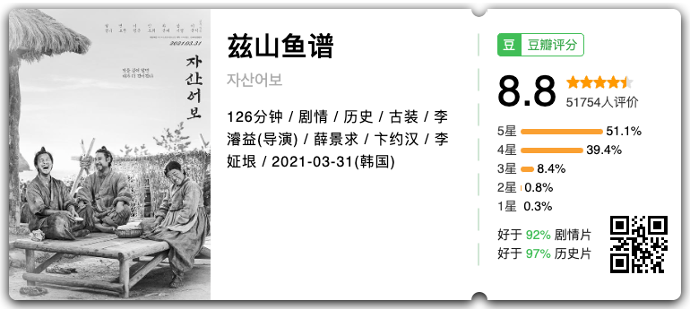

> **我想要的，是没有王的世道**，这样的书如果写出来，连剩下的妻儿也会惹祸上身。不管是性理学、还是西洋学，只要是好的，都要拿来用啊。**我通过性理学接受了西洋学，可这个国家连我一个人都不能接受，这个国家的性理学是为了谁呢**？这个国家的主人是性理学，还是百姓？

韩国与我国类似，是儒家体系教育，在近代以来，随着基督教的传播，传统的儒家的「家国天下」和「王权」观念在瓦解，但君王不会坐视近代基督教的思想动摇君主制统治的思想根基，于是开始抓捕杀害传播基督教观念的士大夫（辛酉迫害事件），丁家三兄弟就是其中的一份子，电影以三者被抓捕开场。

丁若铨被流放到黑山岛，结识了当地的渔民昌大，他是当地门阀家族的私生子，一心想做官出人头地，但苦于找不到老师，于是丁若铨向昌大学习鱼的知识，昌大向丁若铨学习儒家经典知识。

在整个故事中，对儒家、官僚体制和当时社会政治的批判非常深刻，王权与儒学的合谋共同缔造了社会的宗教，达成了王权与教权的合一，皇帝就是这唯一的核心。是非常非常值得一观的电影，非常嫉妒韩国能拍出这样的电影。

### 刺杀肯尼迪  JFK (1991)

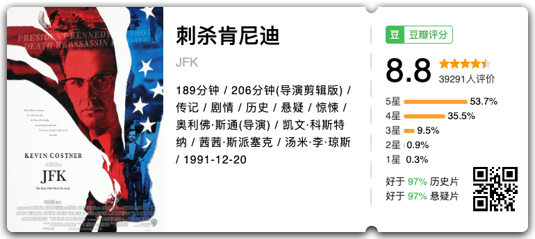

因为看诺兰的一个采访了解到这部电影，在他的描述中是“塑造了美国精神的一部电影”，我很好奇，找来一观。

电影非常长，3 个多小时，使用了伪纪录片的方式，让真实与虚拟以一种模糊的界限混杂在一起，电影拍摄的或许就是真相呢？在看的时候我会这样想，这也确实是导演想要达成的，因为这种真实的参与感，会让人想要为了「刺杀肯尼迪」的真相做点什么。

电影的前半部分有关于刺杀事件本身的调查，通过检察官的视角抽丝剥茧试图还原整个事件的真相，而到后半部分则调转主体，把检察官变成了被观看者，看他一步步被限制调查，看他如何在困境中寻求真实，看他在法庭上做最绝望的起诉。

法庭上检察官的陈词，我听了又听，没有什么比真相本身更重要的了。**Do not forget your dying king.**

本片上映之后（1991），美国政府在巨大的社会压力下被迫提前公开了「刺杀肯尼迪事件」的部分档案。

> We, the people, the jury system sitting in judgment on Clay Shaw represent the hope of humanity against government power. In discharging your duty to bring a first conviction against Clay Shaw, ask not what your country can do for you but what you can do for your country.
> Do not forget your dying king. **Show this world this is still a government of the people, for the people and by the people.** Nothing, as long as you live, will ever be more important.
>
> 今天的判决代表人民与政府斗争的希望，不要问这个国家能为你做什么，而问你能为这个国家做什么。不要忘却你死去的国王。这个政府依然还是一个民有、民治、民享的政府，只要我们还活着，没有比这更重要的了。

### 悲情城市(1989)

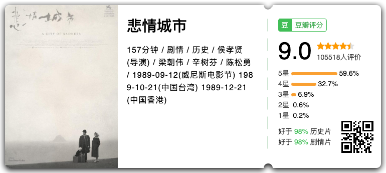

侯孝贤于今年传出因阿尔茨海默氏症不再参与电影制作了，作为台湾最真实的社会记录者之一，这是很令人遗憾的事情。《悲情城市》因为年初的北京电影院重映而重新获得大众关注，票肯定是抢不到的，于是还是自己在家看。

近期看完了齐邦媛的《巨流河》，她的描述中也有很多大陆人去到台湾聚会的描述，和侯导以本地人的视角，刚好形成补充，还原了当时台湾本地人与撤离的大陆人之间紧张的气氛，也把二二八事件重新带回大众的视野。

在看这部电影之前，我从来没想过，中国人和中国人讲话需要配备两个翻译，同根的文化、割裂的语言、对立的群体，有点残酷地在短时间内同时冲击着家庭和社会，**家族里的每一个人和每一个个体都缺乏可以缓冲或者对抗的力量，于是只能作为一颗尘埃无声地死去**。

侯孝贤用了大量剧情和台词的留白，塑造出一种真实又间离的观感，跟我们平常听到其他人的八卦一样，逻辑是断裂的，事情是突然的，我们是这个故事的接收者，而**那个时代的人们，在遭受着一种没有逻辑的、无常的、突然的死亡**。林文清带被枪毙的狱友的血书，写道：“要有尊严地活着，父亲无罪”，想有尊严地活着，是一种罪吗？

### 椒麻堂会(2021)

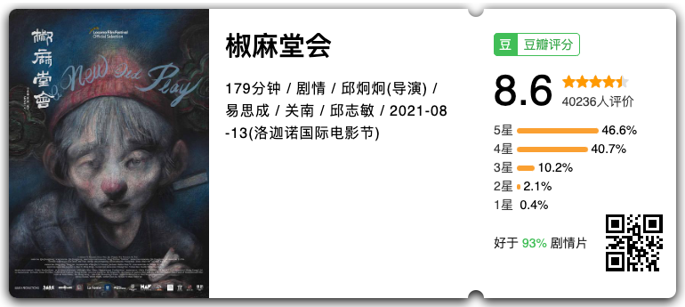

这是一部迄今未能上映的片子，估计也不可能上映，导演以自身家族经历为底本，以川剧变迁勾勒出近代百年历史，川剧、演员、家庭，每一个都是社会的演员，有一部分的残酷，我甚至不敢细想。

有人还在讲真实的故事，而我能看，已经是莫大的幸运了。

### 她 Her (2013)

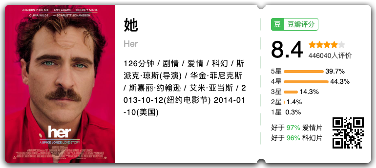

选这部完全是因为今年的 chatGPT，总有一种科幻电影要变成现实的感觉，当现实中的人与人变得隔离，人与 AI 的相伴是否能够缔造出一种新的“亲密关系”？

当我在今年看到很多 chatGPT 写给人类的语言和信件，有时候会觉得，人的主观意志有时候并不能带来安慰，反而有时因为无知而显得刻薄恶毒，AI 安慰失去妈妈的孩子、提供给有挫败感的人真诚的鼓励而不是打压，这种支持，不稀缺吗？

人很难意识到自己的局限，往往是因为过于自大。

## 影院观影 Top 5

### 芭比 Barbie (2023)

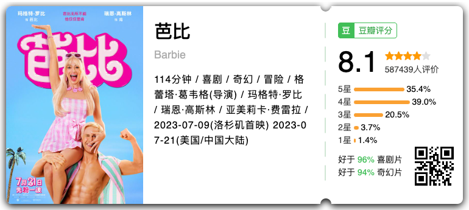

毫无疑问，这部我连续走进电影院三次的电影是年度影院最佳，简化直白表达了女性的困境，以幽默讽刺的台词直指父权制的虚伪，我看得很开心。

纵然有些瑕疵，但已经是目前以来影院表达最直白激烈之作，希望未来有更多类似的表达与故事。

### 晒后假日 Aftersun (2022)

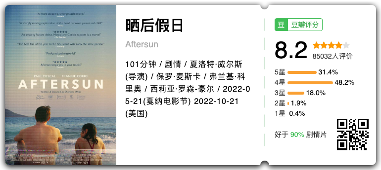

自己在家看了一遍，后来上海国际电影节有票，去电影院又看了一遍，第一遍只看到父亲与女儿的旅程，看到父亲藏匿在快乐假日背后的悲伤，第二遍看到了更多，父亲作为中年人的不安、抑郁与无奈，而成年后的女儿，终于在长到了当时父亲的年纪的时候，理解了他。

整个故事很克制，悲伤藏在蓝色的海水下，一点点泛起，而不是直接打过来，这大概就是生活吧。

### 切腹 (1962)

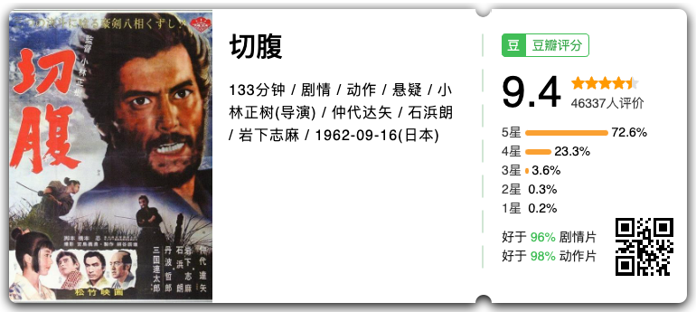

“日本电影大师展”上的电影，是回味悠长的电影，对武士精神的反思，也是对当时社会现状的讽刺。

> 武士精神只是幕府无用的荣誉而已。

刚开始就想批判的话最后由角色本身以自毁的方式呐喊出来，一层层地剥开东亚“脸面秩序”的内幕，很惨很壮烈，很东亚，很深彻。

虽然是黑白电影，画面构图非常美，故事的节奏也很好，大师的作品。

### 涉过愤怒的海 (2023)

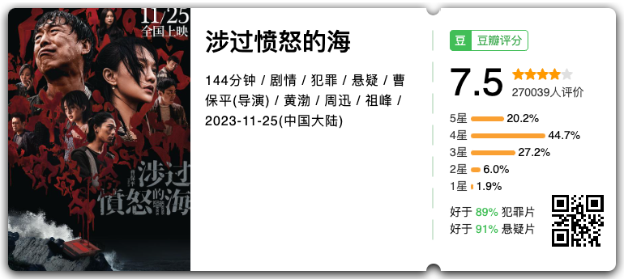

看了曹保平导演的《狗十三》，这部电影更像是一种续篇，东亚孩子不得不面对的来自父母的暴力，一点点被塑造，一步步被异化，然后在某一天，“嘭”的一声，炸成碎片，

真的是很久没有在电影院看到国产电影如此粗粝的真实感了。整个世界就是一场巨大的谋杀，每个人都参与其中，最后大家的死因都是——自杀。

### 宇宙探索编辑部 (2021)

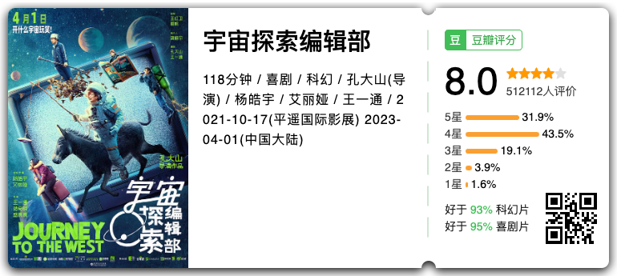

有点无厘头，但是我想敏感型人会懂这部电影的浪漫，有我不喜欢的点，唐志军说，不原谅抑郁症自杀的女儿。但整体上瑕不掩瑜，人总要有一些能够执着的事情支持我们。

## 女性作品 Top 5

> 选取女性主创的作品，包括导演、编剧、主演。

### 电击少女第一季 The Power Season 1 (2023)

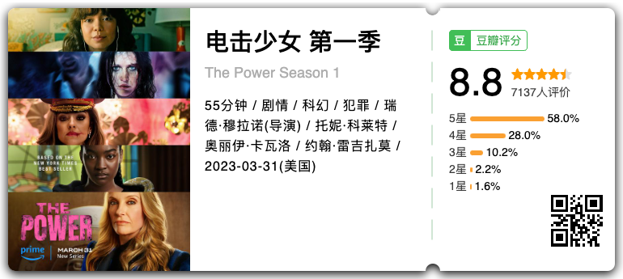

当青春期女性为了自保进化出一种放电能力，类似电鳗那种高压电；当这种放电能力能够由年轻女性传给年长女性，并可以在女性之间传播；当暴力关系逆转，这个世界会怎样变换？

由 5 个生活不同的女性视角出发，看看女性所遭遇的结构性困境与她们的愤怒，看看当关系逆转之后，体制对女性的态度如何，是恐惧、是压制、还是另一场屠杀？

前半段带着爽剧的模式，而后半段则越看越现实。但无论如何，当我看到带着头巾的女性顶着枪声前进，看着被性奴役囚禁的女性奔向阳光，看着女儿给予妈妈不会恐惧的力量，看到女孩们互相拯救谈论伤痛。我只想说，这种好事什么时候轮到我？

### 人选之人造浪者 (2023)

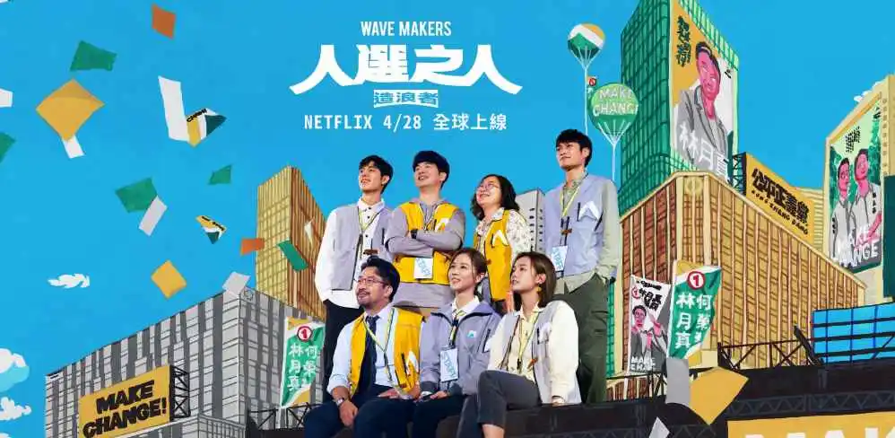

一部全网被炸词条的剧集，关于民主、关于女性、关于良性的社会如何形成和将要如何走。

> 我们不要就这么算了。

当我们还在广泛进行受害者有罪论的时候，对岸的剧集已经开始讨论权力不对等下的「同意认定」，被诱骗的 yes 是同意吗？权力下的 yes 是同意吗？没有拒绝就是同意吗？

由这部台湾热播剧引发的 Metoo 运动在这部剧播完席卷了台湾的政界、文艺界、娱乐圈，至今仍有余波，其中的一句台词“我们不要就这么算了，如果这样，人会慢慢死掉，会死掉”，更是成为这场社会运动的口号一样的语言。这大概也是一部剧能给社会带来最好的教育吧。

### 坠落的审判 Anatomie d'une chute (2023)

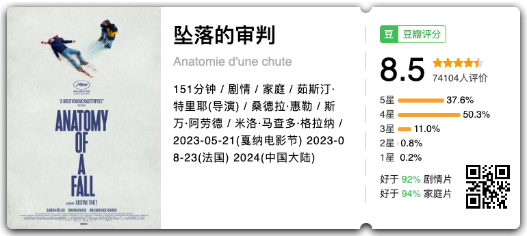

今年很多影单的 Top10 电影，结构、剧本、节奏都没有什么可挑剔的，剧情很简单，丈夫从阁楼坠落，妻子作为成功的小说家，不得不面对公众和法庭的共同审判，婚姻里的每一个细节、对话都被翻出来反复讨论，细究其中的恶意与权力关系。

有句古话，“论心千古少完人”，尤其是婚姻关系里，互相口出恶语算事再正常不过的事情了，但是检方只想定罪、辩方只想胜诉，她是不是有罪的，只有她自己在乎，可是她真的没有，观众也并不好奇。

### 弗兰西丝·哈 Frances Ha (2012)

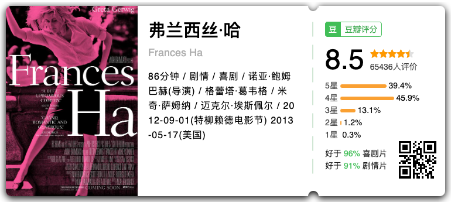

因为《芭比》，我去看了格蕾塔·葛韦格导演当演员的作品，一个真诚的、笨拙的、努力生活的芭蕾舞小演员，是类似流水账一样的生活记录，让我想到去年很喜欢的《世界上最糟糕的人》，这样活着也没有什么大不了的。

### 野蛮人入侵 (2021)

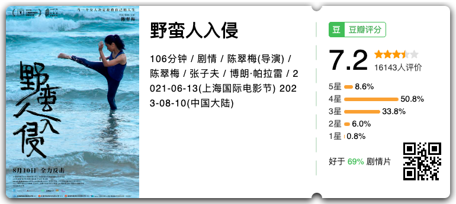

这是见到了导演本人的一场观影，一个离了婚的“过气”演员通过为新电影进行的武术训练，发现自己、寻找自己、重塑自己的过程，电影很巧妙模糊了戏中戏与戏的界限，这部戏是从什么时候开始的呢？看完之后我跟我朋友都有这个疑问。

导演提到她希望打破一些什么，所以最后的镜头在真真假假间选择了打破电影那个世界，让观众回到一种拍摄的状态，电影中的导演从开头到结束都站在水上思考“年轻的时候，电影就是一切，现在，一切都是电影”，他想明白了吗？导演说，他最后挠了挠头。 

## 最佳剧集

### 戴洛奇小镇第一季 Deadloch Season 1 (2023)
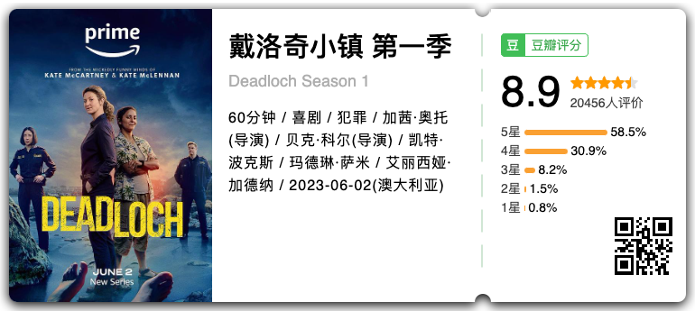

实在是太喜欢这部剧啦！在我心里是年度最佳剧集。

小镇的海滩上突然出现了一具全裸的尸体，各位脑子里想的，是不是女性呢？市警长也这么想，可是不是，是男的，不仅全裸，他的舌头也被拔掉了。

由这样一个连环杀人案引发的小镇风云，主角是两位女性警长，一位不修边幅、满口黄段子，一位非常严谨守规矩，这样的搭配也往往出现在两位男性身上，我非常惊喜，这样的设定是两位女性。

这里面的每一个环节，都太典型了，只能说，没有看过的女性有福了。

### 重启人生 ブラッシュアップライフ (2023)

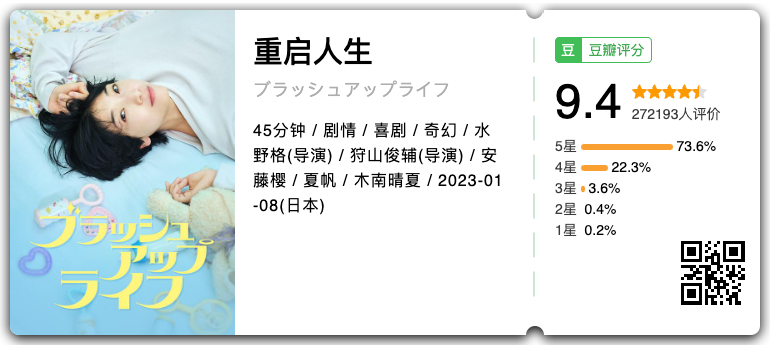

看完让人觉得很温暖的故事，四个女生，一段友情，为彼此才值得千千万万次。

我也想这样和我的朋友们健康平凡地过一辈子。

## 最佳综艺

### 海妖的呼唤：火之岛生存战 사이렌: 불의 섬 (2023)

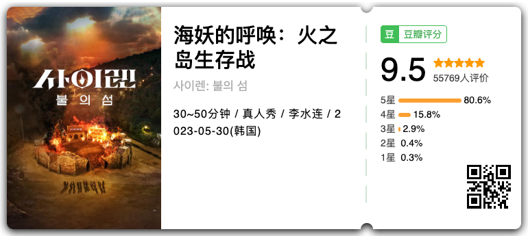

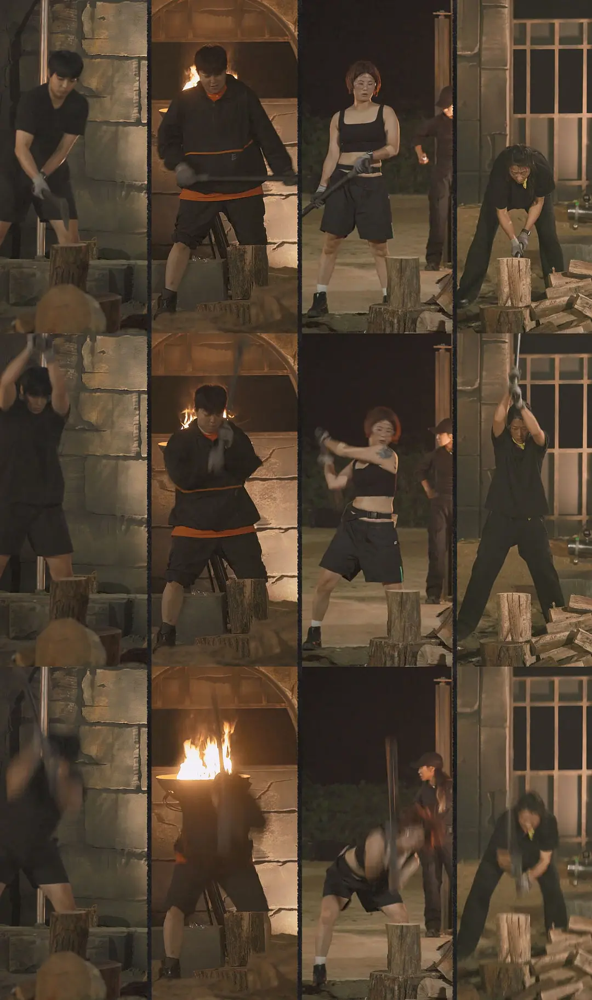

啊！我真的爱死她们劈柴了～好喜欢这么有力量的女人们啊。

## 最新奇

### 成为约翰·马尔科维奇Being John Malkovich (1999)

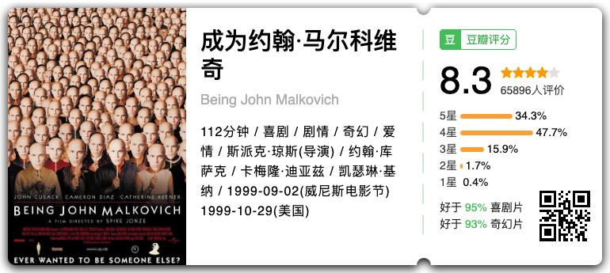

如果有一扇门，可以让你成为别人十五分钟，你会做些什么？

非常新奇的故事，值得一看。

## 结语

今年截止目前看了 85 部电影/剧集/综艺，以上就是我年度的观影总结了，有很多很好的作品碍于篇幅就不写了。

> 自从电影出现，人的生命延长了十倍。

希望明年，能看更多好电影～
