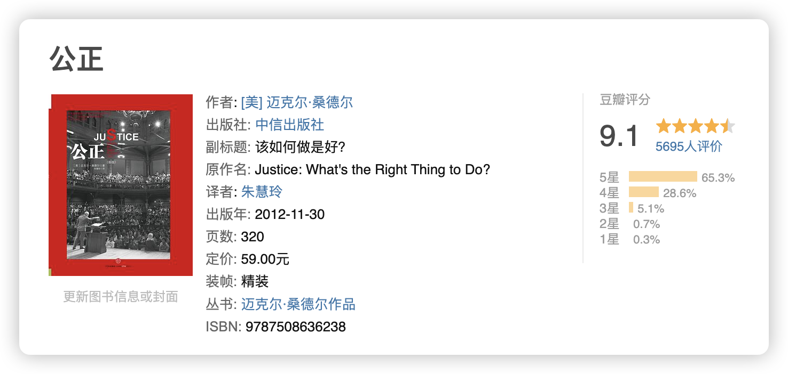
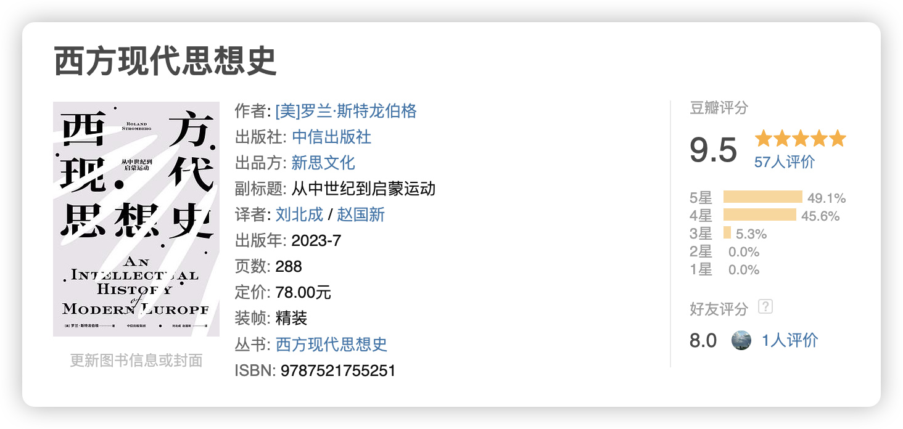
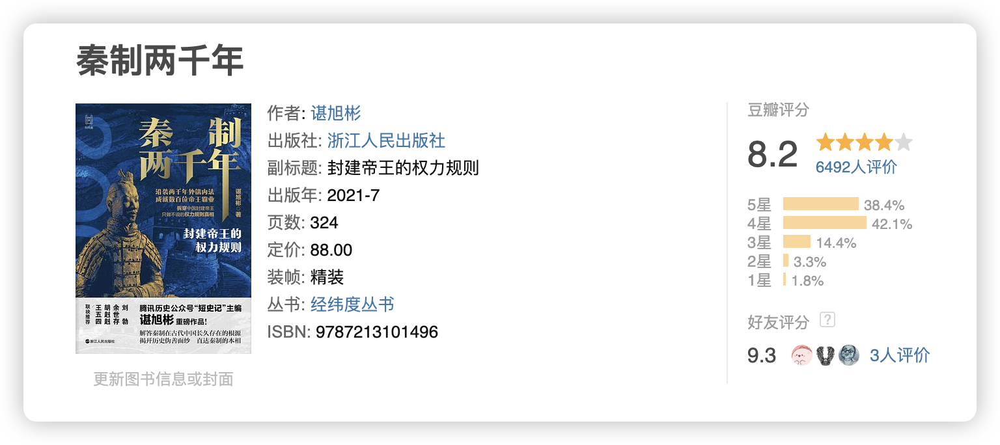
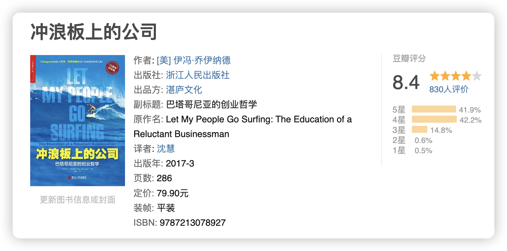
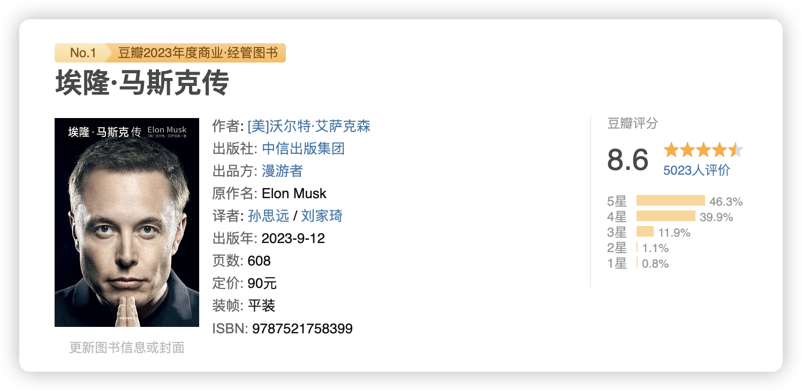
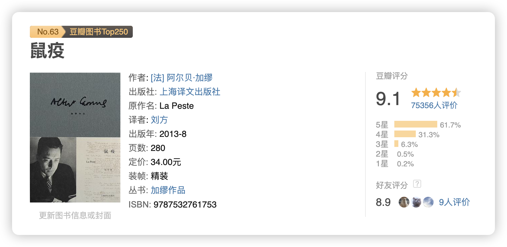
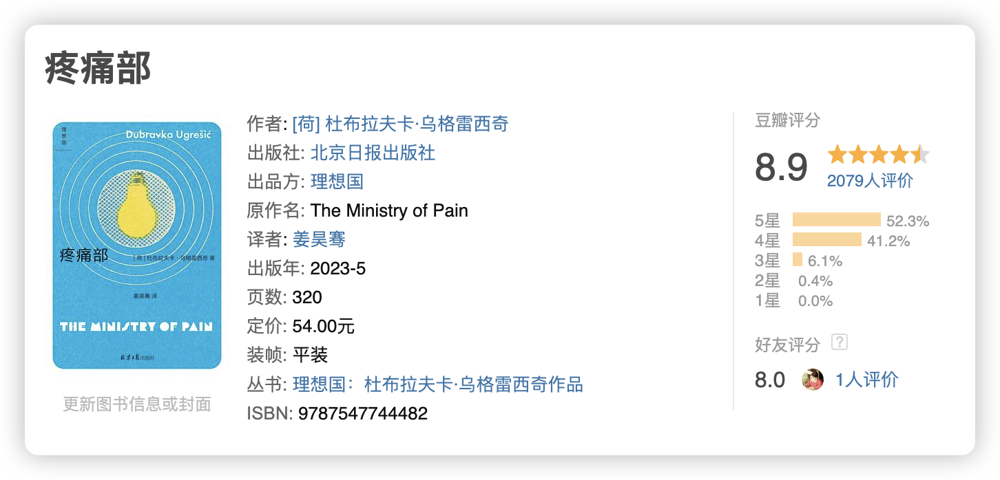
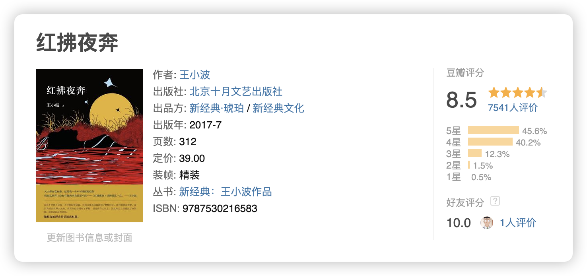
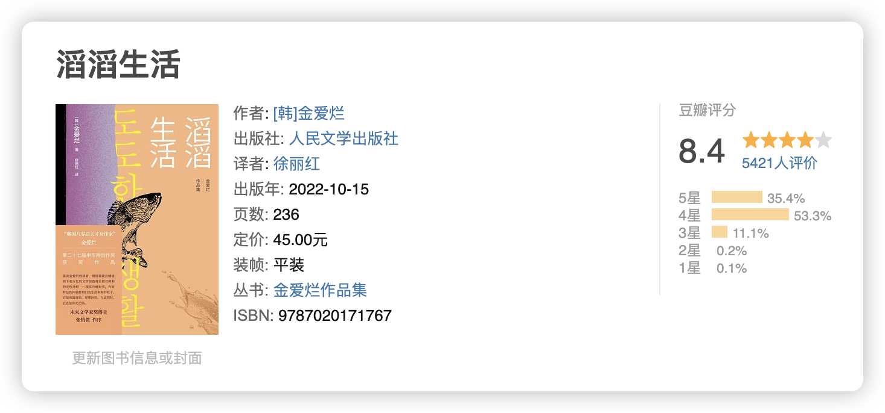
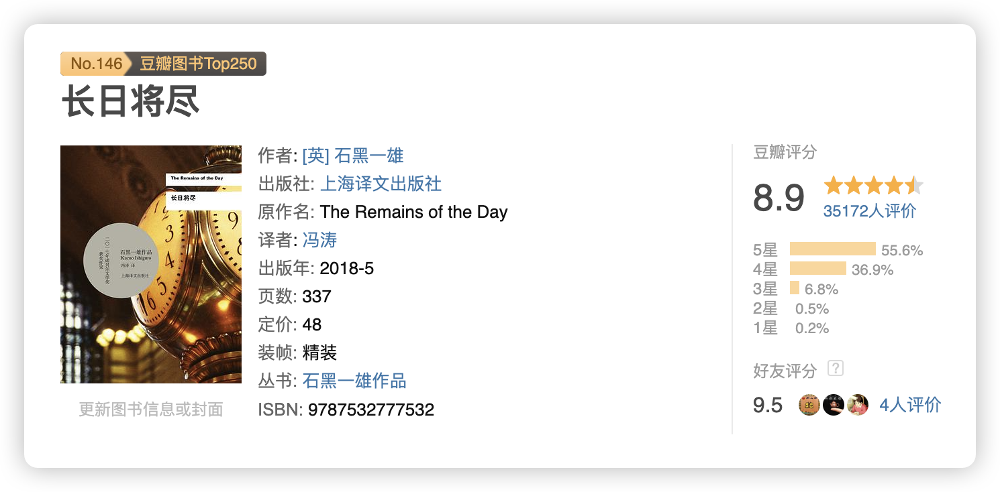

今年截止目前共读完 63 本书，大部分都还不错，在做了非常艰难的选择之后，推荐虚构类和非虚构类各 5 本。

## 最爱非虚构 Top 5

### 公正：该如何做是好？｜迈克尔·桑德尔

今年觉得最有启发的书之一，一个社会运行很核心的问题，我们如何思考公正？

我们如何思考公正，就决定了我们如何制定规则、组织人群，人们有着不同的利益诉求，从这其中找到一个公正的处理方式，恰是这本书希望探究的。我们的生活离不开对公正的追求，作者用一个个案例与问题引导，深入浅出梳理了几千年来人们对公正的思考，非常有启发。

《公正》也是哈佛大学最早的公开课之一，是目前为止上过课程人数最多的课程，喜欢看视频的也可以找找这门课程看看。

对本书也做了一个简单的梳理，参考：[[公正：该如何做是好？]]，以及一个书评，参考：[[第三周刊_No.1｜我们应该如何思考公正]]

### 西方现代思想史｜罗兰·斯特龙伯格

**要理解一个作者最好了解她所处的时代**，这部超厚的思想史著作就能够很好的为读者提供一个时间与思想的谱系，让每个作者都在历史长河中有一个位置，这样无论是之后读书还是思考，脑子中都能有一个大概的图景，这大概就是一部通史最好的功能了。

作者把几千年的西方重要哲人、作家、科学家的思想囊括进来，在概括的同时不失深刻，从浩如烟海的书籍中抽丝剥茧，梳理出思想历程的大概骨架，非常了不起，是很好的入门读物。

[[西方现代思想史]]

### 秦制两千年｜谌旭彬

**“中国两千年，犹秦制也”**，初看这句话我觉得耸人听闻，读完之后掩卷沉默，书评是发不出来的，很推荐。

书评参考：[[秦制两千年：另一种历史想象]]
读书笔记：[[秦制两千年]]

### 冲浪板上的公司｜伊冯·乔伊纳德

我一直被告知的是，想做生意赚钱是不可以有良心的，就是要靠剥削才能赚到第一桶金。但这个世界上有人并不是这样，这就是巴塔哥尼亚的旅程，伊冯·乔伊纳德从开创公司到壮大公司，直到今年捐出公司，都是凭着自己的理念与良心做事，他让我看到办企业的另一种可能。

企业家能够影响社会、改变社会、塑造社会，行动是促进改变的唯一有效方法，给这本书大概写了个总结，参考：[[让我的员工冲浪去：环保主义者如何塑造公司]]。

[[冲浪板上的公司]]

### 埃隆·马斯克传｜沃尔特·艾萨克森

今年又成为了财富增长 No.1，马斯克总是出现在各类榜单里，作为风云人物，他的一举一动都会引发媒体关注，可是在媒体形象的背后，他是如何书写他的人生故事的？这本传记给了我们一个答案。

硅谷钢铁侠并非真的是钢铁之躯，他的热情、愤怒、痛苦，和我们所有人一样，传奇的背后总是一样的人性。

[[第三周刊_No.7｜天才疯子梦：马斯克的硬核人生前半场]]
[[马斯克传]]

## 最爱虚构类 Top5

### 鼠疫｜加缪

原本觉得是反乌托邦的想象小说，现在觉得是现实主义力作，加缪描写的众生态，不多但精准，在三年后重读，其预见性、深刻性都超出想象，**如果选人生书单，我想这会是其中一本**。
[[鼠疫]]

### 疼痛部｜杜布拉夫卡·乌格雷西奇

在流亡的国家坚持用母语写作，就像在海里骑自行车，费力且无用，充满疼痛与隔离，流亡是唯一的母题。

👇 这是我读完后写下的短评：
>在支离破碎的南斯拉夫，离开是异乡客，留下是离魂鬼。难民，一个经常被同情，但几乎不被感受的群体。流亡，一段可以被说明但无法被理解的经历。漂泊，一个只要开始就难以结束的状态。

### 红拂夜奔｜王小波

双线叙事，唐朝的李靖与红拂女、现代的数学家与恋人，一位浪荡子功成名就、一个落魄人纠结半生，举重若轻的讽刺，似有若无的反击。王小波有趣、非常有趣，一个作家最伟大的，就是有趣。[[红拂夜奔]]

### 滔滔生活｜金爱烂

韩国文学在近年来很受关注，无论是国际上还是国内，用简单的语言写出细微的情感，金爱烂对生活的观察除了天赋我想不到别的形容。

写尽贫穷、写东亚人被席卷的一生、写家庭里被打碎的无奈、写人与人之间幽微的晦暗，对了，还有生活从缝隙里漏出来的光，然后用陈旧的胶带把缝隙贴上。

[[滔滔生活]]

### 长日将尽｜石黑一雄

很冷淡克制的一本书，悬疑小说常用的叙述陷阱被这部类似自传性质的小说使用，如果忘记了对主角自述的怀疑，你真的会以为这是无怨无悔的一生。

所以职业的尊严究竟意味着什么呢？如果意味着你必须克制所有的情感与冲动，只在允许的框架内行事，这是职业的尊严还是对人性的践踏？那些自以为正确的绅士们，偏见会带来巨大的灾难。**尊重人，首先要尊重自己的内心的情感**。

[[长日将尽]]

## 结语

真的艰难地做了很多取舍，很多书都想推荐，但一一写出来篇幅就会太长，有些书非常想写，但也面临审核的问题，以上就是今年阅读的推荐，祝各位新年愉快。

<mark style="background: #F6E99E;">无论生活如何，书还是要读的。</mark>