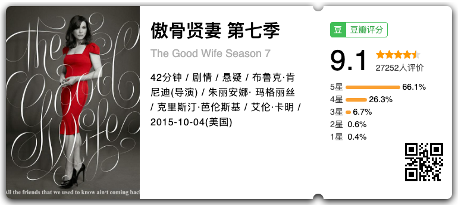
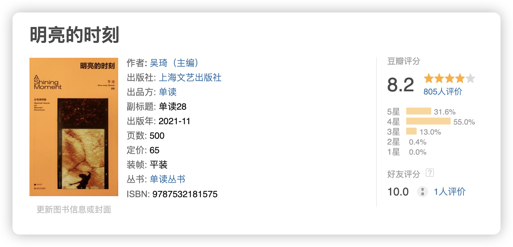

在本周看完了《傲骨贤妻》（The Good Wife）全七季，很长的战线，以至于我都觉得我快和剧中的人物成为老朋友，写了很长的碎碎念，一看已经是一篇作文的程度，我想不如刚好作为本期周刊。

《傲骨贤妻》（The Good Wife）很好的剧集，在聚焦法律的同时，很立体塑造了每个人物，没有人是完美的，每个人都在自己的信仰和道德中挣扎。

我不喜欢 Alicia，但是她的每一个行为都有她的逻辑，即使不喜欢，在看完整个七季之后，我尊重她，我敬佩她跌倒谷底冲头开始的勇气，我敬佩她在被万人议论时候虽然艰难但体面保持自己的尊严，我敬佩她在法庭上或强或软捍卫当事人的利益，从第一季那个站在丈夫身边的崩溃女人到第七季最后，成为被扇耳光之后，摸摸脸、整理头发重新走上舞台的 tough women，人生可能是个循环，很多场景会重复出现，但是每个人的人生都绝对不会是个循环，因为时间没有回头路可以走。

在每一个个体的案件里，聚焦个人的处境和痛苦，法律条文的严格与疏忽，每位法官不同的性格与主张，每个律师对待案件的不同态度与策略，在法庭上、法庭下以连续的方式展现，不仅简单展现了美国的法律体系，也告诉里观众「法律运作的细节」，其中掺杂的政治也告诉我们，政治与法律如何相关，政治如何影响法律，又如何被法律限制。

每一个案件里活生生的人，法律加诸在他们身上的重量，是冤情重申、是正义得雪、还是最后得到法官的抱歉，“Sorry, Sir/Ma'am. I really sympathize with you, but ... ”，我们可以透过这些案件旁观他们人生的一角，没有任何宏大的口号或者正义，只有具体的生活，是的，生活和我们。

印象最深的就是那个被陪审团认为无罪，最后却接受了辩诉交易的女孩，看到一致的“not guilty”，我拍桌叹息，为什么不坚持自己的无罪呢？可是，如果不接受，有可能面临更高的刑期，你敢拿自己的人生做赌注吗？

法律并不完善，正义并不总是出席，真相也不总是能被找出，最后总以叹息结束。

法治是一种信仰，是相信这个世界有值得尊重与服从的共识。

感谢 2023 年遇到这部剧，终于在 2024 年初画上圆满的句号。

## 本周读书

在读单读系列 28《明亮的时刻》，是一本女导演的特辑。

> 本辑《单读》收录了
> 王丽娜的《第一次的离别》，讲述了在故乡塔克拉玛干一段不断经历告别的童年；
> 杨明明的《柔情史》，展现了北京胡同里一组痛苦的母女关系；
> 滕丛丛的《送我上青云》，描绘了一名患癌的女记者在生存和理想间的挣扎；
> 韩帅的《一九九九》，回忆了一名 13 岁少女初识性与死亡的过程；
> 黄绮琳的《金都》，塑造了一位陷入真假结婚的女子，她要做出自己的选择。
> 还有艺术家陈哲的影像作品、陆茵茵和肯尼亚作家伊冯娜·阿德希安博·奥维奥的小说，以及默音的随笔和张敞的评论。
> **他们用不同的文体和角度，共同逼近女性的世界，在其中寻找出许多个暗夜里的明亮时刻**。

世事艰难，这些创作者的柔情与坚定此刻显得更加可贵，如杨明明导演所写：“我们应该培养的是对‘痛苦’的感受力，而不是让自己真的去过心魔重重的生活。”
