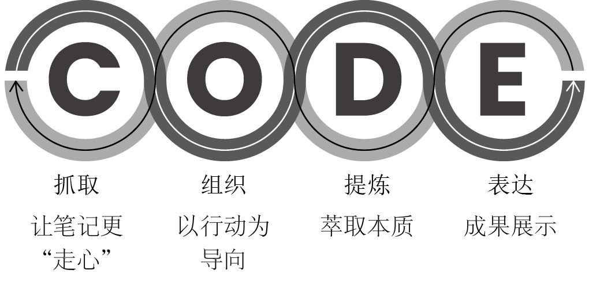
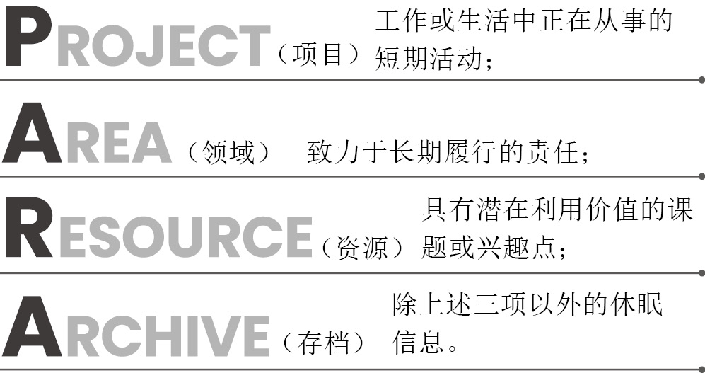
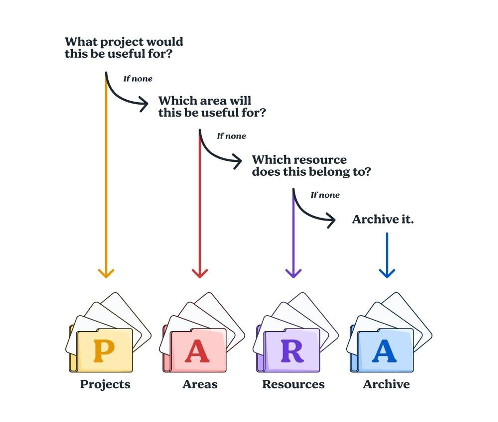
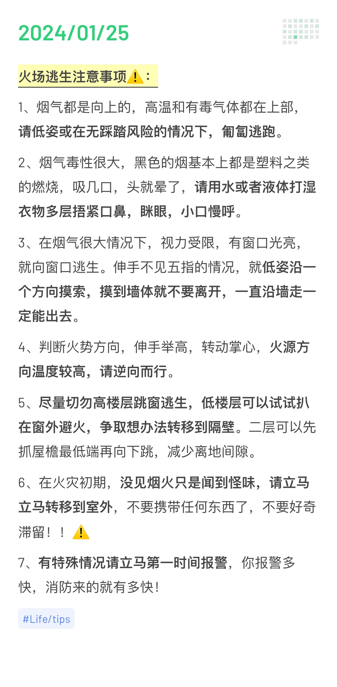
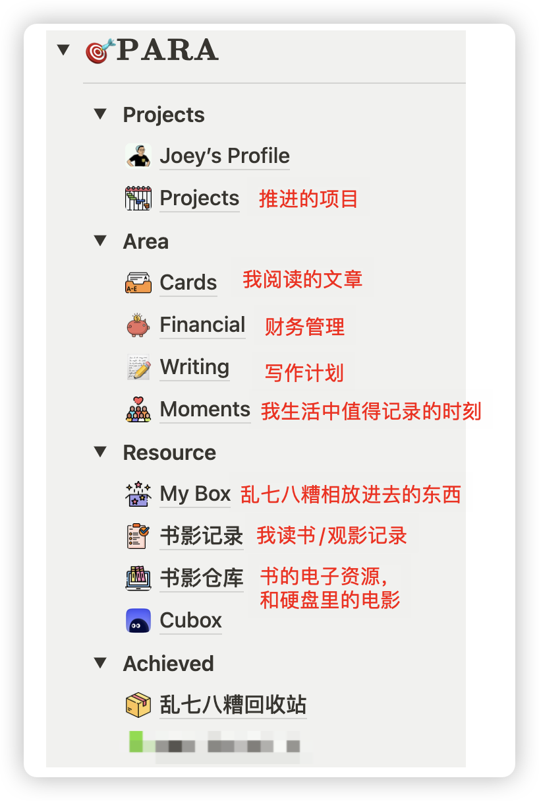
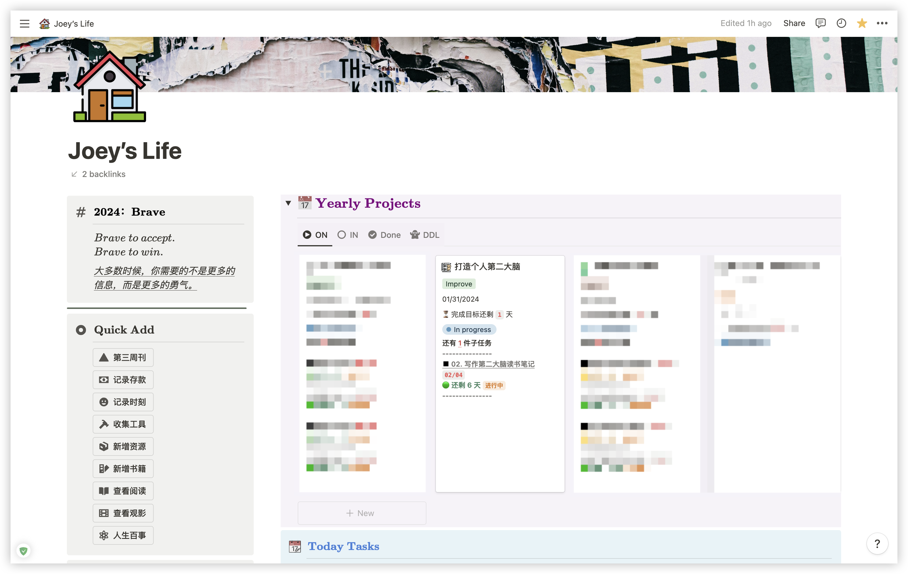
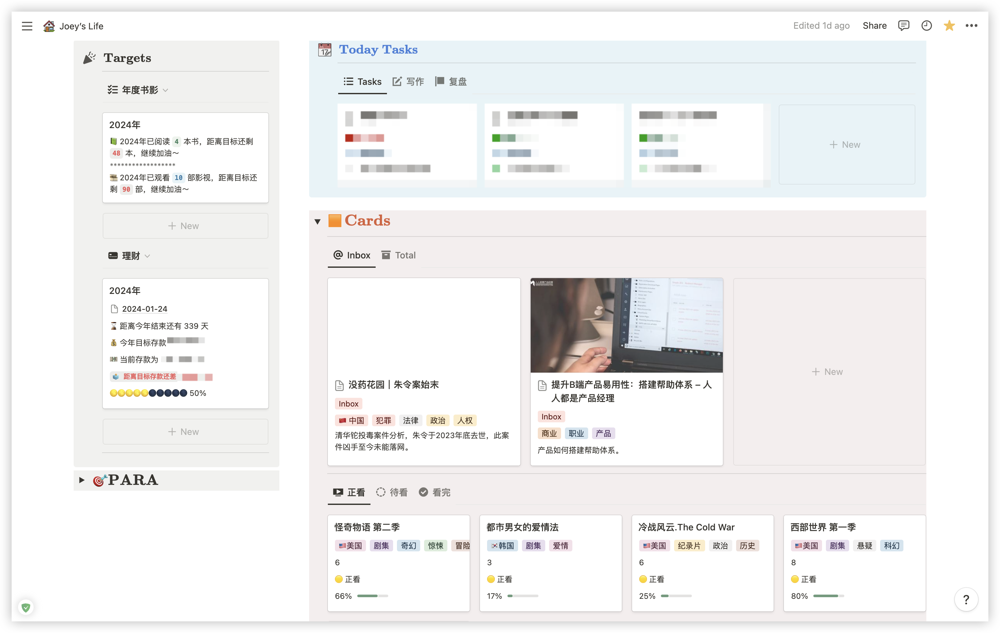
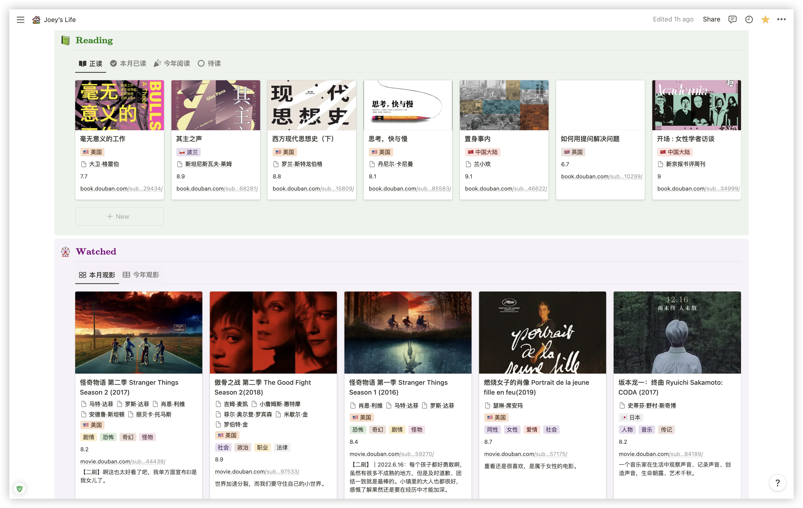
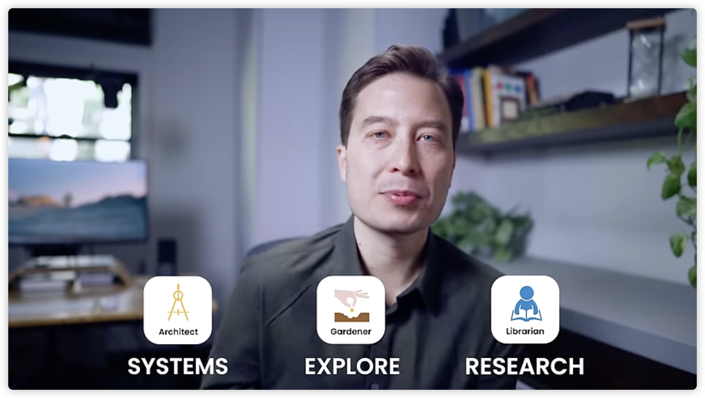
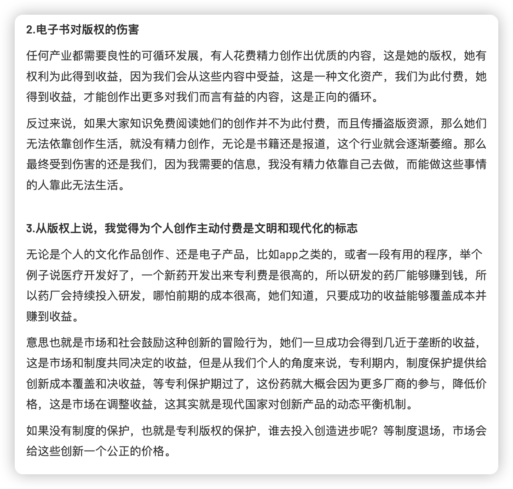

> 本文大约 `5000` 字，预计阅读 `15` 分钟。

在信息爆炸的今天，我们能够获取的到的资源不是太少，而是太多，如何处理好我们已经接触到信息，是数字时代提高效率的关键，在我看来，我们的大脑是 CPU 而非存储器，应该建立第二大脑作为我们的资源库。

那么如何建立属于自己的资源库呢？也就是我们的第二大脑。蒂亚戈·福特在 [[打造第二大脑]]这本书里给出了答案。

打造第二大脑的核心是**信息处理**与**个人系统建立**，针对这两点作者分别提出了两个核心概念，CODE 信管法则和 PARA 资源存储系统。

以下我来分别介绍这两个核心。

## CODE 信管法则

“信管法则（CODE）”指的是：抓取（Capture）、组织（Organize）、提炼（Distill）、表达（Express）。

没有经过提炼的信息就不是属于你的，而没有输出的存储近似于是无效的，知识的核心在与输出与分享。

### 抓取什么信息？

简单来说值得存储的信息有四个特性：

1. 启发性：对你来说是有启发的观点或者评论。
2. 实用性：一些技能、技巧类的文章，或者对你当前项目有用的信息。
3. 个性：一些你感兴趣的人他们的经历与总结，或者你自己的想法。
4. 新奇性：让你大呼“哇，我怎么没想到”的内容。

一个有效的对策则是，**仅记录下震撼人心的重磅信息并保存在可靠的位置**，对于其他内容能省则省即可。

也有一些不适合记录在个人系统中的信息，比如：

- 敏感/涉密信息
- 特殊格式信息：专用格式 psd 等
- 容量巨大的信息：视频、压缩包等。
- 需要协同的信息

你还可以做的是，问自己一些有趣的问题，并根据这些问题收集信息，比如：

- 如何让自己不再沉湎于过去，更好地活在当下？
- 如何制定与中长期目标相吻合的投资策略？
- 从“无脑消费”到“专心创造”的转变是怎样一种体验？
- 如何走出“囤书而不读书”的窘境？
- 如何才能又快又轻松地完成任务？
- 其他你觉得有意思的问题～

抓取完信息，你需要面对的就是如何组织它们，这时候就轮到了 PARA 资源系统上线了。

## PARA 资源系统

PARA 系统有效最根本的一条原因就在于：
**以项目为核心，重行动、轻分类**。项目成为你数字生活中最基本的组成单位，从此你不必再根据各种纷繁芜杂的主题乃至二级主题进行笔记分类，而只需要回答一个简单的问题：“**这条信息放在哪个项目里最管用**？”

在 PARA 系统中，每一条信息都可以被划入以下四大类别中：

1. “项目”：工作或生活中正在从事的短期活动，比如我正在为我的写作收集资料，我的灵感碎片就可以放进项目/写作中，任何与当前项目有关的内容，都需要放进对应的项目中；
2. “领域”：致力于长期履行的责任或者感兴趣，比如健康、家庭、旅行之类的，这类内容比较容易转换成具体的项目；
3. “资源”：具有潜在利用价值的课题或兴趣点，但不一定与当前项目有关的内容（但可能未来会有关），比如我对历史感兴趣，我对最近读的历史一些想法，或者他人有意思的书评就可以放到这里；
4. “存档”：除上述三项以外的休眠信息。

### 如何判断资源归属？

简单来说分为四个层次：

1. 该笔记对于哪个项目最有帮助？
2. 若无：该笔记对于哪个领域最有帮助？
3. 若无：该笔记属于哪种资源？
4. 若无：请将其归入存档，或者，别保存。

## 构建第二大脑的 12 个步骤

1）**明确信息抓取内容**。

可以把第二大脑想象成一本私密的札记或日记本。你最想要获取、学习、探索或分享的内容分别是什么？明确两到三种重点内容。

2）**选择笔记应用程序**。

具体参考后面「如何选择适合自己的工具？」

3）**选择信息抓取工具**。

比较使用“延时阅读”应用保存你感兴趣的在线文章或其他内容，然后集中一个时间阅读，可以使用印象笔记 or Cubox（我在使用的，之前介绍过）。

4）**构建 PARA 系统框架**。

设置 PARA 系统的四类文件夹（项目、领域、资源、存档），并以行动为导向，为每个活动项目创建一个专用文件夹（或标签）。从这一步开始，你需要专心抓取所有与项目相关的笔记。

5）**通过回答自己感兴趣问题获得灵感**。

列出你最感兴趣的一些问题并保存为笔记，以供抓取信息时参考。使用这些开放式问题筛选值得保存的内容。

6）**自动抓取电子读物的重点内容**。

创建一个免费的系统集成，将阅读应用（“稍后读”或电子书应用等）中的精彩内容自动发送至你的数字笔记中。

7）**实践“渐进式归纳法”**。

对自己已有的笔记逐步进行提炼总结，直到几句话概括，使用加粗、高亮等格式标注重点，增强笔记的可见性。

参考👇：

8）**就“半熟素材”开展实验**。

首先选取一个混沌、庞杂或者困难的项目，然后再聚焦于其中的某个片段，例如商业提案、图表、活动流程等。请将项目分解成多个零碎步骤，然后试着推进其中的某一个。接着，与至少一位亲友进行分享并获取反馈。

9）**在某一目标上取得进展**。

选取活动项目中的某个具体目标，并从自己的资源中寻找是否能够推动目标的内容。

10）**策划一次每周小结**。

在你的日历上标注每次每周小结的时间，从而培养每周进行自我回顾的习惯。

11）**评估你的笔记记录能力**。

12）**加入个人知识管理社区**。

与同样进行知识管理的人们讨论聚合。

## 我如何构建自己的第二大脑

我主力使用的软件是 Notion，而且 Notion 便捷的知识库、丰富的模块和自由的组合让我可以最大程度根据自己的需求定义自己的系统。

兵马未动粮草先行，无论是什么系统，首先要明确的就是自己的需求，比如你有什么内容？如何将他们排列起来？如何组织并显示它们？

你的第二大脑需要包括什么内容，这就是前面说到的收集什么信息了。如何构建，就是把这些信息以一种可见、可用的方式组织起来。

根据 PARA 的理念，我重新整理了自己的 Notion 页面，主要分为以下几类👇：

据此内容，我重新设计了个人的系统展示页面，首先展示对本年的拟定的关键词和一句告诫自己的话，然后展示本年的主要项目规划，拆分子任务之后展示具体的进度，侧边放一些快捷的操作，这样就不用去找对应的页面添加了。

第二页主要梳理了自己的目标和具体的事项，包括书影的目标、财务目标，和上面项目拆分的具体任务，写作的任务我用视图切换，我使用 Obsidian 写作，所以正在写的内容我都会直接打开，下面的 Cards 包括我在阅读的文章和正在看的剧集进度记录。

第三页主要就是记录我的阅读和观影。

## 如何选择适合自己的工具？

蒂亚戈·福特把知识管理者分为三类[3]：

第一类是**建筑师**，她们喜欢把知识有结构化地组织起来，比如按照表格的模式，安排一些固定的属性，她们的知识管理就像在建筑，一层层累加，这类人最适合的工具就是 **Notion**。

第二类是**园丁**，她们喜欢随手记录，并把笔记相互关联起来，追求的是像耕耘花园一样，她们的笔记可以有机、随意生长，这类人最适合的工具就是近期比较热门的双链笔记，类似 **Obsidian**、**Roam** 之类的。

第三类是**图书馆管理员**，她们希望能够尽可能抓取网络上有益的信息存储到自己的知识库中，并分门别类，未来游泳时是能够快速抓取并获得详细的内容，这类人比较适合的工具是**印象笔记**之类的，因为印象笔记的剪藏功能做得非常好，能够在多个平台抓取内容并存储。

以上的三类各位可以自己对号入座并选取适合的工具，当然工具的选择也并不一定是非此即彼的，多个工具组合使用也是很不错的。

## 结语

最近在读《人类简史》，作者提到认知革命帮助智人从自然进化中脱颖而出，如果说人类开始学会使用工具让我们逐渐走上食物链的顶端，那么数字时代如何使用工具是一场新的认知革命。

这两天也看到了一篇文章讲述电子书对传统图书行业的冲击，因为有人问了问我的看法，所以我简单写了一些，总而言之就是，在我们有能力的时候，我们应当给予他人的劳动应有的收益，这会鼓励更多优质的创作，也会形成一个良性的市场循环。

所以为了践行我的想法，本篇文章开通赞赏啦～你可以自由选择点赞、赞赏或者转发，如果你喜欢我的内容，这会鼓励我的继续写作的～🥰

### 参考阅读

【1】 [构建外脑 / 智变时代的个人知识管理](https://www.indigox.me/build-exobrain/)

【2】 [从此告别信息过载！构建第二大脑入门指南助你高效学习和生活](https://mp.weixin.qq.com/s/ssnJpaV_7Nu_c4gvFKWC5Q)

【3】 [Pick a Notes App: Your Note taking Style (Part 1)](https://www.youtube.com/watch?v=f3dDVtJ2sec)
