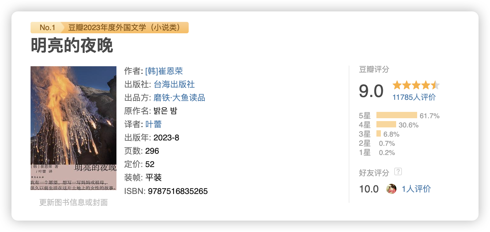
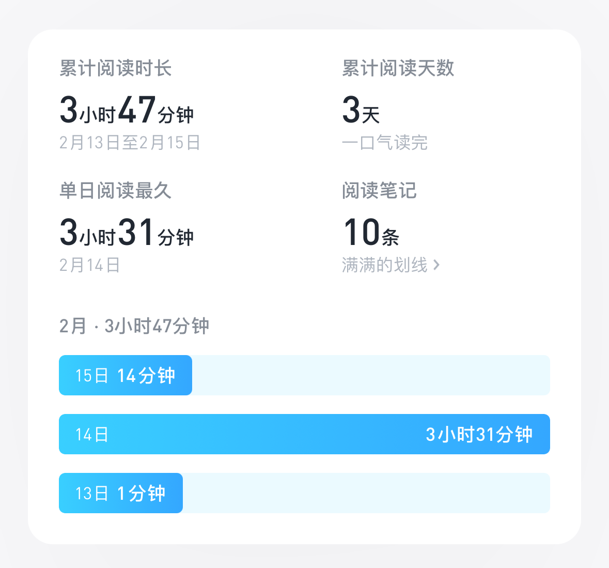

本文大约 `900` 字，预计阅读 `3` 分钟。
春节假期过去啦，简单发篇书籍推荐～

>这是女人的逃亡史、女人的战争史、女人的家族史。在战争与流亡中惺惺相惜、肝胆相照的女人们，她们不在一个家族里，心却连在一起。

本期周刊实在是忍不住想要跟大家推荐我最近读完了一本非常好看的小说，韩国作家崔恩荣的《明亮的夜晚》，用四代女性的经历拼凑出韩国简略的近代史，以女性的视角重新看待大事件给个人、给家庭的影响，每个女性在困难、流亡中展现出的蓬勃的生命力与给彼此的爱和连接，让我在阅读的过程中几次流泪。

这本书好看到我几乎从打开就没有放下过，直到我在凌晨读完这本书，仍旧心有戚戚，我脑子中忍不住在想，我母亲的故事是什么样？我祖母的故事是怎么样？作为这个世界上连接最紧密的三个女性，我们对彼此的故事几乎一无所知，如果能把她们和我的故事串起来，也能是一部历史吧。

这样的想法，跟作者开始写作这本书的动机一样，“我有一个愿望，想写一写妈妈或祖母，很久以前生活在这片土地上的女性的故事”，这样的动机，诞生了一个一定会在文学史上留名的故事，属于女性的故事，属于人类的故事，女性不再仅仅是“妻子”、“母亲”，而是每一个在乱世中挣扎求生的普通人，是每一个经历战乱、流亡仍旧不灭心火的勇敢的人，是每一个即使生活迎面痛击，仍旧勉力支撑自己的家庭的坚韧的人。

从曾祖母、祖母，到开始走进现代的母亲和“我”，在这部小说里女人们不再是仅供同情、怜悯的角色，也不再是装饰男人壮丽生活的配角。她们是自己，生如草芥，彼此搀扶，尽全身之力对抗荒诞的时代。

曾祖母生活在日据时代，祖母生活在二战时，又遇到韩朝战争，母亲生活在高压政治时期，“我”生活在经济发展但个人压力也飞涨的时代，每一代人各自有各自的挣扎，四代女性以不同的方式捍卫自己的生活。其中曾祖母与新雨大婶的友谊，祖母与喜子的友谊，不同代际的母女关系，都非常动人。

我就不剧透了，希望读者都能跟随着作者的视角去还原每一个女性的人生，用作者对这本书的名字的含义作为结束，这是属于女性的明亮的夜晚：

>书中四代女性走过的长达百年的时间就像漫漫的长夜，但是，那不是伸手不见五指的漆黑的夜，而是充满隐隐光辉的明亮的夜。
>
>如果人生是长夜，照亮漫漫人生路的又是什么呢？我想，那一定是爱。是小说中那些女性人物之间的互助与友爱，支撑着彼此，走过了人生里的一程又一程。无尽的黑夜中，因为有了光，所以这一切才有可能。