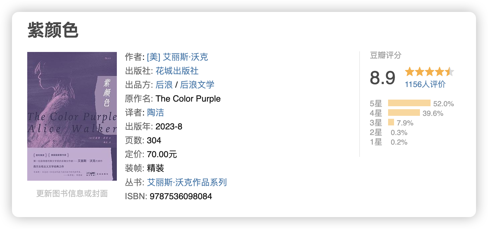

本文大约 `600` 字，预计阅读 `3` 分钟。

“当你的眼里没有男人，你才看得到一切”，女人想要找到自我，首先就要离开男人的世界，在结构性的困局里，如果没有独立的反思，每个人都会自觉填入社会给我们的加害者-受害者位置里，想到阿伦特说的“平庸之恶”，书里的男人、女人都不经思考成为了这样的角色。

可是总有些不甘心于当受害者的女性，莎格的独立、耐蒂的出走、西丽的坚韧，这些女性的自我召唤如同每天都会升起的太阳，它永远存在，我们永远能听到内心那一点点声音，“这是不对的”、“我想要…”、“我不想要…”，不要忽视这样的声音，“当你开始问自己一个问题，就会引出一大堆问题”，这样的问题让我们成为自己，让我们思考爱与尊重的能力。

和解，是多么困难的事情，与当初逆来顺受成为受害者的自己和解，与当初在被教育成为加害者的男性和解，但是，与加害者的和解只能在你反抗之后，只能在他尽力取得取得你的原谅之后。

书里的女性情谊看得让人落泪，她们互相照顾孩子，她们一起劳作，她们就算打一架依然能够为了彼此勇敢，她们一起探索属于女性的身体与生命经验，黑人+女性的身份让她们受了太多苦，可是她们依然熬过来了，暴烈的索菲亚在经历公权暴力之后变得温和，西丽在莎格的鼓励下开启她的“娜拉出走之路”，我想这也给“娜拉出走之后怎样办”提供了一个答案，在那个艰难时代女性可以通过互相的支持生存并开启自己事业，那么娜拉也可以。

关于这本书实在是有太多感慨了，很难用语言一一形容，只能说艾丽斯·沃克写了个太好的故事，这个故事关于黑人、关于女性、关于生活、关于自我。

我永远臣服于这样的好故事。