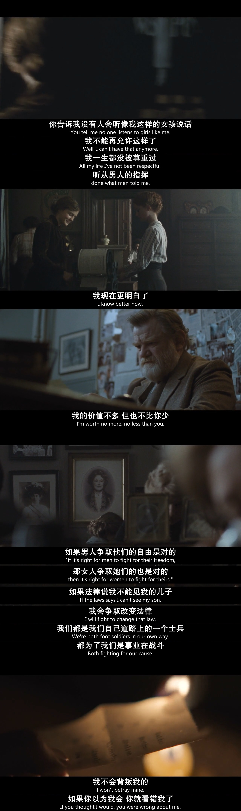
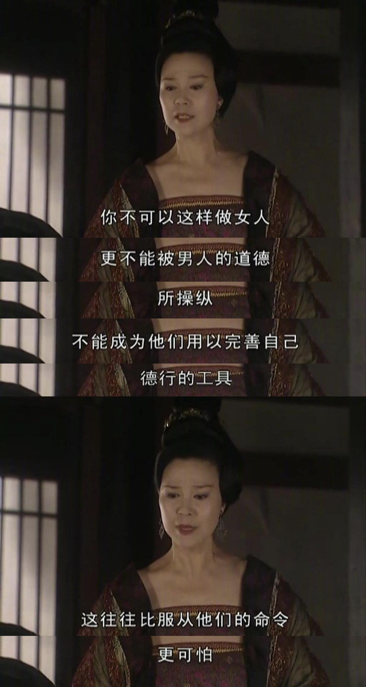

本文大约 `1300` 字，预计阅读 `5` 分钟。

我一直觉得女权即人权，女权两个字没有那么烫嘴。

女权是要求每个女人生下来就有生而为人的权利，她有不因为性别被谋杀的权利，她有生下来得到公平对待的权利，她有出生就得到家里的重视、偏爱、称赞的权利，她会被当作血脉、她会被当作继承、她会被当作宝贝。

“人人生而平等”，这振聋发聩的口号，不应当只是男人身上，它应该在我们每个人身上，“如果男人们追求自由是正确的，那么对于女人来说也是如此”。

女权，是告诉每个女人，你们拥有自我，你们拥有一切生而为人应当拥有的东西，任何男人可以拥有的权利，我们都理所应当。

不要成为结婚之后在家务的间隙才想起年少热爱自由的自己，不要劳作半生才看到自己只是作为家里的外姓人存在，不要在死了之后都要作为xx氏存在。

我们要拿回自己的名字、自己的身体、自己的时间，我们不是x太太，我们不是父权与夫权之间流转的商品，我们自己就是女人，不需要“A4腰”，不需要“脾气好”，**不需要任何“像女人”的标签，我们就是女人，更不需要任何男人的承认**。

上野千鹤子说，“我无法想象一个不厌女的社会”，在这个方方面面都想吃女人一块肉的社会，成为一个掀桌子的人并不会太优雅，但无所谓，我不会割下我的肉，我不会献祭我们的同伴，我鼓励所有女生，**不要害怕冲突，不要害怕愤怒，去做那个看到自己需求并争取的人，而每当你往前走一步，女性就向前走一步**。

我时常感触很多女人实在是太忽视自己了，我们一直都被教育成为那个忍让、付出更多情绪劳动的人，但是，这不是理所应当的，女权是一个很漫长的抗争过程，每一个群体在拿回自己的权力的时候，总是曲折坎坷，这也是我一定要坚持在妇女节送书的原因。

你有过的困惑，我们的母辈、祖母辈也有过，我们世世代代都在经历一样的困境，而**有人在说、有人在写，属于女性的问题，属于女性的故事，这是我们的共同体验**，男人们说的太多了，从历史书上，到方方面面的公共区域，爱说教的男人充满我们的生活，所以我要告诉我的姐妹们，我的同行者们，这些女人们，在说话，这些女人们，在写作，这些女人们，在抗争。

**她们在说出我们共同的体验**，「父亲的女儿：被当成儿子培养的女儿《厌女》」，「为什么我们坐汽车座椅总是不舒服：因为测试模型都以男人为准《看不见的女性》」，「女性为什么喜欢看言情小说，这些小说又塑造了我们对男性怎样的虚假想象以至于哄骗着我们走进婚姻《阅读浪漫小说》」，「女性写作是如何被打压，比如简·奥斯汀需要以男性的名字才能发表作品《如何抑制女性写作》」。

**她们写出属于女性的经历**，「废奴前后的黑人乡村女人是怎么经历父权和种族的双重压迫《紫颜色》」，「朝韩战争女性之间的情谊与流亡生活《明亮的时刻》」，「在母亲病逝后，一个女儿用食物想念母亲的日常《老派少女的购物路线》」，「从贵族到难民，一个女儿寻找母亲的历史，还原出二战期间的苏联生活《她来自马里乌波尔》」。

还有更多关于女性的科普，《身体由我》《炙热的你》，通过阅读了解我们的身体。

这是女性的声音与文字，这是不同于宏大的具体视角，这是反父权的尊重个体生活的声音，那么多宏大的故事，都不如我在家里听一个女人诉说我们共同的体验。

一本书或许能改变的很少，但你会发现，你再也无法忽视自己心里的声音，你无法不去思考你看过的字句，你开始意识到，你想要什么？或者仅仅只是，你不想要什么？这都是令人称颂的进步，恭喜你，开始一点点描摹出自己的形状。

通过送书活动，你们会知道，自己并不孤单，我们会有各种各样的分歧，因为我们每一个人都是如此独特、独立的人，但是我们会明白，在成为捍卫女性权利的路上，我们终将走在一起。