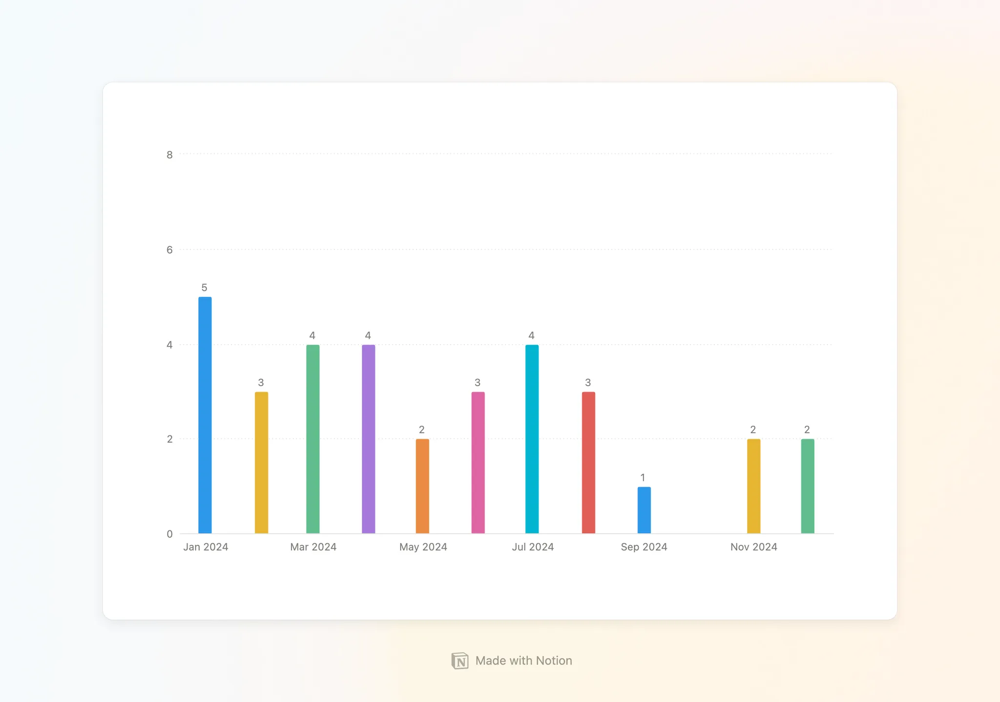
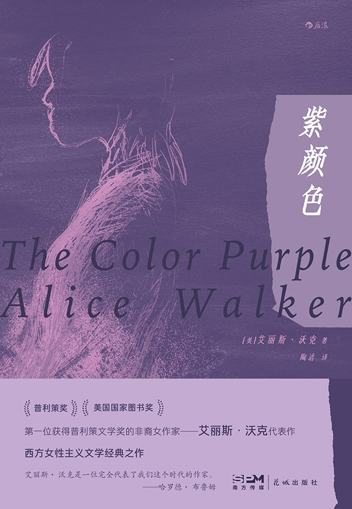
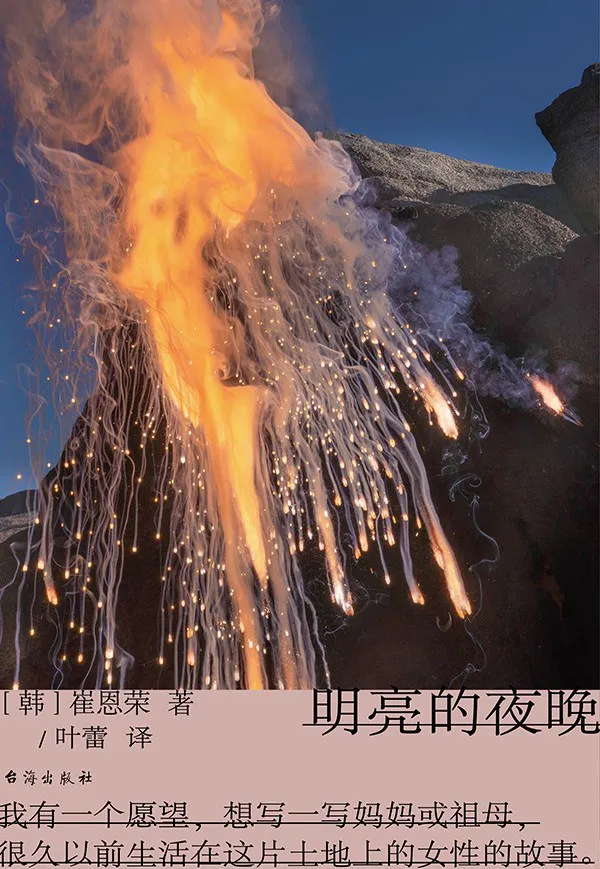
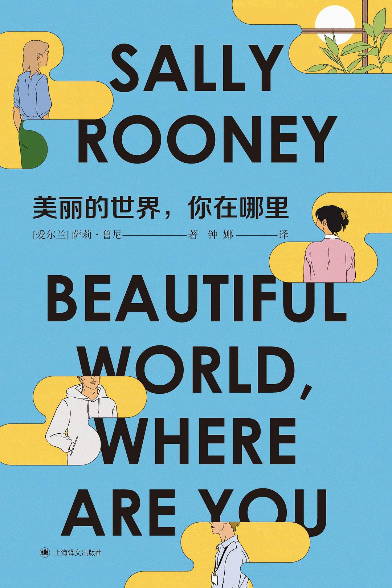
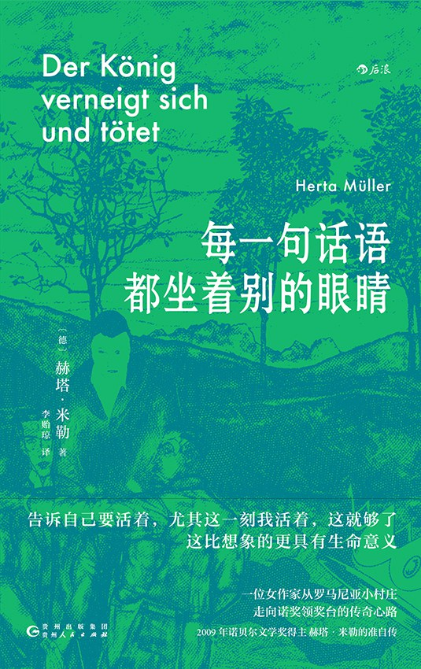
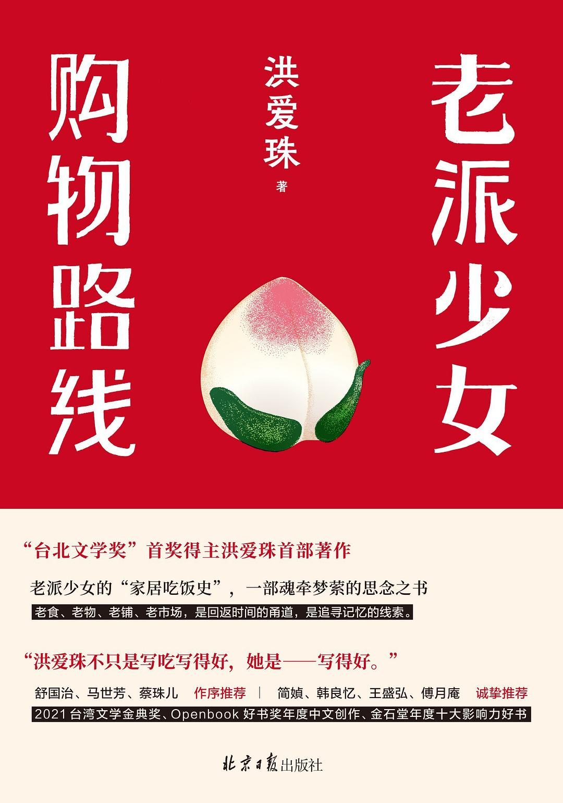
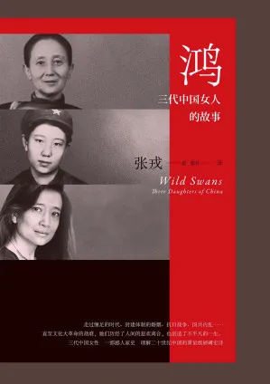

本文大约 `3700` 字，预计阅读 `12` 分钟。

2024 又快过去了，今年读的书，估计也不会有特别多增加了，干脆就总结一下今年的阅读好了。

今年读书比去年少——33 本，10 月一本书都没读，今年下半年精神状态确实影响了我的文化体力，不过从年初开始，我给自己的目标就更希望读得更有质量，而非更有数量，所以也在可接受的范围内吧～

按照去年的惯例，按照「虚构类」和「非虚构」各推荐 3 本。

## 虚构类

### 1. 《紫颜色》by 艾丽斯·沃克

> 这是个太好的女性故事了，每一个女性之间的感情，都纯粹让人想要落泪。她们仅仅只是因为对彼此的爱与同情连接在一起的。

《紫颜色》是一本让我读完就想大喊“这么好看的小说我竟然才读到”的书！作为首位获得普利策小说奖的非裔女作家艾丽斯·沃克的代表作，《紫颜色》不仅同时斩获普利策小说奖和美国国家图书奖双项大奖，更在斯皮尔伯格的执导下，获得奥斯卡奖 11 项提名。但这些荣誉都不是重点，这不仅是一本获奖作品，更是一面镜子——照见每一朵被践踏却依然昂首的野花。

> 我认为，你要是走过一块地，没注意到地里的紫颜色，上帝就会很生气。

就像地里不起眼的紫色野花，底层女性们在这本书里绽放出惊人的生命力。就像书中的西丽，被继父性侵生下两个孩子，又被转手卖给了某某先生，替这位先生养育八个孩子。在西丽的叙述中，这位丈夫几乎都没有名字，就叫「某某先生」，这种不具名的写法，意味着更普遍的压迫，只有当他开始反问生活，他才有了名字。

书里的女性情谊看得让人落泪，她们互相照顾孩子，她们一起劳作，她们就算打一架依然能够为了彼此勇敢，她们一起探索属于女性的身体与生命经验，黑人+女性的身份让她们受了太多苦，可是她们依然熬过来了，暴烈的索菲亚在经历公权暴力之后变得温和，**西丽在莎格的鼓励下开启她的“娜拉出走之路”，我想这也给“娜拉出走之后怎样办”提供了一个答案，在那个艰难时代女性可以通过互相的支持生存并开启自己事业，那么娜拉也可以。**

当你的眼里没有男人，你才能真正看到自己，看到整个世界。就像地里不起眼的紫色野花，底层女性们在这本书里绽放出惊人的生命力，被践踏却依然昂首 —— **我们是万物之一，我们就在这里**。

### 2. 《明亮的夜晚》by 崔恩荣

这本也是一口气读完，太好看了。

如果说《紫颜色》是底层女性的觉醒，那么《明亮的夜晚》就是一部四代女性的家族史诗。嘿，不过别被"史诗"这个词吓到！这绝不是那种让人昏昏欲睡的反抗爹然后成为爹的老套家族剧（女人写的故事没有老掉牙的登味）。这里的女人们不再是等待被拯救的弱者，不是男人生活的装饰品，她们是活生生的人，**生如草芥，却彼此搀扶，在荒诞的时代里给予彼此善意并建立自己的生活**。

我最喜欢的一幕是曾祖母与曾祖父的对峙。信仰天主教"人人平等"的曾祖父从日本人手中救下了"贱民"的曾祖母，却一边信仰着人人平等，一边觉得自己高人一等，在生活中一直拿此对曾祖母呼来喝去。直到有一天，曾祖母终于爆发，对着这位自以为是"救世主"的丈夫大吼："你是拯救了我，可二十年来给你当牛做马，我又欠了你什么呢？我对你救了我心怀感激，可是我强迫你救我了吗？"

这段话不仅给所有居高临下、自以为是的"拯救者"当头一棒，更让我们看到：一次拯救不该成为终身的枷锁，一个人的善举不该成为压迫他人的资本，平等的尊重才是人与人之间相爱的基础。

女性不是附属，不是点缀，我们就在这里，我们就是我们自己。我们自己就可以建立自己的家族，我们可以书写自己的故事、妈妈的故事、祖母的故事，这是我们的家族故事。

无论是被压迫的黑人女性，还是被"拯救"的"贱民"女性，她们都在用自己的方式寻找答案，无论是通过出走，还是通过写作。

### 3. 《美丽的世界，你在哪里》by 萨莉·鲁尼

在看到萨莉·鲁尼的小说之前，先看了她小说改编的英剧《正常人》，实在是喜欢，又去看了《正常人》的小说，进而去读《美丽的世界，你在哪里》，经常听媒体说，萨莉·鲁尼是书写年轻人的作家，读完这本小说，我对此表示非常同意。

这是一部关于当代年轻人生活的小说，有点碎片，人与人的相处在紧密中偶尔展现出间离，就像一面镜子，照见了我们这个时代里那些迷茫又清醒的灵魂。故事讲述的不仅是爱情，更是一群年轻人如何在这个世界里寻找自己的位置。"我们已经习惯和设定在'当下'的文化作品进行互动。但当下的连贯性已不再是我们生活的标志。当下已经失去了连贯性。"

小说中的人物都在追问：我们该如何生活？面对爱情、事业、政治、阶级，他们时而犀利时而迷惘。"会不会地球生命的意义不在于永无止境地接近某个模糊的目标？会不会这些东西只是自然地潮涨潮落，而生命的意义亘古不变——去生活，和他人相伴？"

最打动人的是，书中的角色不是完美无缺的，他们有缺陷，有困惑，有时还会做出令人费解的选择。但正是这些真实的困惑和挣扎，让我们看到了自己。

> "我们憎恨别人犯错远胜过爱慕他人行善，于是乎活着最轻松的方式就是什么也不做，什么也不说，谁也不爱。"但是人生从来就不是选择最轻松的方式，而是在所有的不完美中找到属于自己的道路。

这本书最迷人的地方在于，它既写出了时代的焦虑（资本主义、阶级、环境），又深入探讨了最私密的情感。就像夜色中的出租车后座，我们半梦半醒地想着："无论我去哪里，你都在我身边，他也是，只要你们都活着，这世界对我而言就是美丽的。"

### 4. 《每一句话都坐着别的眼睛》by 赫塔·米勒

如果说语言是一把钥匙，那么赫塔·米勒就是那个在高压下找到了打开真相之门的人。这本书不仅是一部文学作品，更是一份关于语言、权力与反抗的档案。这是我读的第一本赫塔·米勒，我想我一定会爱上这个作者。

在罗马尼亚做一个异见者，书写的每一个词都可能成为罪证，说出的每一句话都可能引来杀身之祸。但米勒偏偏用这些被监视的词语，编织出了最锋利的真相。她的文字像是在钢丝上跳舞，既要躲避审查的眼睛，又要让真相透过字缝流淌出来。

这本书最迷人的地方在于，它展示了语言如何在极权统治下成为一种生存策略。当你说"今天天气真好"的时候，也许暗指的是"今天没有人被抓走"；当你说"我很想你"的时候，或许真正的意思是"我很害怕"。

米勒的写作让我们看到，在那个处处是眼睛的年代，人们如何用语言的双关、隐喻和象征来保护自己，同时又不放弃表达真相的勇气。这种写作方式本身，就是对专制统治最有力的控诉。

> 在挤压的语言中找到权力扩展的罪证，这些都是我们听到却无法诉说的秘密。米勒用她独特的文字，为那个时代的恐惧、压迫与反抗，建立起了一座文学的纪念碑。

语言不仅是交流的工具，语言也是权力，语言也是尊严。

## 非虚构

### 1. 《老派少女购物路线》by 洪爱珠

这是一本充满烟火气的美食散文，作者洪爱珠用细腻的文字，通过一道道家常菜、一件件厨房用具，串联起与母亲、外婆的记忆，编织成一幅温暖又略带感伤的生活图景。

"女子有了专属的厨房，便是当家做主了"——这不仅是对食物的掌控，更是对生活的态度。从继承母亲的旧瓷碗碟，到学会养护铁锅，每一个生活细节都在诉说：如何在失去至亲后，依然能够好好地对待自己，好好地生活下去。

> 若有什么一生持续念想的菜色，赶得及，就应该设法学会。以后长路走远，恐怕前后无人，把一道家常菜反复练熟，随身携带，是自保的手段。

作者的文字里藏着许多这样的人生箴言。她告诉我们：煮饭即自强，一个人也要认真地给自己做饭；她也提醒我们：**世人有时轻看物质，不知道人生难料，须有旧物相伴，回忆才能轻轻附着其上**。

我最喜欢这本书的地方在于，它不仅是一本看着都流口水的散文（bushi），更是一部关于如何与失去和解的备忘录。当至亲渐渐远去，当"恍惚间她们松手，长长的百年的大街上，四顾仅余我一人"，我们依然要好好地泡一壶茶，细细地煮一顿饭，让生活的温度持续下去。

### 2. 《鸿：三代中国女人的故事》by 张戎

张戎的《鸿》是一本穿越百年中国的家族史诗，通过姥姥、母亲和作者自己三代女性的视角，为我们展现了一个鲜活、震撼又令人心碎的中国。

诚实，是我对这本书最大的感受，她对自己的家族诚实、对自己的盲从也诚实。从外婆那一代被裹小脚的女性，到母亲那一代在战乱与政治运动中挣扎求存的干部，再到作者自己在文革中的成长经历，每一个故事都像一面镜子，映照出不同时代中国女性的命运。

> "在那个时代，甚至死亡消息也只像石头投进了水池，溅起一阵浪花后，波纹很快散成了平静的水面。"这种平静的叙述背后，是无法平静的人生。

作者以细腻的笔触描绘了许多令人难忘的场景：母亲在批斗会上被迫戴高帽游街，父亲在干校写下"闻君病重，辗转不能成眠"的长电报，还有那些在大饥荒中消失的生命。这些私人的、微小的记忆，构成了一部活生生的近代中国史。

历史不仅仅是政治运动和社会变革，更是普通人如何在时代洪流中保持尊严、守护人性的故事。正如作者所说，她开始把中国人分成两种：一种是有人性的，另一种是无人性的。在最黑暗的年代里，是那些依然保持善良和同情的人，让我们看到了希望。

### 3. 一本不能说的历史纪实

这是一部关于记忆与遗忘的口述史。通过对天安门母亲、受害者家属、在场者、旁观者等多方人士的深度访谈，为我们拼凑出一幅三十年后的六四全景。

这本书最珍贵的地方在于它试图还原历史的多面性。它不仅记录了受害者的悲痛与坚持，也包含了参与镇压者的自述，让我们得以从不同角度理解这段历史。从体制内的改革派到坚持捍卫记忆的后来者，从亲历者到研究者，每个人的叙述都构成了这场事件的一个碎片。

> 如同一场穿越记忆隧道的旅程，这本书让我们看到，即使在集体失语的年代，依然有人在坚持记录、守护真相。

三十多年过去，当事人或离世、或沉默，但这些口述为我们保存下了最珍贵的第一手资料。这不仅是一本历史书，更是一份关于如何对抗遗忘的档案。记忆本身就是一种抵抗，而真相终将在时光的缝隙中生长。

真相从来不是单一的叙事，在每一个个体的记忆中，都藏着一个需要被倾听、被理解的故事。这些故事的集合，才是我们必须面对的完整历史真相。

## End

从女性的觉醒到语言的力量，从生活的烟火气到历史的重量，这七本书以不同的方式回答了同一个问题：在这个不完美的世界里，我们如何保持善良与尊严，守护真相与记忆，并找到属于自己的生活之道。

以上就是本年度的阅读推荐了，祝各位阅读愉快～
