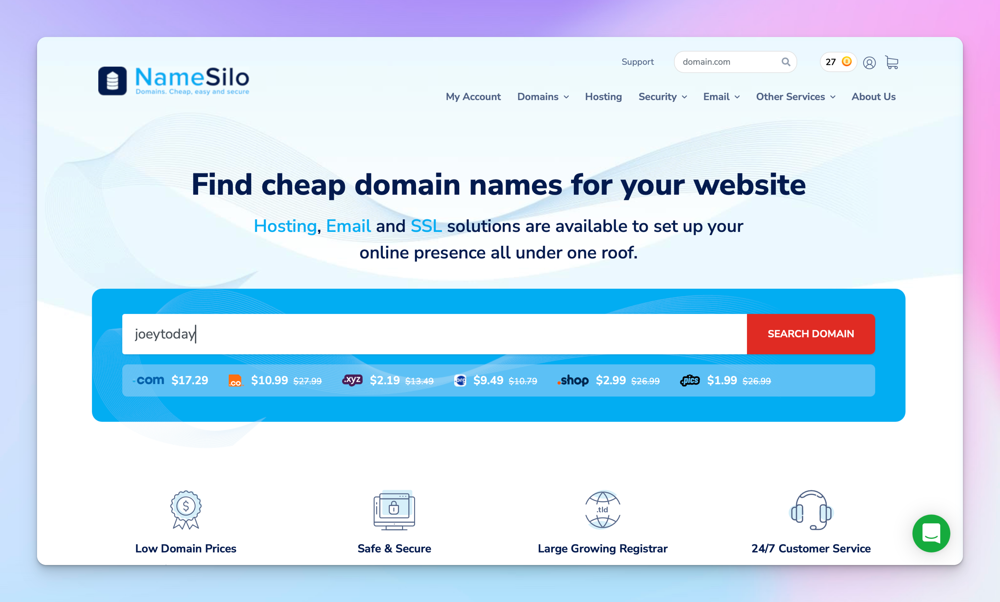
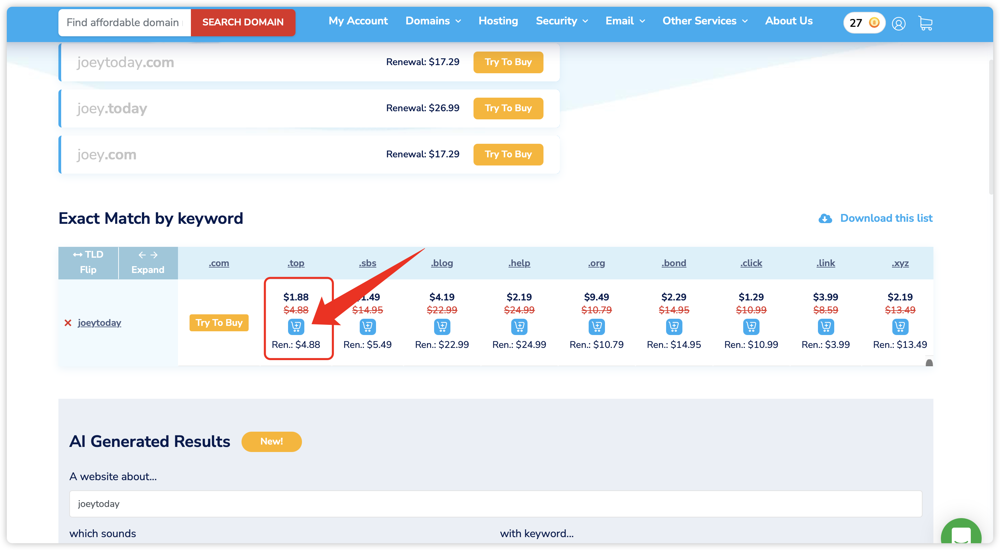
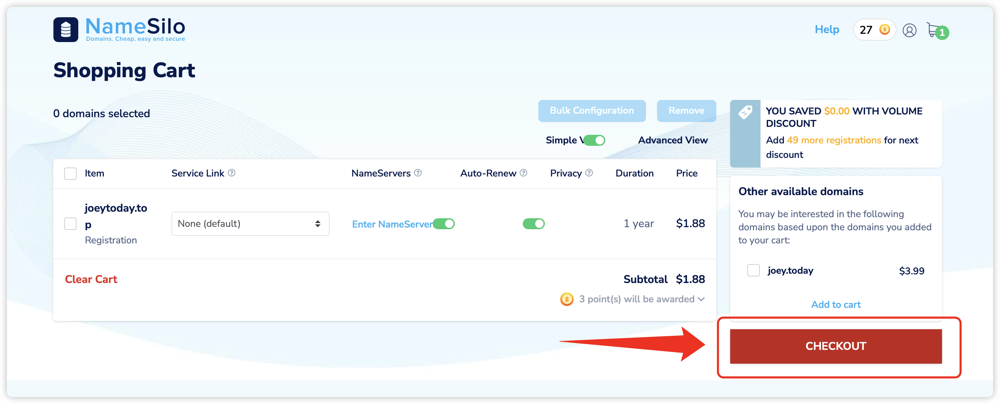
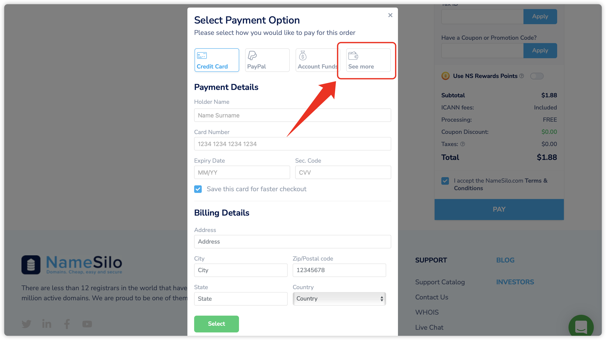
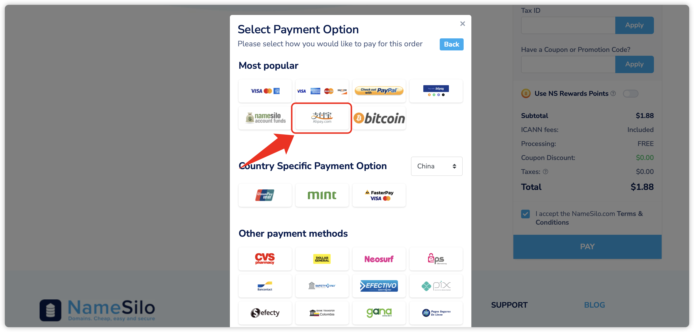

### 1. 进入 NameSilo 网站

进入网站后，可以在主页搜索你想要的域名名称。
[https://www.namesilo.com](https://www.namesilo.com)

### 2. 把自己喜欢的域名加入购物车

### 3. 进入购物车结算，选择支付宝

进入购物车点击「CHECKOUT」

在弹出的页面选择「See more」

选择「支付宝」

扫码付款 🎉 这个域名就属于你啦～

> 配置请参考[《如何使用Cloudflare配置域名？》](https://www.joeytoday.com/blog/2025/domain-config-by-cloudflare)