之前写了一篇使用 Notion 搭建个人主页，可以参考：[如何使用Notion【无代码】搭建自己的主页](https://www.joeytoday.com/blog/2025/notion-publish-public)，我最近有了不满意，觉得 Notion 主页的链接太长了，类似这种 https://www.notion.so/xxxxx/xxxxxxxxxxxxxxxxxxxxx ，我更希望我的主页是 https://www.xxxx.xxx 这种短链接的形式。

于是有以下几种方案可选：
1. 自己购买域名链接到 Notion，为此我上阿里云域名网站看了，一年价格在几块到几百块不等，
2. 使用 Notion 建站工具。本来都打算购买域名了，但是半夜看到 Notion 有专门给它建站的工具，具体可以参考这个盘点 [Notion 建站工具盘点（少数派）](https://client.sspai.com/post/77787#!)，我最后是在 [Potion](https://potion.so/) 和 [Super](https://super.so/) 两个中考虑，最终选择了 Super。
   目前免费版本就可以满足使用了，Potion 不知为何我创建网站一直失败，大概是需要梯子的缘故，但好在 Super 也足够我的需要了。

免费版本的内容包括：

设置完之后我的[主页](https://thirdoption.super.site/)（点击查看）大概是长这个样子的，基本和 Notion 主页的内容一致，可以手机打开，可以切换浅色/深色模式，右上角可以搜索（这个开关我真的是找了很久）。
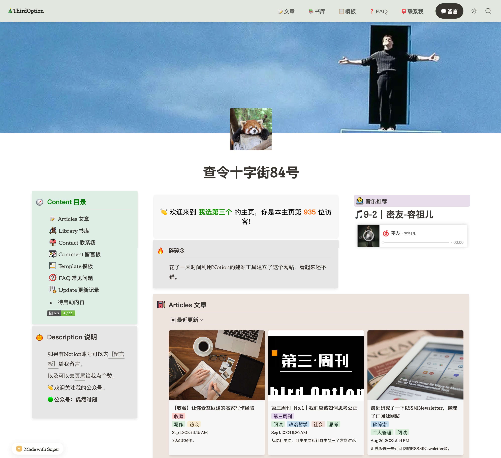

下面来介绍一下 Super 的配置，也可以看看官方的指引文档 [Guides](https://super.so/guides)，里面一步步的操作都很详细。

### 如何配置 Super 

注册完之后会进入个人的主页面，点击❶「Creat site」新建网址，然后点击❷「Edit site」进入主页的编辑设置。
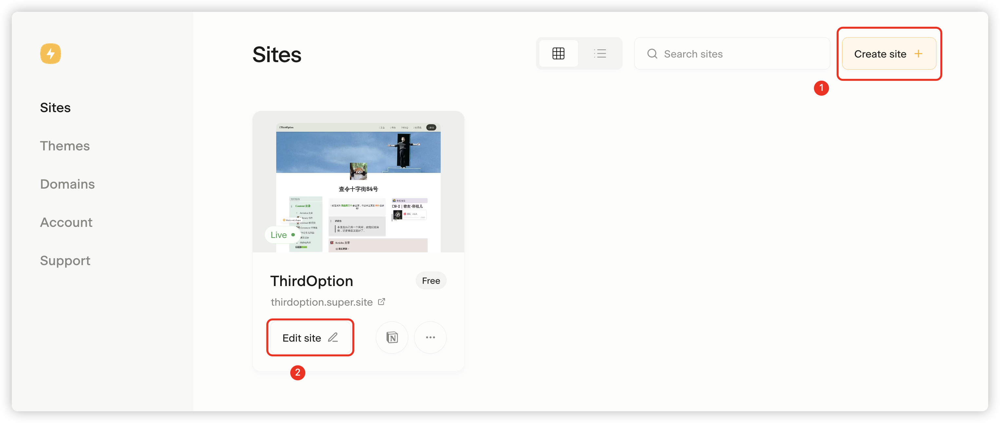

#### 设置名称、页面和网址 icon。
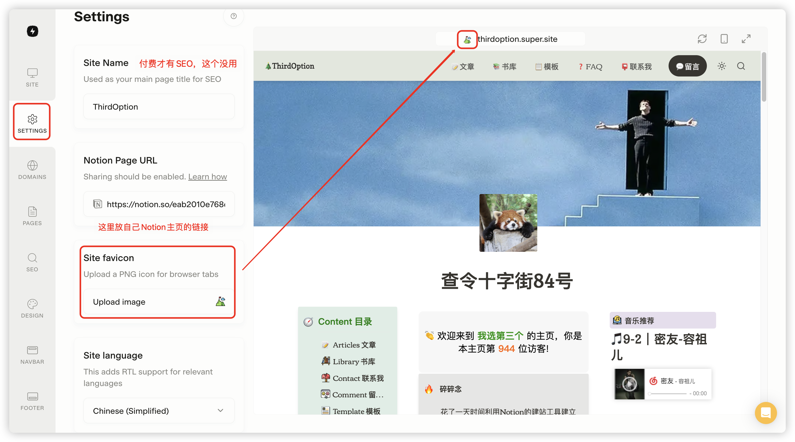

#### 自定义域名
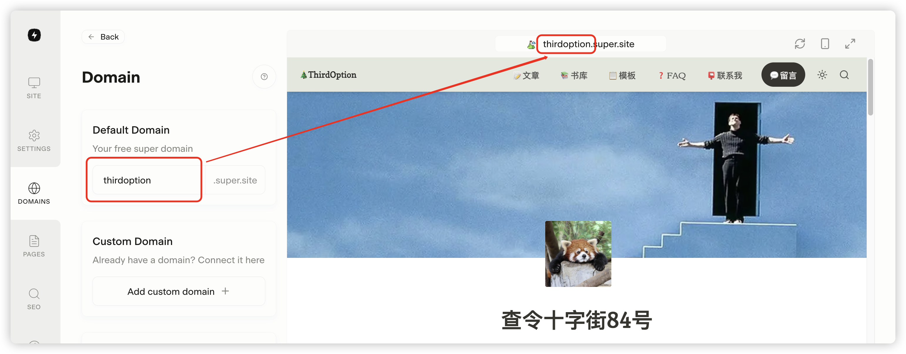

#### 设置子页面的下属链接
比如我的/articles 全链是 https://thirdoption.super.site/articles ，链接到「Articles 文章」。
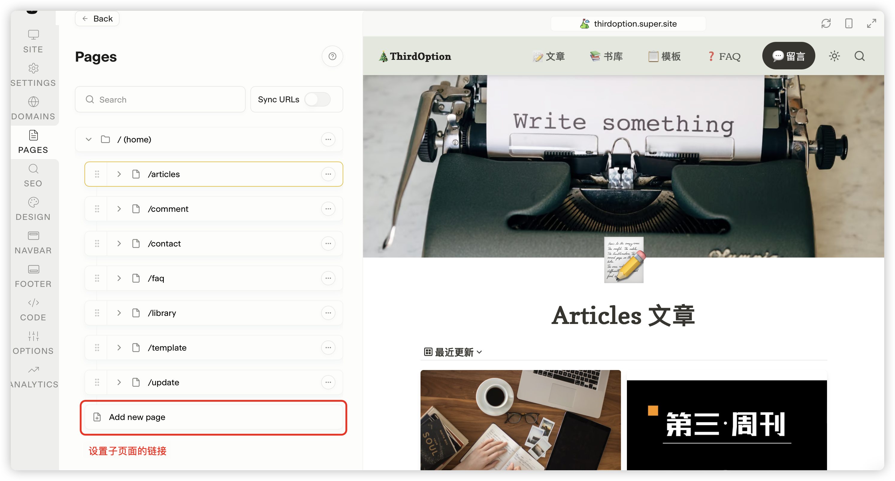

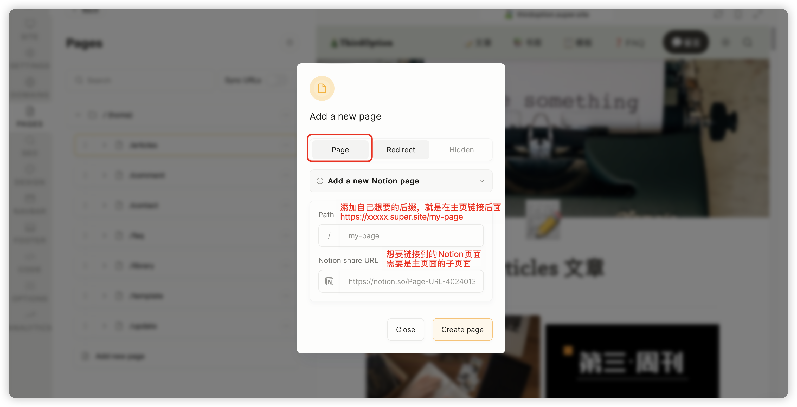

#### 页面样式设置
可以每个都去点点看看右边显示变化。
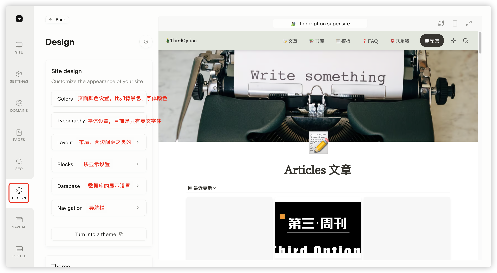

#### 导航栏显示设置
各个项目显示和解释。
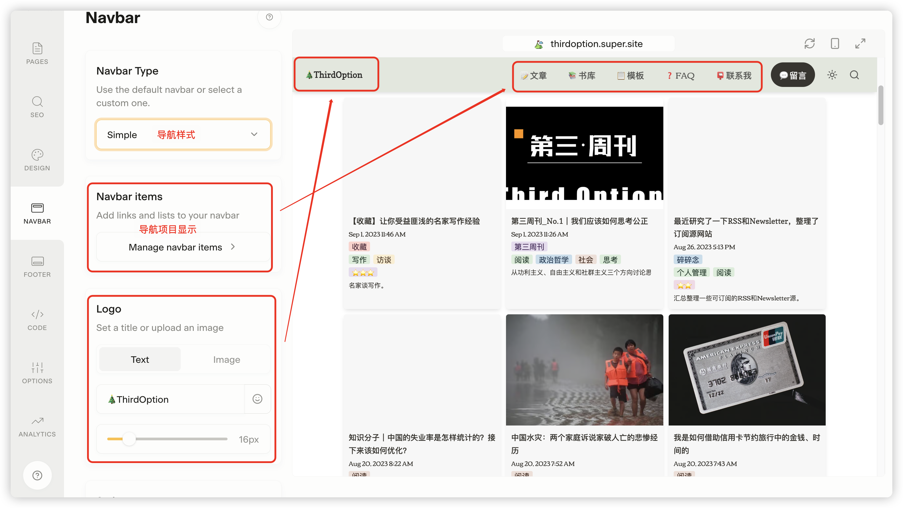
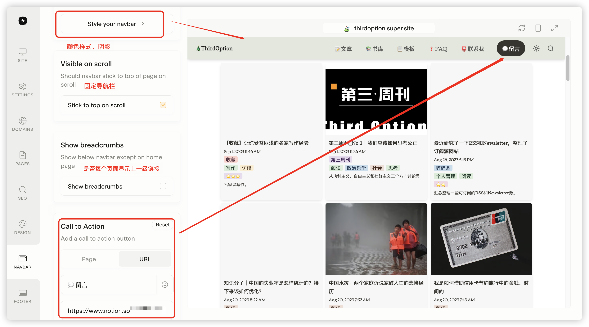

#### 脚注设置
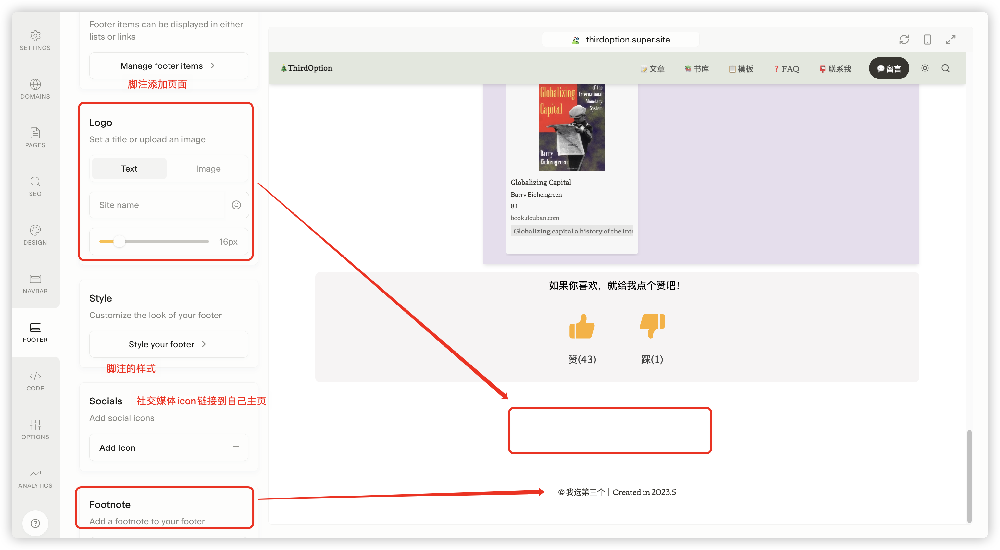

#### 显示模式/搜索按钮
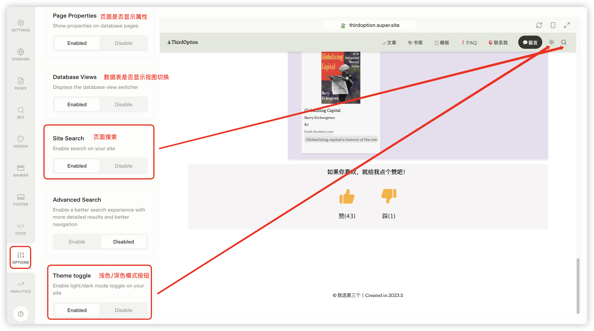

### 最后
以上就是我主页的设置，感谢阅读。