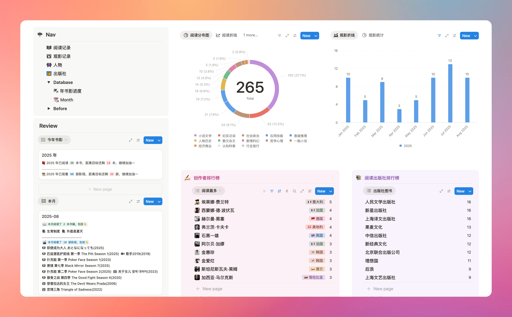
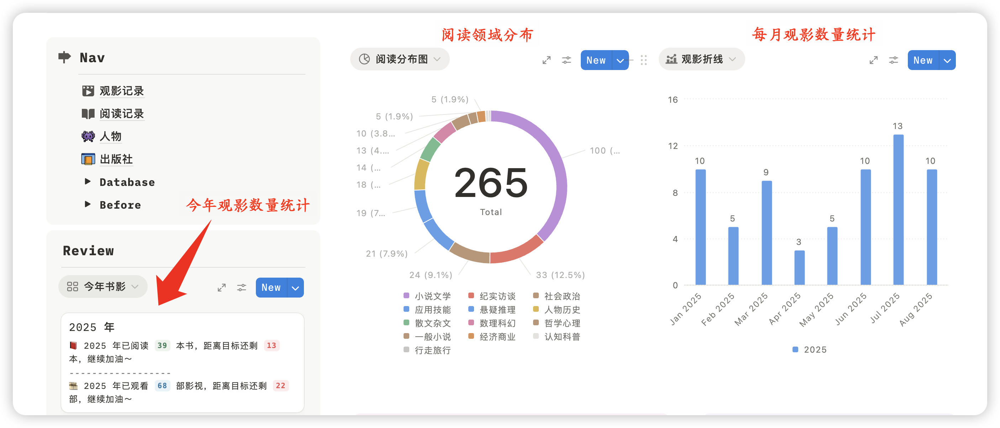
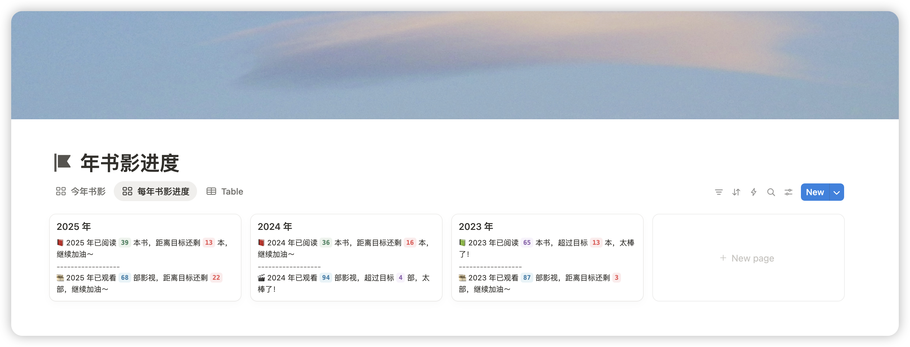
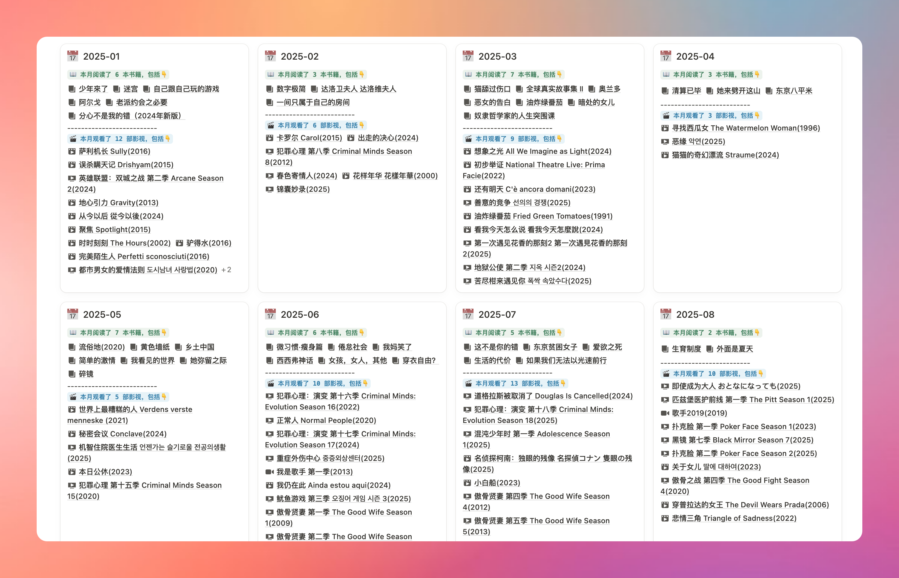
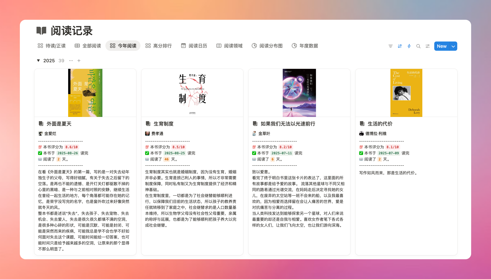
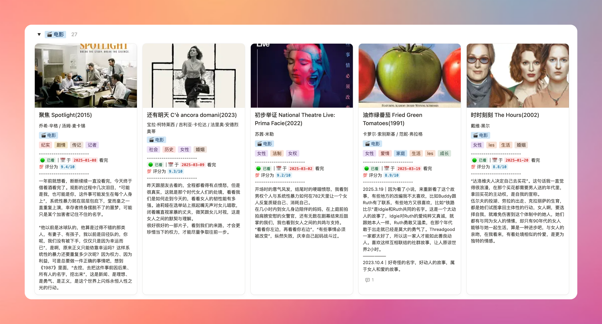
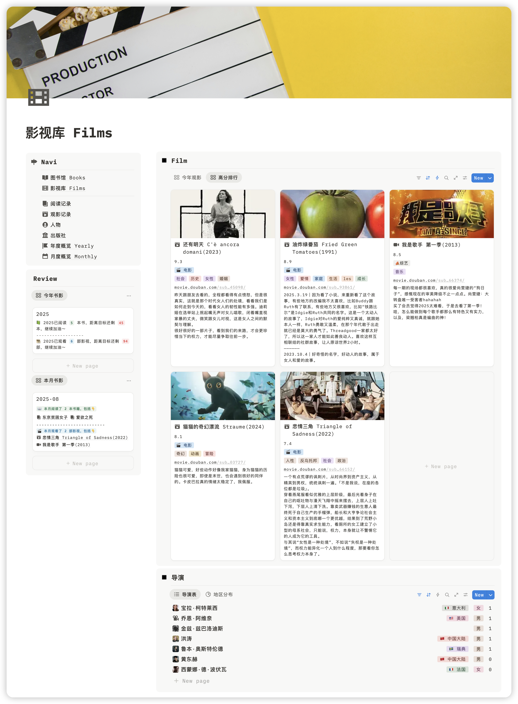

不知道你有没有过这样的经历：**想跟朋友推荐一本书，却突然想不起书名和核心内容**；聊起某类题材的电影，明明看过很多，却连几部代表作都说不完整；年底想复盘一年的阅读观影收获，翻遍手机备忘录、购物记录，才发现很多痕迹早已模糊……

作为已经使用 Notion 记录自己读书观影多年的博主，今天给大家隆重推荐一款专为阅读观影爱好者打造的 Notion 模板，如果你也想**把零散的阅读、观影记录收纳起来，用最直观的方式看到自己的进步**，那这款 Notion 模板会成为你的最佳拍档。

🛒 [购买点击](https://xhslink.com/m/6jTC8joPt0G)

## 从记录到复盘，全流程拿捏阅读观影体验

### 1. 丰富主页视图 + 数据库，分类清晰一目了然

打开模板的第一眼，你就会被它的 “高颜值” 和 “强逻辑” 打动。主页设计了**多个可视化视图和分类数据库**，比如按 “文学小说”“历史社科”“商业认知” 划分的阅读主题分类，按 “电影”“剧集”“总计” 分类的观影类型。不管你是想快速找到某本特定风格的书，还是想回顾某类题材的电影，都可以在数据库中一键直达，再也不用在杂乱的记录里翻找。

### 2. 自动统计 + 复盘功能，告别手动整理的麻烦

很多人不愿意记录阅读观影，很大程度上是怕 “后续整理太麻烦”。但这款模板完全解决了这个痛点：
- 使用 save 2 notion 插件自动从豆瓣中剪藏内容到数据库。
- 在数据库中标记某本书 / 某部电影的 “完成时间” 后，系统会**自动将其计入当月统计数据**，不需要你手动输入到表格里。

到了月底或年底，你不用再到处搜集记录 —— **模板自动统计月度 / 年度阅读/观影记录**，包括 “本月阅读 TOP3”“年度观影类型占比”“平均每月阅读时长” 等关键信息。去年读了多少书、最爱看什么类型的电影，点开复盘页面就能清晰掌握，成就感直接拉满。
#### 年度书影

#### 月度书影统计

### 3. 画廊视图展示，颜值与实用性并存

比起枯燥的文字列表，视觉化的展示更能唤醒记忆。这款模板专门设计了**阅读 / 观影画廊视图**：每本书的封面、每部电影的海报会以卡片形式排列，点击卡片就能看到你的详细笔记 —— 比如书中的金句摘抄、电影的核心感悟，在属性中直接增加了阅读情况的统计，阅读了几天，什么时间读完的。

闲暇时翻一翻画廊，就像逛自己的 “私人书店” 和 “家庭影院”，不仅能快速回忆起内容，还能随时重温当时的感动，记录瞬间变得生动又有趣。

### 4. 科学化设计，让成就感驱动你持续输入

很多人在阅读观影时会陷入 “三分钟热度”，但这款模板用 “正反馈设计” 帮你养成习惯：**每完成一次记录，模板会自动在 “月度概览” 添加一条记录**。

这种科学化的设计，让每一次阅读、每一次观影都有 “仪式感”，你会清晰地感受到自己的知识储备在不断增加，慢慢从 “被动记录” 变成 “主动期待”，不知不觉就打造出属于自己的 “私人图书馆 + 影视库”。

### 5. 离线存储 + 数据私有，安全感拉满

现在很多人担心 “记录的数据会丢失”，但用这款模板完全不用慌：**Notion 已经正式推出离线版，即使没有网络，你也能随时查看和编辑记录**；更重要的是，所有数据都存储在你的 Notion 账号里，**不依赖任何第三方数据库**，既不用担心平台倒闭导致数据消失，也不用顾虑隐私泄露，把 “知识资产” 牢牢握在自己手里。

## 为什么你一定要入手这款模板？这 4 个理由足够说服你

### 1. 帮你留住 “碎片化记忆”，再也不做 “看过就忘” 的人

我们每天会接触大量信息，阅读的书、观看的电影如果不及时记录，很容易在记忆里褪色。可能过几个月，你只记得 “好像看过这本书”，却想不起核心观点；再过一年，甚至会完全忘记自己曾经的体验。

这款模板就像你的 “记忆保险箱”，不管是书中的某个段落、电影里的某个镜头，还是当时的感悟，只要记录下来，就能直接打开查看。以后想回顾、想分享，随时打开就能找到，再也不用为 “遗忘” 遗憾。

### 2. 自动化统计省时间，复盘再也不用 “到处找”

年底复盘时，你是不是也有过这样的崩溃时刻：想统计一年读了多少书，要翻购物记录、电子书 APP、纸质书标记；想整理观影清单，要打开豆瓣、美团、视频平台一个个查…… 不仅浪费时间，还很容易遗漏。

但有了这款模板，你不用再做 “数据搬运工”—— 所有记录自动汇总、自动统计，月度 / 年度复盘页面直接生成。哪怕你一年读 50 本书、看 100 部电影，也能在 1 分钟内完成复盘，把省下来的时间用在更有意义的阅读和观影上。

### 3. 用 “微习惯” 搭建知识资源库，让成长看得见

很多人觉得 “建立知识体系” 很难，但其实每一次阅读观影记录，都是在为知识体系 “添砖加瓦”。这款模板通过 “正反馈设计”，让你从 “每次记录” 中获得成就感：今天读完一本书，记录下来，成就墙多了一条；这个月看了 5 部纪录片，柱状图的橙色柱高了一截。

这些小小的正反馈，会慢慢帮你养成 “记录习惯”，而积累的记录会变成你的 “私人知识资源库”—— 以后写文章需要引用、做分享需要案例，随时能从自己的库中调取，成长的每一步都清晰可见。

### 4. 告别第三方数据库依赖，数据完整度自己把控

很多人会用第三方平台记录阅读观影，但这些平台往往有 “局限性”：**比如某本书的信息不全、某部小众电影搜不到；更麻烦的是，平台可能会下架内容，导致你之前的记录 “断档”**。

而这款模板让你 “自己掌握主动权”：你**可以根据自己的需求补充信息** —— 比如给书添加 “推荐指数”“适合阅读场景”，给电影标注 “观影同伴”“印象最深的台词”；所有数据都是你自己录入的，没有 “信息缺失” 的问题，也不用担心平台变动影响记录，真正做到 “我的资源我做主”。

## 各功能操作简单，小白也能快速上手

虽然模板功能强大，但操作却非常简单，哪怕你是 Notion 新手，也能轻松玩转：

- **记录操作**：使用插件直接爬取网页内容，只需要简单补充部分定制信息。点击保存就能完成记录，全程不超过 1 分钟。
- **视图切换**：主页顶部有 “列表视图”“画廊视图”“日历视图” 三个切换按钮 —— 想快速浏览内容，选 “列表视图”；想欣赏封面海报，选 “画廊视图”；想查看某段时间的记录，选 “日历视图”，点击对应日期就能看到当天完成的阅读或观影，操作逻辑非常直观。
- **复盘查看**：在主页点击 “月度复盘” 或 “年度复盘”，就能进入对应的报告页面。报告里的图表会根据你的记录实时更新，让复盘不仅是 “数据回顾”，更是 “成长规划”。
- **离线使用**：打开 Notion 客户端，在右上角设置开启 “离线模式”，模板里的所有记录都会同步到本地。哪怕你在没有网络的地铁、飞机上，也能随时翻看自己的阅读笔记、观影感悟，碎片时间也能享受 “文化回顾”。

## 写在最后：记录不是目的，而是让成长有迹可循

其实，我们记录阅读观影，从来不是为了 “完成任务”，而是为了留住那些打动我们的瞬间，为了让自己的成长有迹可循。比如我自己就是**通过记录养成了阅读习惯**，我 8 月份就看了比较少的书，当**我在上周发现自己本月一本书也没看，于是这周在有意识增加阅读时间，这就是一个让自己保持输入习惯的过程**。

当你用这款模板记录下第 100 本书、第 200 部电影时，你会发现，那些曾经读过的文字、看过的画面，早已变成你知识体系的一部分。现在，这款能帮你 “留住记忆、提升效率、积累知识” 的 Notion 模板已经上线。不管你是热爱阅读的 “书虫”，还是沉迷观影的 “影迷”，都能通过它打造专属的文化知识库，**让每一次阅读、每一次观影都更有价值**。

##  模板页面概览

### 主页面

### 图书馆页面

### 影视库页面

🛒 [购买点击](https://xhslink.com/m/6jTC8joPt0G)
