最近熬了好几个大夜做了个自己的博客，看过我之前文章的朋友们都知道，我之前就有尝试过使用 Notion 搭建自己的博客，去年 12 月使用 NotionNext 这个项目购买域名做了部署的，但是，最后的结果不如人意，总有一些我看不明白的 bug，老是部署失败，而且主题可选样式太少了。

我这么爱折腾的人怎么可能满足于此，于是上周我尝试了使用 Hugo 静态部署，研究了老半天，我感觉还是不太行，最后我搜索 Obsidian 部署个人网站的时候搜到了很多其他人的博客，比如这个朋友的：[Home • CCM'blog](https://8cat.life/) ，于是我溯源找到了他使用的主题，也就是 [Astro Pure Theme](https://astro-pure.js.org/)，最后使用此主题改造了自己的博客主页。

我的主页已经上线，欢迎大家参观 👉 [Home • joeytoday](https://www.joeytoday.com/)，可直接复制链接在浏览器打开，也可点击「阅读原文」进入查看。
```
https://www.joeytoday.com/
```

最终我选择了 Astro 框架+Pure Theme，使用 GitHub+Vercel 部署，主页效果如下，如果不想打开网页，也可以在展开大概看看～👀
> #### 我的主页
>
> 

# 部署过程
大概说了下我是如何选到自己喜欢的主题的，选择使用 Astro 很大一部分原因也是帮助文档有中文的，部署也相对简单，具体部署也可以参考教程，整体来说比较简单：[入门指南 \| Docs](https://docs.astro.build/zh-cn/getting-started/)

指南给的部署步骤，主要是本地的，我需要同步部署在网络上，目前的流程还是会有点麻烦，所以我优化了一下流程，主要操作如下所示。

### 导入主题仓库到本地

下载 [ GitHub 桌面端](https://desktop.github.com/download/)，点击 `Add` - `Clone Repository`，选择 `URL`，粘贴主题仓库地址，克隆到本地。
```
https://github.com/cworld1/astro-theme-pure.git
```

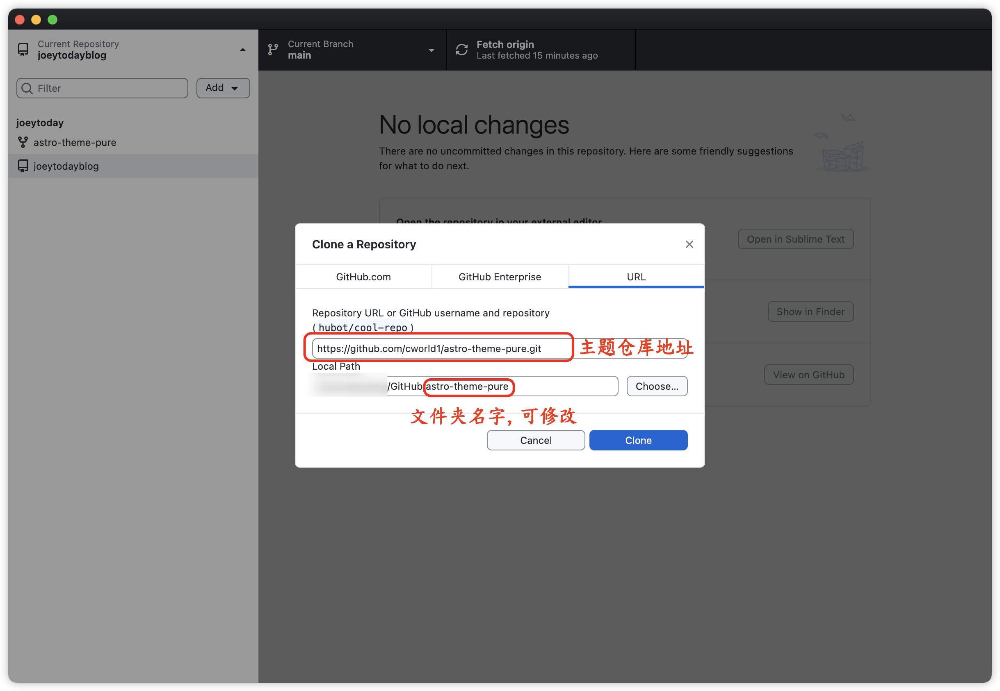

## 同步修改到 GitHub
然后选择 commit to main，再点击 push origin，同步到 GitHub 仓库，之后每次修改也是这两部操作。

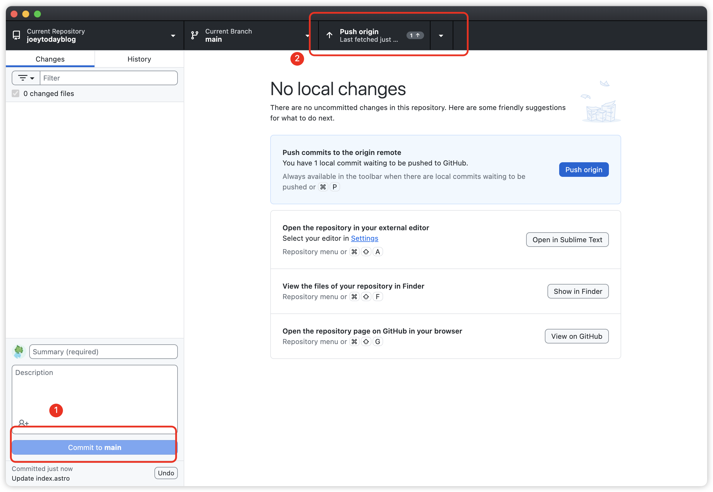

打开终端，进入到项目文件夹，也就是上图的 `Local Path` ：
```bash
cd ./<your-project>
```

在本地启动开发模式：
```bash
npm run dev
```

然后进入本地开发环境，你就会打开一个此主题的预览页面，此后修改的内容，都可以在这个页面看到。
```bash
http://localhost:4321/
```

## 直接部署到 Vercel
为了防止修改配置后部署失败，建议没修改的时候就直接先部署。没有账号的可以先注册 Vercel，然后新建项目 [New Project](https://vercel.com/new)，在页面 import 刚刚同步的博客仓库。

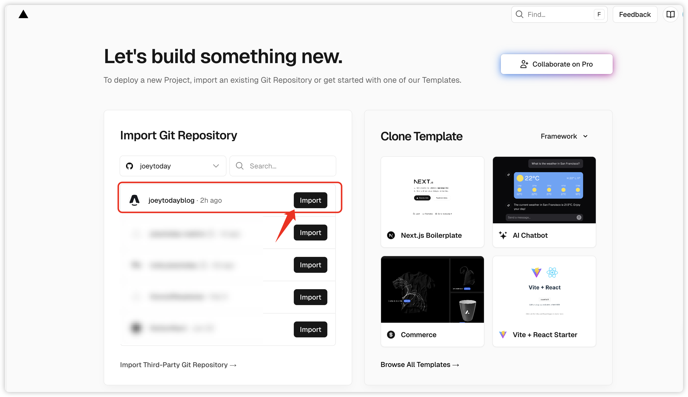

等待部署之后就可以直接查看页面了，初始网页链接是：`project-name/vercel.app`，国内访问可能存在比较慢的问题，所以你可以购买域名，点击右上角的 `Domain` 修改重定向。

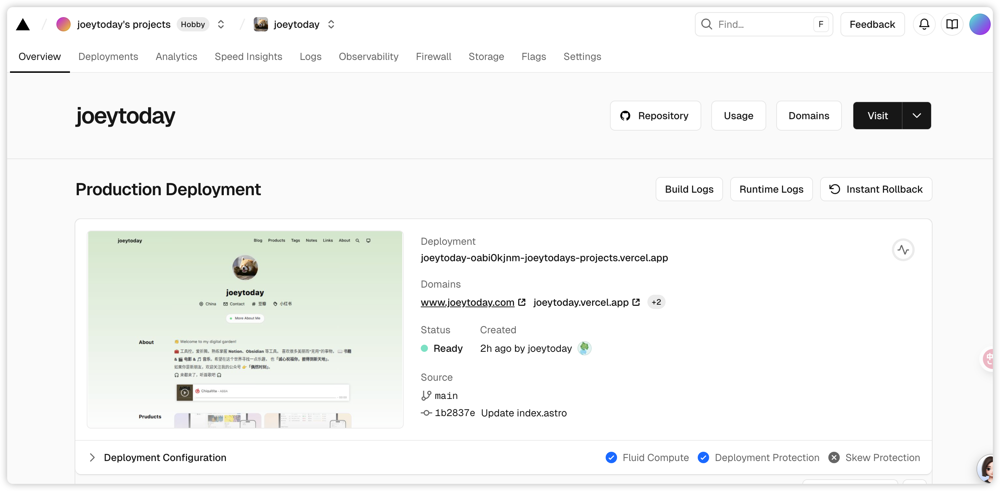

> [!note] 说明
> - 关于购买域名可以参考：[如何使用 NameSilo 购买域名？ • joeytoday](https://www.joeytoday.com/blog/2025/domain-purchase-by-namesilo)
> - 关于域名 cdn 加速可以参考：[如何使用 Cloudflare 配置域名？ • joeytoday](https://www.joeytoday.com/blog/2025/domain-config-by-cloudflare)

## 修改页面设置
具体的配置和修改也可以在 [Getting Started • Astro Theme Pure](https://astro-pure.js.org/docs/setup/getting-started) 这里看到，但有些配置也没有说的太清楚，所以我补充我的设置进行一些说明。主要修改的部分在 `src` 文件夹下。
### site.config.ts
页面整体设置，包括页头和页尾
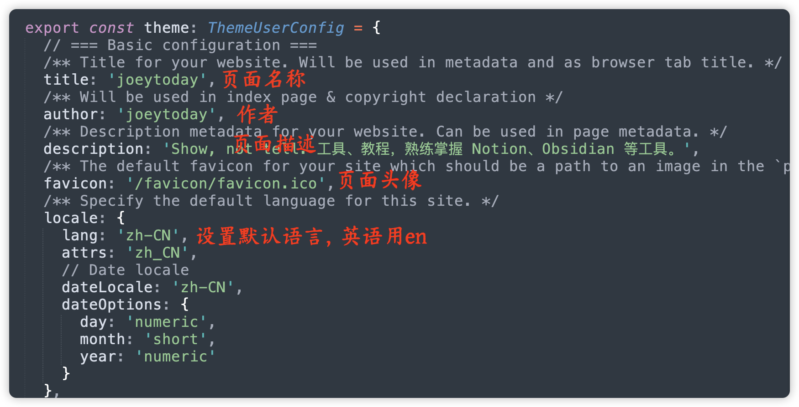
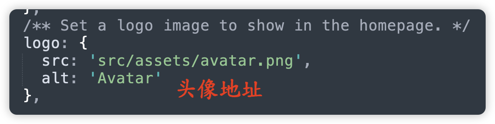
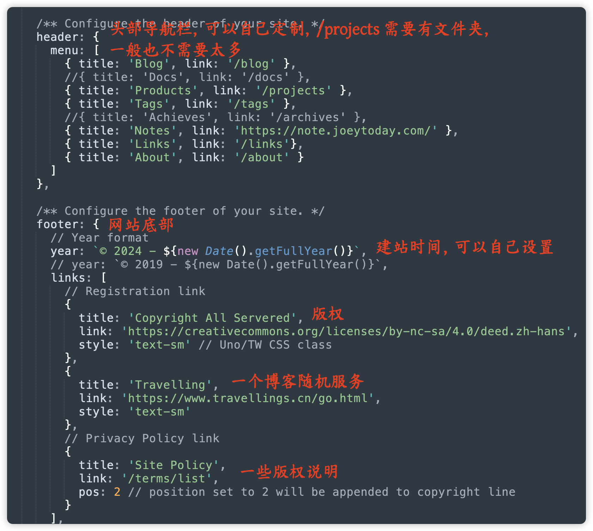

### Src/pages 页面配置
#### Index. Astro
这个页面是配置主页的，
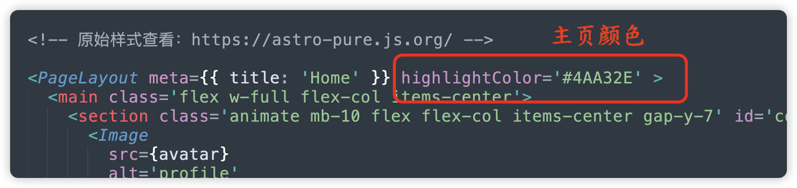
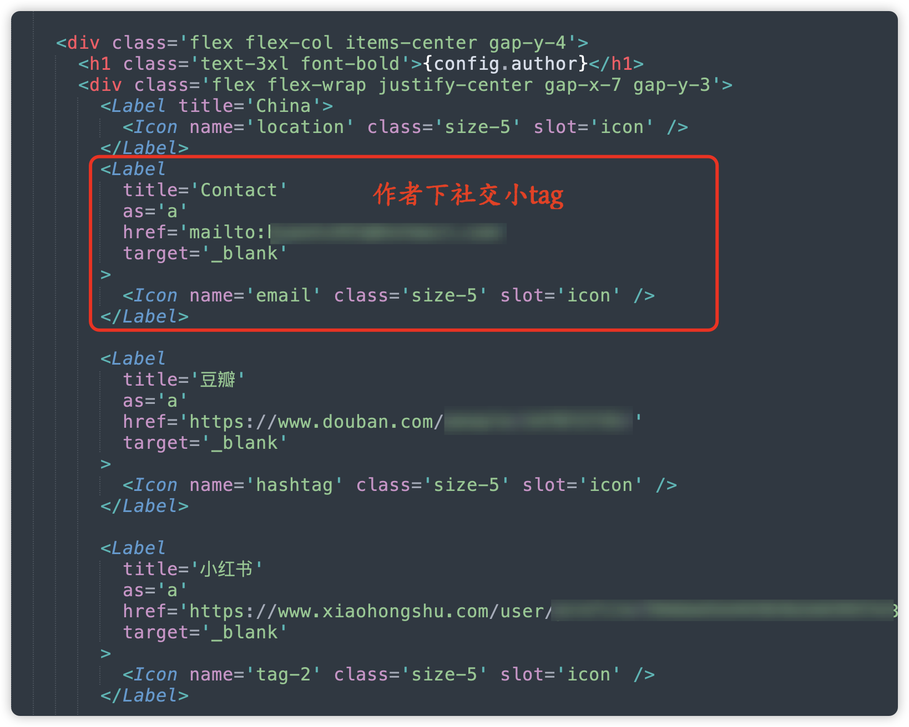
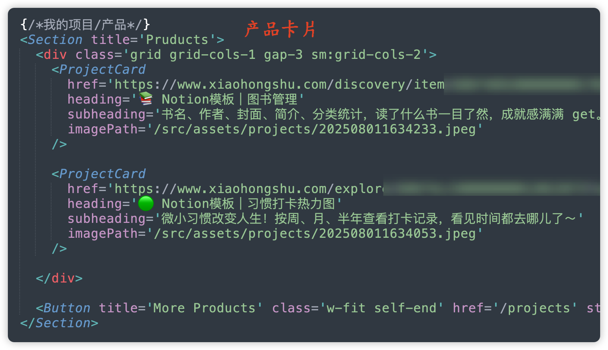
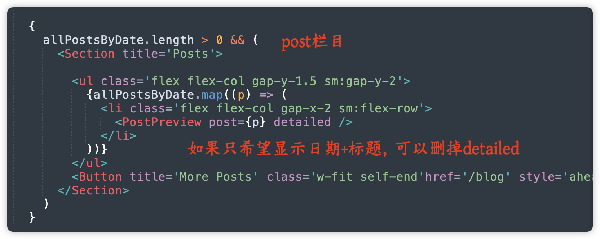
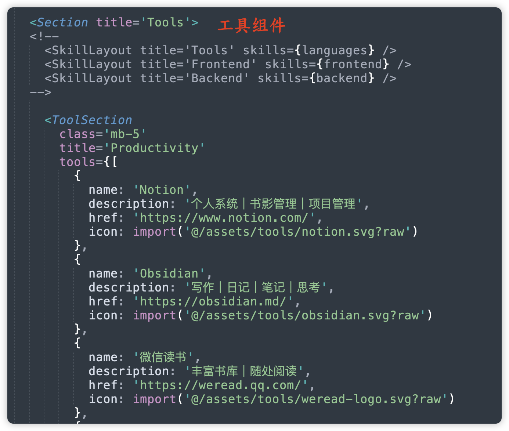
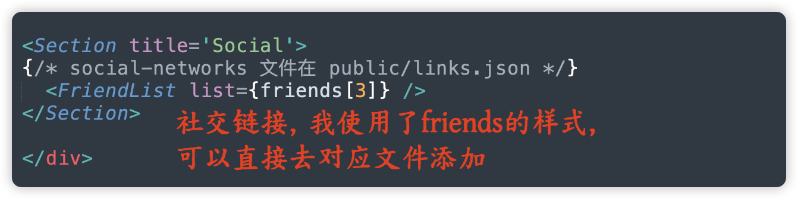

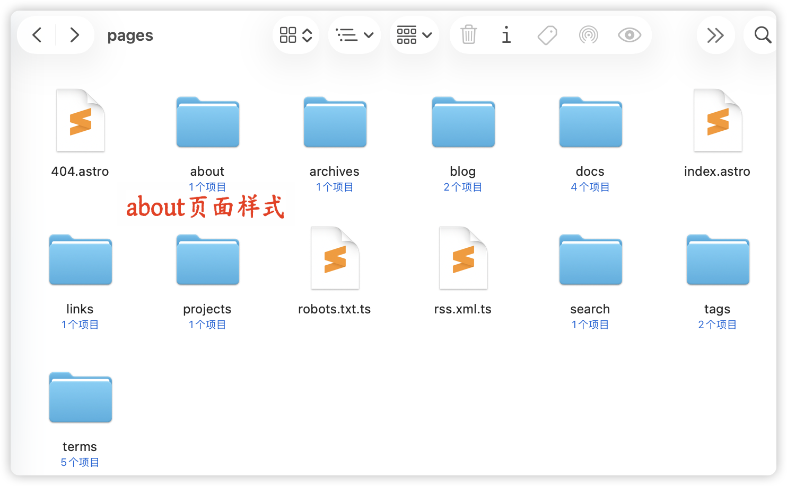

大部分的页面样式都在对应的文件夹下，样式如果实在看不懂可以让 AI 给注释一下。

## 添加文章
所有的文章都在 `src/content` 之下，我一般也用不上 `docs`，所以我直接在 `blog` 中添加，内容都是 markdown 文件，基础信息可以使用 frontmatter，形式如下：
```markdown
---
title: 标题
author: 作者
description: 文章概述
draft: false 发布，true 为草稿
publishDate: 2023-09-01 发布时间，格式如右
tags:文章标签
  - 第三周刊
  - 政治
  - 社会
  - 书评
heroImage: {src: 'https://joey-md-asset.oss-cn-hangzhou.aliyuncs.com/img/202312140000460.jpeg', inferSize: true} //封面图片，本地、网络图片都可以
---
正文内容正文内容正文内容正文内容正文内容正文内容正文内容正文内容正文内容正文内容正文内容
```

添加完之后[[#同步修改到 GitHub]] 就会自动更新部署了，部署完成后主页就会更新内容。

# End
折腾完自己的主页之后，还使用 **Obsidian** 的 **【Digitial Garden】** 插件生成了我的笔记网站，可以直接从 Obsidian 发布到网站上，效果如下所示，如果大家感兴趣的话，我可以下期再出一篇教程。

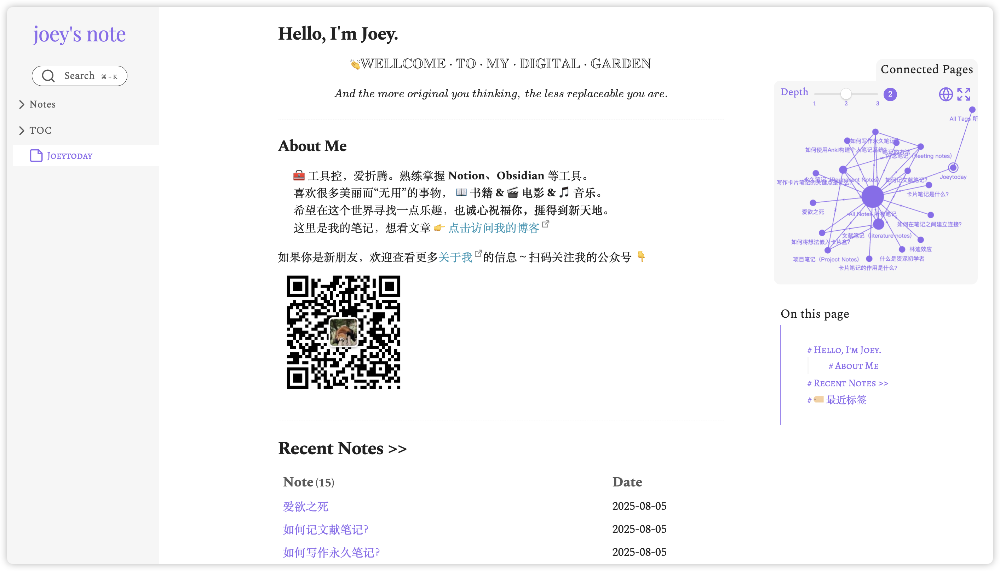
