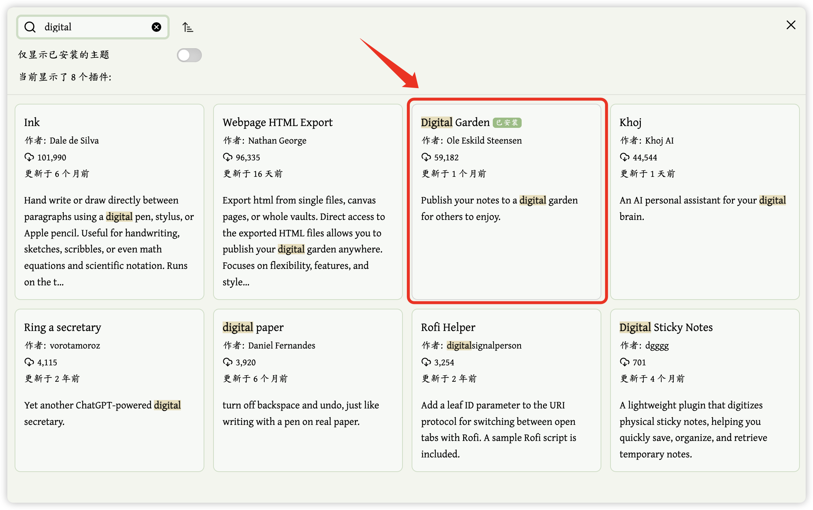

使用 Obsidian 写作的朋友们有福了，Obsidian 中的 Digital Garden 插件（后称 DG）可以直接发布到网页，直接生成个人网站，整体比较简洁，能够满足不想写代码，但想发布自己的内容的朋友们～

👇 是我使用 DG 插件简单搭建的笔记网站，下面来介绍一下搭建与部署的过程。


## 前期准备
首先，你需要的东西有：
- GitHub 账户
- Vercel 账户
- [Obsidian](https://obsidian.md/)，然后进入 OB 设置，Mac 可以使用 `⌘` + `,` 打开设置，关闭【安全模式】后进入社区插件市场。


搜索【Digital Garden】（后称 DG）然后安装：



## 安装配置【Digital Garden】
作者也写作了很详细的使用指南，可复制到浏览器打开：
```
https://dg-docs.ole.dev/
```

进入 DG 官方 GitHub 仓库，直接点击 Deploy 部署到 Vercel：
```
https://github.com/oleeskild/digitalgarden
```

从 OB 进入 DG 插件设置：


## 配置发布和主页属性
在 OB 页面中添加属性 `dg-publish` 和 `dg-home`。


配置 DG 笔记设置和外观设置。


### Note setting


### Appearance setting


## 我的主页配置说明
我在自己的主页筛选了最近更新的笔记和标签，主要是用了【dataview】插件，注意去安装一下，使用的代码是 `dataviewjs` ,具体的配置样式和代码如下：

### Recent Notes
样式👇


```markdown
dataviewjs

// ===== 配置 =====
const targetTag = "#Note";
const publishFlag = "dg-publish";
const limit = 15;

// 获取文件：按最后编辑时间倒序 + 限制数量
const pages = dv.pages(targetTag)
  .where(p => p[publishFlag] === true)   
  // 筛选已发布
  .sort(p => p.file.mtime, 'desc')       
  // 按最后编辑时间倒序[2,6](@ref)
  .limit(limit);                         
  // 限制数量

// 处理标签（可选，按需取消注释）
const filterAndFormatTags = (tags) => {
  if (!tags) return "";
  const filtered = tags.filter(tag => 
    !tag.startsWith("#Note") &&
    !tag.endsWith("#Area") &&
    !tag.endsWith("#Post") &&
    !tag.endsWith("#Ref") &&
    !tag.includes("/#Note")
  );
  return filtered.join(", ");
};

// 构建表格数据
const data = pages.map(p => [
  p.file.link,                            
  // 笔记链接
  // filterAndFormatTags(p.file.tags),    
  // 标签列（按需取消注释）
  dv.date(p.file.mtime).toISODate()        
  // 正确显示最后编辑日期[6](@ref)
]);

// 渲染表格（无标签列）
dv.table(
  ["Note", "Updated"],               
  // 表头：笔记 + 最后编辑时间
  data
);

// 添加紧凑样式
dv.el("style", `
  .dataview.table-view-table th:nth-child(2),
  .dataview.table-view-table td:nth-child(2) {
    width: 25%; /* 固定日期列宽度 */
    text-align: right; /* 日期右对齐 */
  }
`);
```

### Recent Tags
样式👇


```markdown
dataviewjs

// ===== 配置区 =====
const targetFolder = '"2.2-Cards"';   
// 目标文件夹（双引号包裹）
const maxNotes = 20;                  
// 统计最近编辑的笔记数量
const maxTags = 15;                   
// 最多显示的标签数量
const minFrequency = 1;               
// 标签最低出现频次（≥1）
const columns = 3;                    
// 表格列数

// 1. 获取目标文件夹文件，按编辑时间倒序 + 限制数量
const recentPages = dv.pages(targetFolder)
    .sort(p => p.file.mtime, 'desc')
    .limit(maxNotes);

// 2. 统计标签频次（仅统计最近笔记）
const tagCount = {};
recentPages.forEach(page => {
    (page.file.tags || []).forEach(tag => {
        tagCount[tag] = (tagCount[tag] || 0) + 1;
    });
});

// 3. 筛选并排序标签（按频次倒序）
const sortedTags = Object.entries(tagCount)
    .filter(([_, count]) => count >= minFrequency)
    .sort((a, b) => b[1] - a[1])
    .slice(0, maxTags)
    .map(([tag, count]) => `${tag} (${count})`);

// 4. 将标签分组为多列
const chunkArray = (array, size) => {
    const rows = [];
    for (let i = 0; i < array.length; i += size) {
        rows.push(array.slice(i, i + size));
    }
    if (rows.length > 0) {
        const lastRow = rows[rows.length - 1];
        while (lastRow.length < size) lastRow.push("");
    }
    return rows;
};
const tagColumns = chunkArray(sortedTags, columns);

// 5. 渲染无表头表格
if (sortedTags.length > 0) {
    dv.paragraph(`**最近 ${maxNotes} 篇笔记的高频标签：**`);
    dv.table([], tagColumns);      
} else {
    dv.paragraph("⚠️ 目标文件夹中未找到符合条件的标签");
}
```

## End
安装完 DG 插件之后侧边栏会出现一个 icon，类似如下：


点击打开，勾选发布，等待一段时间就发布成功啦～这样你的个人网站就已经部署好了🎉