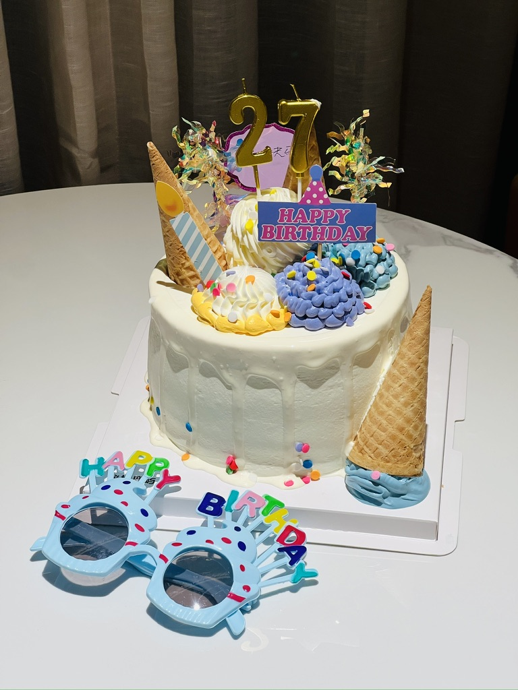
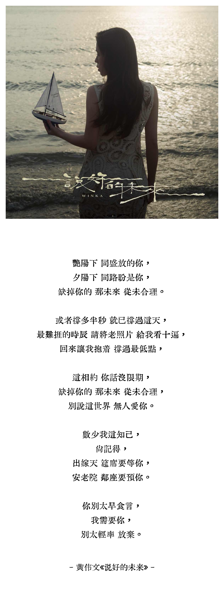

我没有在生日的时候总结自己生活的习惯，又因为生日在阳历年初、农历年末，往往都是忙着期末考试，回家就会准备过年的事情，也很难抽出时间反思，好像是在工作之后才有空思考这一年我做了什么、没做什么。

我很庆幸自己拥有很好的朋友们，她们在过去的这么长时间内一直陪伴着我、见证着我的成长，我们一起经历了很多事情：在疫情时期看梅西夺冠，回家后统统生病；尝试坐船回家，一路上看到很好的风景；去完环球影城，在北京的深夜去喝酒，有人在加班，有人在狂喝酒；还有杨千嬅、安溥的演唱会，我亲手摸到了《巨流河》中写的历史；在川藏线上的深夜对谈、雨天徒步、长达一周的自驾，还有我的高反；还有仅仅只是很多个在一起吃饭聊天的时刻……提到这个，想到其实我的川藏的日记还没写完。

想说很多又觉得矫情，所以很多时候我只是默默记住这些让我能够回忆的时刻。

**很感谢每一个在我身边的朋友们，哪怕只是经历过一段时光，也是人生的恩赐了。**

**除了我的朋友们，可能最感谢的就是书籍了**，还好世界上还有书可以读，还好世界上有足够多的好书可以读。在很多个 emo 的时刻，总有一本书（or 一篇文字）能拉我走出那些近似深渊的时刻。

20 年在家里读《第二性》仿佛人生被打开一扇窗，还有无数姐妹们写的内容，21 年读《厌女》更是打开了我对社会学的好奇；读布尔加科夫的《大师与玛格丽特》，我震惊小说还能这么写，不敢说我看懂了，但文字的世界奇异诡丽让人惊叹；读《平面国》的时候，我想，一百年的科幻小说能有这么深的洞见吗？

对了，还有对我影响最深刻的《美丽新世界》，简直打开我的新世界，虽然作为很早的内容，里面倒是不出意外有厌女的内容，但小说中对“娱乐至死”的塑造，让我直到如今会对高浓度的娱乐保持警惕，可以说我到现在没有任何抖音、快手这样的短视频 APP，它是首要助力。

还有很多非虚构的作品，很多甚至不能提到名字，但真实的历史与文字，不会甘心轻易湮灭在历史的尘灰当中，总有人会记录、总有人会发现。

还有音乐，我爱粤语歌，大概我的朋友无人不知了，我最近发现一首新的歌，很喜欢，是黄伟文写给抑郁症的朋友，很难说被哪一句词感动，但最近就是很喜欢。

👇是一些歌词摘录

好了，说回来，18 年的时候开始接触粤语歌，当时好喜欢谢安琪《罗生门》，黄伟文用十年打破一个假象圆满的故事，原来《耿耿于怀》《念念不忘》的深情只是故事中男子的一厢情愿：
> 狄更斯是漫画吗？
> 仍然少女误会了吗？
> 迷恋蔽眼才给美化
> 其实真懂得我吗？

我才知道，原来歌词可以写故事！再后来就是喜欢一对 cp 啊哈哈哈，很常见的入坑剧情，从《黄色大门》嗑到《痴情司》，《劳斯莱斯》一句：
> 能成为密友大概总是带着爱

直接垂直入坑，那么多密码歌，在 N 6 演唱会上穿着彩虹裙唱《空港》的容祖儿，是真的快乐过：
> 云层上满星光，星星不知我的怯慌
> 人间却有殷切的目光，每夜
> 往上看

再之后，杨千嬅是我最爱，《可惜我是水瓶座》，我真的是水瓶座，“我什么都没有，只有心头一个勇”，《勇》是我学会的第一首粤语歌。

然后发掘了更多宝藏歌手，薛凯琪，很爱《奇洛李维斯的回信》和《男孩像你》；陈慧琳，很喜欢《阁楼》；郑秀文，很喜欢《终身美丽》。
> 任他人多美丽
> 未及你矜贵

陈奕迅又是更常见的选择了，他歌里的哲理，总是扎人，林夕和黄伟文总钟爱把这类词交给他，他也总能完成很好：
> 留住温度、速度、温柔和愤怒
> 其实人生并非虚耗
> /沙龙

> 但当你智慧都酝酿成红酒
> 仍可一醉自救
> /葡萄成熟时

> 娱乐再无穷但本质都雷同
> /反高潮

> 听不到世人爱听的福音
> 曾迷途才怕追不上满街赶路人
> 等遍世界所有绿灯
> 还是疯一下要紧
> /任我行

……

太多了，我的生日回顾，都快变成我钟爱的歌词回顾了，所以就到这里了，杨千嬅是我看的第一场演唱会，也在很多时刻和我的生活绑定了，**谢谢这些作者和歌者，给世界增加了很多色彩**。
> 缤纷色彩闪出的美丽
> 是因为它没有分开每种色彩

---

在不知不觉中碎碎念了很多，我最近的生活度过得有点不知所谓，明明几天前，却感觉像好久之前，日子跟我的感知有点不一致了，加上睡眠障碍，最近终于在生日前去看了医生，我一直很抗拒吃药，20 年吃药的经历实在是不怎么好，但这次感觉好像还行，还得是大城市的医院啊（手动狗头）。

写到这里的时候，还想到对我很有影响的一篇文字，「人物」对黄永玉的一篇专访《人只要笑，就没有输》，我想，**生活还是需要很多幽默感才能幸存下来的**，于是我打算用一句玩笑话结束这篇碎碎念：
> 为什么电脑经常生病？
> 因为它的窗户（Windows）总是开着！

昨天让我突然笑了一下的冷笑话，希望各位也莫名其妙笑一下。
