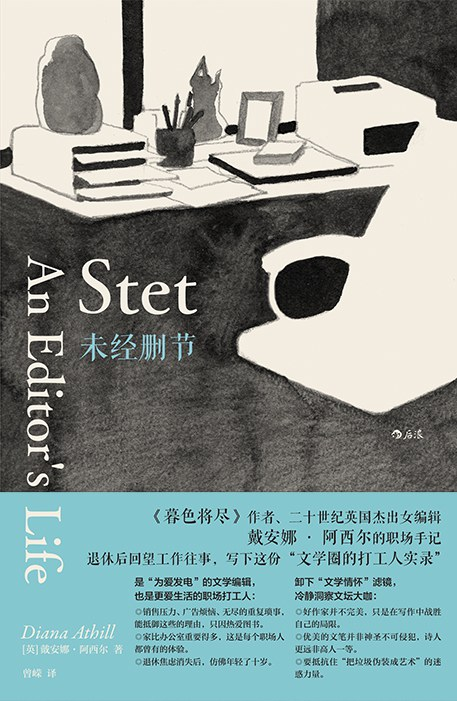
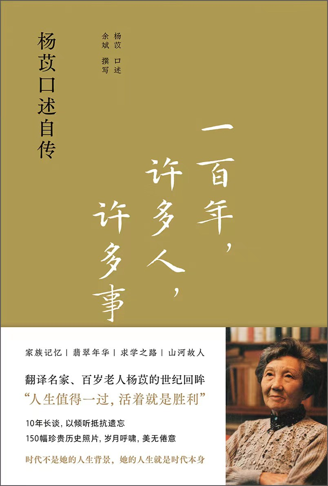
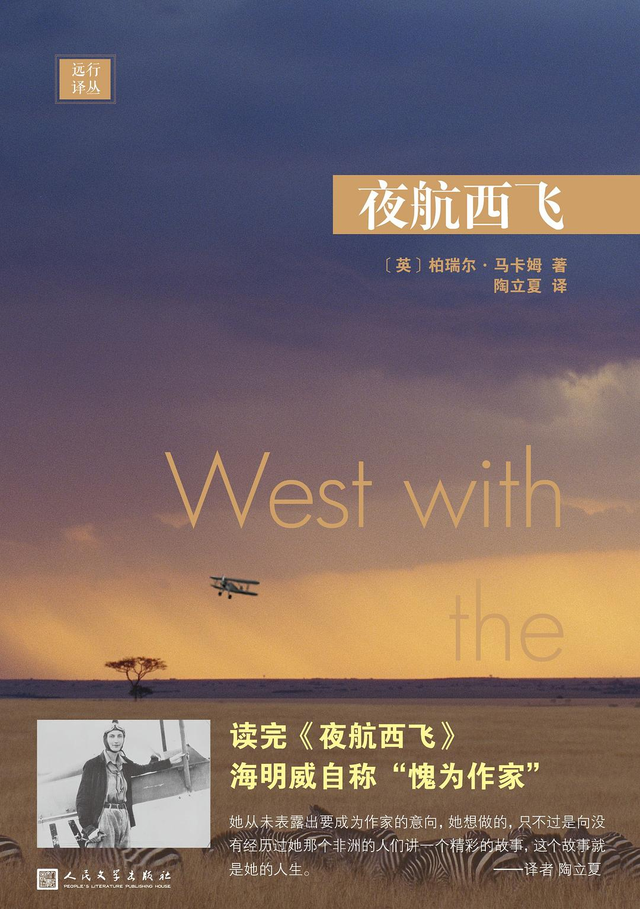
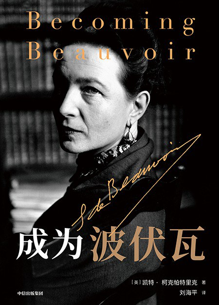
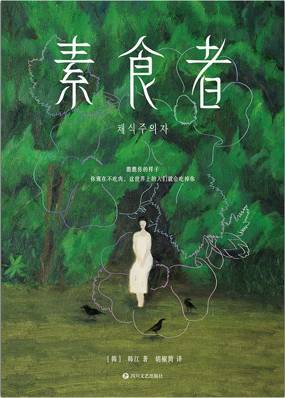
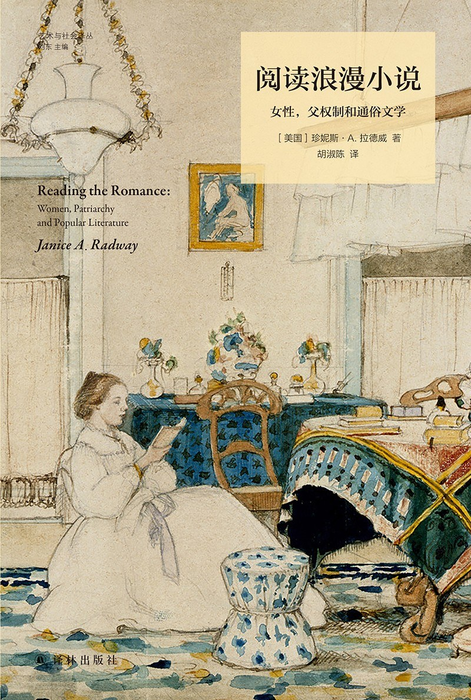
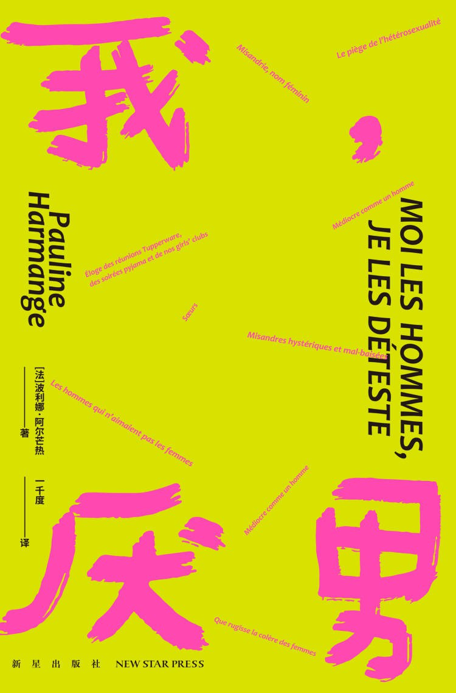

当我们谈论“情人节书单”，被反复推荐的爱情故事总在暗示：女性的终极幸福必须与爱情（往往是与男性的爱情）绑定。但我觉得女性的人生远不止于此，远不止那些爱情小说里的样子——她们可以翱翔于非洲夜空，在哲学思辨中觉醒，用肉身对抗社会规训，甚至以冷眼解构性别权力。浪漫爱叙事绝不会是女性生命的唯一答案。

在这个以爱情为名的节日里，我更希望各位朋友们能够看到一条更为不同的道路，或许是人迹更罕至的路，或许是更艰苦但更自由的道路。这些书写以锐利的笔触刺破浪漫幻象，带我们凝视不同时代、不同境遇中女性的挣扎与觉醒。

女人的世界，可不止情人节。

### 《未经删节》

> 书本能带我远远超出自身经历的狭隘界限，极大地扩展我对生活复杂性的认识：它充满了黑暗，以及，感谢上帝，还有那一直艰难跋涉的光明。

一个终身未婚的女编辑的职场手记，从 76 岁开始创作，在人生暮年开始从幕后走向台前，创作拿下多个大奖，从此声明远扬，最后于 2019 年以 101 岁高龄去世，**戴安娜·阿西尔的人生，完全不按照所谓的“社会时钟”走，但看起来也「有点意思」！**

作为第一代职场女性，戴安娜·阿西尔经历了完整的女性开始走向职场的过程，但不知该庆幸还是遗憾，她是一个钝感力十足的女人，甚至在自传《暮色将近》中大胆开麦“我觉得我更适合当情人，既不需要尽妻子的义务，又可以享受爱情”，不过这本书更多谈论她的职场之路。

**阿西尔用来自上个时代年长女性的视角和语言，缓缓道来她自己在战争之后是“如何把读书作为职业”的**，经过了半个世纪，她再回首已经能够以足够冷静的视角看待整个战后英国出版业的变迁，可能是性格使然，她对身边的人都有着间离与温和共存的冷淡，让这本书读起来更像是在雨天的房间，听一个老朋友的慢慢叙述她的生活。

### 《一百年，许多人，许多事》

> 我活得久，看得多，听得多。许多人，他们的事从头到尾都知道大概，有头有尾，听上去就像一个个故事了。这些人和事不时想起，想忘也忘不掉，有时又不愿想，因为好多人，一辈子过去，细细想来，更像一出悲剧。

这也是一个钝感力十足的女人（是不是人要钝感点，才能长寿啊），杨苡出生在很有名望的家族，但是作为「二房」生出的小女儿，总是不受宠的，上又有聪明的哥哥姐姐，可能也塑造了她万事不过心，有点玩世的态度**，杨女士的人生似乎一直游走在大事件的边缘，却经过了很多大人物的人生，一以贯之的观察视角，让百年历史如家长里短**。这样的女人，就算变成老太太了，也还是有趣的。

**大事件，有什么重要呢？重要是人，是活在其中的「日子」**，她年少未开口便错过的爱恋，战乱中苦涩的婚姻，经历的百年近代中国的历史浮沉，而当人生几近末尾，回望这一生，都是淡淡的，她提到婚姻对她的搓磨，难得有了点情绪和不甘。

到了最后，那么多人，那么多事，最后也不过笙歌一曲、炊烟一袅。祝这个老太太在另一边跟哥哥姐姐、大李先生相聚愉快。

我写过这本书的书评，可以看看👀 [[第三周刊_No.8｜杨苡百年人生：许多人，许多事]]

### 《夜航西飞》

“飞行教会我，孤独不是诅咒，而是自由的勋章。”——柏瑞尔·马卡姆独自驾机穿越非洲夜空时写道。

知道这本书，完全是由于朋友的推荐，在去年的妇女节赠书中，我也加上了这本书，这是一个超酷的女孩的人生自述，我也不多说，看看这个雌鹰般女人的生平：
> 柏瑞尔•马卡姆（Beryl Markham, 1902-1986），英国飞行员、探险家、赛马训练师。出生于英国莱斯特郡，四岁随父亲来到肯尼亚，**十八岁便成为非洲首位持赛马训练师执照的女性**。一九三一年，开始驾驶小型飞机在东部非洲载运邮件、乘客和补给物品，成为**非洲首位职业女飞行员**。她还是**首位单人由东向西飞越大西洋的飞行员**。一九四二年，《夜航西飞》出版。一九五〇年，回到肯尼亚，重操赛马训练师的职业，直到一九八六年在内罗毕家中辞世。

这位女飞行员用翱翔的姿态粉碎了“女性必须依附”的偏见，她用自己的实践告诉所有人**：狩猎，有何不可？独自飞行，女人更勇敢！写作，那也不是男人们的专属。**书中对荒野、星空与冒险的描写，构建了一个完全属于女性的精神旷野。人生最壮美的航线，来自于观察自己并勇敢实践。
> **可能等你过完自己的一生，到最后却发现了解别人胜过了解你自己**。你学会观察他人，但从不观察自己，因为你在与孤独苦苦抗争。假如你阅读，或玩纸牌，或照料一条狗，你就是在逃避自己。对孤独的厌恶就如同想要生存的本能一样理所当然，如果不是这样，人类就不会费神创造什么字母表，或是从动物的叫喊中总结出语言，也不会穿梭在各大洲之间——每个人都想知道别人是什么样子。

### 《成为波伏瓦》

很多人听过波伏瓦的名言：“女人不是天生的，而是后天形成的”，但我最爱她的另一句：
> 女人的不幸就在于她受到几乎不可抗拒的诱惑包围，一切都促使她走上容易走的斜坡：人们非但不鼓励她奋斗，反而对她说，她只要听之任之滑下去，就会到达极乐的天堂，当她发觉受到海市蜃楼的欺骗时，为时已晚，她的力量在这种冒险中已经消耗殆尽。

她是存在主义奠基人，她是女性主义哲学理论的引领者，她是哲学家、思想家、社会活动家，这部传记揭开了波伏瓦拒绝成为“他者”的觉醒之路，如何在与萨特的情感纠葛中完成哲学突围。她提供了一份关于独立与欲望的辩证思考指南：**真正的自由，始于对“成为自己”的绝对忠诚。**

不必成为她，她是一座灯塔。

### 《素食者》

> 你现在不吃肉，全世界的人就会把你吃掉！

当所有人都在吃肉，选择成为一棵树就是最暴烈的反抗。去年诺贝尔文学奖获奖者韩江的代表作之一，这本小说也是亚洲第一本“布克奖”得主，韩江用魔幻笔法刻画了一个通过极端素食主义进行自我救赎的女性。**这场看似荒诞的“变异”，实则是对男权社会物化女性最决绝的“不服从”**。

最后路过的熊熊燃烧的树火，是不灭的自我。

### 《阅读浪漫小说》

“数百万女性在浪漫小说里寻找的，不是王子，而是暂时逃离现实的喘息。”——这是作者珍妮斯·拉德威的研究结论。

当我们在读言情小说的时候，我们在想象着些什么？最近关于过往言情小说的设定还有挺多讨论的，但我觉得任何讨论都避不开这部学术著作，作者犀利剖析了浪漫小说背后的文化悖论：**女性既借幻想逃离性别压迫，又无意识巩固着刻板印象**。

一个很神奇的问题：**当我们阅读（与男人的）爱情时，究竟是在喂养父权，还是在寻找觉醒的裂缝？**

### 《我，厌男》

“厌男不是仇恨，而是对性别特权的过敏反应。”——作者波利娜·阿尔芒热宣言式写道。（我备注：作者有男性伴侣）

这本书以过于直白的书名赢得了网暴，写到这里我都觉得好笑，因为书名而已，从面世之初就面对着男权暴力的书，跟标题的厌男形成闭环了。这本书表达的很简单，就是**正当表达出女性对整个男性群体的愤怒**。

这部现象级小册子以幽默毒舌解构性别权力结构。它不提供温吞的解决方案，而是用挑衅的姿态宣告：**女性有权利对不公保持愤怒**。在情人节阅读此书，会有种独特的体验。

## End

有人用写作抵抗遗忘，有人在战火中认真生活，有人借飞行丈量自由，更有人以“异端”姿态撕破规训的网。女性的生命从来不该是爱情的注脚，而是自我书写的史诗。

愿我们不再收下被玫瑰包装的枷锁，而是在阅读中锻造属于自己的钥匙——去打开那扇通往更浩瀚世界的门。
