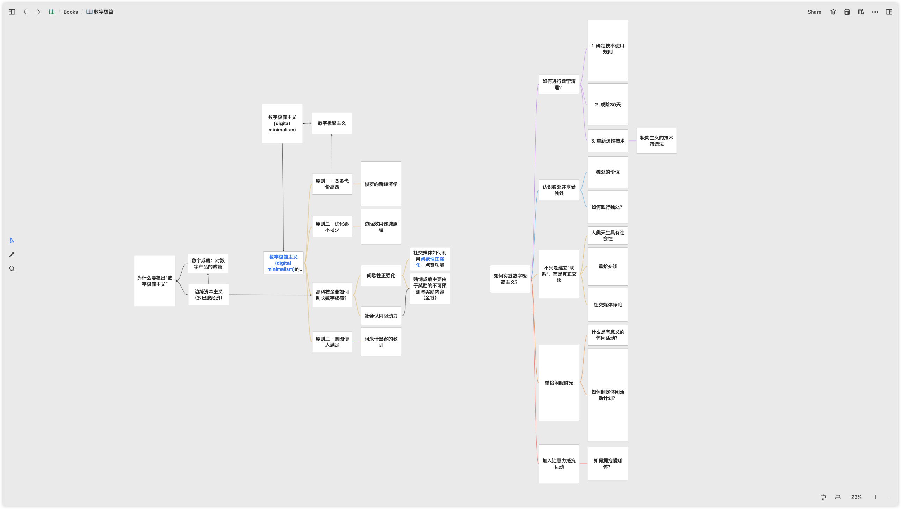
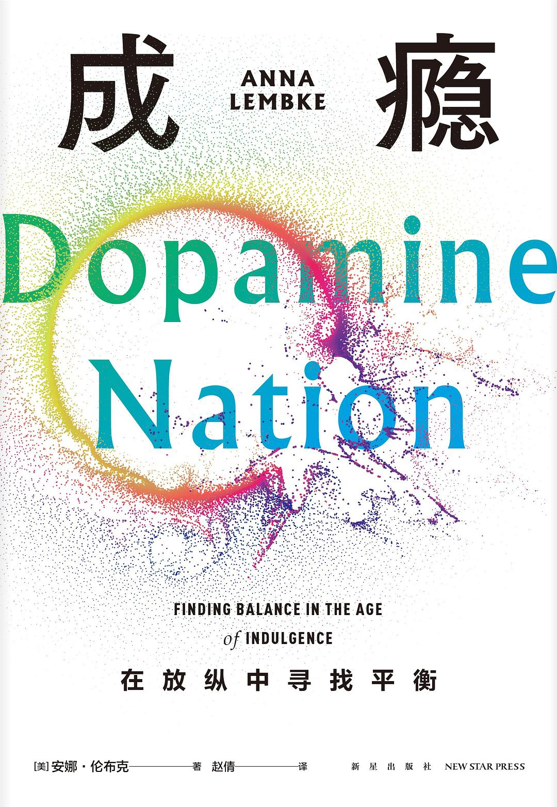
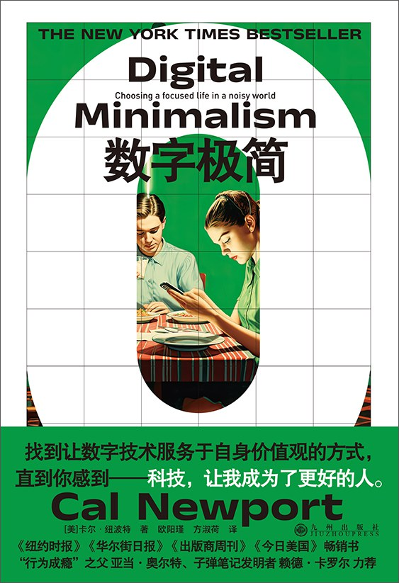

---
tags:
  - 第三周刊
  - 书评
  - 观点
  - 生活
publishDate: 2025-02-26
title: 读书｜你 Brain rot（脑腐）了吗？数字极简主义指南
description: 2024 年，“Brain rot”（脑腐）当选牛津年度热词，特指因沉迷低质网络内容导致的心智退化。
author: Joey Kai
draft: false
heroImage: { src: 'https://joey-md-asset.oss-cn-hangzhou.aliyuncs.com/img/202502262116684.png', inferSize: true}
---

**你的大脑被手机“腌入味”吗？**

2024 年，“Brain rot”（脑腐）当选牛津年度热词，特指因沉迷低质网络内容导致的心智退化。就相当于你的大脑像一罐泡菜，每天被短视频、点赞通知和算法推荐反复腌渍，最终变成一坨软塌塌的“数字咸菜”。

## 数字成瘾：我们如何沦为“多巴胺打工人”？

社交媒体像一台 24 小时营业的“数字老虎机”：你永远不知道下一次下拉刷新会刷出明星八卦还是萌宠视频。

在《成瘾》中，作者就提到神经科学领域发现：**大脑中处理快乐和痛苦的区域是相同的**，大脑会努力维持快乐与痛苦的平衡，每当快乐-痛苦的天平倾斜，大脑就会往另一边家加码，**竭力恢复平衡，神经科学家称之为“内稳态”。**

刷短视频就跟赌博一样，拥有不可预测的奖励机制，当我们得到了预期奖励，大脑会分泌更多巴胺，而没有得到预期奖励的失落也会更明显——这种快乐-失落的巨大落差能让人迅速成瘾。

### 边缘性资本主义的陷阱

科技巨头深谙“注意力经济学”，大家越多时间沉浸在“奶头乐”之中，科技公司越能够从你的注意力中赚到更多的钱。历史学家戴维·考特莱特 (David Courtwright) 提出了“边缘资本主义”，推动了成瘾事物的增加。革命性技术增加了成瘾物质的获取途径，也增加了这类物质的数量、种类和效力。

- 点赞按钮=现代巴甫洛夫实验（用户变成听到提示音就流口水的“数字犬”）；
- 自动播放功能=电子奶嘴（“再看一集”成为新时代的婴儿止哭神器）；
- 个性化推荐=思维茧房建筑师（你爱看极端情绪？算法立刻为你搭建愤怒小屋）。

### “脑腐”症状自测

☑️ 刷完 3 小时短视频后仿佛失忆

☑️ 独处 5 分钟就想摸手机（比摸猫还频繁）

☑️ 线下聊天时手指自动抽搐式“点赞空气”

中 2 条以上？恭喜加入“数字咸菜”预备队！

## 如何给大脑“脱腐”？数字极简主义

当梭罗在 1854 年写下“Brain rot”，他大概想不到后人会用手机验证他的预言。但大脑拥有惊人的神经可塑性，神经元之间的连接也可以重新建立，我们只需切断“多巴胺输液管”，把注意力从碎片信息中打捞出来。

### 那么数字极简主义是什么？

数字极简主义 (digital minimalism) 是一种技术使用理念，将线上时间用于少量经过谨慎挑选的、可以为你珍视的事物提供强大支持的网络活动上，**毫不留情地减少上网时间，将精力集中在少量更具价值的活动上，带来了巨大的积极变化**。

### 数字极简主义的核心三原则

**原则一：少即是多**

梭罗在《瓦尔登湖》早预言过脑腐，你为微博热搜付出的不是流量，是生命中的分钟。数字极简主义者信奉：卸载 10 个 APP 省下的时间，够你学会吉他版《晴天》。

**原则二：必要优化**

用社交媒体的正确姿势：

✓ 关通知→设使用时段→取关 99%的账号

✗ 别让自己活成“人形点赞机”

**原则三：带着意图使用**

对每项技术灵魂拷问：“这玩意真能让我更接近上帝吗？”（现代版：这 APP 能让我更接近理想自我吗？）

每次打开手机进行灵魂三问：

- 为什么打开手机？
- 为什么是现在要打开手机？
- 还有什么别的事情可以做吗？

## **30 天“脑复苏”训练营**

留出 30 天的时间，在此期间你将暂停使用那些可有可无的技术。数字清理过程的头一两个星期最难熬，但这些难受会慢慢消失，等到清理过程结束、你需要做决定的时候，这种脱瘾体验会发挥有益的作用。

### **STEP 1：数字戒毒所**

判断要在接下来的 30 天的清理期间，**暂时远离哪些可有可无的技术**。**不要混淆“方便”与“关键”**，碰到大部分时间都可有可无、只有很少关键用途的技术时，你应当借助操作规程如何以及何时使用这些技术的明确规定。

在这一步你会得到「禁用清单」和「技术的适当操作流程」

- 禁用清单：短视频、游戏、购物 APP（别心疼，它们更消耗你）
- 替代方案：把手机锁进微波炉（别通电！），用纸质书和拼图填补空虚

### **STEP 2：不只是建立“联系”，而是真正交谈**

社交媒体上的很多活动，比如点赞，更多的是在建立浅层次的联系，而不是建立深度的“交谈”，有作者写过“只有散步我们才真正聊天”，人类天生是社交动物，我们的社交需求也过于复杂，远不是社交媒体的语句和表情符号可以覆盖的，面对面交谈之中的表情、氛围、语气，都是交谈的信息所在。

在戒断社交媒体之后，我们寻找可替代的、能带来真正满足感的活动，比如：

- 每周约 1 位朋友面对面聊天（话题从“你今天吃啥”进阶到“你上次独立思考是啥时候”）
- 模仿 19 世纪贵族：每天写封信（收件人可以是明天的自己）

### **STEP 3：开发“反算法技能”**

不遵循算法带来的行动，找到独处的价值和意义，同时进行一些有意义的休闲活动，比如你可以：

- 手工课：烤焦的曲奇比滤镜美食更治愈
- 发呆竞赛：挑战盯着窗外云朵 10 分钟不摸手机（难度堪比马拉松）
- 音乐养成计划：3 个月成为“吉他新手”

### **STEP 4：慢媒体计划**

慢媒体会以很高的质量标准，从生产、形式和内容等方面来要求自己，以与那些快速生产但内容生命短暂的媒体形成区隔。

1. 将注意力分配给品质最好的新闻来源。
2. 少量高质量内容，胜过大量低质量内容。
3. 如果你对政治和文化评论感兴趣，那么同时阅读与你自身立场相左的优秀观点往往会提升你的认识。
4. 为消费慢媒体制定方式和时间。

## 给生活一场“文艺复兴”

从今天起，做个“数字园丁”：修剪 APP 枝蔓，播种深度思考，让大脑重新长出郁郁葱葱的灰质森林。毕竟，你的人生剧本，不该由算法编写。

本文写于 2025 年 2 月 16 日——作者正在实行 30 天数字断食，现正用打字机敲字并享受窗外的真实鸟鸣。
