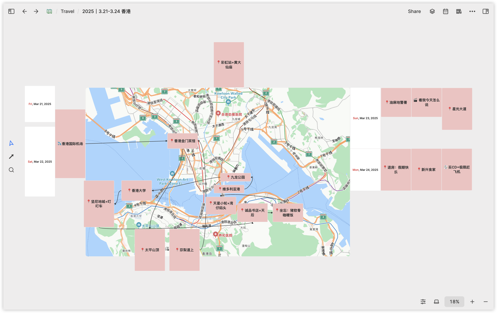
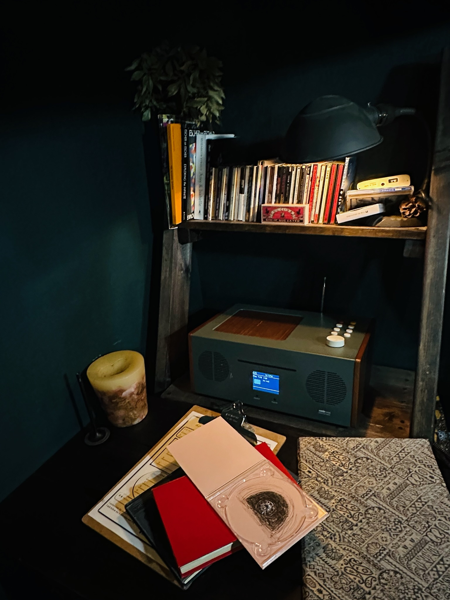
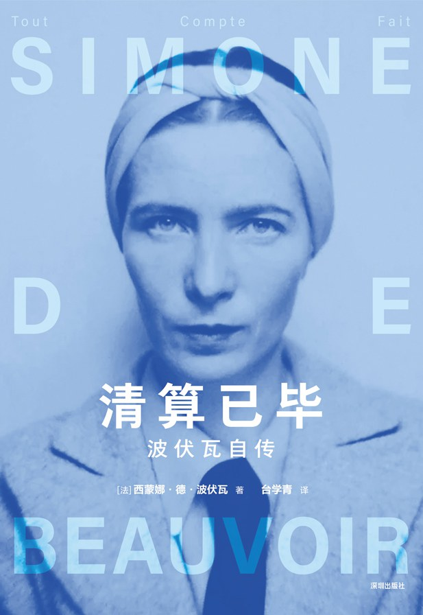
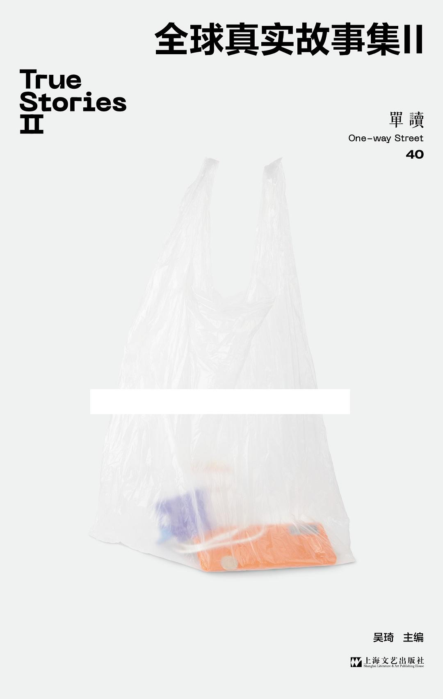
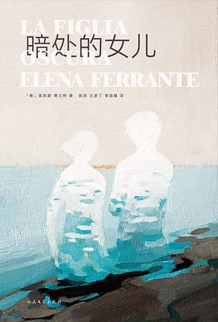
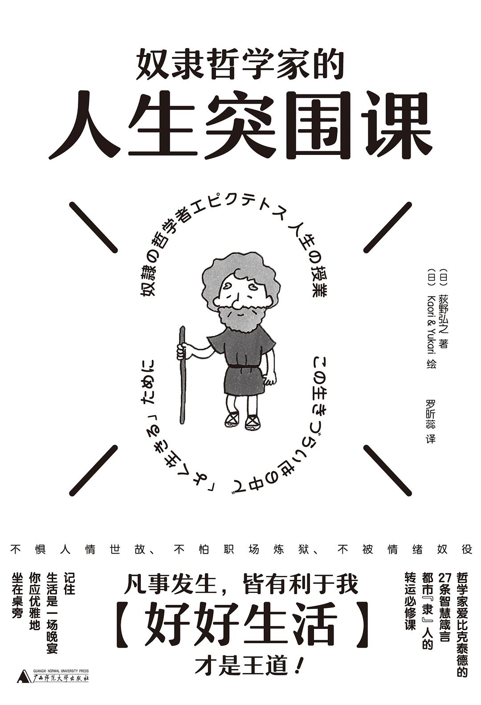
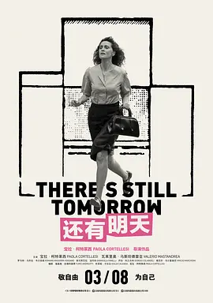
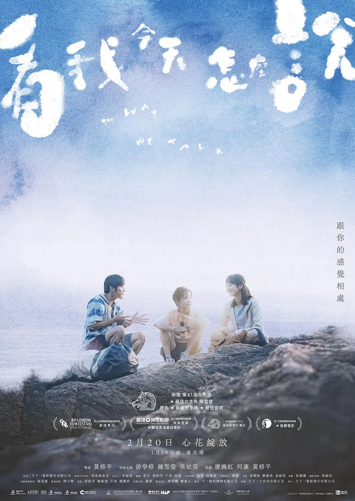
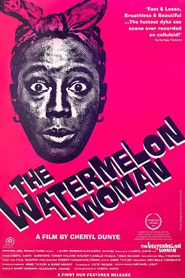

>  本文大约 `3200` 字，预计阅读 `11` 分钟。

好久没有写周刊了，我这个专栏的更新实在随意，没有更新周刊的日子都在干些什么呢？3 月底去了香港，对钟爱粤语歌的我来说，相当于是圣地巡游，到太平山顶走在《芬梨道上》，没去《喜帖街》但路过《弥敦道》，特地去了《九龙公园游泳池》，二百年后或许这里什么都不是，但至少我还拥有此时。还见到许久未见的老朋友，逛逛她的学校，聊聊最近的生活，很是快乐。吃到很好吃的菠萝包和猪软骨饭，以及写到现在还没写完的游记。

4 月 4 日开始的清明假期跟朋友们一起去了日本，又见识到更大的世界，很热情的房东爷爷提供了我们日本之行最丰盛的早餐，还有充满艺术氛围的京都民宿，在来自世界各地的留言本上写下汉字，是跨越时间和空间的相会。

我想我真是幸运，我的朋友们一直在我很低落的时候给我支持，而当我终于可以袒露一些痛苦的时刻，也得到很好的回应。最近也在经历的生活的变动，无论是精神上的还是真实生活中的，今天也是离职后的第一天！或许是开始新生活的契机，就简短地整理一下最近看的一些不错的书影～

## 读了什么？

### 清算已毕 by 波伏瓦

今天凌晨读完的这本，短短续续也读了半个月了。波伏瓦一直都是我很敬佩的女性之一，《清算已毕》是她在老年时对自己人生的回忆录。同样是老年女性对人生的回忆与记录，《清算已毕》与《暮色将近》十分不同，这也反映出二位女性在面对人生与社会的不同态度，展现了女人的不同面向。

与阿西尔相比，**波伏瓦是更主动介入社会的那种知识分子**，她更热衷于探索新鲜的知识与社会，她会积极为自己感兴趣的议题收集材料。她关注左派，她会真实深入工人的环境与组织中；她关注女性，她会实地去考察不同地区的女性生存情况；她关注年轻人，在“五月风暴”期间依然选择发声；她抗拒权威，于是在街头直接叫卖报纸直到被抓捕；她有很多在坚持的事物，**她勇敢走在自己的道路上，不矫饰、不自欺**，看完这本书我更加敬佩她。 

我想我的人生中开始有了自己的女性偶像。

### 全球真实故事集 2 by 单读

2 年前读过这个系列的第一本[[单读26：全球真实故事集]]，是来自世界各地非虚构写作的获奖作品，影响我很多，看到那些因为混乱和暴力非法移民的一家人，我切实感受到特朗普的政策是如何影响到更多人的生活的；常年无法下楼的老年人，让我看到老年生活的一角，还有更多真实在发生着的故事，也写过一篇书评[[书评｜我想我的生活需要一些真东西]]。

时隔两年，再次读到来自世界各地的故事的，**来自不一样的地方，诉说的是一样的伤痛**，关于失去、关于求生、关于记忆，都是关于人的故事。

失去自由、失去生命、失去历史，记录会被焚烧、记忆会被覆盖、生命会被漠视，所以我们还坚持什么？在监狱里睡在走廊上的人们、在养老院一个接一个死去的老人们、不堪忍受早年的性虐待或者生活而早早离开的父亲、每一代都面临流亡不被承认身份的罗兴尼亚老师，在面临生死，什么是重要的呢？

好像西西弗斯，一次又一次做着重复无意义的努力，这个世界有一点点改变吗？好像人们永远是这样，好像生活一直是这样。

我有时好像太执着问意义，但是生活是真实存在的，所以这是“全球真实故事集”，看到别人的真实生活，也会让人不停反照自身，这样的事情是真实发生的，这样的事情是不对的，生活不应该是那样的“真实”。

希望能从真实中得到一些反思，希望能从故事中认知到一些是非，希望从多样的非虚构中找到身为人的同情心，这是我学到的，或许依旧没意义，但也是属于我的真实感受。

### 暗处的女儿 by 埃莱娜·费兰特

母女关系是这个世界上最复杂的关系之一了，甚至我觉得也可以没有这个之一。最近看了一部国产剧《雁回时》出圈的讨论，也有关于母女关系。我们共享同一种命运，**女儿既是血脉的传递，也往往意味着命运的传递**——身为女性的命运，而母亲的现在，既有可能是女儿的未来，也可能是女儿要打破的过去。

在父权制的社会中，孩子的诞生常常也意味着母亲的自我被剥夺，这是我的血脉，我们曾在一个身体里共享同一份呼吸，但爱与自由，常有冲突，**如果成为“好母亲”就意味着全然的放弃自我，那么这份爱中一定有恨**。勒达毫无疑问是爱着她的两个女儿的，可是这份爱让她无法自由，于是她选择做了一个父亲做的事情，把孩子的养育责任甩手给另一个人，她独自生活，怀着对孩子的歉疚，但也怀着对家庭生活的解脱，通过 2 年的独自生活，她找到了一部分的自我，并重新发现自己对女儿们的爱。

人没有自我，何以谈爱，人没有自由，何以谈自我？她必须要先放弃，才能真正地回归。过程中我经常会想到法拉奇的《给一个未出生孩子的信》，她也担心因为孩子失去自由，但孩子与她在一个身体里，这份存在与感受又是如此真实，作为母亲也无法不爱她，矛盾又纠结的情感，这就是女人成为自我和成为母亲之间真实的矛盾。

### 奴隶哲学家的人生突围课

斯多葛哲学是早闻其名，但一直搁置了解的思想，这次刚好遇到契机，读这本书的时候正处在情绪很痛苦的时期，纠结于自己得不到的，可以说，这本书启发了我“如何面对失去”这个课题。 

斯多葛哲学的核心概念就是「区分」，**学会区分自己“掌控内的事物”和“掌控外的事物”**，面对自己掌控外的，包括她人的评价、看法、行动，不必要太过纠结，因为思索无用，你无法改变她人的想法，思考只是自困。**失去是一种“归还”**，可能本身就不属于你，而你短暂拥有过，已经是恩赐，当离开时，只是回到了既有的轨道，“命运敲定了要这么发生”，不要自苦、不要自困、不要自欺。

其实这种「区分」也有点像存在主义里描述的，自由的重负，所有的事情都可以区分为掌控内和掌控外的事情，在掌控内的部分，你拥有绝对的自由，所以必须要为自己的选择承担完全的责任，在享受这种选择的同时，也会成为一种重担，但同样也意味着，你永远有选择的空间。

## 看了什么？

3 月的好电影太多，都有点难以抉择。

### 初步举证

开场时的意气风发，结尾时的哽咽愤怒，我看到男权个人与系统性暴力如何在782天里让一个女人反复质疑自己、消耗自己。在几小时内到女儿身边陪伴的妈妈，在上庭前拍拍肩膀安慰的女警官，还有无数在剧幕结束后鼓掌的我们，我也看到女人之间的共鸣与支持。 “看看你左边，再看看你右边”，“有些事情必须被改变”，纵然失败，庆幸自己起码战斗过。

此片上映之后，也引起了司法系统的一些改变，**改变真的正在发生**。

### 还有明天

我很难用简单的几句话描述出观看这部电影的感受与情绪，网络上很多讨论有关于对迪莉亚经历的暴力的表达，以探戈的形式被展现是不是浪漫化了暴力行为，我个人的感受是，这种表现形式更多是减少对女性经受暴力的观赏性，我一直很讨厌很多电影中会把镜头聚焦于经历伤害的受害者，镜头应该更多给到加害者，看看他的嘴脸是如何狰狞。

有关于那个时代的系统性暴力也无需多言，看看我们是如何走到今天的，看看女人的韧性能有多强。迪莉娅在选举站上抿起嘴无声对女儿唱歌，闭着嘴直视家暴的丈夫，微笑跟女儿对视，这是女人之间的默契与理解。这是很好很好的一部片子，**不忘来时路，才不会反复走回头路，才会更珍惜当下的权力，才能尽量争取往前一步**。

### 看我今天怎么说

去香港的时候觉得，要做一些在内地做不了的事情，于是去电影院看了一部，内地没有上映的片子——《看我今天怎么说》，这也是我第一部在HK看的电影，开场没有龙标还有点不习惯呢。

电影中的三个主角都是听障人士，有人选择植入人工耳蜗融入主流社会，有人选择就使用手语表达，但什么是表达呢？**文字是表达、语言是表达，动作也是表达**，又为什么一定要强求对方使用语言才能表达呢？  就像我们当时在日本跟房东爷爷沟通，完全是语言不通的情况，依靠着翻译、文字、动作也完成了自己故事的讲述，也完成了一场交流与表达。

整体来说，很喜欢电影拍摄状态，喜欢这种更“非主流”群体的生活展现，最感动的瞬间是洗完车后离开时用手语说谢谢的孩子们，素恩说，用手语才感觉自己真正在表达，**接受并承认自己的处境，没必要按照“正常人”的模板生活，这才是自由**。

### 寻找西瓜女

这是一部被推荐的电影，用伪纪录片的方式寻找一个电影中的演员，试图从案牍、影视、采访中还原出这个黑人女演员——西瓜女的生活，希望看到她是如何在好莱坞闯荡的。故事的最后揭露了这个故事的真相，具体的我就不能剧透了，但总而言之，来来去去的都是生活，你必须要发现你自己的故事。

## End

以上，就是最近比较中意的书影啦，接下来可能会有更多属于自己的时间，希望自己能够一点点消灭囤了很久的书籍和影视！

下次再见，各位愉快～👋