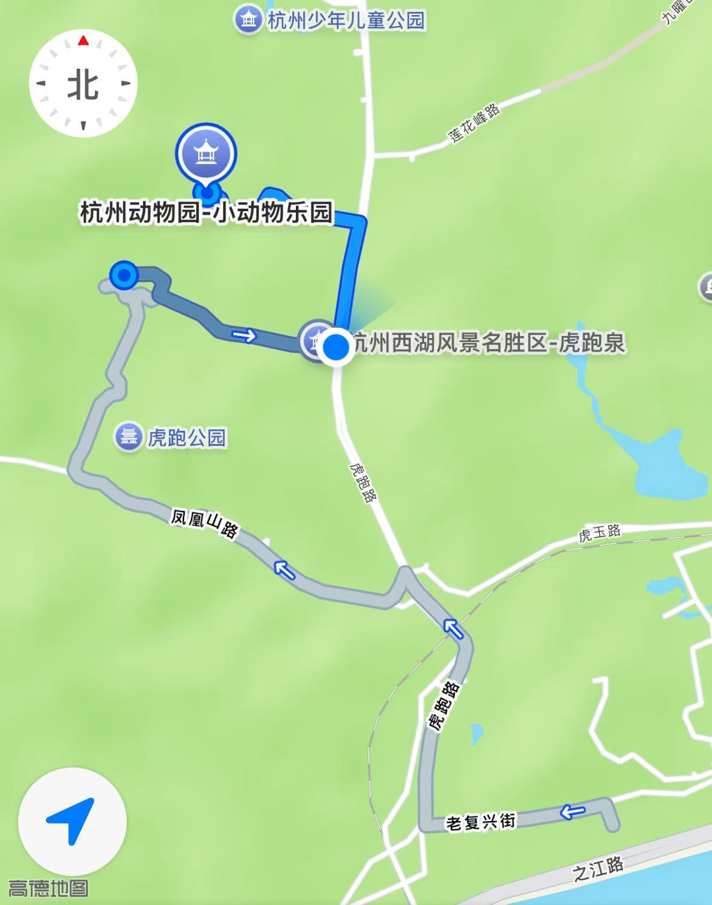
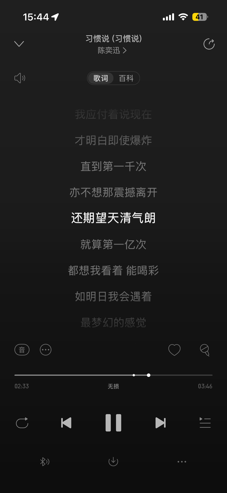
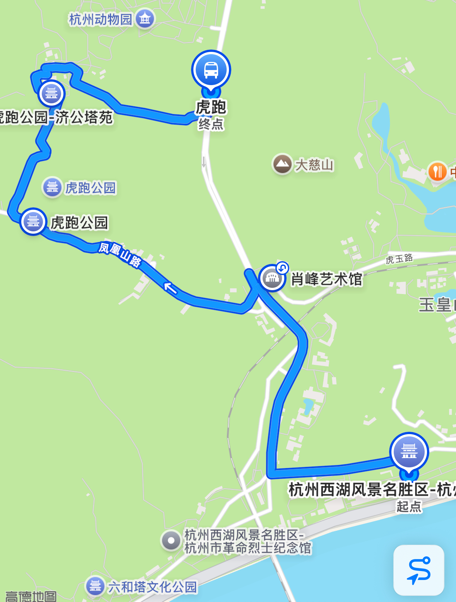

> [!note]
>
> 本文大约 `1200` 字，预计阅读 `4` 分钟。

记一次随意的徒步，不是那种特别常见的徒步路线。这个路线大部分是在马路的侧边，只是我兴之所至，自己规划的一条路线。可能是因为不是周末的关系，路上的人很少，然后大部分都是平路，没有什么需要爬坡的路段。  

出发的时候背上我的小书包和相机，心情兴奋得像个即将春游的小学生，计划从白塔公园出发，到杭州动物园看完小熊猫回家。

公交车到白塔公园，在路上看《简单的激情》，途中还路过了钱塘江。

### 白塔公园
工作日人很少，基本就我一个人，上午天气有点多云，等到我到白塔公园，已经艳阳高照了。

从白塔公园进去，按照大概的方向随便走，偶遇到很以前的老铁路，还有蒸汽的绿皮火车，

还路过一家火车餐厅，有很土的蓝路牌。Hahahaha～

从白塔公园出来后，就基本是马路边的人行道了，杭州的景区，路边的绿化都做得很好，也随处可见绿植。路上虽然有车，但整体感觉也还好，感觉是更适合骑行的一条路线。

### 肖峰艺术馆
行至中途，偶然瞥见一个艺术馆，刚好有展览，兴之所至就直接走进去，很多人在此处拍照，看上去像是一个网红拍照点。

### 虎跑公园
走出来之后往虎跑公园走，进山后路人更少，这条路上基本就我一个人。

雨后初晴。  
山上的水沿着水渠一直流到公路上，形成鱼鳞状的波纹。  
看起来很漂亮！  
但不幸的是，我不得不踩过这些水纹，导致我的鞋子湿了。

再往山上走，常有小亭子，里面总有三五个人一起坐着。  
有人在对弈，感觉很像诗句中的场景，局中人棋局过后，世上是否过千年。  
另一个亭子种，有几个女人在嗑瓜子聊天，没敢拍她们的照片。

最后走到了一个写着「天朗气清」的亭子，刚好耳机里也播放到了“天清气朗”，很奇妙的缘分。

### 济公塔院

上山来到济公塔院，既然路过，就进去拜了拜，想到我小时候还看过济公的电视剧来着。

### 下山咯
走过济公庙和弘一法师塔，就开始下山了，下山的路上人就开始变多了，看起来是我走了一条相反的路线，所以才会越走人越多。

山上的排水系统也很神奇，好像在石头上凿了洞，很像是眼睛 👀。

在路上的池水中看到很多锦鲤，希望会有好运气。

### End

下山后，就大约 17:00了，来不及去看小熊猫了，等下次再去看吧～最终路线就是这样，路上的爬坡很少，基本都是平地，走了 2 小时，大概 6 公里，感觉很适合想随便走走的朋友们。

