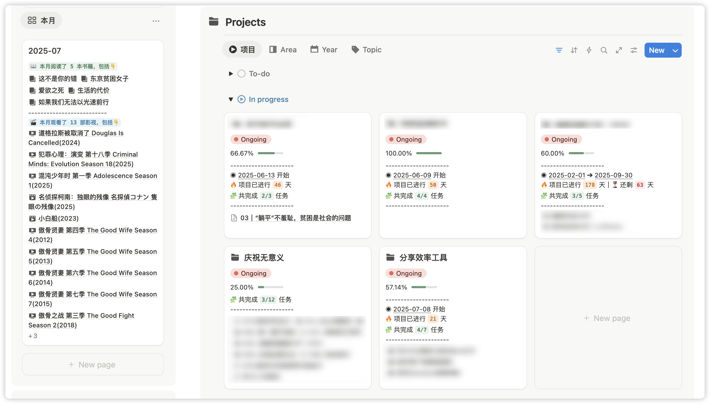
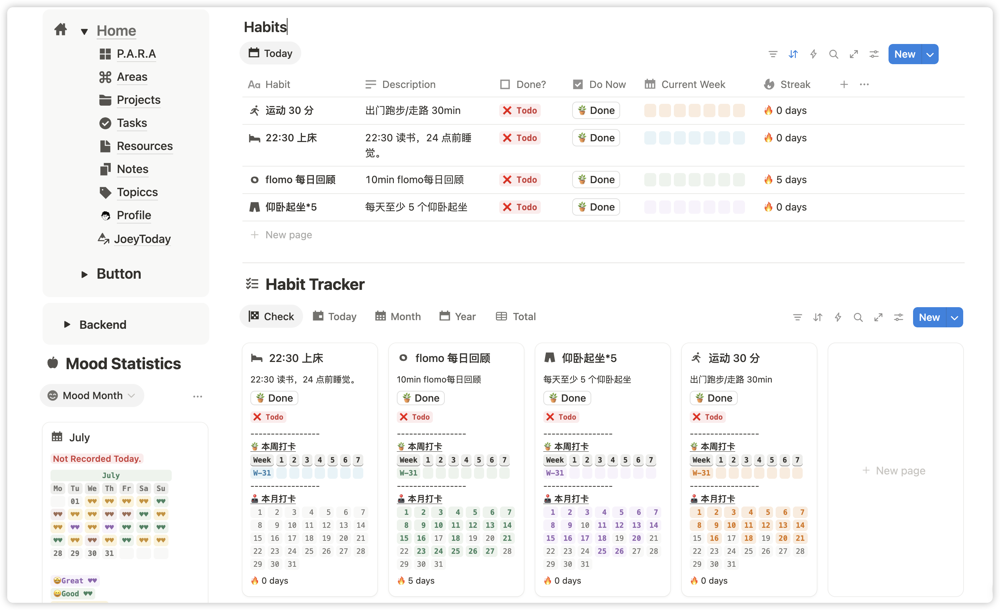
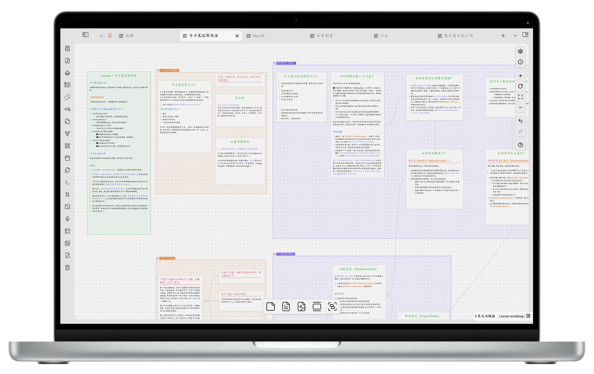
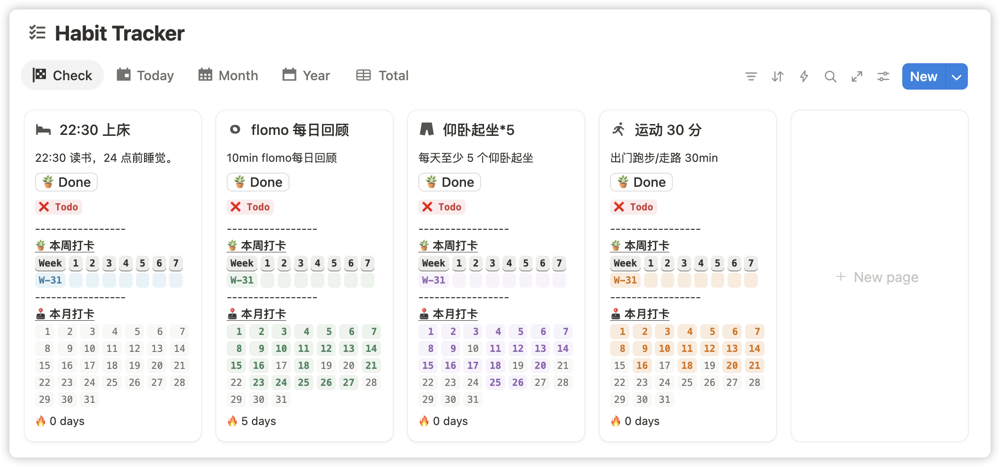
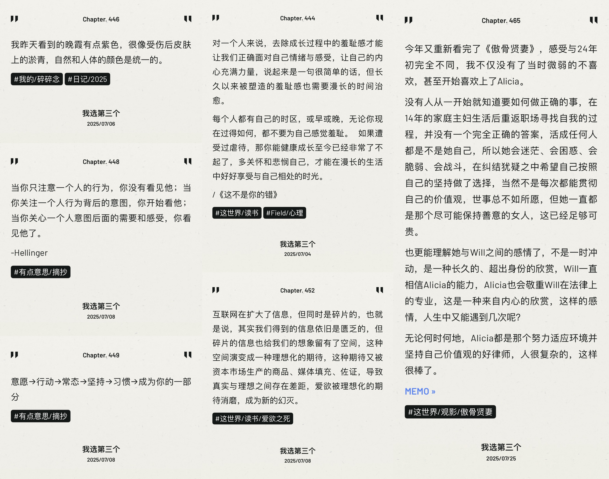
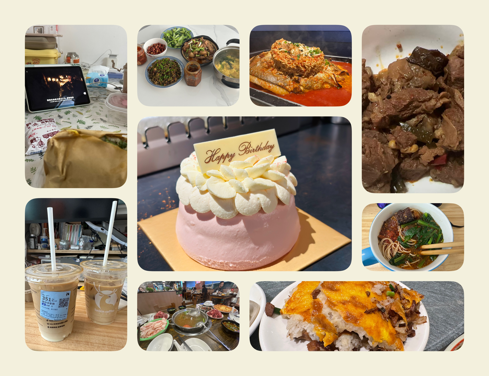

又有一个月没更新了，最近的一个月感觉过得很长又很短，很长在于月初做的事情现在回忆都有点记不清楚了，很短在于似乎也没有做了很多事情，但已经是月底了。

感觉本月做的事情主要是关于自己，鼓捣了很多看似美丽但实则可能没有用的东西。

1. 重新设计了自己的 Notion 主页，从项目到笔记都按照 PARA 优化了一遍。

2. 给自己添加了习惯打卡和心情打卡。

3. 在小红书上线了图书管理和习惯管理的模板，目前已经卖出去了一单，小小得意一下😎。

4. 7 月中的时候坚持了跑步 30 天，对我来说是个很不错的里程碑。最近 2 周因为其他事情挤占了固定跑步时间，有所懈怠。

5. 7 月下旬梳理了自己的订阅软件，白板笔记软件从 Heptabase 转移到 Obsidian（免费），白板读书笔记笔记真的很棒。

6. 开始使用 Obsidian 写日记。

7. 最近开始考虑使用 Obsidian 搭建博客（还在鼓捣中）。

看起来似乎都是很不起眼的小事情，但都让我感觉快乐。

使用了新的 Notion 页面，让我的生活打卡和项目都有有一个记录，也让我能够坚持某个微小习惯，看着日历一点点亮起来就是一个小小鼓励。在此基础上，让人不开心的就是体重到了平台期，卡住了快一个月，但我从决定减重开始，就已经做好了这是一次调整生活习惯过程，可能相比较习惯的调整，体重反而是一个附带的结果了（我这样自我安慰）。

记录自己的心情以及日记让我能够观察自己的情绪，发现自己在什么时候会很开心，什么时候会不开心，当感受和情绪袭来的时候都能够好好感受它们，出门跑步看到了很多傍晚不一样的云，跟朋友吃饭偶遇到了很美丽的彩虹，**发现天空与生活的颜色有着不一样的共鸣**，走路回家的路上发现很多风格不一样但十分好听的歌曲。

也开始重温之前看过的剧集，发现新的影视与书籍，之前一直提不起精力看的书和影视，现在有了更充沛的时间和想法，我有很多关于生活的碎碎念，一点点写在日记里，偶尔回顾到，会想，原来真的经历了这么多。发现兜兜最近很爱被拍 pp，很可爱～

跟我的朋友们一起度过了很好的时间、吃了很多很好吃的饭，会被抽出时间来我家找我（or 我的猫）的朋友们感动，也会在突然想念朋友的时候立刻出发，我有很多突然涌现的情绪，但我学会感受而不是评判，**不要对自己感觉羞耻，也要好好看到自己**，这是我这个月学到最重要的一课。于是我真的有了很多很复杂的情绪，可能现在比几个月之前来说，更不像人机了吧，在反思，也在成长，我进步飞速，一日千里（哈哈哈）。

上网冲浪看到一篇帖子说，现在社会上很多人都是“半成品”，在看到的当下被点中，可能**大家都是在寻找完整自己的过程中，而在这段被称之为 gap 的时间里，我过得很快乐，那我想，就是值得的**。

以上就是今天的碎碎念啦，希望大家也都快乐，勿负今日。