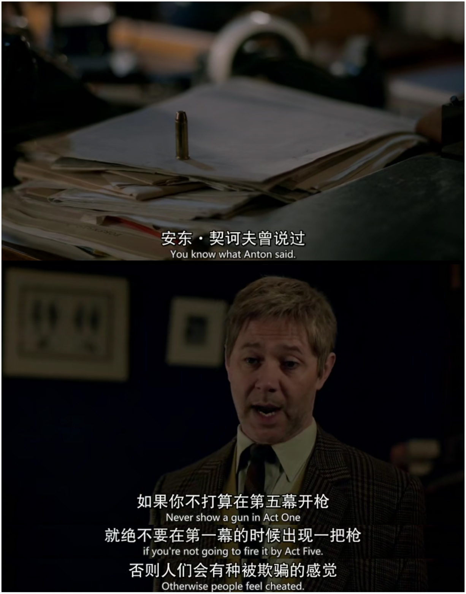
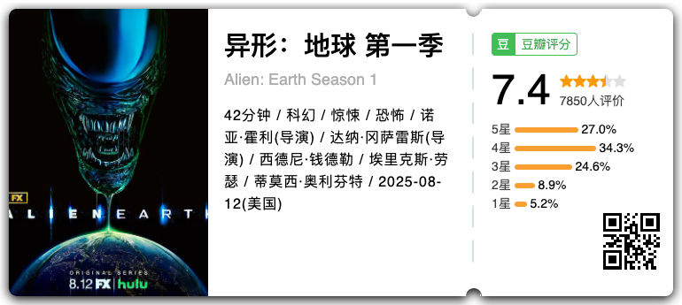
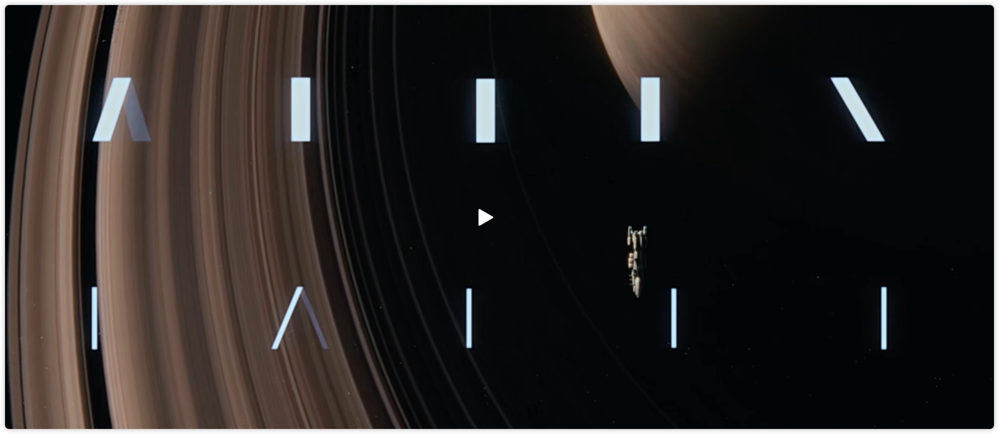
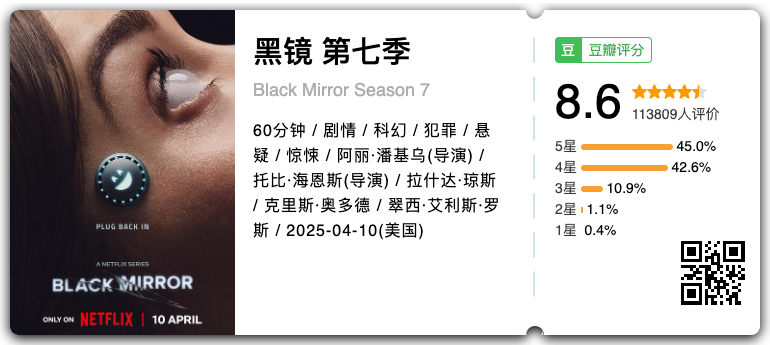
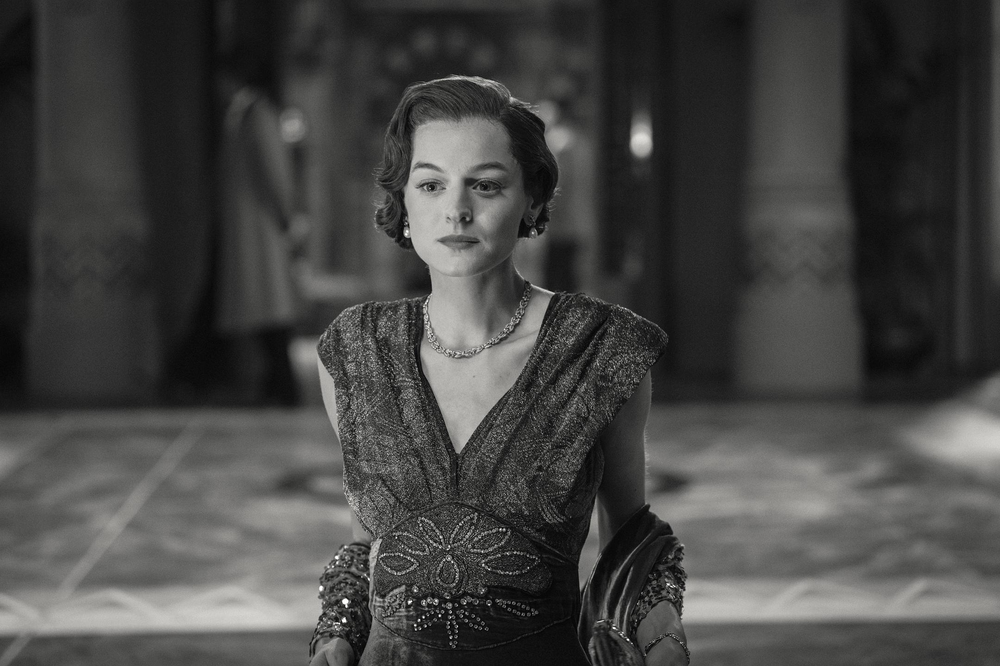
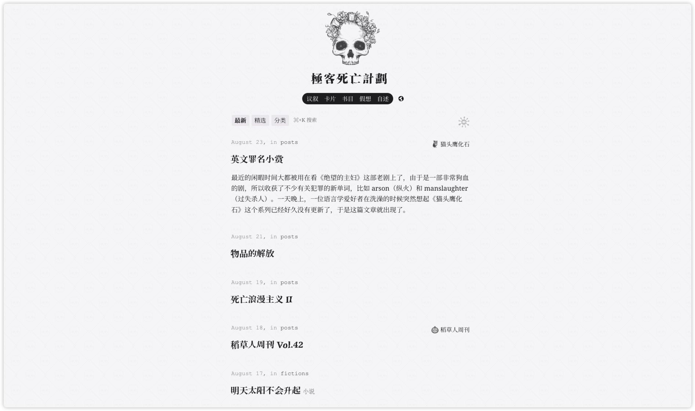
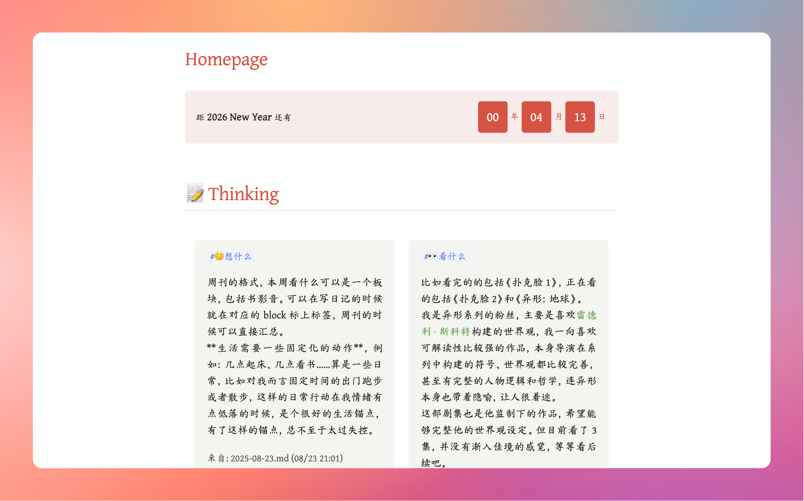
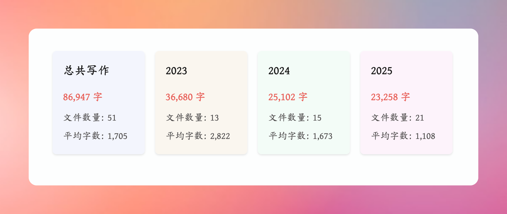

> 本文大约 `1800` 字，预计阅读 `6` 分钟。
> 🤖 本文声明无任何 AI 辅助创作。

回顾了一下之前的周刊，内容都有些不稳定，有书评、书单，也有影评和生活这样的内容，成分比较复杂，输出也都不是很稳定，所以在思考周刊的内容和格式是不是可以相对稳定一些，让周刊真的成为周刊。

**生活需要一些固定化的动作**，例如：几点起床、几点看书……算是一些日常，比如对我而言固定时间的出门跑步或者散步，这样的日常行动在我情绪有点低落的时候，是个很好的生活锚点，有了这样的锚点，总不至于太过失控。 

我希望周刊的写作可以于我而言是一个每周的固定的动作，锚定一些我每周的行动。所以我计划在周刊中的板块分为以下几个部分：
- **🤔想什么**：我本周想到的事情，包括想法、观点、思考。
- **👀看什么**：我本周看的东西，包括书籍、电影、剧集等，我会选一些比较有感触的内容。
- **🕹️好东西**：我本周发现的好文章、好产品、好网站等等，一系列我觉得好玩的东西。
- **🥕折腾记**：我本周折腾的东西，可能涉及到我的软件装修、我最近研究的东西等等。

以上内容并不一定全部出现，主要看我本周都干了些什么，好了，接下来看正餐吧，我本周的随机组合周刊。

## 🤔 想什么

在跑步的时候突然想到《9 号秘事》中的一句台词“**如果你不打算在第五幕开枪，就绝不要在第一幕的时候出现一把枪**”，联想到我在跟朋友一起看《扑克脸》第一季第一集的时候跟朋友说，这是一个剧本非常扎实的剧，最主要的原因就在于每一个镜头都有它的意义，前一幕闪过的镜头是下一步剧情的埋点。

前两天回顾自己的笔记也看到一篇关于写作的内容，写作的艺术性与残酷性就在于你要不停地删掉内容中的废笔，比如“我想”、“他认为”，而是描述，不要使用“喜欢”、“厌恶”，而是要说：

> 比起说：“亚当知道格温喜欢他。”
> 你必须要说：“在课间，他去打开他的储物柜时，格温总是倚在它上面。她会翻翻眼睛，用一只脚把自己推开，在被漆过的金属上留下一道黑色的鞋跟印，但她也留下了她的香水味。组合锁上还有她臀部的温度。下一个课间，格温又会倚在那儿。”

> 别告诉你的读者“丽莎恨汤姆。”
> 作为代替，像法庭的律师一样据理力争，用细节说话，展示出每一件证据。
> 比如说：
> “点名时，在老师叫到汤姆的名字之后的一喘气之间，在他应答之前的那个瞬间，就在那时，丽萨会小声说出‘讨厌鬼’。就在汤姆说‘到’的时候。”

写作总是这样的过程，你的文字中最好不要有无关的描述，**你要一直记得，你为何写这段文字**，为了表达感情、或者为了下一步的表达，所以很困难，反复推敲自己的语言，十分耗费心力。

所以一直非常敬佩一些语言精妙的作者，从这个角度上来说，写一些教程类的文章反而更简单，只需要把每一个步骤写清楚就好。**写作跟策划一场“完美”谋杀案一样精妙，阿加莎简直是双重大师**！

## 👀 看什么

### 异形：地球

我是异形系列的粉丝，很喜欢[[雷德利·斯科特]]构建的一个很神奇的世界，「反乌托邦」类的作品对我而言有种魔力。**科技高度发达，人类能够探索各个宇宙，但是还是很难明白每个人的内心，甚至是「生化人」的内心**，看异形系列最大的感受就是：**神造人、人造人，人成为人造人的神，然后人造人想成为新神，造出异形**，总而言之是这样的一个逻辑，其实核心在我看来有关于「弑父」，或者说对「父权」符号的一种解构。

《异形 1》诞生于 1979 年，好早的年份了，系列连续的几部都由大导操刀，整体都是以女性角色为主，在那个年代算是很不爹的作品了，一种带着克苏鲁气质的科幻神话宗教片，元素被融合地很好。

我也很喜欢异形系列的字体设计。刚开始都是一根线，然后慢慢变出完整的名称。

我一向喜欢可解读性比较强的作品，导演在系列中构建的符号、世界观都比较完善，甚至有完整的人物逻辑和哲学，连异形本身也带着隐喻，让人很着迷。

这部剧集也是他监制下的作品，希望能够完整他的世界观设定。但目前看了 3 集，并没有渐入佳境的感觉，很担心会烂尾，所以等等看后续吧。

### 黑镜第七季

这一季的故事整体都蛮喜欢的，大部分的反转都很有意思，最喜欢第一集和第三集，无限订阅真的是，太写实了，免费的总是有额外的代价。

> 私心放一张剧照，此时适合点播一首《梦中人》。

《梦幻酒店》真的很梦幻，只是布兰迪女主演技有限，没能很好展现出情感的拉扯感，一种必然悲剧的义无反顾，多萝西穿过电影布景的那段，真实的往事如梦一般袭来，她一直停留在女制作人身上的目光，在那个年代不敢宣之于口的爱恋，**在时间停顿的那几个月，她认真享受了当下的人生，这怎么不是于她而言的梦幻酒店呢**？ 直至她以更惨烈的方式收场，这是多萝西，这是她为自己做的选择，I love you forevermore。

## 🕹️ 好东西

本周发现的一个很有意思的博客——[极客死亡计划](https://www.geedea.pro/)，博客内容包括作者的思考和周刊，还有作者的小说，作者的思考和阅读都很有意思，所以分享给大家：

## 🥕 折腾记

主要是在折腾我的 Obsidian 页面，包括但不限于以下内容。

> 注：以下内容都使用了 `dataviewjs` 代码，如有需要，可以关注公众号「偶然时刻」后私信关键词获取代码：「标签卡片」「字数统计」。

### 给 Obsidian 增加了标签卡片视图

### 增加 Obsidian 文件字数统计

## End

没想到吧，本周什么都有！阅读愉快～
