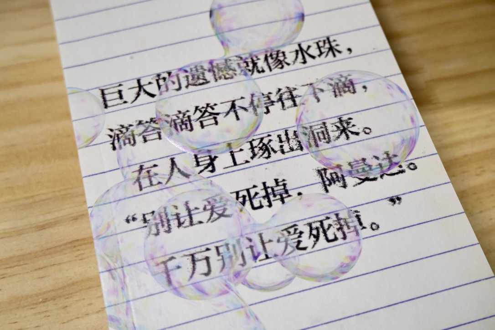
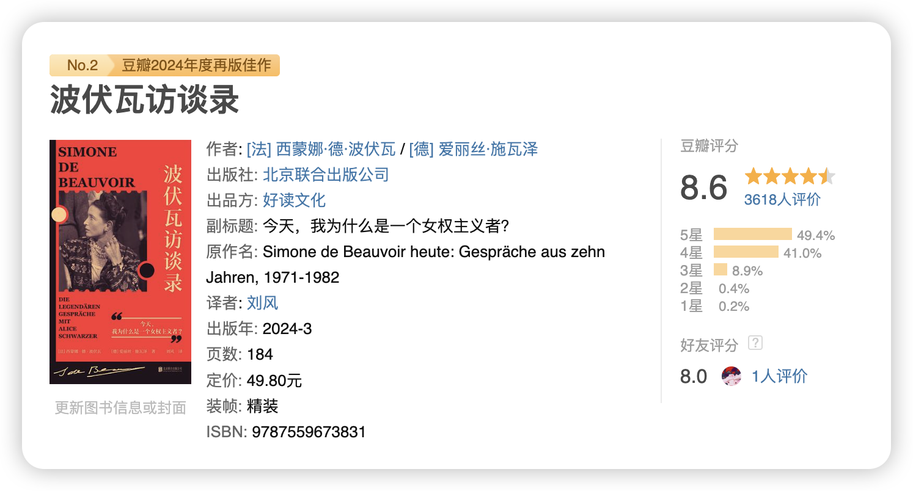
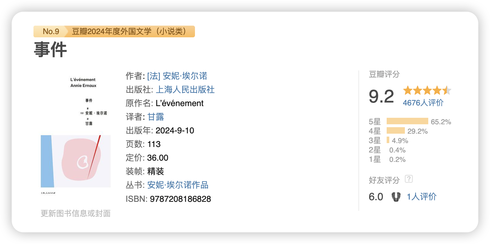
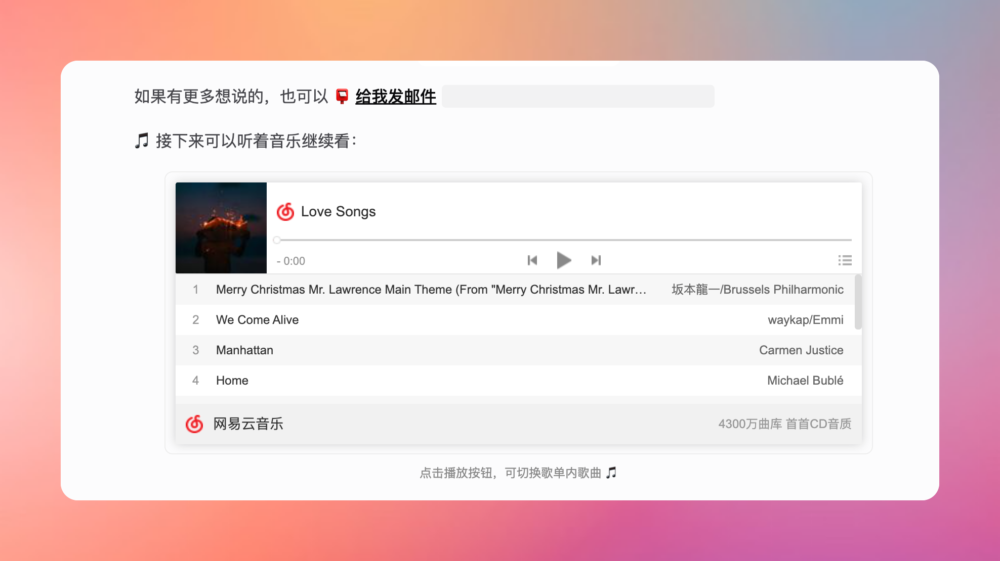
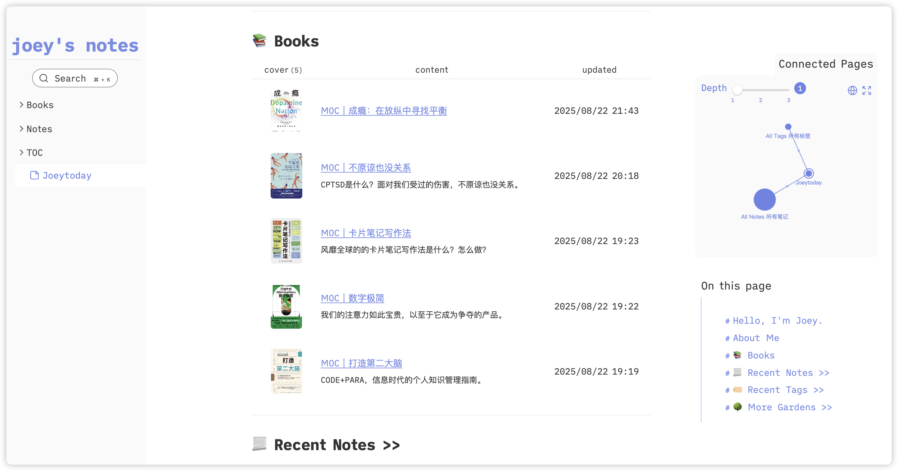

最近脑子里在播放吴青峰的《逃亡》这首歌，有点喜欢～

## 🤔 想什么

### 出名趁早？还是大器晚成？

很早就听说过张爱玲的一句名言“出名要趁早”，就好比一些明星，一系列事情下来你发现人家不过 25，成名早的好处肉眼可见，明显**有更多的时间可以经历更多的事情**，看着是可以拥有更丰富的人生，可是“伤仲永”的故事我们也听过，年少成名而后迅速黯淡的例子也是数不胜数，只是这些故事往往都被时间掩埋了。

大众可能并没有那么喜欢一步一个脚印的故事，起伏跌宕的剧情更戏剧化，也更让人好奇。各大杂志也更喜欢推出「30 位 30 岁以下 xx 人物的榜单」，仿佛人过了三十就要从聚光灯下消失，这样的氛围有时候也会让我偶尔焦虑自己的年龄。

最近看了一篇文章，刚好是在说“大器晚成”，**对于许多人而言，晚年才绽放的才华往往比早期更具有深远的影响**。

2019 年，丹麦的研究人员进行的一项研究显示，**诺贝尔奖得主平均在 44 岁时做出了他们的关键性发现**。这表明，即便是天才，也至少需要二十年的时间来精通自己的领域。

> 在美国，申请专利的平均年龄是 47 岁。**45 岁的人，其创新能力是 25 岁年轻人的两倍**[^1]。一项刊登在《美国经济评论》（The American Economic Review）的研究发现[^2]，**企业家的平均年龄是 45 岁**，而且，创业成功的几率在 25 岁到 35 岁之间显著上升，并且这种上升趋势一直延续到 50 多岁。
> 
>  **50 岁的科技创业者，其创办成功企业的可能性是 30 岁创业者的两倍**[^3]。西北大学、麻省理工学院和美国人口普查局的研究人员进行的研究发现，**增长最快的初创企业是由那些在公司成立时平均年龄为 45 岁的人创办的**。信息技术与创新基金会的研究表明，创新的黄金时期是在 40 多岁后期。

也就是说，相比较年少成名的人们来说，大器晚成的人们更有能力守住他们的成果，这篇文章也直接总结了那些**大器晚成的人们所具有的特质**：
- 内在驱动力
- 敢于对抗权威
- 发散性好奇心
- 卓越的自学能力
- 真正下定决心的能力
- 探路者的心态
- 脾气暴躁：由于较长时间的怀才不遇。
- 智慧：一种能够从多个角度观察事物的能力，一种能够综合不同视角，并在它们之间的张力中找到平衡点的能力。

总而言之，最重要的是**不要虚度当下的时光，有点耐心，不要焦虑**。

在大学的时候读过一首诗，当时很大缓解了我的焦虑，也把这首诗送给当下有点着急的朋友们，Life is a run：

 
	
走在自己的时区
 
	

### 后发优势 & 后发劣势

在想大器晚成的时候，想到另一个相关概念，叫“后发劣势”，来源于华人经济学家杨小凯提出的概念，跟“大器晚成”不同的是，“后发劣势”更多针对于一个经济体而言的。
对于经济体来说，很多人会聊“先发优势”或者“后发优势”。
- **先发优势**是说抢先的时机、技术能够帮助经济体（公司、机构、国家）抢先占领市场，以达成发展上的领先。
- **后发优势**是说后发展的经济体能够利用先发经济体的技术、基建，以达到更小成本、更快速达成发展目标。

在相对迷信“后发优势”的地方很少有人讨论“后发劣势”。
- 后发劣势[^4]是指**虽然新经济体能够借用先发经济体的技术和基建，但本身并没有培养出创新的机制**，身处其中的人们也缺乏与新状态磨合的时间，所以在发展一段时间后就会展现出疲态，无法再保持增长。

这两个概念看似不太相关，但在我看来表达的基本是同一个意思，**在发展的时候要打好地基**，对个人来说是能力，对更大企业或经济体来说，是管理组织形式，否则最终凭运气拿到的，最终也会凭实力丢掉的。

### 关于失去

好几个月以来我也有一些感觉被困住的时刻，在于一些“本可以”，我总是会想，如果我做得更好一些，如果我能够了解更多一点，如果我能更多尝试理解一些，事情是不是“本可以”不是如今这样。我总是会遗憾，我是不是可以做得更好的。

但想了很久，其实内心也知道，很多事情并不是真的努力就会有用，世界上还存在很多，只能存在遗憾的事情，一些我就是无能为力的事情，我只能在更多的时间里，慢慢想明白、也慢慢接受这些失去和遗憾。在思考这些的时候，想到之前看过的一句话：

> 上帝，请赐予我平静，去接受我无法改变的。
>
> 给予我勇气，去改变我能改变的。
>
> 赐我智慧，分辨这两者的区别。
>
> /美国神学家尼布尔（1934）

在看《外面是夏天》的时候，失去孩子的父母在孩子离开后的冬天突然发现孩子未写完的名字，金荣（宇），**未完成的字，未完成的人生，未完成的时间在失去的空荡中走完春天、走完夏天、走完秋天、走到冬天，只变成贴墙纸时无法关上的窗，在房间内吹出阵阵冷风**。

也很难忘记最后一个故事中失去丈夫的女人，没能说出口的“为什么”变成自我纠缠的“玫瑰糠疹”，一层层掉落的皮屑是心里一阵阵的潮湿，会好吗？会好的吧。会康复的吧。可是也还是会复发的。因为救人而死的丈夫，最终也没能救下谁，这有意义吗？可能唯一的意义只是一起面对死亡时不那么冰冷的手，最后妻子想：

> 一个生命用惊讶的双眼注视着另一个生命。那个瞬间，丈夫能做什么呢……也许在那天，那个时刻，在那个地方，**不是“生命”闯入死亡，而是“生命”闯入“生命”**。

是的，是生命闯入了另一个生命，以死亡的方式。
你的夏天还好吗？希望想念能够让失去看起来没有那么残忍。

> 我试图忍住，然而豆粒大的泪珠还是“啪嗒啪嗒”落上了信纸，落上了被表皮遮挡、脱落，再长出来的斑点，在看不出消失迹象的污迹上面弥漫开去。我想你。

记录下以上内容的两天后，我想到之前偶遇的一本小说封面：别让爱死掉。

## 👀 看什么

由于上半个月都没怎么看书，本周就在狂看书，上面也提到了我看完了《外面是夏天》，来自韩国作家金爱烂，本周看完的书还包括《波伏瓦访谈录》，正在看安妮·埃尔诺的《事件》。

### 📖 波伏瓦访谈录

波伏瓦是个好有前瞻性的女人，她的访谈中不仅包括了她对女权运动的看法和实践，也包括对自己生活中关系的想法和感受，甚至也坦诚了自己面对老年和性的看法，是一本很值得阅读的小册子。以下是一些书摘，有些甚至回答了现在大家还在争论的问题。

> *施瓦泽*：那么关于妇女解放，在个体和集体层面，您觉得有哪些具体的可能性？
>
> *波伏瓦*：首先，**女性一定要外出工作。其次，可能的话，不要结婚**。

> 波伏瓦：我可以断定，**阶级斗争实质上并不解放妇女**。这个结论使我改变了自《第二性》出版后所抱持的一些观点。在那些强调阶级斗争的派别中，女性永远处于附属地位，服从于男性。因此，我坚信，**在妇女问题上，女性必须自己寻求解决之道，把命运掌握在自己手中**。

> 在创造普世价值的过程中，男人往往在其中注入自身的男性气质。他们以一种狡猾而微妙的方式，将普世性和男性气质混合在一起。因此，关键是对二者加以区分，剔除混淆的部分。这是可能的，也是女性面临的任务之一。

### 📖 事件

安妮·埃尔诺的《事件》，她尽可能坦诚分享了自己年轻时秘密堕胎的经历，在那个堕胎还是违法的年代，怀孕带来的恐惧让我想到了《异形》，是一种对被寄生的恐惧、是一种身体渐渐不被自己掌控的恐惧。

在社会对怀孕堕胎噤声的时候，波伏瓦也在积极推动堕胎合法化，分享自己年轻时的堕胎经历，另一个地方的写作者，安妮也在把自己的经历写成记录，写身为女性的真实感受，为推动女性的身体自由作出自己的努力。

> 我所写的书都是这种愿望的结果——把个体和私密的东西转化为一种可知可感的实体，可以让他人理解。这些书以不同的形式潜入身体、爱的激情、社会的羞耻、疾病、亲人的死亡这些共同经验中。与此同时，它们寻求改变社会和文化上的等级差异，质疑男性目光对世界的统治。通过这种方式，它们有助于实现我自己对文学的期许：带来更多的认知和更多的自由。

## 🪨 她山石

这个部分包括我的一些摘录。

> 琐碎而无聊的日子一天天积累下来成为四季，四季积累下来就是人生。插在浴室玻璃杯里的三支牙刷和挂在干燥台上尺寸不一的袜子，小巧的儿童马桶盖，看到这些东西，我明白如此平凡的事物和风景恰恰就是奇迹和事件。
>
> /《外面是夏天》

## 🕹️ 好东西

### 黄蜀芹的「东窗理论」

黄蜀芹导演在《女性电影——一个独特的视角》中曾如此评论：“如果把南窗比作千年社会价值取向的男性视角的话，女性视角就是东窗。阳光首先从那里射入，从东窗看出去的园子与道路是侧面的，是另一角度。有它特定的敏感、妩媚、阴柔及力度、韧性。**女性意识强烈的电影应当起到另开一扇窗，另辟视角的作用**。作为艺术，要求出新。女导演恰恰在这里具有了一种优势，也就是说，平日没人经意一个女人眼中的世界是怎么样的，但你有可能用你独特视角向观众展示这一面。人们将惊奇地发现：原来生活里有另一半的意蕴、另一种情怀，它将使世界完整。”

## 🥕 折腾记

1. 给主页 about 页面增加了音乐清单，放一些最新喜欢的歌曲。

2. 在笔记网站上显示最近做笔记的书，研究了好几个办法，终于成功显示了图书封面+笔记链接。

---

[^1]: https://www.pnas.org/doi/full/10.1073/pnas.1102895108

[^2]: https://pubs.aeaweb.org/doi/pdfplus/10.1257/aeri.20180582
[^3]: https://www.sciencedirect.com/science/article/abs/pii/S0883902619302691
[^4]: https://www.bing.com/search?q=%E5%90%8E%E5%8F%91%E5%8A%A3%E5%8A%BF&PC=U316&FORM=CHROMN&PC=U316&FORM=CHROMN
