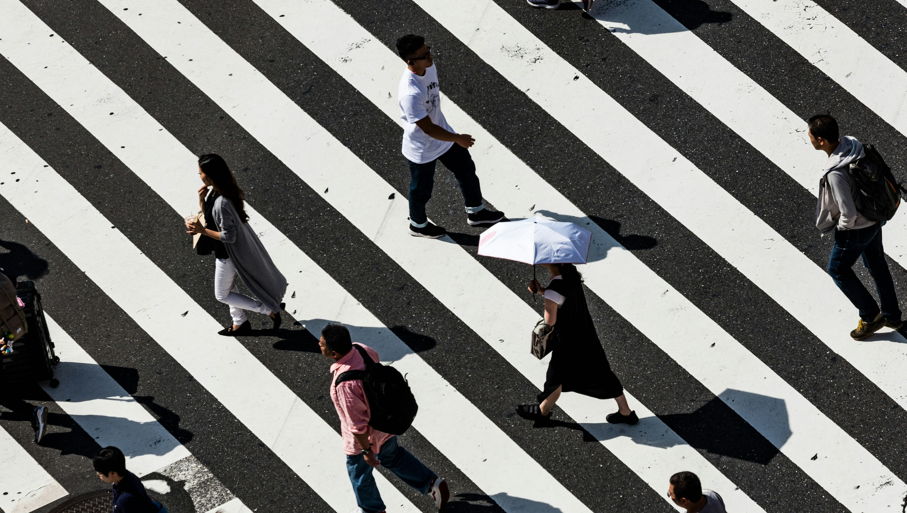
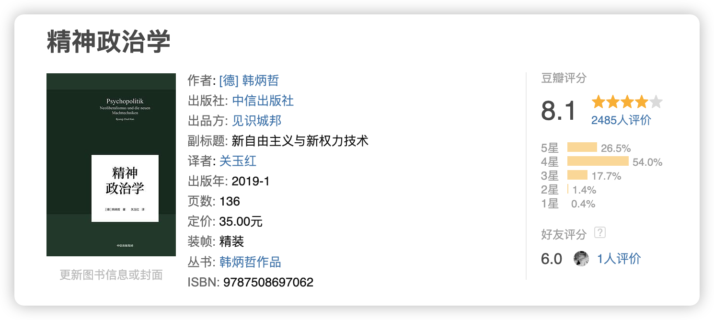
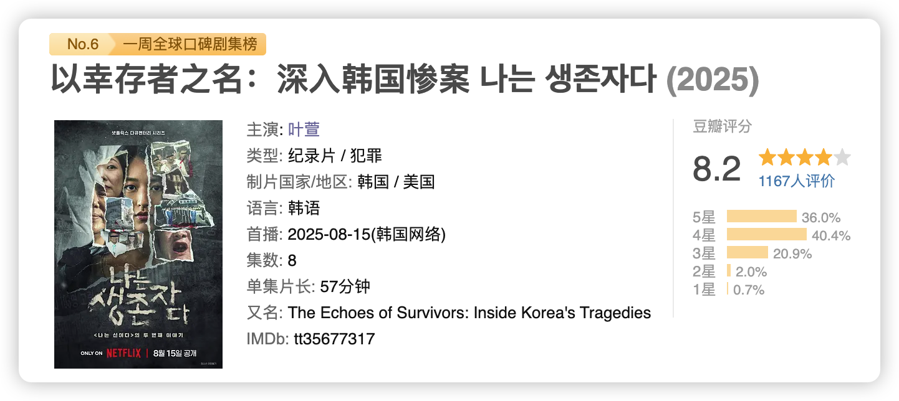
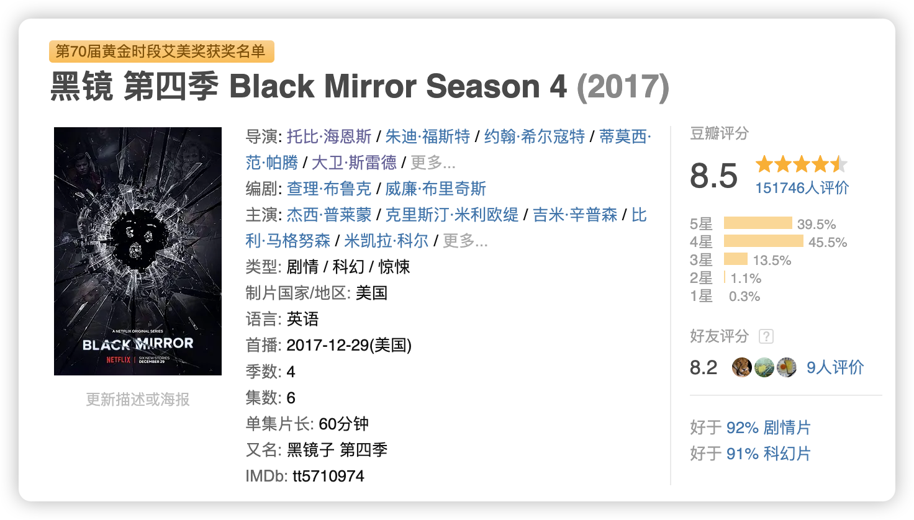
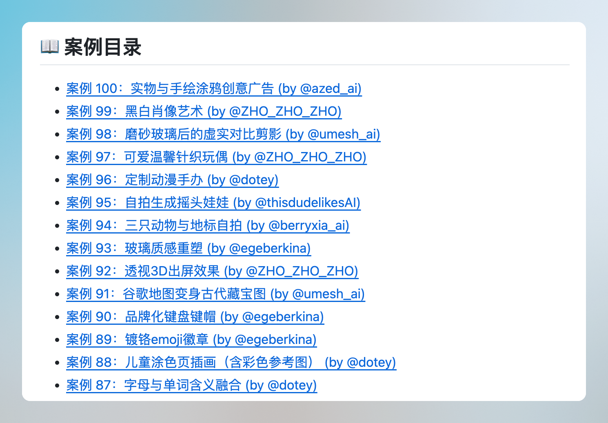
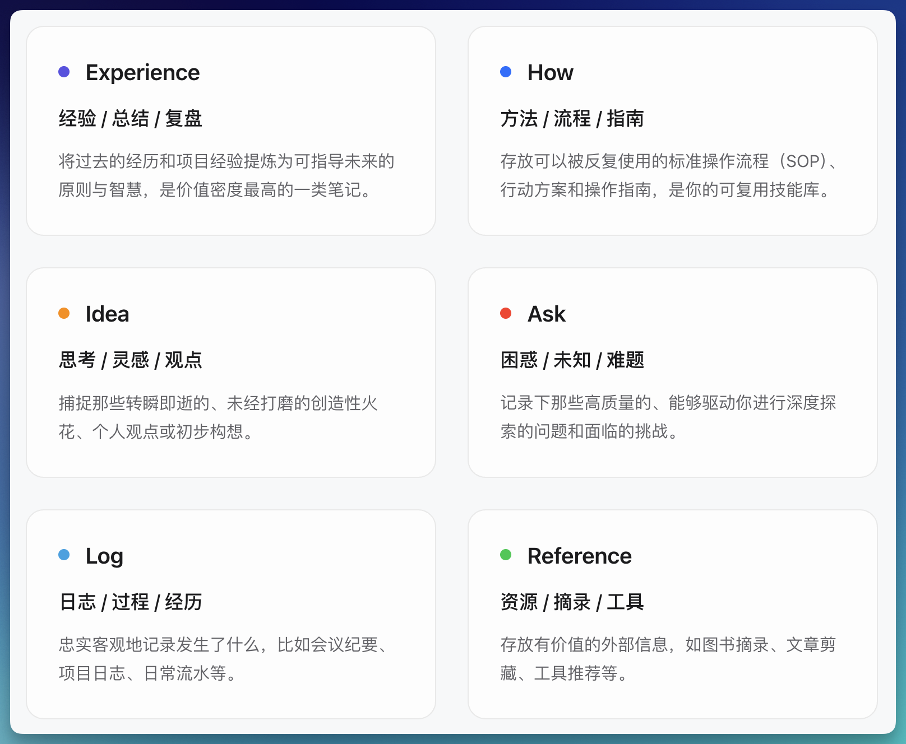
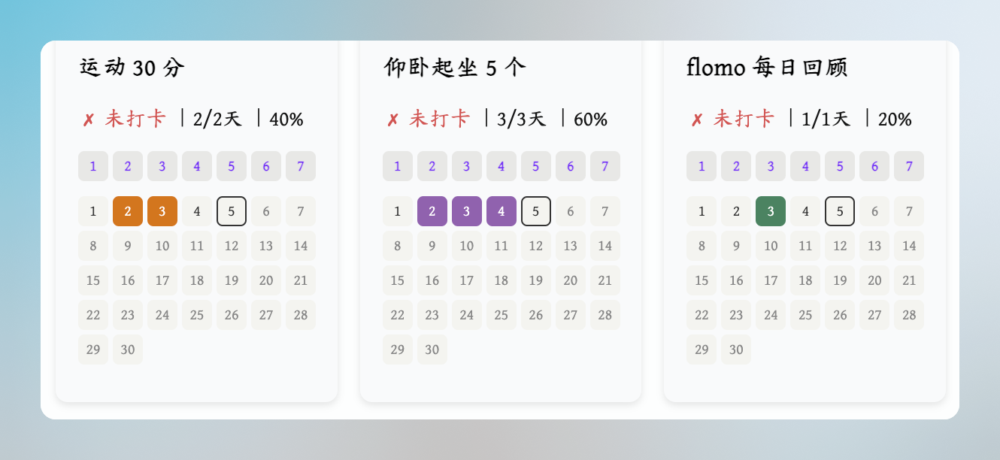
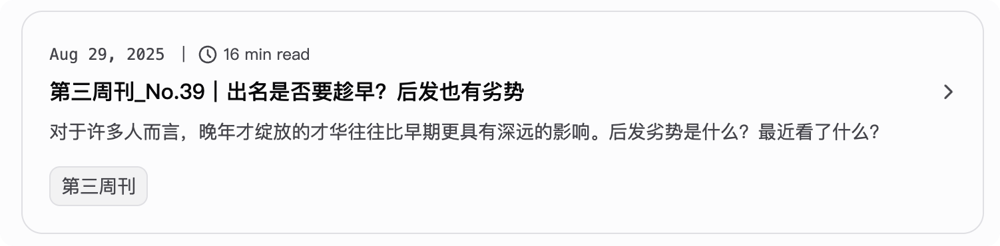
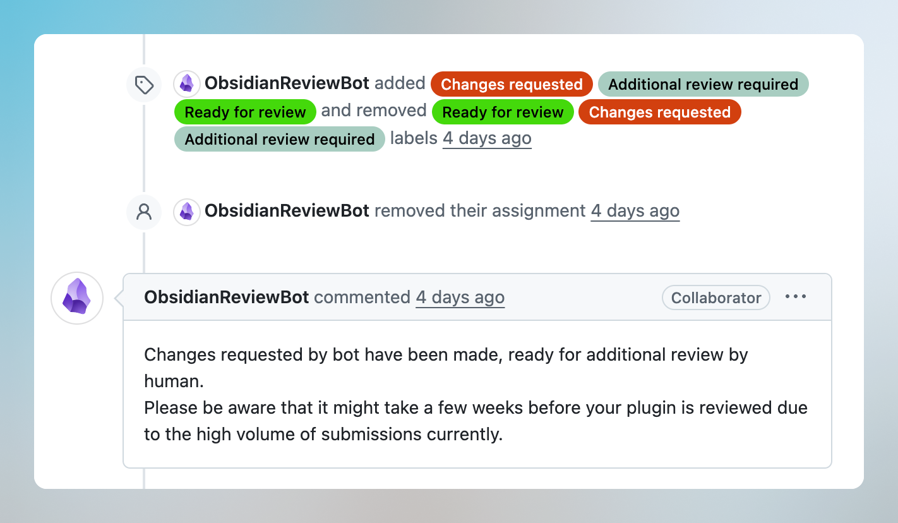

又是新一周，本周主要结合阅读的《精神政治学》做了一些思考，看了很多东西，然后折腾了一个新的小开发项目。

## 🤔 想什么

### 社会审美是根据「富裕」定义的

我发现社会审美是根据「富裕」定义的，比如以前吃不饱饭的时代里，就会以长得圆润壮实为美，而到了现在物资丰裕的时候，苗条是美的。  

在以前饥饿的年代，能吃饱饭能长肉，说明这个人是富裕的；而到了现代垃圾食品热量更高、食物填补空虚的可能更多的时候，有时间健身、有金钱吃更健康的食物的人是更富裕的。  

归根结底，社会崇尚的都是「富裕」的各种表现形式。

### “功绩社会”与“爱欲之死”

当自我成为功绩主体，我们所有的一切都必须要通过绩效衡量，**社会通过一种积极性的手段鼓励个人进行自我量化与 PUA**，当“能够”成为社会的主流语言，那么不能够就归咎责任到个人身上。  

在这样的社会氛围下，“拒绝”被视作一种“不能够”的托词，**量化没有终点**，这种功绩化的思想也会延展到我们的关系与生活中，世俗化的标准鼓励我们量化，于是有了： 卡身高、卡体重、卡存款、卡学历，卡各式各样的 title 与标签，**这些 title 与标签真的能告诉我们，一个人究竟是什么样的吗？**  

前两天看到一个直播切片，有人在庞颖的直播间问：喜欢上一个不被世俗认可的人怎么办？她看了问题之后突然笑了，反问了一句：世俗能给你什么呢？  

是啊，按照世俗的标准衡量我们的内心与情感，世俗带给我们的快乐与体验，真的能比你真心喜欢的人或者事物给你更多吗？  

内化了世俗标准，人成为自我量化的功绩主体，说人话就是 NPC 和螺丝钉，而在社交媒体的信息过滤下，所有人都在告诉你可以寻找自我，可是**寻找自我的过程不是新的一套量化标准**，不是旅行 20 个城市、不是认识 20 个陌生人、不是读了 20 本书，而是你终于开始接受自己的情绪，开始真正感受“想要”和“拒绝”的时刻。

**在公域空间抹灭了自我，在私欲空间就要放大自我**，社交舆论场成为放大自我的工具，要点赞、要评论、要数据，哪怕在关系当中也要争取更多的关注，情欲世俗化之后成为色情，脸、身体成为被消费的色情符号，导致情欲本身也失去神秘性，消弭了情欲中复杂的可能。色情化导致情欲失去吸引力。所以才会有“爱欲之死”，无法看到面前真实的爱人，更片面的了解，更多自我的投射，于是爱自然死亡了。  

爱是让人谦卑的过程，是哪怕我确信自己很好，也依然无法让自己在你眼中；是哪怕我好似一无是处，在另一个人眼中都是无可替代。没有什么道理可言，于是让人放下自我，努力通过另一个人的眼睛看看这个世界，放下了自我，才能看到更不一样的世界。

## 👀 看什么

### 📖 精神政治学



```linkpreview-nopic
[精神政治学 (豆瓣)](https://book.douban.com/subject/30389922/)
```

新自由主义的精神政治学通过点赞而不是规训诱导人们的行为，正符合《成瘾》中所点出新自由主义下的[边缘资本主义](https://note.joeytoday.com/Books/%E6%88%90%E7%98%BE/%E8%BE%B9%E7%BC%98%E8%B5%84%E6%9C%AC%E4%B8%BB%E4%B9%89/)，也就是多巴胺经济，通过不同的[数字药物](https://note.joeytoday.com/Books/%E6%88%90%E7%98%BE/%E6%95%B0%E5%AD%97%E8%8D%AF%E7%89%A9/)让你产生过多的多巴胺，从而形成[数字成瘾](https://note.joeytoday.com/Books/%E6%95%B0%E5%AD%97%E6%9E%81%E7%AE%80/%E6%95%B0%E5%AD%97%E6%88%90%E7%98%BE/)，各大公司也通过点赞这样的[间歇性正强化(Intermittent Reinforcement)](https://note.joeytoday.com/Books/%E6%88%90%E7%98%BE/%E9%97%B4%E6%AD%87%E6%80%A7%E6%AD%A3%E5%BC%BA%E5%8C%96\(Intermittent%20Reinforcement\)/)手段，助长数字成瘾。  

一切都是积极的、正向的、鼓励的、快乐的，可是人却在滑向一个不可控的深渊，而当你到了深渊发现自己不快乐了，要么通过社交媒体产生更多多巴胺快乐，要么社会推脱说，这是你自己不够努力。新自由主义真的是两边都赚啊。  **远离我所欲。现阶段的自由表现为一种拒绝的自由，当你可以说“不”的时候，你才是自由的**。

> 权力也许表现为暴力或镇压，但并不以此为基础。权力不必是排他性的、禁止性的或者封锁性的。它不仅不反对自由，甚至可以将自由为己所用。权力只在消极的情况下，才表现为罔顾他人意愿的、扼杀自由的、说“不”的暴力形式。今天，权力越来越呈现出一种自由的姿态。它以顺从、友好的形式摒弃了自己的否定性，将自己装扮成自由。  
> /《精神政治学》

这样的精神政治很难不想到《美丽新世界》，一个完全丧失了否定性的社会：  
- 消灭了蚊虫与危险，还不够；  
- 消灭文学与诗歌，还不够；  
- 消灭冲突与爱情，还不够；  
- 消灭信仰与艺术，还不够；  
- 那就来两克唆麻吧，保管你忘掉任何痛苦，抵达极乐。  

完全失去了痛苦的世界，快乐还有意义吗？失去了拒绝的权利，那还算是自由吗？通过积极的、鼓励的手段，控制人们真正的选择，就不是一种极权了吗？

> 野蛮人点点头，皱起眉头，“你们消灭了它们。是的，确实像你们干的事情。把任何让人不高兴的东西都清除掉，而不是学着去忍受它。‘默然忍受命运的暴虐的毒箭，或是挺身反抗人世的无涯的苦难，通过斗争把它们扫清’，这两种行为哪一种更高尚……但是你们两者都不做，既不忍受，也不反抗。你们只是把毒箭消除。这太容易了。”
> /《美丽新世界》

> “但是我喜欢不方便。”  
> “我们不喜欢，”总管说，“我们喜欢舒舒服服地做事情。”  
> “但是我不喜欢舒服。我要上帝，我要诗歌，我要真正的危险，我要自由，我要善良，我要罪恶。”  
> “实际上，”穆斯塔法·蒙德说，“你在争取苦难的权利。”  
> “那好吧，”野蛮人挑衅地说，“就算我是在争取苦难的权利。我要求这一切。”野蛮人最后说。
> /《美丽新世界》

### 🎞️ 以幸存者之名：深入韩国惨案



```linkpreview-nopic
[以幸存者之名：深入韩国惨案 (豆瓣)](https://movie.douban.com/subject/37305901/)
```

韩国的一部纪录片《以幸存者之名：深入韩国惨案》，前两集就讲述了在 1976-1986 期间，独裁政府庇护下的大型人权侵犯事件——兄弟之家福利院恶性收容事件，在兄弟之间的很多孩子是被公职人员强制收容进去的，甚至辅助了拐卖行为，最多的一年有 4000 多人被收容进去，很多孩子不过 10 岁，在里面经历了毒打、性侵、强迫劳动等等恶行，甚至有 627 人被打死，活下来的也有伴随一生的精神问题。  

但是始作俑者朴仁根院长，却在 2016 年在疗养院去世，侵占的资金超过 20 亿韩元，折合现在的价值差不多 100 多亿韩元，制作者和受害者去到澳洲他们的家里，每一个人都在否认、都在说自己没做错什么，看得让人十分愤怒，这个世界存在如此明晃晃的恶意与恶魔。  

很敬佩制作人直面这种恶性事件的勇气、能够不掩饰、怀抱着对受害者的同情心、对社会的责任感，制作出这样的节目，非常值得人尊重与敬佩。

### 📺 黑镜第四季



```linkpreview-nopic
[黑镜 第四季 (豆瓣)](https://movie.douban.com/subject/26898192/)
```

《黑镜》第四季有一集说的是妈妈给孩子装了芯片，可以看到她看到的东西，可以马赛克掉让她感觉危险的画面、语音，孩子在成长过程中失去了对真实世界的感知，危险、暴力、血腥都从她的世界里被过滤掉了，只留下一团马赛克。  

这个故事的内核跟《美丽新世界》好类似，并没有挺身去战胜危险，而是把危险过滤掉了；跟现在的自媒体算法也好像，并没有改善这个世界，它只是给你推送更“正能量”的信息。  

最终，我们丧失对世界的真实感知，想要恨点什么，却发现它并没有说谎，它只是过滤，有一种无力的下坠感，丧失了消极自由，只剩下积极自由的世界，怎么不算是一种数字独裁的世界呢？

## 🕹️ 好东西

### Nano-banana 效果+提示词合集

🔗  https://github.com/JimmyLv/awesome-nano-banana 



### 关于笔记分类 by 二一的笔记 

- **Experience经验/总结/复盘**：将过去的经历和项目经验提炼为可指导未来的原则与智慧，是价值密度最高的一类笔记。  
- **How方法/流程/ 指南**：存放可以被反复使用的标准操作流程（SOP）、行动方案和操作指南，是你的可复用技能库。  
- **Idea思考/灵感/观点**：捕捉那些转瞬即逝的、未经打磨的创造性火花、个人观点或初步构想。  
- **Ask困惑/未知/难题**：记录下那些高质量的、能够驱动你进行深度探索的问题和面临的挑战。  
- **Log日志/过程/经历**：忠实客观地记录发生了什么，比如会议纪要、项目日志、日常流水等。  
- **Reference资源/摘录/工具**：存放有价值的外部信息，如图书摘录、文章剪藏、工具推荐等。



## 🥕 折腾记

### Obsidian 习惯月历

在每天的日记中勾选待办项，就可以自动统计显示了。



### 个人博客显示
修改了主页博客内容的显示，取消了封面的显示，封面直接显示在正文就好，完全没有必要显示在博客页面，有点侵占视觉空间。



### 开发了第一个 Obsidian 插件
已经提交并通过机器人审核啦～现在等待 Obsidian 团队的审核。这里放个预告，我会写一篇内容聊一下我的开发过程～



>[!note] 免责声明
>本公众号内容仅代表创作者个人观点，不免除前后矛盾的情况，那是我思考的过程。