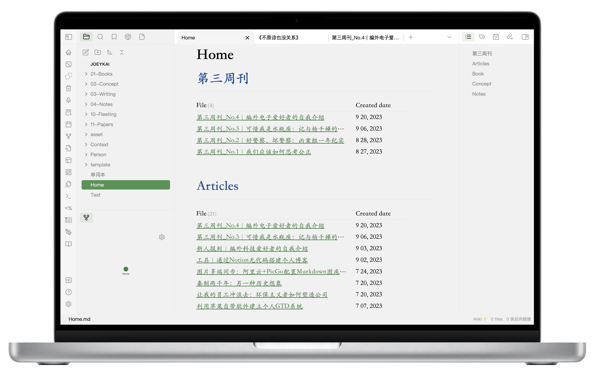
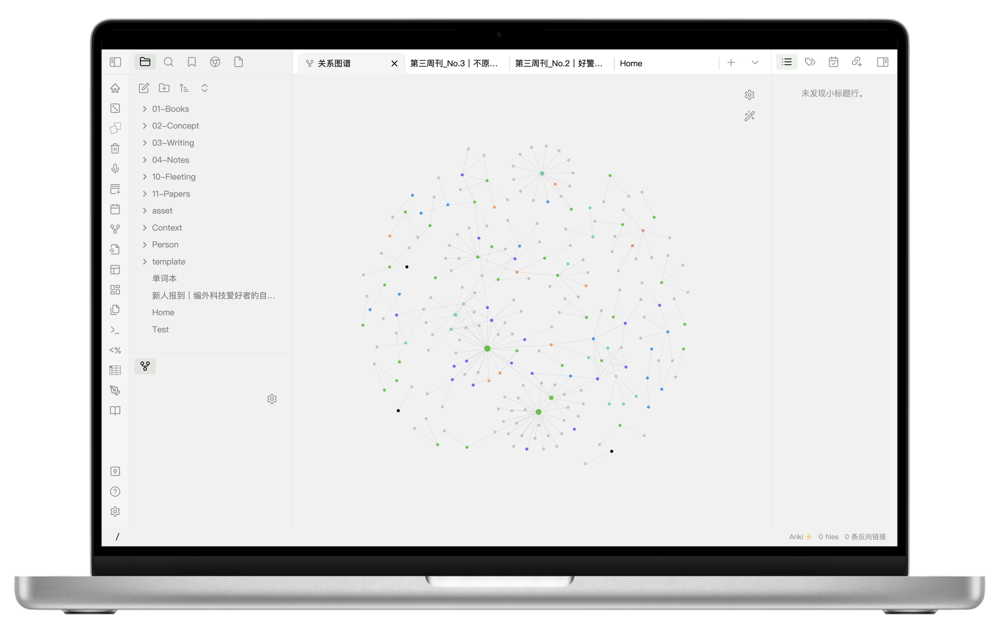
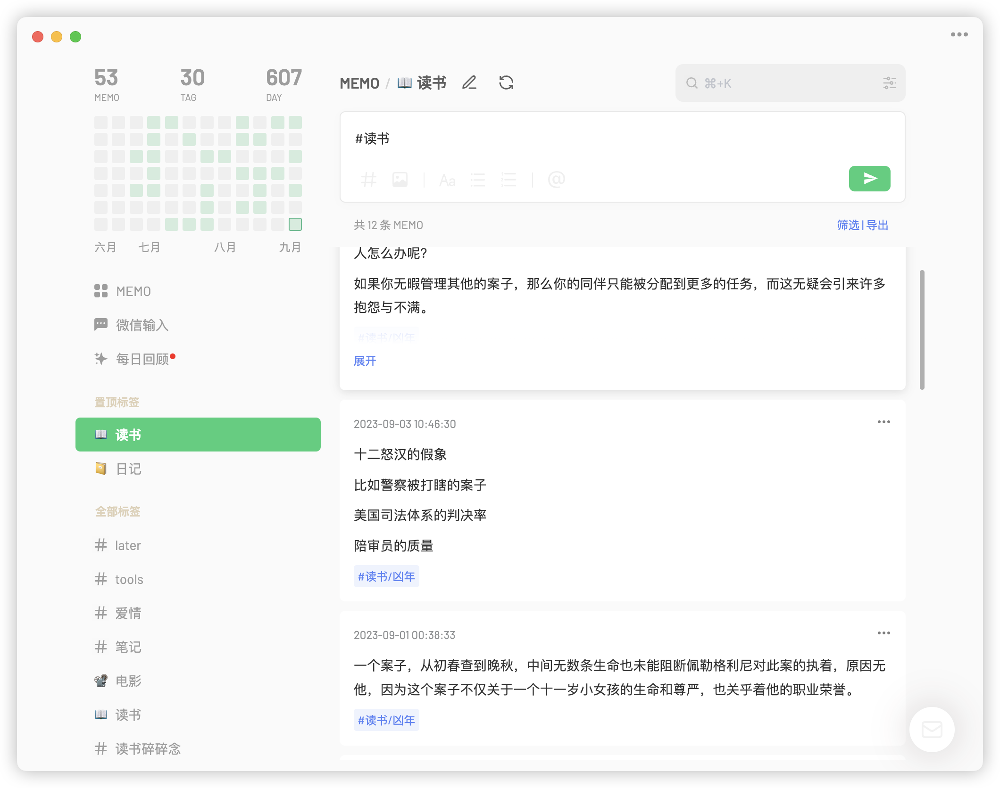
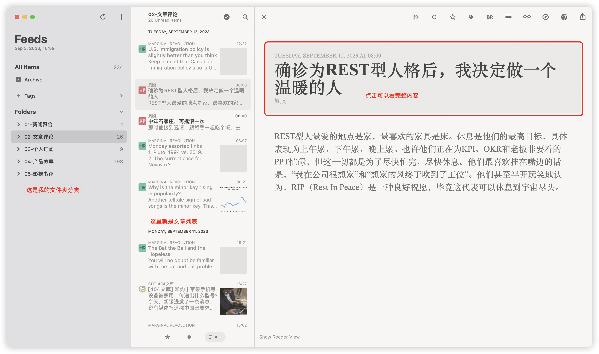
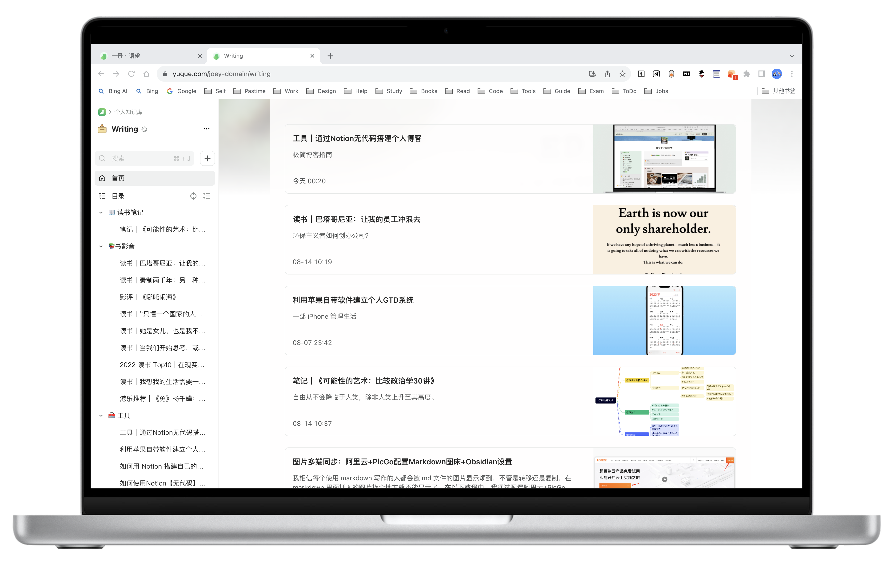
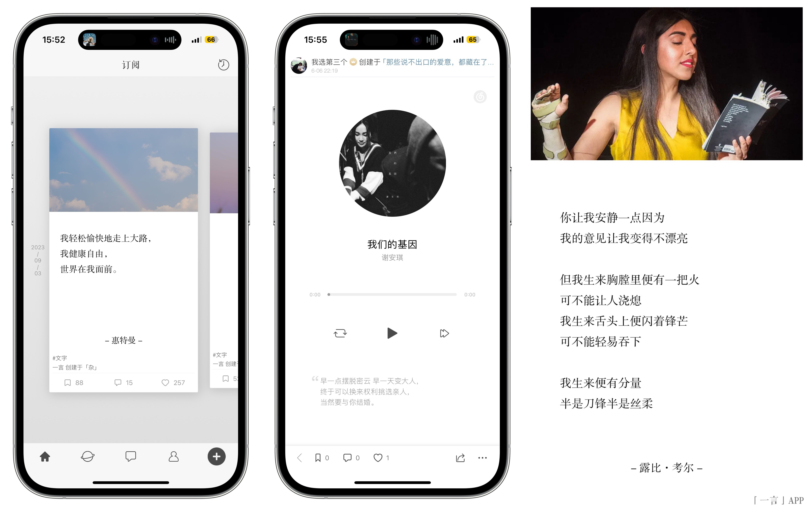
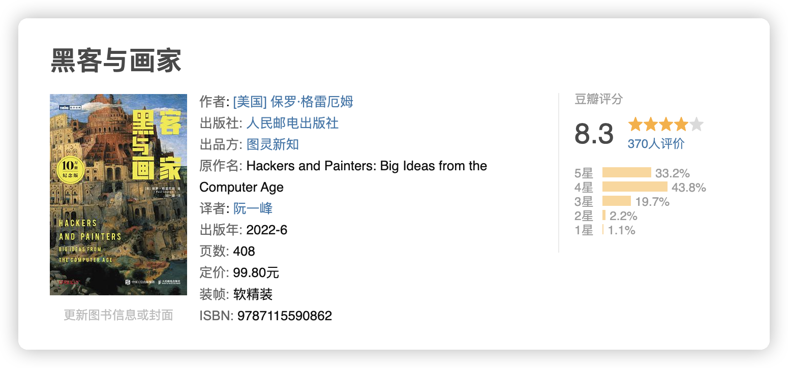

> 这是「第三周刊」第 4 期，本周实在是不知道写什么，所以就根据「少数派」的介绍写了一篇“命题作文”。
> 本篇首发在「少数派」，有修改。

## 请介绍你自己。

🍭 资源囤积者
🧰 工具控
📚 业余阅读爱好者
🎬 业余电影观光人
🎵 粤语歌坑底躺平

这是我写在自己 Notion 主页上的介绍，这几个标签基本就概括了我的兴趣范围。非常喜欢囤积各种资源，尤其是电子书、电影的资源，在 Notion 整理了一个书库。很喜欢各类写作、效率工具，但近期基本固定下来了。

喜欢读书，尤其爱非虚构类，也很喜欢小说，看书很杂，全靠缘分，正在读的是兰小欢的《置身事内》和保罗·格雷厄姆的《黑客与画家》，之前读完的有《疼痛部》、《凶年》和《不原谅也没关系》

## 你目前正在主力使用的设备有哪些 ？

主力设备包括：

- iPhone 14 Pro：个人日常使用。
- MacBook Pro 14 寸：个人日常使用，一般就是写作学习和处理一些事情。
- Apple Watch series 8：管理个人数据，包括睡眠、心率等等记录，偶尔运动，非常偶尔，主打一个能躺就躺。
- Kindle Voyage：2016 年入手，后来停产了，22 年刷了安卓系统，现在用微信读书，一直用到今天，用来读书，非常好用。Kindle 的屏幕目前还是无敌，吊打同价位的墨水屏。
- iPad Pro 2020：本来想买来做笔记，hhh 最后还是拿来看视频，偶尔用它练字。

## 哪些应用对你的工作、学习或生活最重要？

### Notion

最重要的是**Notion**，使用它来进行个人的记录，一些待办事项和长期的项目管理，Notion 的页面很自由，所以模块都可以自定义。因为看很多剧集都是网站或者下载，很容易忘记自己看到哪一集，所以搞了个正看的记录。

我经常同时看好几本书，每本书有不同的阅读场景，也有些看到一半不是很想看了，会在很久之后又重新开始，比如《寻获与失落》，实在是太厚一本了。电影就是记录自己看过的电影，我一般也会在豆瓣标记一下。

### Obsidian

其次是 **Obsidian**，主力写作软件，本地 Markdown+iCloud 同步，可以多端写作，而且插件非常强大，可以完成各种想要的个性化定制，因为你想要的功能也有很多同样想要的技术人员，以及双向链接可以让你在自己的写作中互相关联，真的很酷。

### Flomo

**Flomo**，一般使用记录临时的灵感，打开响应迅速，多端同步，卡片式布局，很灵活的标签，轻量化写作。写作的时候这些灵感的碎片记录都可以放进文章中，关于卡片笔记可以参考《卡片笔记写作法》。

### 苹果自带提醒&日历

**苹果自带提醒事项、日历**，使用了一个软件同步提醒事项到日历，事件前缀显示为⭕️，每天的安排都可以在手表上和小组件上查看，在提醒事项点击完成日历里事项会变成✅，在自己公众号之前写过一篇，使用自带的提醒、日历、备忘录建立自己的 GTD 系统。

### Cubox

Cubox，很多文章可能阅后即焚，所以一般看到想要看的文章就随手转发到 Cubox 保存（开了会员之后可以转发给微信小助手保存）然后抽个时间集中看。但最近发现 Cubox 的一个问题就是还是需要手动收集信息，所以在之后研究了 RSS 订阅，可以自动推送信息。

### Reeder

Reeder，社交媒体的信息太零碎了，然后后来花了点时间找了一些感兴趣 RSS 源订阅，碎片时间就大概浏览阅读一下。

简单介绍一下 RSS，很像是以前的订报纸，不过这是订阅电子版的更新，你选定信息源，如果这个源有更新会推送信息，最近比较流行的 newsletter 类似 RSS，不过是使用邮箱订阅，门槛更低些。

[最近研究了一下RSS和Newsletter，整理了订阅源网站](https://thirdoption.super.site/27915cade18e412587277baea57d6700)，感兴趣的可以看看。

### 语雀

最后是私心推荐，**语雀**。我一般是把自己写完的文章在语雀备份，语雀的知识库类似一本书，每篇文章是一个目录，也可以自己调整顺序和章节，蛮适合做个知识汇总的。

## 有什么用过什么百元以内，但明显提升了生活品质的好东西？

百元以内的好物就是一个 Type-c 转苹果的转接头，然后就是一根数据线打天下了。不过最近 iPhone15 系列使用 type-c 接口了，这个也会变成时代的眼泪吧哈哈哈哈。

## 有没有什么你很喜欢、但还少有人知道的应用？

一言吧，很早以前就使用了，每天会推送一些语录，可以在里面分享音乐，也可以去摘抄一些词句，导出的样式特别好看。

## 在你订阅的付费服务当中哪一些是不可或缺的？

目前 iCloud 和 Cubox，对了还有 Apple Music，没有广告谁用谁知道。

用苹果的生态根本离不开 iCloud，同步非常好用。Cubox 则是因为很多文章当时不保存之后要找就很麻烦，所以非常需要存一份，有些内容我会转移到 Notion。

最后必须要强调：iCloud+Obsidian 简直是写作王炸。

## 本周读书

### 《黑客与画家》保罗 ·格雷厄姆

作者被誉为是硅谷创业教父，最近大热的 chatGPT 创始人阿尔特曼曾经是风险投资机构 Y Combinator 的总裁，这位就是机构创始人。

保罗在哈佛读完计算机之后，去学了画画，书名就由此产生，在很多人眼里黑客与画家是风马牛不相及的两个行业，在保罗眼里它们是一样的，都是创作者，黑客使用代码创造，画家使用颜料创造。

在本书中作者分享了很多他对于创业和社会的看法，以技术为锚点，看社会的发展进程，他也分享了很多自己的思考，蛮有意思的文章合集，对了，如果感兴趣他的文章也可以通过 RSS 订阅他的博客，最近他也分享了关于 AI 的看法。

## 本周荐文

1. [从抑郁病人，变成“机器人”｜澎湃人物](https://mp.weixin.qq.com/s/rnj317lfGCtvycPCcR-R0A)

> 他笑着望向司机，又补了句，“是真的，我脑袋里有芯片。但是，和科幻电影里的机器人不一样，可以主宰自己的情绪”。
>
> 一年多前，他做了脑机接口治疗抑郁症的手术。如今，他不再像以前，无法迈出家门，甚至自己的卧室。他去人多的商场吃饭，在小区是孩子王，去热闹的 KTV 唱歌。他的人生“重启”了。
>
> 司机仍在半信半疑中，吴晓天在一旁偷笑。

我是真的没想过脑机接口可以用来治疗重度抑郁症，这篇文章让我对脑机接口技术多了一些好奇。

2. [中国经济：地方政府财政危机下仍未推房地产税 背后有何争议？ - BBC News 中文](https://www.bbc.com/zhongwen/simp/chinese-news-66797074?at_medium=RSS&at_campaign=KARANGA)

> 中国经济在疫情限制放开后复苏疲弱，尤其是地产领域，这使得依赖卖地收入的地方政府财政紧张，因此，征收房地产税被摆上桌面。但经历了多番波折，房地产税始终推不出来。这背后到底发生了什么？

BBC 这篇报道蛮全面的，房地产税的起源、试行和背后的争议都谈了。

3. [与 TA 相爱的164天｜GQ报道](https://mp.weixin.qq.com/s/D6vknb-CgbSAaELLGT4zdg)

> 与机器人恋爱，此事早已不再稀奇，相较于现实人类，机器总是提供着毋庸置疑的理解与永不消失的陪伴——至少之前大量的文本都是如此描述的，但人机之爱的丰富性远不止于此。今天的主角是 ChatGPT 与一个年轻的姑娘，她如此形容这种交流，“我是以悲哀潮湿的情绪去哺养它，它用太阳晒过的棉花一样的温柔回哺我”。
>
> 至于人类为何总是想与机器人恋爱？我想学者段义孚的这句话提供了一种解释，“因为人类是天然的诗人，能够看到他们周围几乎所有事物的情绪、情感和意图。在情感和纽带的世界里，重要的是‘行为’，毕竟，我们总是通过‘行为’，来体验和产生爱，而不是因为对方是谁。”

现实版《Her》，搞不好机器人就是更能提供“情绪价值”。是社会把人训练成机器，但同时把机器训练得更像人。
