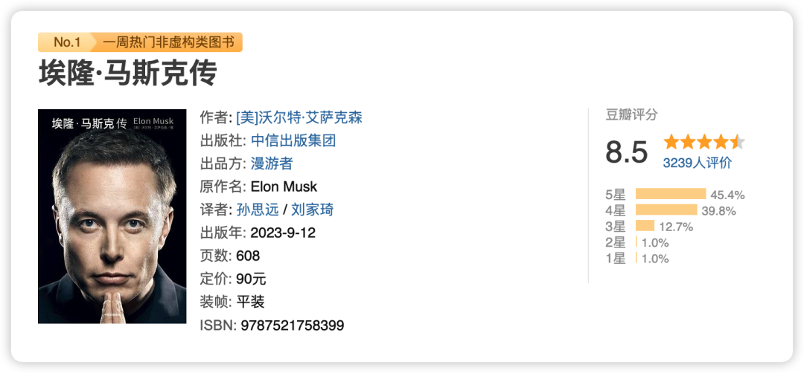
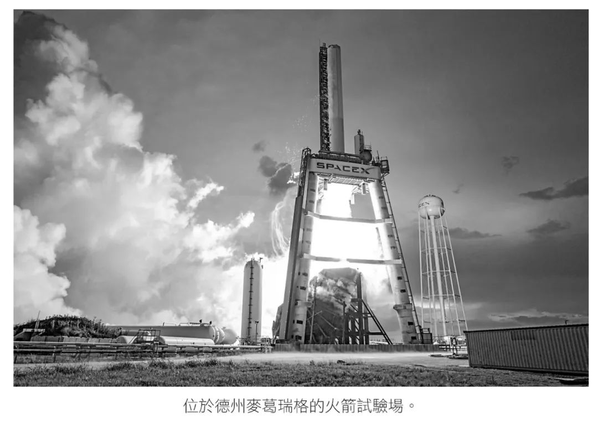
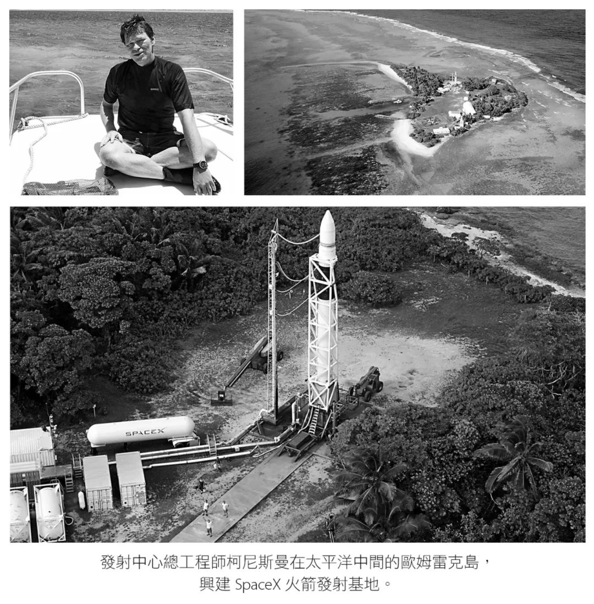
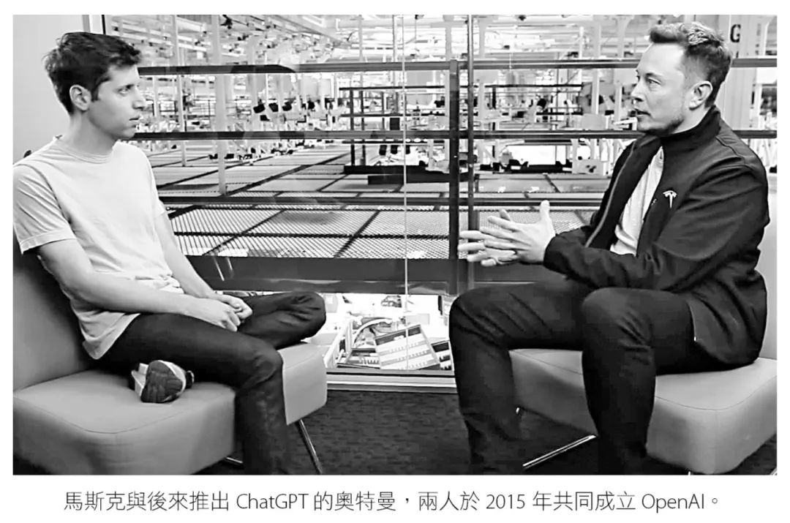
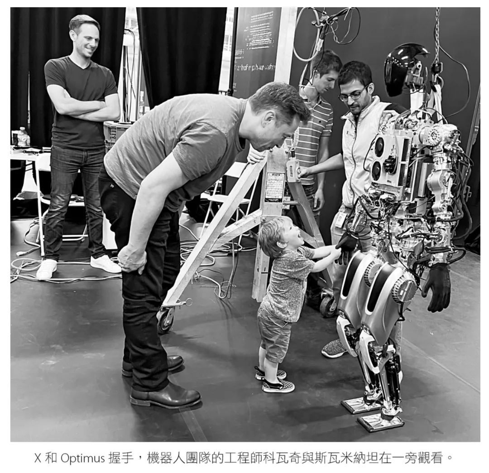
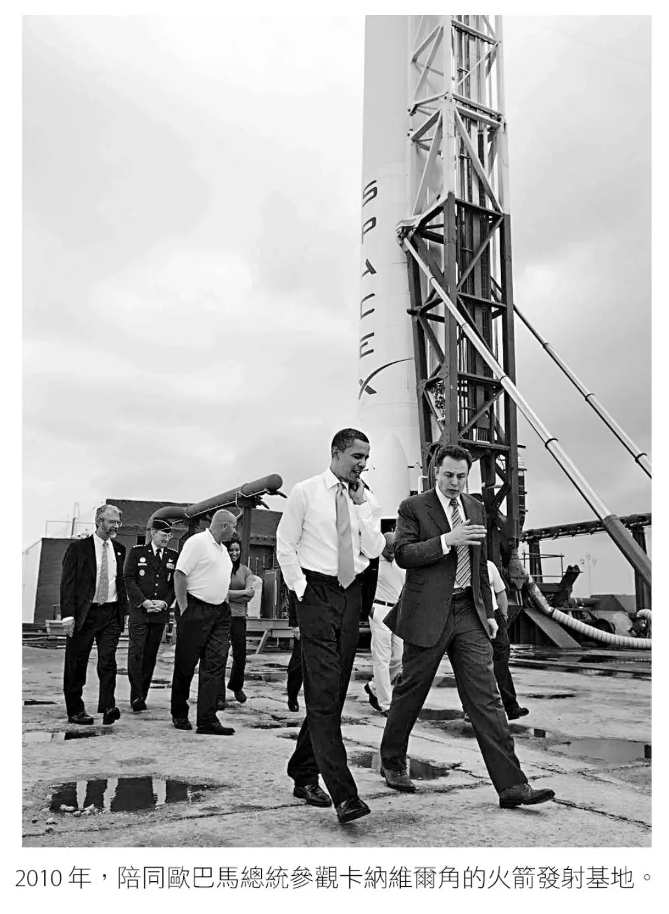
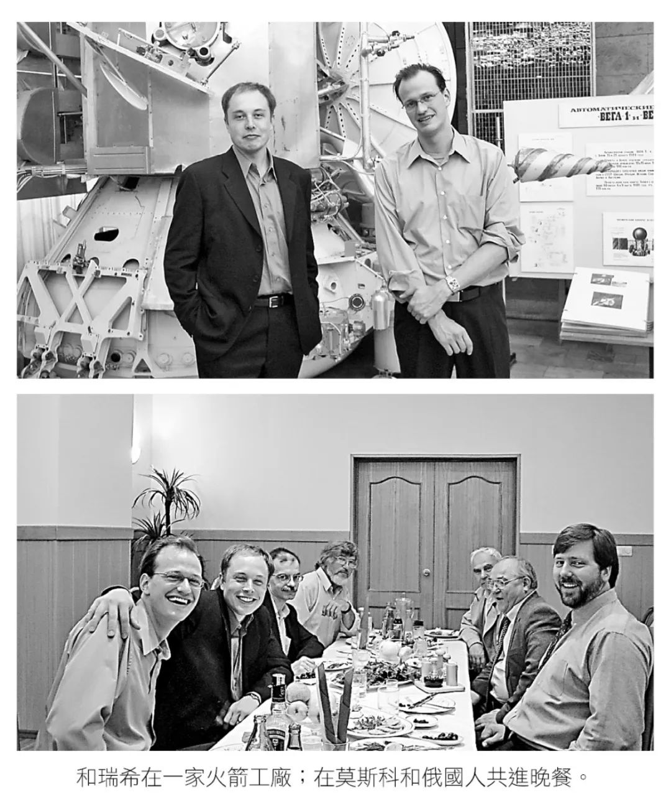
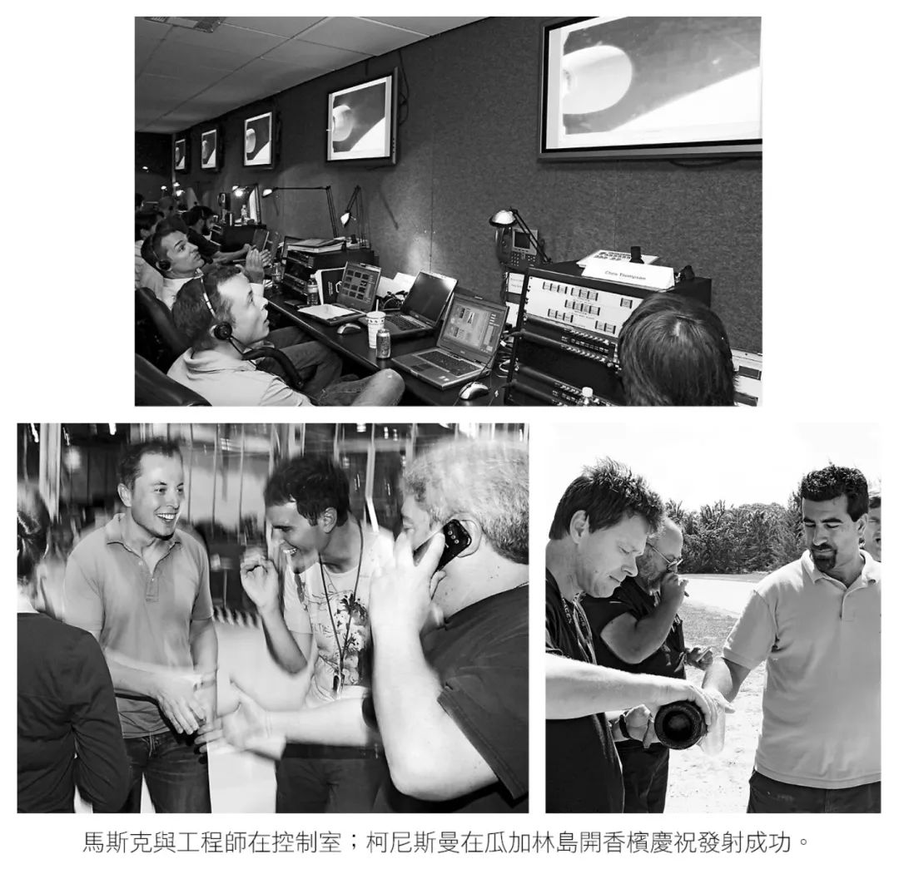

> 马斯克简介：埃隆·里夫·马斯克（Elon Reeve Musk），1971 年 6 月 28 日出生于南非的行政首都比勒陀利亚，资产2320亿美元。美国、南非、加拿大三重国籍的企业家、工程师、发明家、慈善家，特斯拉（TESLA）创始人兼首席执行官 ，太空探索技术公司（SpaceX）首席执行官兼首席技术官，太阳城公司（SolarCity）董事会主席 、推特首席执行官，美国神经连接公司（Neuralink）创始人、OpenAI联合创始人，美国国家工程院院士，英国皇家学会院士 ，本科毕业于宾夕法尼亚大学经济学和物理学双专业。

这一篇内容想了很久（周刊变月刊了🐶），除了自己最近有在忙的事情之外（以及懒），也实在是觉得很难用一篇文章讲述一个如此复杂的人物。马斯克毫无疑问是个“疯子”，尤其是近年来他在社交媒体上的离谱发言（反疫苗等）和被曝光的离谱行为（给下属捐精等），无疑让大家对这个形象更加印象深刻；但他也是有着自己的创伤的普通人，挣扎在童年与父亲的暴力中，直到今天他仍然需要通过手术修正幼年时被打歪的鼻子；他是个天才，对事情有着自己的执着与判断，他是个「暴君」，也是实实在在影响这个世界的人。

**有很多标签可以形容他，很多标签也不足以形容他。**

作者艾萨克森也是《乔布斯传》的作者，这次写了在世的一位天才疯子——马斯克，作为世界知名传记作者，他早已不需要为了谋生来书写某一位人物了，他更热衷于还原人本身的生活和特性，书写一些影响社会的人物作为人存在的时刻。

这次选择马斯克恰逢他发疯想要收购推特的阶段，艾萨克森全程跟完了他收购推特的 2 年，18 年之后的内容与其说是传记，更像是调查报道，也是很好的收购推特的新闻特稿。马斯克似乎无法享受平静成功的人生，就是要搞点事情才开心，然后他决定在自己人生最顺利的时候给自己找个麻烦……

---

“总有一天，你会到那里生活。”马斯克在好友埃里森的私人小岛上指着望远镜指向的火星，对儿子 X 这么说。这句话也表达了他对自己的使命定位：**让人类可以移民火星**。

> 当其他企业家在发展世界观时，马斯克已在构建他的宇宙观。

他对宇宙的愿景来源于科幻小说——《银河搭车指南》，这是一本影响他至深的科幻小说，当其他商业领袖对人类社会感兴趣时，马斯克对这个宇宙感兴趣。

他相信地球的资源总有一天会被耗尽，通过计算之后认定就算是煤炭发电，电能相比较石油也是更经济清洁的，所以他创办清洁能源的电动车公司特斯拉；他相信人类总有一天会移居火星，所以他想和 NASA 合作制作火箭，但发现 NASA 的官僚主义作风已经严重阻碍了技术的发展，他大胆创办了 SpaceX 成为第一家也是唯一一家成功发生火箭的私人企业，让美国的技术再次站在世界尖端；还有低轨卫星通讯——星链，在乌克兰战争中发挥了举足轻重的作用，脑机接口 neutrallink，想要绕过神经让瘫痪的人站起来、让失聪的人听见、让失明的人看见。

马斯克希望未来某一天，人工智慧将能够应付更伟大、更关乎生存的问题，它将“尽其所能追求真相，认为了解宇宙很重要，这可能促使它想要保护人类，因为我们是宇宙中很有趣的一部分。”

马斯克热爱人类，但不是某个具体的人，而是人类本身，他认为人性是机器人永远无法具备的，他关注 AI 技术，担心 AI 会无法制衡以至于伤害人类，选择和 Altman 联合创办 openAI，又因为理念不合愤而撤资，转而创办人形机器人公司 Optimus。很难想象这些愿景和公司出自同一个人，但马斯克竟然也都做到了。

### Surge 模式

马斯克的工作很喜欢「surge」模式，也就是一种在短时间内超负荷工作的模式，在这个模式下他会睡在公司的地板上，日以继夜直到达成一个目标，他足够聪明，不信奉任何除了「物理定律」以外的任何规则，阿斯伯格让他很多时候不能理解人的情绪和感受，他的暴躁和斥责会伤害到很多人，但是很多时候却又不得不承认，他是对的，于是一些人会收拾好心情重新开始跟他汇报，然后发现他已经完全忘记自己曾经那么剧烈地辱骂过别人。

面对马斯克，员工们的情绪也是很复杂的，他们一方面忍受不了他的脾气，一方面却被他独特的人格魅力吸引，或许这就是艾萨克森说的「现实扭曲力场」。

于是在这种作用力下，在连续失败之后，SpaceX 成为了唯一有能力发射火箭的以及执行载人任务的私人企业。

### 白痴指数

马斯克在成本控制中提出了所谓的“白痴指数”（idiot index），也就是计算“某个零件的总成本”与“该零件的材料成本”的比值。如果某样东西的白痴指数偏高，例如某个零件的成本是 1,000 美元，但是制造该零件使用的铝成本只要 100 美元，就代表这个零件的设计太复杂，或是制造流程太没效率。马斯克说，“如果比值太高，你就是白痴。”

比如在 SpaceX 有位工程师走到马斯克的办公隔间告诉他，猎鹰九号酬载区的空气冷却系统价格超过 300 万美元，马斯克立刻朝着坐在隔壁座位的萧特威尔大声问说，一般家用的空调系统是多少钱。她回答：大约 6,000 美元。于是 SpaceX 团队买了几台市售空调机，重新改造内部的泵浦，好让泵浦能够在火箭上顺利运转。

### 马斯克的演算法

五大戒律：

1. **质疑每一项要求**。每一项要求都应该附上提出这项要求的人名。任何来自部门单位的要求，例如“法务部门”或是“安全部门”，都应该拒绝。我们必须知道提出这项要求的人是谁，不论这个人有多聪明，你们都要提出质疑。聪明的人提出的要求通常是最危险的，因为其他人多半不会去质疑他们。一定要提出质疑，即使是马斯克自己提出的要求也一样，然后想办法把这些要求变聪明。
2. **如果可以，删除任何零组件或流程**。之后你可能需要重新把某些删掉的东西加回去。事实上，如果你后来没有重新加回去至少 10％，就代表你一开始删得不够多。
3. **简化与优化**。完成第二步之后，才能开始这一步骤。常见的错误是去简化或优化本来就不应该存在的零组件或流程。
4. **缩短周期**。所有流程都应该要缩短时间，但前提是必须完成前三个步骤。在特斯拉工厂，我的错误是花太多时间加快流程，但后来发现许多流程根本应该要被删除。
5. **自动化**。这一点必须放在最后，不要从一开始就想尽办法要把所有步骤自动化，应该要等到所有要求都被质疑过、不必要的零件与流程全都被删除、所有漏洞都被解决之后，再开始自动化。

补充：

- 所有技术主管都必须具备实务经验。
- 软体团队的主管至少要花 20％的时间自己写程式。太阳能屋顶安装团队的主管必须花时间亲自在屋顶上安装太阳能板。否则他们会变成不会骑马的骑兵团长，或是不会用剑的将军。
- 同事情谊其实很危险。这会让人很难去挑战彼此的工作，大家都会觉得不要害到同事。必须避免这种情况发生。犯错没有关系，但是不要犯错还过度自信。
- 绝对不要要求部属去做你自己不愿意做的事情。如果有问题需要解决，不要只找主管讨论。要跳过这些主管，直接和他们底下的员工讨论。
- 找人时，一定要寻找具备正确态度的人。工作技能可以之后培养，但是要一个人改变态度，只有换脑手术做得到。
- 收集资讯时尽可能接近源头。
- 精准，从零件到产品。

### 马斯克的游戏（人生）哲学

1. 同理心不是一种资产。
2. 像玩游戏一样游玩人生。
3. 不要怕输。
4. 积极主动。
5. 每一回合都要优化。
6. 加倍下注。
7. 选择战场。
8. 偶尔要关机。

