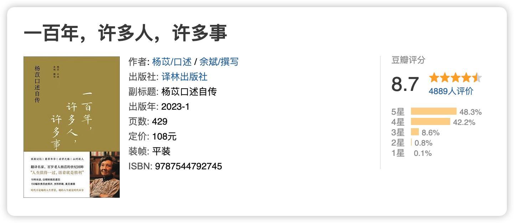
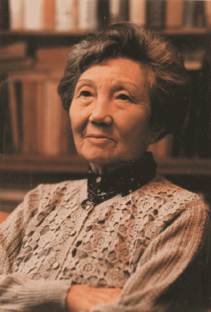
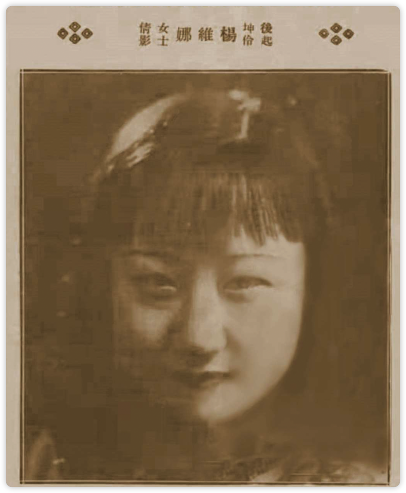
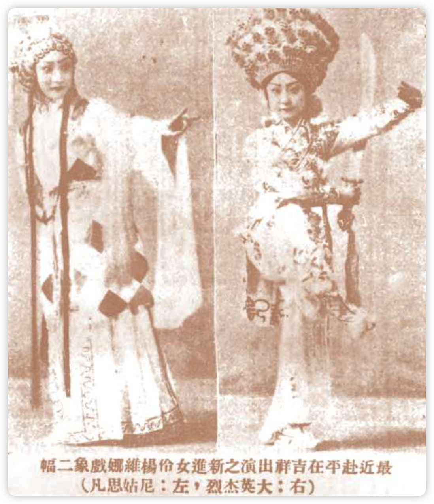
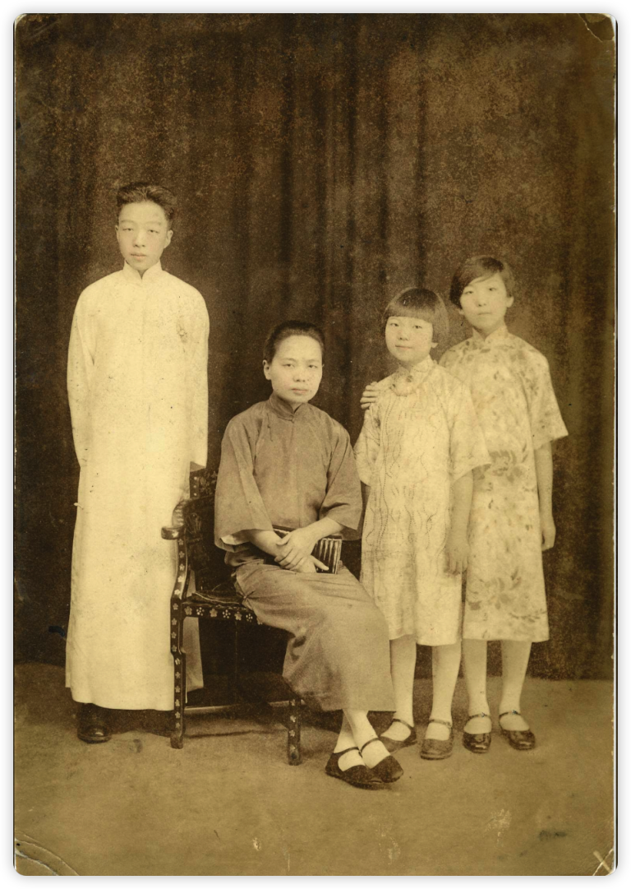
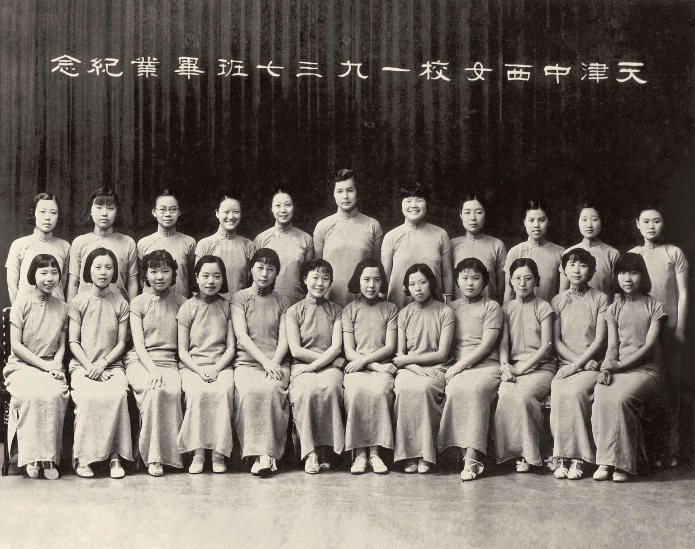
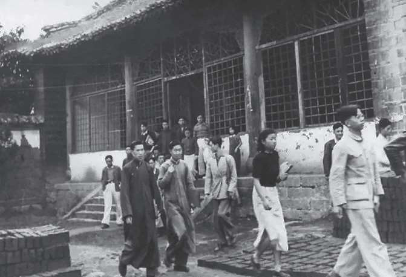
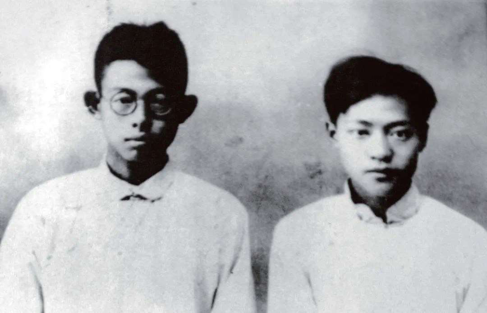
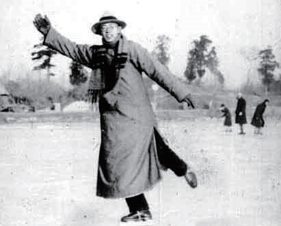

> 杨苡简介：杨苡，原名杨静如，生于 1919 年 9 月 12 日，卒于 2023 年 1 月 27 日，女，安徽人，出生于天津，先后就读西南联大外文系、重庆国立中央大学外文系，翻译家。杨苡翻译的《呼啸山庄》是最流行的中译本之一，也是此中文书名的首译者。
> 主要译著有《呼啸山庄》《永远不会落的太阳》《俄罗斯性格》《伟大的时刻》《天真与经验之歌》等。著有儿童诗《自己的事自己做》等。2023 年 1 月 27 日晚，杨苡去世，享年 103 岁。

> 我活得久，看得多，听得多。许多人，他们的事从头到尾都知道大概，有头有尾，听上去就像一个个故事了。这些人和事不时想起，想忘也忘不掉，有时又不愿想，因为好多人，一辈子过去，细细想来，更像一出悲剧。

第一次知道杨苡女士，是在纪录片《九零后》中，片子里访谈录几位年纪都逾 90 的几位大家，包括杨振宁、马识途、许渊冲等等，她诙谐幽默，爱笑、喜欢娃娃，一点都不像是九十岁的老太太。

她在今年年初去世，年中她的口述自传出版，我早就好奇，一出版就买了书，但直到年尾才开始读。由于是口述自传，书看起来很轻松，仿佛就是一个历经百年的智者在给你娓娓讲述自己的人生，一口气看完仍然意犹未尽。

如今杨老已然仙逝，到另一个世界里去和她最爱的哥哥、姐姐和妈妈团聚，祝她在那边还是可以做个快乐的小女孩。

## 童年：身世浮沉雨打萍

杨苡出生在一个大家族里，祖父数人都是进士出身，父亲杨毓璋曾经是中国银行的行长，年轻时到日本留学，杨家是天津的大家族，与很多政商界的人士都过从甚密，杨苡的哥哥杨宪益出生时，袁世凯还送了一件黄马褂。在这样的家庭里出生，基本就意味着衣食无忧了，但杨宪益五岁时，父亲由于风寒去世，杨苡正出生在这样的「家族由盛转衰」的时刻。

> 家里很多人都是悲剧，其实说“悲剧”这个词，我首先想到的便是四姐，其他有的人也许说有悲剧色彩吧，以现代的眼光看，有某一段不如意。比起来，四姐的一生，包括最后的结局，整个就是悲剧。

她家中人物关系复杂，有父亲的正妻“娘”，娘生了两个女儿，就是她的大姐和二姐，二姐早早去世了，大姐在家里被称为“大公主”，后来疯掉了；她母亲徐燕若是为了传嗣娶的小妾，生了她的哥哥杨宪益，三姐杨敏如；家里还有个二姨太，生了一个女儿，也就是四姐。

在杨苡父亲去世之后，因为一些变故，四姐主动随着母亲离开了杨家，后来为了养母亲，去唱戏了，曾经上过报纸，最后死于流产。此事后来杨苡的母亲还念念不忘，说“如果当时把她留在杨家，她是不是就不会是这样的结局”，“她有那样的母亲，她是杨家的血脉，如果我们要强留，也是留得下来的”。

杨宪益是唯一的儿子，从小就是被宝贝着长大的，一出生就被养在娘的膝下，他更小一点的时候甚至是不知道自己生母的，后来知道了就对两个妹妹很好，姐姐杨敏如是第一个养在母亲身边的孩子，从小也是极受母亲爱护的，再加上姐姐聪明勤奋，一向是被捧着，杨苡既不如哥哥聪明，又不如姐姐勤奋，就是家里那个最不受重视的孩子，又爱玩，这也造就了杨苡的性格，就算到了九十岁还是很依赖哥哥，很听姐姐的话。

## 求学：从中大到联大

这一段是我最喜欢的，杨老的求学生涯恰逢中国最风云变幻的年代，作为大家族的孩子，她受到的波折相对是小的，但是她的视角恰好补齐了那个时代拨弄浪潮的人作为普通叔叔伯伯的一面。

中央日报的替蒋介石执笔《中国之命运》的陶希圣，独女是杨老的好朋友，在她眼里，陶希圣是“穿件长袍，没官架子，像个读书人”，甚至还给她提供毕业后的工作；当过外交部次长、总长的颜惠庆，在她眼里是会替她捉迷藏打掩护的颜伯父；还有在西南联大任教的朱自清、沈从文、陈福田、陈嘉等等如今大师级的人物，在当时也不过是，严肃的、亲和的教书先生。

中西女校位于天津“中国地”，也就是不是租界的地方，上学时能够明显感觉到租界之间，租界和“中国地”之间的差别，比如：英租界、法租界治安很好，干净整洁，人也礼貌，到了日租界就有点紧张，日本人还会闹事，醉鬼常见，容易出事。“中国地”比日租界更脏乱，晴天尘土飞扬，雨天泥泞陷脚，一路过去，破破烂烂的。也可以说中西就在贫民窟里。

中西女校西方人创办的基督教性质的教育，就算与现代所谓的“素质教育”也不遑多让，昂贵的学费，和完善的教育机制，相当于是“贵族学校”，里面的同学多是非富即贵。当时很多大家族的的孩子都是上类似的教会学校，也会在这几所学校中挑选对象，不同学校之间的学生也不一样，很有讲究的叻。

> 过去北京流行一句话，“北大老，师大穷，燕京清华可通融”，说的是选女婿的标准，燕京、清华出来的，学业、家世应该错不了。清华要求高，难考，学生特别拔尖，有不少寒门子弟，燕京学费很贵，一般人家上不起，就更需要家庭背景了。也不光是燕京，上海的圣约翰，南京的金大、金女大……凡是教会大学，都贵。

杨苡在中西十年，打下了极其坚实的英语基础，毕业后上了南开大学，结果不久就面临着日本的侵占，随着学校南迁，成为西南联大的学生。

在联大的日子堪称美好，因为联大管理自由，什么政治立场的人都有，杨苡和堂弟杨纮武租住在一起，楼上是朱自清和沈从文，同一栋楼还有施剑翘姐弟，跑警报、读书的趣事、她对各个同学的评价、说各个同学老师的八卦，实在有意思，我没法描述出趣味，书中还有大量的图片，建议亲自去读读。

## “大李先生”：这么近，那么远

那时候年轻人的文学偶像是写出了《家》的巴金，巴金原名李尧棠，杨苡崇拜巴金，在读完他的著作之后给他写信，巴金出于对晚辈的爱护，告诉她在天津如果需要帮助可以去找自己的哥哥李尧林，这就是「大李先生」了。

李尧林是巴金的亲哥哥，大排行行三（家族排行），两人的关系特别好，巴金离开四川的家，就是和李尧林一起。后来巴金去了法国，李尧林到北平念燕京大学的外文系，毕业后就到天津南开中学教英语。

杨苡和大李先生两人见上面之后就经常一起散步，两人的爱好类似，音乐、文学、英文，甚至传出来了风言风语，那个年代风气保守，加上杨苡年轻，不久之后就去云南读书了，二人就通信交流，无论遇到什么好吃的、好玩的、遇到了什么人，杨苡都会写信跟大李先生说。

> 大李先生从来没对我表白过他喜欢我，我不管对别人还是对自己，都没承认过那是爱情，我就是崇拜他，一边说我在等大李先生，一边否认这里面有男女之情——的确，和他在一起时，人家说的那种触电似的感觉，我也没有。

巴金的《家》其实就是以自己的家族为蓝本的，巴金的大哥因为受不了家族的压力选择了自杀，后来他的二哥（小排行行二），也就是大李先生主动选择了扛起家族的重担，他的工资大半都寄回养家，调和巴金和家里的矛盾，给了巴金一个相对自由的空间，可以说，如果没有大李先生，可能之后也不会有创作出如此多杰作的巴金了。

两人谈文学、谈音乐，杨苡谈自己的生活，大李先生总是以最大的包容支持她的决定，去往联大之后，杨苡写信告诉大李先生在船上的见闻，大李先生的回信道：“这封信可把我等够了，现在知道你平安，我这才放心。我只希望有一天，我们又能安安静静在一起听我们共同喜爱的唱片，我这一生也就心满意足了……”，在联大时，杨苡每天最期盼的就是大李先生的信，等待着他能来云南相聚。

在联大读书时，杨苡被赵瑞蕻追求，都写信对他说的。有封信里杨苡问他为什么还不来云南，还说了赵瑞蕻“纠缠不休”（信里就是用的“纠缠”这个词），问他我该怎么办，他回信中的话：“我一向关心你的幸福，希望你早日得到它。既然 young poet 这样追求，你为什么不接受他的爱呢？”

杨苡又听闻李尧林与冯秀娥恋爱，她自觉没有冯漂亮，于是一气之下就接受了赵瑞蕻的追求，从此，她和李尧林不再联系。随着战事逼近，昆明轰炸不断，经历几次搬家后，那些珍藏的信件也遗失了。（杨苡问过冯秀娥此事，她表明自己已有婚约，传言不实）

很多年之后，有个学生去天津看李尧林曾问他：“都说你和杨静如好，有这回事吗？”他听了，玩笑似地说：“她和我赌气哩，一赌气就和别人结婚了。”1945 年，李尧林因肋膜炎在医院去世，他没有结婚，二人生死相隔，最后一面还是他送杨苡去联大读书之前。

上世纪80年代，杨苡去看望巴金，客厅里只剩他们两人时，杨苡终于问出了那句几十年来一直想问的话：“大李先生这一生，有没有爱上过什么人？”巴金缓缓地说：“也许有一个，是个富家小姐，他多半因为自己的情况，没有接受对方。”

## 结语

杨苡的百年人生，从清末、民国、近代到如今，所有大大小小的事件，都算是亲身经历了，历史的真相究竟是什么呢？我觉得，她们经历的，她们感受到的，就是历史的真相。
