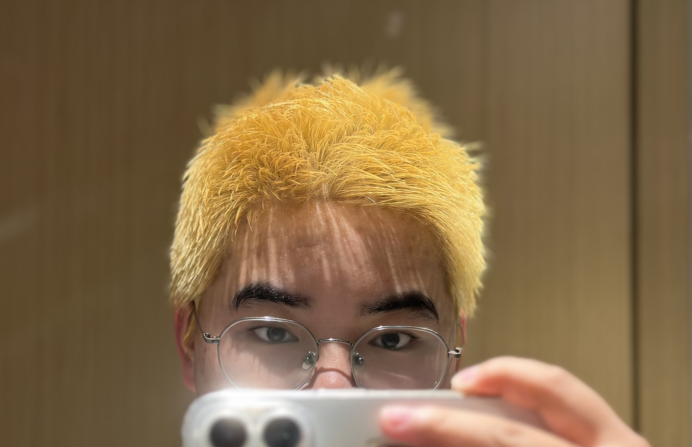
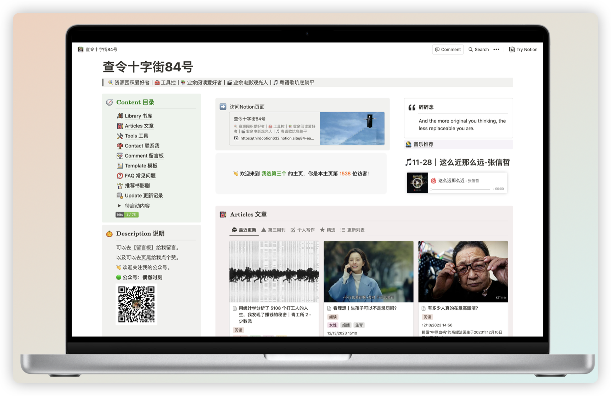
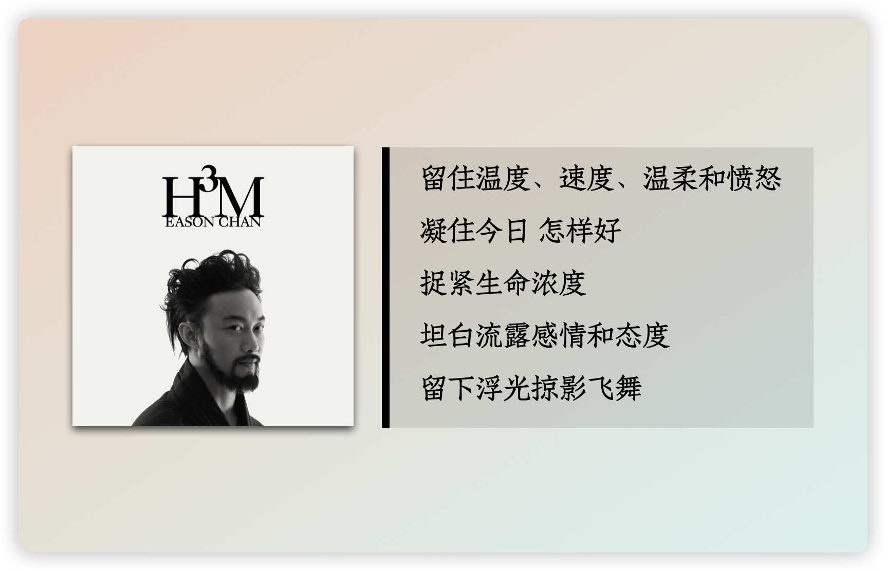
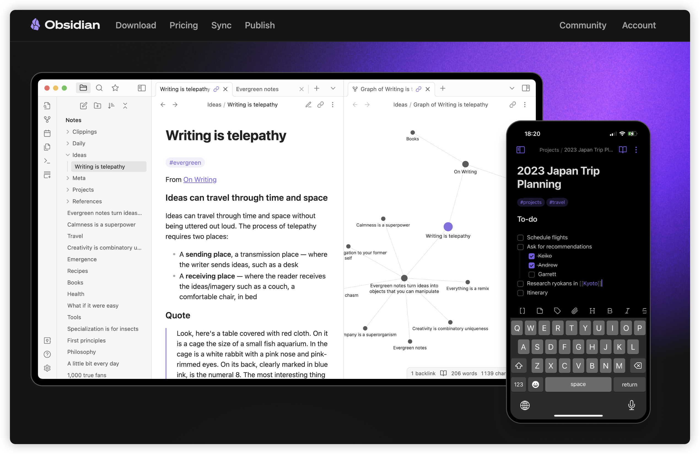
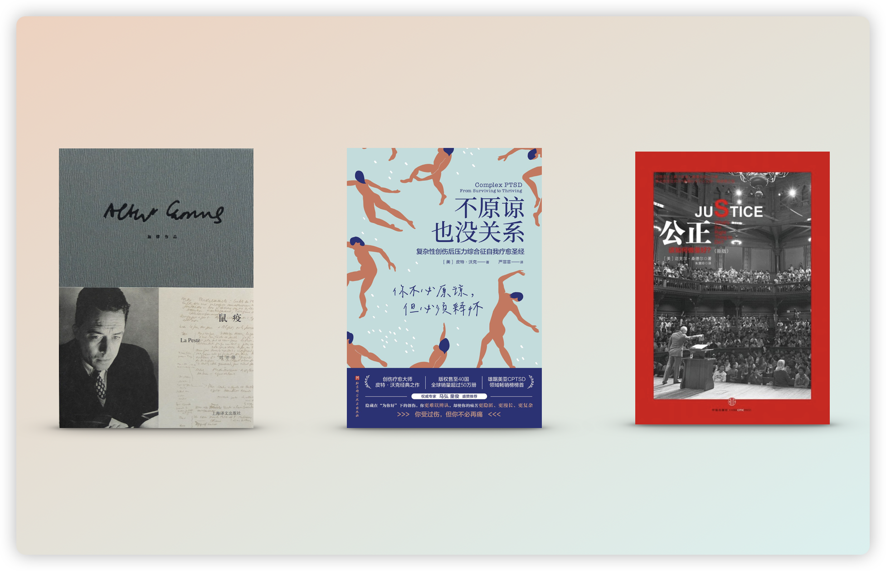
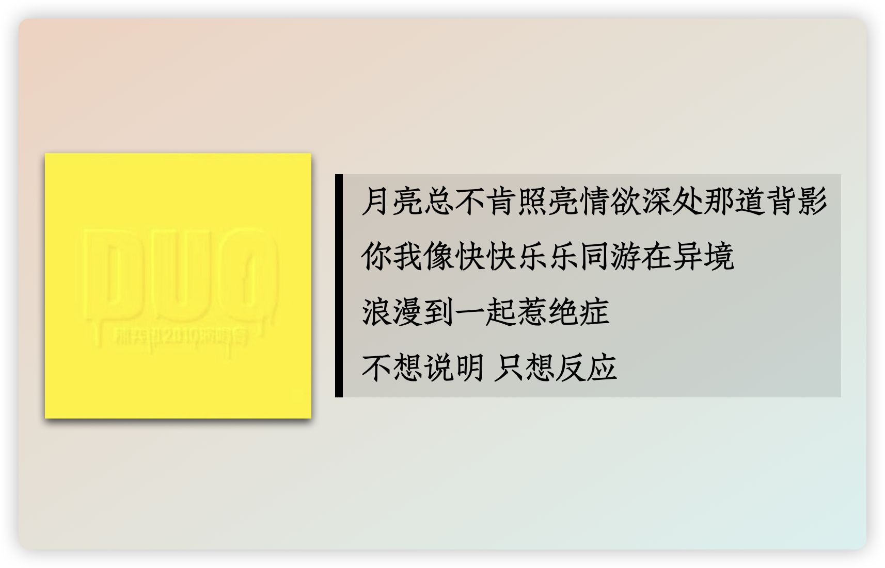
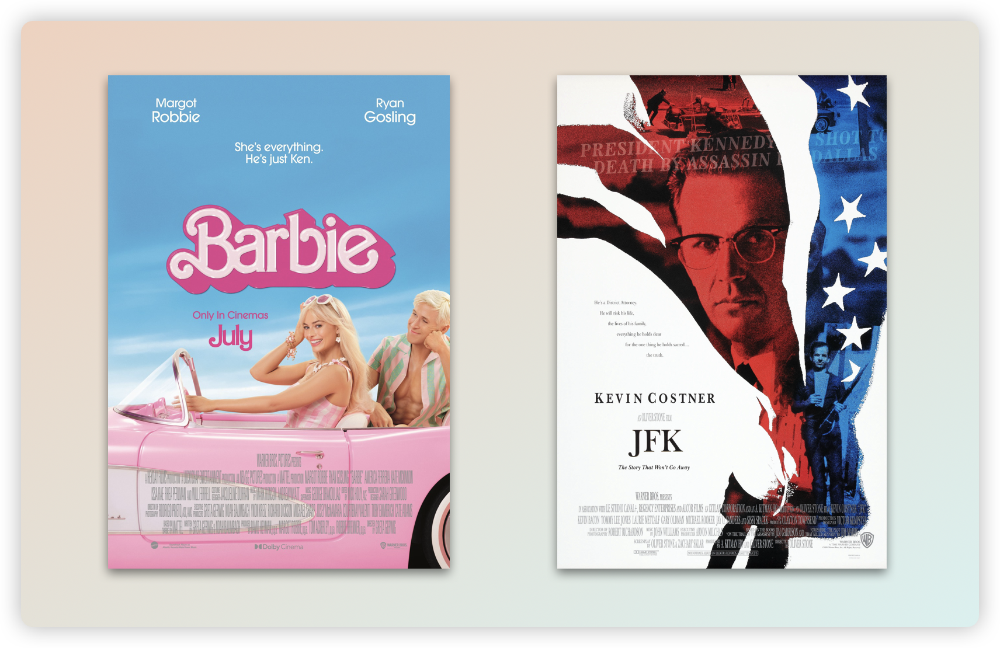

作为热衷于复盘的人，每年的年终总结简直是我最期待的流程之一，今年的复盘以 Steph Ango 的每年四十问为基础，他是笔记软件 Obsidian 的 CEO。

根据他的问题，我分为了三个部分，分别是「年终回顾」、「人际关系」和「未来展望」，以下是根据个人生活修改后的内容：

### 年终回顾

##### 1. 你今年做了哪些**之前从未做过的事**？

想了想还蛮多的，今年在年初给自己一年定的一个关键词就是：突破，到现在为止，算是能够称得上是有些突破了。

- 剃了寸头
- 去参加了书店的分享会
- 去看了杨千嬅的演唱会
- 去了线下观影会
- 去了线下的读书会，并认识新朋友
- 一个人出行去见网友
- 见到了活的许知远
- 见到了《野蛮人入侵》的导演
- 坚持了写作

##### 2. 你有没有**遵守年初时和自己许下的约定**？

没有全部遵守，但整体都按照期望的方向在走。

##### 3. 今年旅行了吗？**最喜欢的旅行**是哪一次？

旅行了，最喜欢下一次。

##### 4. 今年的**哪个或哪些日子**会铭刻在你的记忆中，为什么？

- 1 月 20 日，我的生日，第一次去看了脱口秀。
- 3 月8 日妇女节，我和我的朋友们一起策划了妇女节的赠书活动，很成功，明年会继续。
- 4 月 8 日，这一天剃了寸头，然后几个月后把头发漂成了黄色。👇 是这样：

- 7 月 2 日，和朋友在酒吧聊天到 1 点，去参加了朋友🦊补办的毕业典礼。
- 9 月 9 日，杨千嬅上海演唱会。
- 10 月 29 日和 11 月 18 日。

##### 5. 觉得自己今年做的**最棒的事情**是什么？

- 整理并重读了「川 A 123456」的文章，共计有 20 w+的字，这些让我醍醐灌顶的文字，希望能通过我的努力更广泛地传播出去。
  因为这件事，加上了川老师的联系方式，并且认识了很多新的同路人，真的很棒。
- 在 3.8 妇女节和朋友一起抽奖在朋友圈赠送女性主义的书籍，非常感谢很多朋友的赞助，这个活动共有 89 人参与，总共送出 15 本书，希望幸运的各位都有好好阅读呀～
  活动参考：
- 制作了自己的个人主页
- 开始写作我的「第三周刊」，虽然总共也没写多少，只希望自己在未来只会拖更不会停更。

##### 6. 你今年遇到的**最大的失败**是什么？

没有让我觉得非常挫败的事情，我觉得每一件事都是一个过程而不是结果，谁知道峰回路转在什么地方呢？

##### 7. 你今年还遇到过哪些**困难**？

主要困难在于脸皮不够厚、时间不够多、定力不够强。

##### 8. 你今年是否生过病或受过伤？

在九月份的时候流感，高烧 4 天，最后不得不去医院挂了盐水（感谢我的室友陪我去医院）。

##### 9. 你今年**买过的最好的东西**是什么？

手机吧，毕竟每天都在使用，真的用它完成了很多事情，有些工具就是只有使用之后，你才知道它可以完成什么。

##### 10. 你大部分的钱都花到哪里去了？

作为穷鬼，必然是吃的。

##### 11. 有什么事让你感到超级、超级、超级兴奋？

如果能做自己想做的事情并且赚钱，这是最让人兴奋的。

##### 12. **哪首歌**会永远让你想起这一年？

陈奕迅的《沙龙》：

##### 13. 与去年的这个时候相比，你是：感到更快乐还是更悲伤了？变得更瘦还是更胖了？变得更富还是更穷了？

更快乐了，长大和工作都是一件不那么坏的事情，起码对我而言是更好的事情，能对自己的生活有一定的控制权，这是非常令人愉悦的。
年中短暂的瘦了一点，年终因为狂吃又长回来，所以没有什么变化。
这个问题真的灵魂一问，从金钱上来说，没有增长多少，从脑袋和体验来说，我富有了很多很多。

##### 14. 你**生日**那天做了什么？

我的生日在年初，今年的生日已经过去好久，上班摸鱼看完了《当呼吸化为空气》，下班后跟朋友去看了脱口秀，度过了一个很平静快乐的生日。

##### 15. 你会如何描述你**今年的个人风格**？

我的风格，实用吧，今年所有的行动都朝着我认为最简单、便捷的方向。

##### 16. 你希望自己能**做得更多**的是什么？

很明显，我希望能读更多书，能写更多文字。

##### 17. 你希望自己能**做得更少**的是什么？

必然是，少看点社交媒体，但是我往往控制不住。

##### 18. 今年用过**最好用的软件/工具**是什么？

Obsidian，我今年的写作全在这个软件上，它的高自定义性和丰富插件让我想要的功能都能做到，双链功能是很好组织知识关联的有机思维，本地化让文档只属于自己。

最重要的是，免费！

官网：[Obsidian - Sharpen your thinking](https://obsidian.md/)

##### 19. 你今年读过**最好的一本书**是什么？

虚构类和非虚构各一本吧。虚构类是《鼠疫》，非虚构是《不原谅也没关系》和《公正：该如何做是好？》，这两本我都觉得太好，并列吧。

##### 20. 你今年发现的**最好听的一首歌**是什么？

陈奕迅《无人之境》，很早之前就标记了喜欢，今年真的非常非常爱。最喜欢 DUO 演唱会现场版，Eason 沙哑的声音搭配上这首歌的压抑纠缠的意境，很美。

##### 21. 你今年看过**最喜欢的一部电影**是什么？

今年必然是《芭比》，我可是去电影院看了三遍，太喜欢了。
还有一部，想了想还是得放进来，《刺杀肯尼迪》。
今年真的看了很多很好的电影，既然说是最，那就这两部吧。

##### 22. 你今年**最难忘的一顿饭**是什么？

7 月在北京和朋友们一起吃的饭。

##### 23. 有什么是你**想要却没有得到**的？

想要一只狗狗，还没条件养。

##### 24. 有什么是你**想要且得到了**的？

想要独立生活，我得到了。

##### 25. 你今年**最大的改变**是什么？

变得不那么讨好了，减少了内耗频率。不喜欢的人和事情，就拒绝；不想听的话，就打断；不想做的事情，不要勉强。
整个人开始从 F 变 T 起来，我很满意。

### 人际关系

##### 26. 你身边有人**结婚/恋爱**了吗？你的感受是什么？

有的，但都不怎熟悉，所以我也挺无所谓，要是真的有很亲密的朋友结婚，我会有点难过吧，然后收拾我的心情，祝她顺利，我继续往前。

##### 27. 你身边有人**离开/去世**了吗？你的感受是什么？

今年身边的去世的人就是我的小舅妈了，走得很突然，我妈很有感触，说了很多，我去参加了葬礼，难过的人都很沉默，很难想象人最后就只是在那样小的一个地方。
去往墓地的时候下雨了，一排排的墓碑，只有名字和照片，很沉闷的场合，我联想了一下自己可能面临的，我希望我走得时候气氛愉快些。
黄伟文的一句歌词：「如果想哭，可以试试对嘉宾满座，讲个笑话纪念我」，我希望我离开的时候，场景是那样的，「何妨大笑，让妙事亦被我看到」。

##### 28. 今年认识**新的人**了吗？你的感受如何？

是的。今年对我来说真的很神奇，神奇到我去灵隐寺还愿了。有一些人因为我的微博相识，有些因为线下的活动，有些因为我的公众号，还有朋友的介绍，认识了很多新的朋友。
感受只有神奇，以及，我真的有在长大。

##### 29. 你的**老朋友们**还在身边吗？为她们做了什么？

当然在咯，我相当重视老朋友们，一起线上、线下观影，去参加了朋友补办的毕业典礼，让在北京的朋友见了面，给她们过生日，和她们一起徒步爬山，和她们一起旅游，和她们一起吃饭，或者就坐在咖啡馆聊天，还有日常零散的聊天。
我相当喜欢她们，大部分时候我觉得人生就这样，拉倒吧，她们是老天留在我人生里的一些糖果。

##### 30. 最喜欢和朋友一起做什么？

散步吧，这个时候不能玩手机，就只能聊天，我喜欢聊天。

##### 31. 明年想要更多和朋友一起做什么？

想要更多一起看电影，看什么都行。

##### 32. 今年让你**最敬佩的人**是谁？

敬佩一切知道不公还在说话的人，敬佩还在表达的人，敬佩还在笨拙地坚持自己的道德的人。

##### 33. 今年让你**最震惊的人**是谁？

上海万圣节，每一个勇敢表达的人，对那个程蝶衣尤其印象深刻。

##### 34. 今年哪位**公众人物的离开**让你最有感触？

突然去世的高层总理。感觉像是一个时代的逝去。

##### 35. 你今年**印象最深刻的新闻**是什么？

新闻实在是太多了，看着让人抑郁。洪灾、BBC 的偷拍纪录片、台湾的 Metoo 运动、齐齐哈尔体育馆坍塌、房地产、ChatGPT、苏州毒地、中山大学博士生癌症。
希望明年太平些，虽然它只可能是个希望。

##### 36. 哪个政治问题最令你有感而发？

啊，这个，不好说。

### 未来展望

##### 37. 有什么还未发生的事，如果发生了，会让你的这一年变得无比满足?

成功去找某位叔叔谈话，然后得到我想要的东西。

##### 38. 今年你学到了什么宝贵的**人生经验**？

世界是个草台班子，以及大部分人并不知道自己想要什么，所以我可以自信点，狂妄一点也没什么。

##### 39. 明年你**想要获得**哪些你今年没有的东西？

更多的决策权和更多的钱。哈哈哈，想发财是认真的。

##### 40. 能够**总结你这一年**的一句话或者三个词语是什么？

陈奕迅《沙龙》的歌词：
「其实人生并非虚耗，何来尘埃飞舞」

