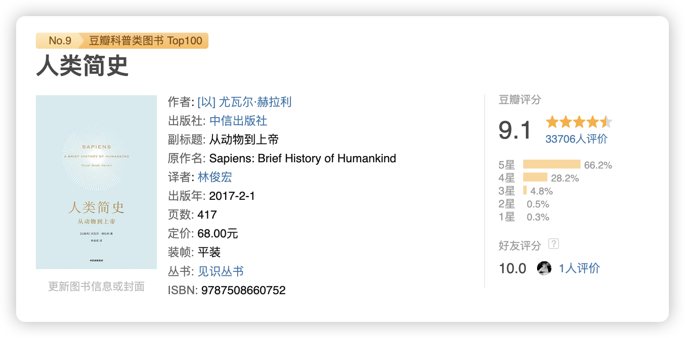

金钱是一种资源，如何赚取/使用资源，与我们如何对它的看法息息相关，所以如何对待金钱，也是一种心理学。这本《金钱心理学》有几个很有意思的观点，在这里跟大家分享。

## 没有人真的对钱失去理智

> 你对金钱的个人经验可能只有 0.00000001%符合实际，但它构成了你对世界运作方式的主观判断的 80%。

第一章作者就抛出了一个很有意思的观点，“没有人会对钱失去理智”，包括一些人在赚到钱之后的大肆铺张浪费，直到自己再度归于贫穷，也不是失去理智的。

这是为什么呢？

在作者看来，每个人的消费习惯受到家庭情况、社会形式和教育的影响。每个人都在根据自己的经验与已有的信息对钱做出判断，进行选择。比如挥霍无度的人，或许在他看来钱就是取之不尽的资源；在上升年代长大的人更容易对未来做出乐观的看法，更加积极投资股票，可是成长在下沉年代的人们，就会更消极，更乐意存款而不是投资。

所以当我们面对差世代的人们的投资选择，只需要引入他们的教育经历、成长年代、家庭情况等因素，他们所有行为的背后逻辑就会开始显现，这个道理就会得到再一次的重申——没有人会对钱真的失去理智。

人们往往会对自己个人经验的普适性做出错误的判断，错误以为自己经历的就是社会的真相，这样的想法决定了他们的行为，我们也就不难预测，他们的理财错误能有多么离谱了。

想要在财富上做出正确的抉择，首要就是保持谦卑。一个人掌握再多的知识，拥有再开放的心态，都不可能真与恐惧和不确定性的力量抗衡。**保持谦卑，随时准备好应对危机**。

## 只要坚持得够久，复利就会开始显现

> 沃伦·巴菲特 845 亿美元的金融净资产中有 815 亿是在 65 岁以后赚到的。这虽然不符合直觉，却是事实。

「复利」这个概念都快被说烂了，说到底什么是复利呢？通俗点说就是「死磕」，坚持一个选择，如果它有道理，那就坚持到底，只要时间够长，你总能看到它增长的时刻。

复利的指数型增长，让很多人支撑不到快速增长的时刻，这种反直觉的特性，导致我们中最聪明的人都忽视了它的强大力量。所以很多人会在黎明前夜放弃，然后他们就会失去自己可能收获的最大利益。

用一个有关以硬盘发展的例子说明复利好了：

> - 20 世纪 50 年代，IBM 公司生产出了世界上第一块计算机硬盘，容量只有 3.5 M。
> - 到了 60 年代，硬盘容量扩大到了几十 M。到了 70 年代，IBM 推出的温彻斯特驱动器的容量达到了 70 M。自此以后，计算机硬盘以飞快的速度不断缩小尺寸，增大容量。
> - 到了 90 年代早期，一台标准个人计算机的硬盘容量达到了 200 M～500 M。
>
> 接下来——砰！一场爆炸式的增长开始了。
>
> - 1999 年，苹果公司的 iMac 电脑的硬盘容量达到了 6 G。
> - 2003 年，Power Mac 电脑的硬盘容量为 120 G。
> - 2006 年，新一代 iMac 电脑的硬盘容量为 250 G。
> - 2011 年，第一块容量为 4 T 的硬盘出现。
> - 2017 年，容量为 60 T 的硬盘出现。
> - 2019 年，容量为 100 T 的硬盘出现。

复利的运作跟硬盘的发展路径是类似的，好的投资并不一定意味着长期回报最高，因为高回报的投资往往是一次性的，很难重复。**好的投资是可以持续获得不错的收益并能长期重复的投资——这正是复利开始大显身手的地方**。

## 我们所能拥有的只有幸运

> “任何事都没有表面看来那样美好或糟糕。”

如果我说一个人最终能拥有多少钱主要看运气，肯定会被很多人反驳，但事实确实如此，你出生在什么国家、什么地区、什么家庭，接受什么教育、遇到什么样的人、有什么样的际遇等等，这些是我们可以选择的吗？

我想回答不全是“可以”，而这些因素往往是决定我们生活走向的最重大因素，国家决定了你能接受的社会保障体系与文化底色，家庭决定了你的教育与交往，这世界上有很多跟我们差不多的人，甚至比我们更聪明更努力，但我们的际遇却大不相同，生活在叙利亚与生活在美国，差别不是个人努力能够改变的。

最后说明这些的原因，并不是想劝各位听天由命，而是保持感恩与谦卑，认识到自己的成就大都源于幸运，会让我们对自己拥有的所有，财富、家庭、朋友、亲人等等保持知足与感恩的心态，赚取财富是为了什么呢？如果是为了获取尊重与幸福，那么知足与感恩就能帮助你达成目标。

同时这种心态也能让我们保持身为人的同理心，要知道，很多在受苦受难的人并不是他们不配得，而只是缺少了一点幸运而已，对他们保持同情，而不是指责，这会让我们更值得尊重。

## 本周读书

智人何以统治地球？

1. 能说话。复杂的语言能力。
2. 聚在一起说八卦？与周围人的交换信息并建立信任。
3. 讲故事统治地球！建立共同信仰，促进超大规模的合作。

## 结语

随便写写感想，祝各位周末愉快。
