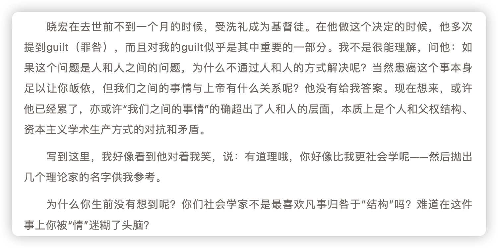
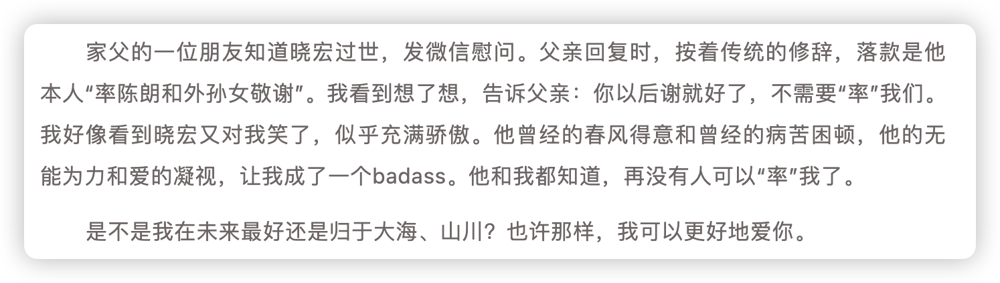
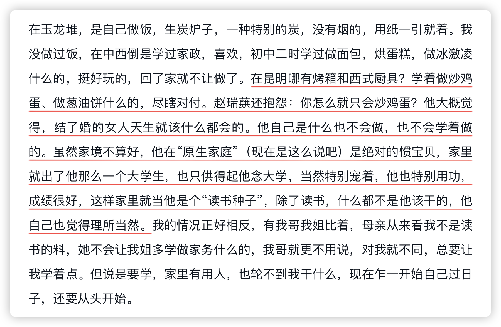
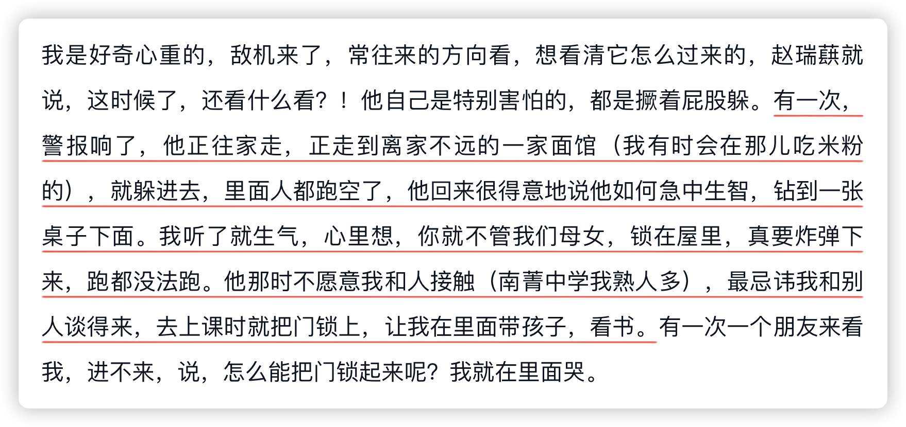
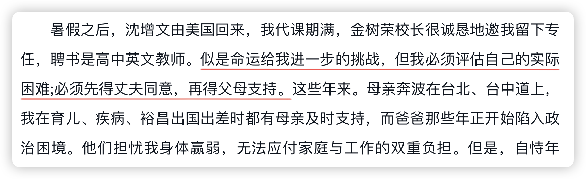
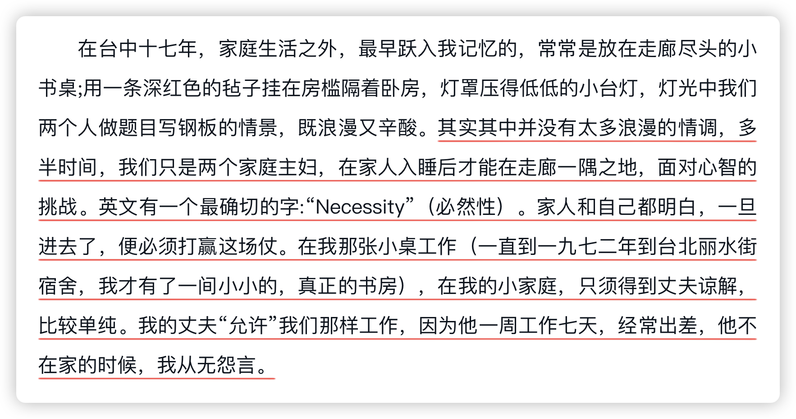

最近陈朗缅怀丈夫的悼文引起了一些讨论，文章中提到她成为妻子之后渐渐被生活琐事消磨的学术理想，提到她作为妻子看着丈夫在自己的“牺牲”下挥斥方遒，产生的想法“这又与我有什么关系呢”，她在丈夫与朋友畅谈哲学、社会时，也会暗暗地想，如果没有走进婚姻，是否能够与他有更多的共同语言呢？

此类种种，让我感觉真实又恐惧，想到在微博上看到的一句评论：
>如果你想毁掉一个女人，最好的办法就是说爱她，然后让她走进婚姻，最后在孩子与家庭中渐渐被抹掉自我。她会成为家庭的囚徒。

可是女人不是生下来就会成为妻子，但当她们成为妻子的那个时刻，几乎就已经注定了后来的结局，我说是地狱，可是总有人甘之如饴，说是因为爱，你不懂的。

是因为爱，是的，**所有的一切开始都是因为爱，可是呢，爱既宏大也具体，具体的爱是无法避开权力结构**，这份权力不对等就会以一种恨意交杂在婚姻中。<mark style="background: #F6E99E;">权力的上位者无法避免使用权力，当他一无所知，他就已经在使用权力了，这是独属于权力上位者的钝感</mark>。

陈朗在家庭中属于权力的下位，家庭琐事、孩子三餐等等，我相信他们一定相爱，我相信研究权力结构的晓宏不会不理解权力关系的运作，因为在学术这场体制里，他是权力的下位，当他怨愤地说出“我恨学术（体制）”的时候，不知道他有没有想过，陈朗会不会呢喃“我恨婚姻（体制）”。

当她们走进婚姻，就不再只是她们自己了。她们身上作为人的属性会被妻子的属性掩盖，任何声称女权主义的男性都无法消除结构对女男双方的影响，**有人在得益，就有人在牺牲。可是凭什么牺牲的总是妻子**？

我总有这个疑问，从杨苡的自传、到齐邦媛的自传、再到陈朗的悼文，无论什么阶层的女性，只要成为了妻子，就只能压抑个人的追求成为家庭的主妇，可是，家庭不是女性一个人的，**我们同样是人，值得同样的尊重，我们的追求，并不比另外一个人劣等**。

当杨苡坐在只能在赵瑞蕻离开才能使用的书房，连写作都得让位于赵瑞蕻的需求，这个时候，我想问问凭什么？这个成长在显赫家庭中的贵族小姐，心中是否后悔过她的选择？

当齐邦媛得到很好的进修机会，却为了家庭不得不放弃梦想，一拖再拖，拖到一个合适的机会，她觉得这就是女人的生活，可是我想问问凭什么？她的先生可以日以继夜、长年累月不回家，为了台湾的铁路事业，事业很伟大，然后呢？一日三餐、孩子成长、家庭琐事，哪一项就理所应当甩手给家里的另一个人呢？**为了这些事情消磨的精力与时间，足够一个人成长多少呢？足够她进修多少呢？**

陈朗日复一日的困于家庭事务，会不会在洗碗打扫的间隙想到自己的学术理想，想到被自己忽视的自我需求。

我无法认同婚姻，是因为在目前的权力结构中没有人可以独善其身，没有人能够避开结构谈个人，**权力位置或许可以逆转，但权力结构无法在短时间内平衡**。

自愿走上的道路，会成为吞噬女性的深渊，这个深渊，叫婚姻。

研究权力的人也处于结构之中，了解了还是会践行，因为我们生活在这样不对等的社会中，我们被权力塑造、被权力支配、被权力异化，一个人、一个家庭，如何对抗这普遍的不平等呢？

总有人要管孩子，可是那个人为什么默认是妻子呢？

**不要小看默认的力量。**

因为默认女性是属于家庭的资源，才会有那么多的“荣誉谋杀”。

因为默认女性要有归属，当然这个归属人默认是男性，所以无论她们几岁，都会被视作物品，这是「凝视」的根源，归属这个词，就是一种权力的体现，为什么一个男性不普遍被使用归属这个词呢？

因为默认男性有妻子和孩子，所以无论是公权还是舆论，都宣传婚姻的内容，强调孩子与父亲的血缘，强调以男性为核心的家庭、家族，可是自然界本来就不是每个雄性都能留下自己的基因，各种“暖被窝”工程、男性对女性的人身暴力与谋杀，都能在舆论场上留下“荡妇羞辱”，这是权力。是社会参与的性别谋杀。

因为默认男性是继承人，而女性是商品，才会在大量的流产、抛弃的女婴尸体之后，大言不惭地说整治“天价彩礼”，这份钱买断的是什么？是一个人的自由与人生。

我一直觉得一个人的自我需要自己好好维护，需要好好尊重，这需要对自我的反思、对外界的反思、大量的输入、不断的质疑，我相信人不是工具，而是目的本身，我相信理性的力量。所以我无法忽视外界对我们的打压与异化，我不能接受他们对我们自由与自我的压迫，我希望每一个小女孩来到世界上，是带着期待与尊重的，是自由的，而不是成为父权家庭交换资源的介质。

以上，祝各位好。
